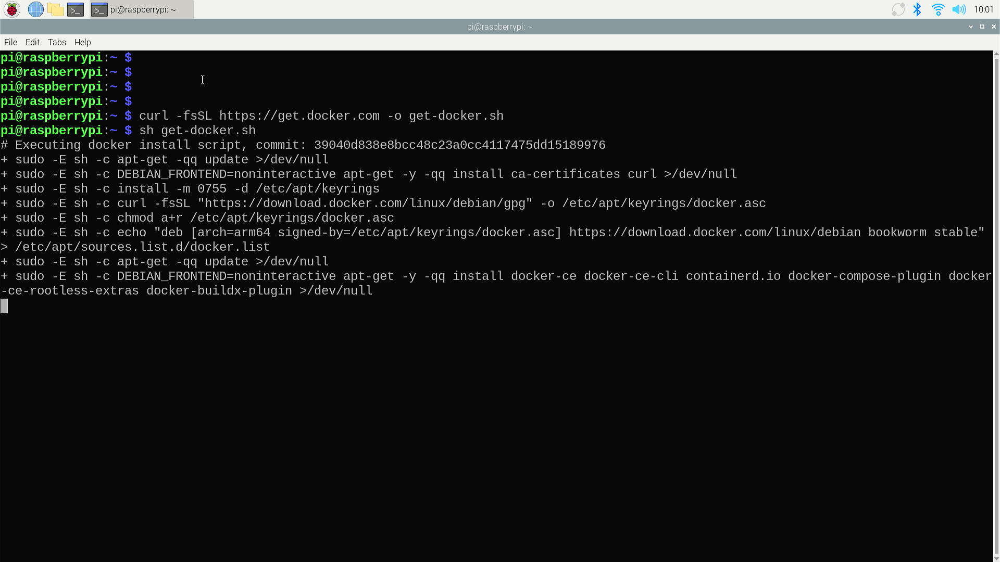
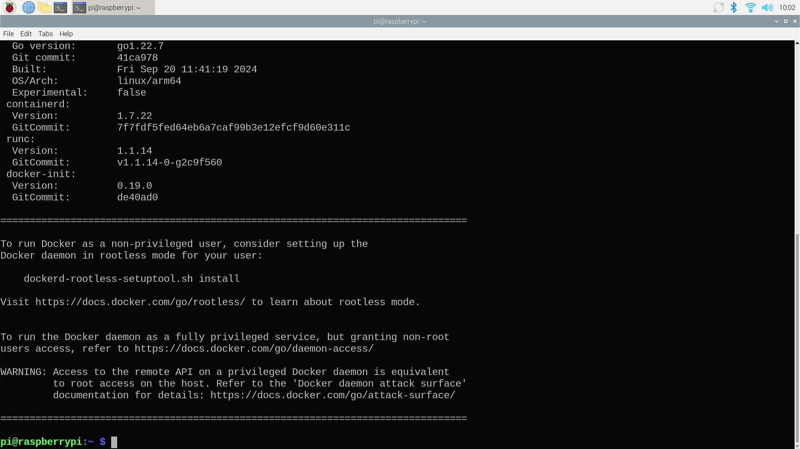
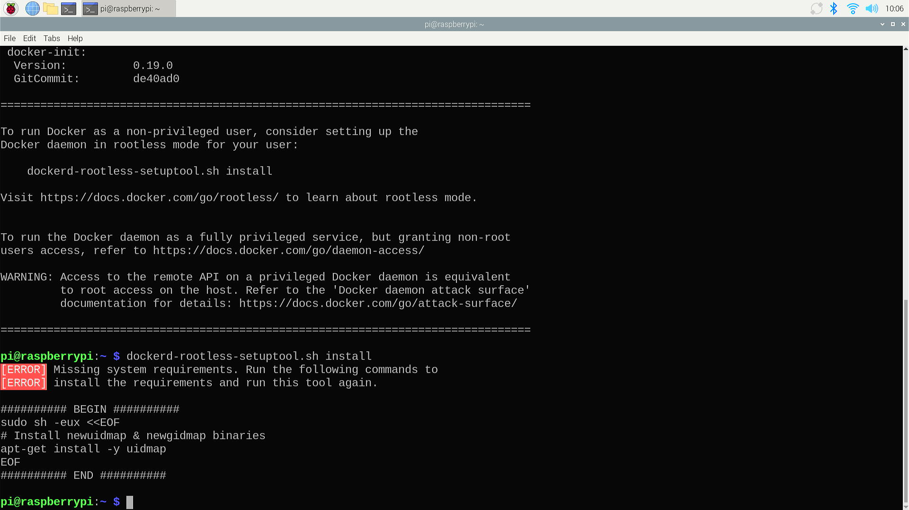
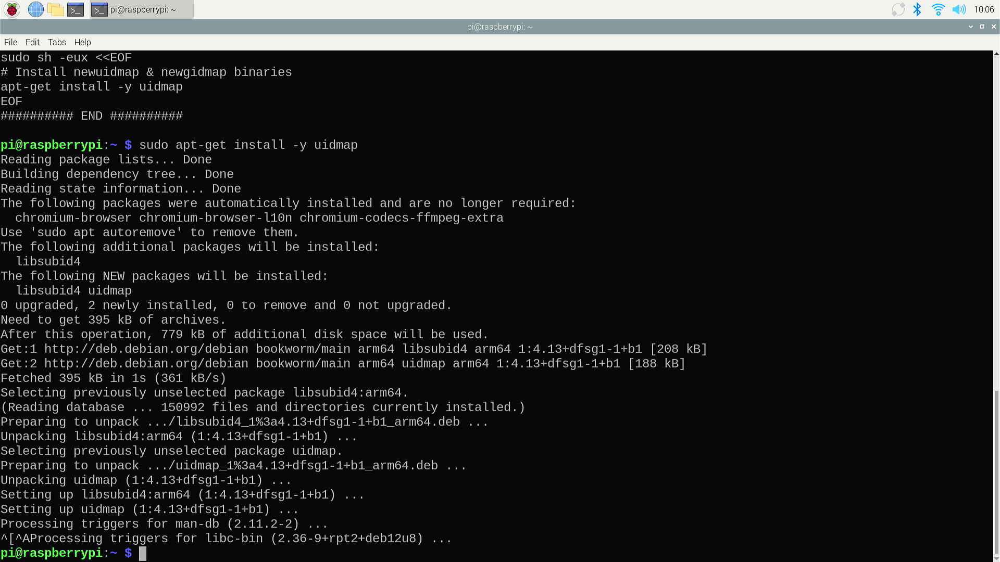
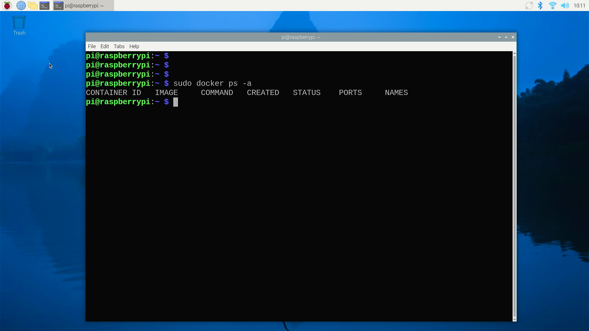

# Install Docker 

## Description

There are various ways to install Docker. Here, we will demonstrate the method for installing it on a Linux operating system. It is recommended to use Ubuntu or Raspberry Pi OS 64bit to set up this environment, which is quite easy and only requires a single command. When installing, please ensure that your device can smoothly access the internet.

## Steps 

* Update and upgrade software repository 

```bash
sudo apt update 
sudo apt upgrade -y 
```

* Install Docker

```bash
curl -fsSL https://get.docker.com -o get-docker.sh 
sh get-docker.sh 
```

As following figures:




If you see this figure means it has been installed successfully.  



If you want to run docker as non-provileged user, consider setting up the docker
daemon in rootless mode for your user:

```bash
dockerd-rootless-setuptool.sh install 
```

* If you see this figure, you need to install `uidmap` by following command:



```bash
sudo apt -y install uidmap 
```



* Check if the docker is installed properly. 

```bash 
sudo docker ps -a 
```
Be like: 



Congratulations! You have installed docker in your system, you can move to next
chapter to install docker container right now!!! 
