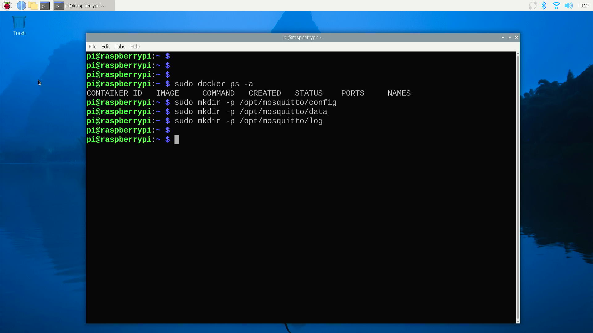
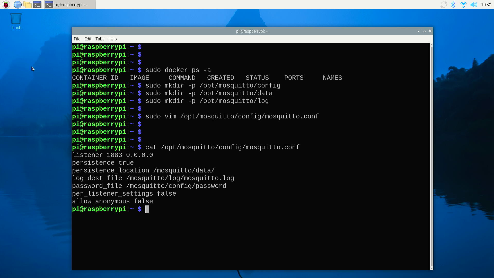
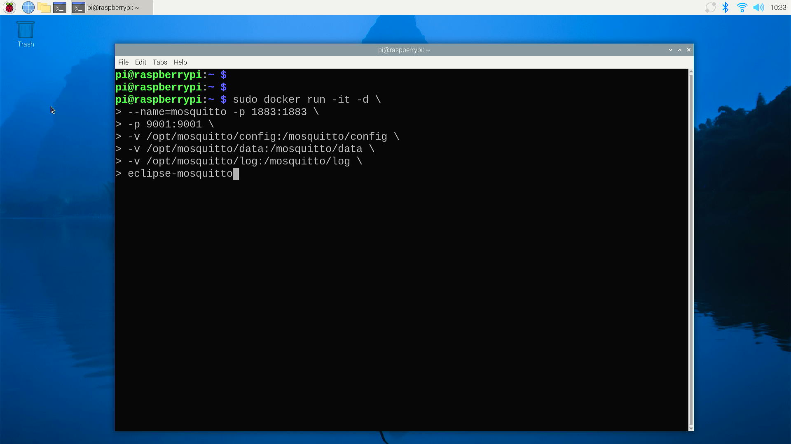
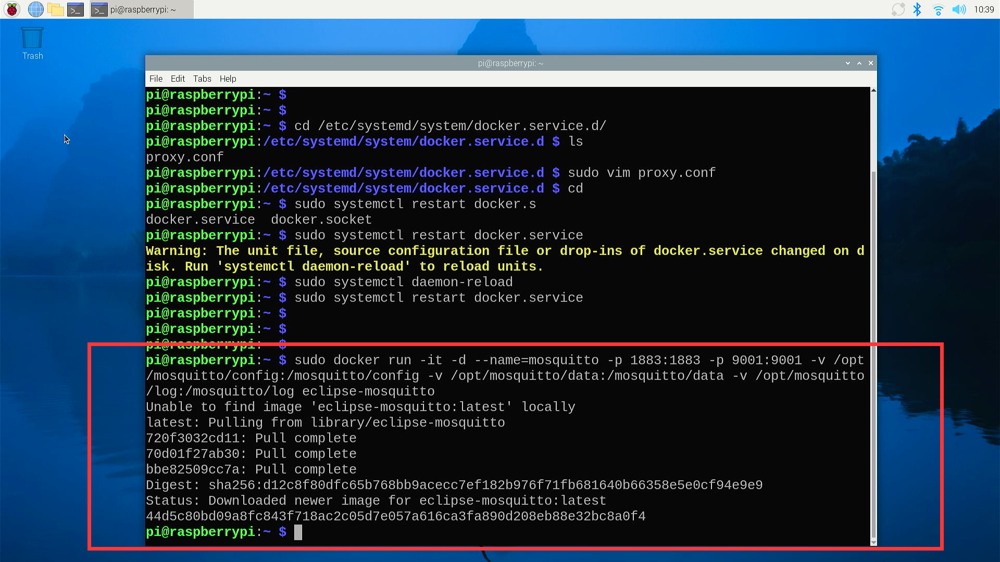
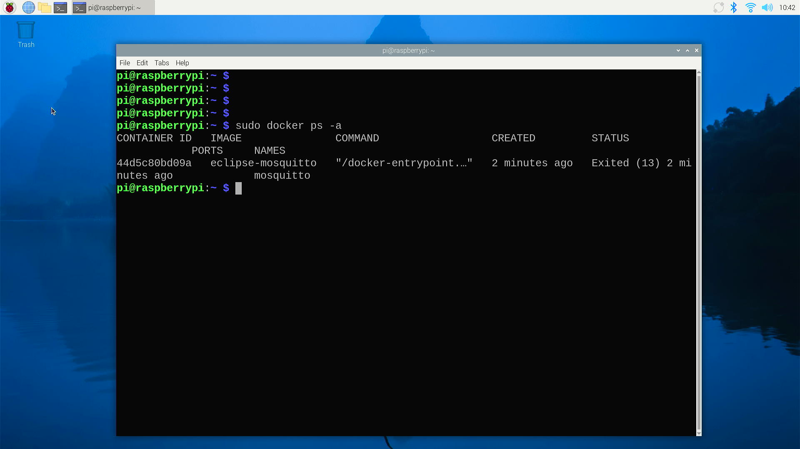
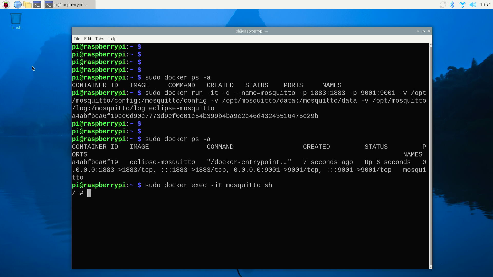
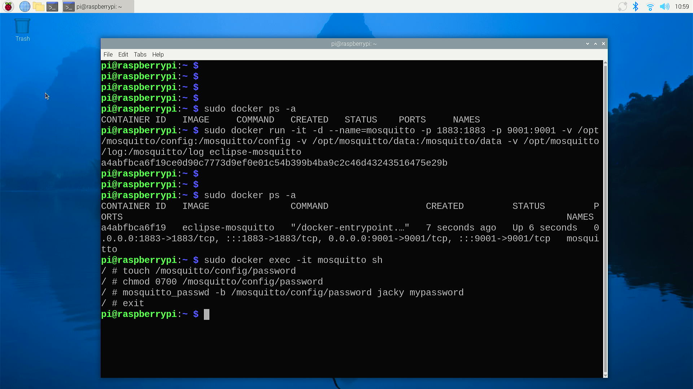
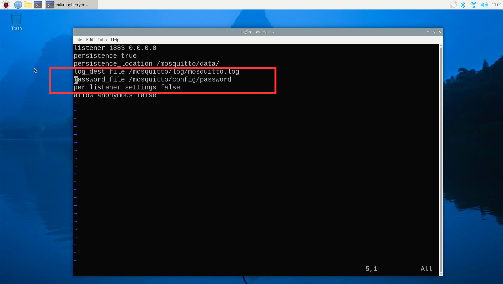
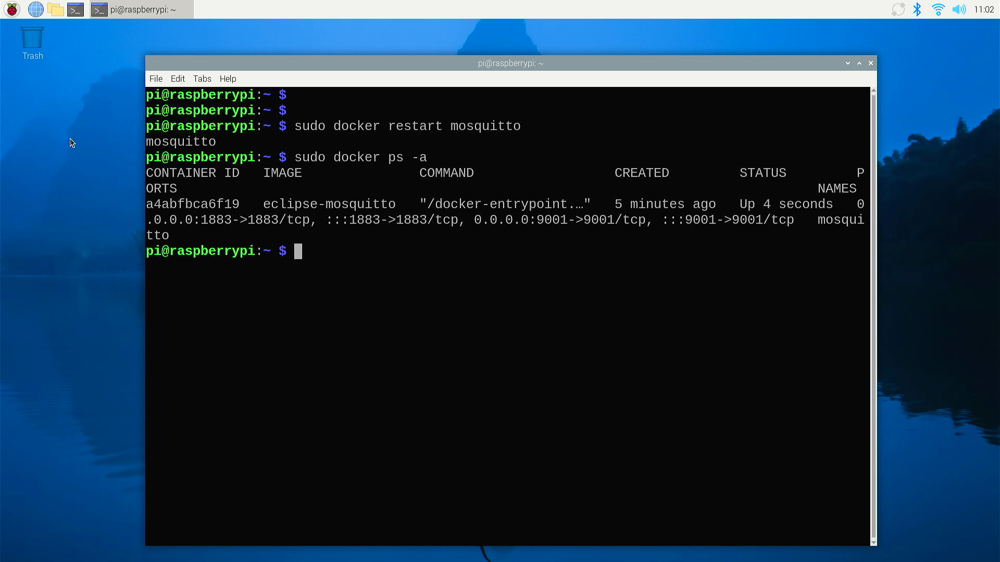

# Setup MQTT container

## What is an MQTT Container?

MQTT (Message Queuing Telemetry Transport) is a lightweight messaging protocol for small sensors and mobile devices, optimized for low bandwidth, high latency, or unreliable networks. It facilitates the exchange of messages between devices and is widely used in the Internet of Things (IoT).

## MQTT Container

In the context of MQTT, a container refers to a self-contained environment that encapsulates the MQTT broker and its dependencies. This allows for easy deployment, scalability, and management of MQTT services without the need to install and configure the broker on each individual server.

### Key Features of MQTT Containers:

* **Isolation**: Containers provide a level of isolation from the host system, ensuring that the MQTT broker runs in a controlled environment with its own set of libraries and configurations.

* **Portability**: Containers can be easily moved across different environments, from development to production, without the risk of encountering compatibility issues.

* **Scalability**: It's straightforward to scale MQTT services horizontally by running multiple instances of the container, which can be managed and orchestrated using container management platforms.

* **Reproducibility**: Containers ensure that the MQTT broker runs in the same environment every time, regardless of where it's deployed, which is crucial for maintaining consistent behavior across different systems.

* **Ease of Management**: Containerization simplifies the management of MQTT brokers, as updates, patches, and configurations can be applied to the container image and then rolled out to all instances.

### Popular MQTT Brokers Available as Containers:

- **Mosquitto**: A popular open-source MQTT broker that is widely available as a container image.
- **EMQ X**: A scalable and highly performant MQTT broker that also offers a containerized version.
- **RabbitMQ**: Although primarily an AMQP broker, it supports MQTT and can be run in containers.

### How to Use MQTT Containers:

* **Pull the Image**: Use a container registry to pull the MQTT broker's container image.
* **Run the Container**: Execute the container with the necessary configurations and ports exposed.
* **Connect Clients**: MQTT clients can now connect to the broker running inside the container.
* **Manage and Scale**: Utilize container orchestration tools like Docker Compose, Kubernetes, or others to manage and scale the MQTT service as needed.

MQTT containers are a convenient way to deploy and manage MQTT services, providing a flexible and efficient solution for IoT and messaging applications.

### Steps 

* Open a terminal in the desktop you have installed docker service before. 
* Create folder as following commands:

```bash
sudo mkdir -p /opt/mosquitto/config
sudo mkdir -p /opt/mosquitto/data 
sudo mkdir -p /opt/mosquitto/log 
```



* Create `mosquitto.conf` file. 

```bash 
sudo vim /opt/mosquitto/config/mosquitto.conf
```

Configure file sample be like: 

```bash
listener 1883 0.0.0.0
persistence true
persistence_location /mosquitto/data/
log_dest file /mosquitto/log/mosquitto.log
# password_file /mosquitto/config/password
per_listener_settings false
allow_anonymous false
```



* Start docker container 

```bash 
docker run -it -d  --name=mosquitto -p 1883:1883 -p 9001:9001 -v
/opt/mosquitto/config:/mosquitto/config -v /opt/mosquitto/data:/mosquitto/data
-v /opt/mosquitto/log:/mosquitto/log eclipse-mosquitto 
```

Be like: 

                        
* It will download docker container and running it automatically.  



* Check container status.

```bash
sudo docker ps -a
```
Result be like:



## Change password of MQTT 

* Get into docker via `sh` shell. 

```bash
sudo docker exec -it mosquitto sh 
```

* Create password file and setting to what you want. 

```bash 
touch /mosquitto/config/password 
chmod 0700 /mosquitto/config/password 
mosquitto_passwd -b /mosquitto/config/password YOUR_NAME YOUR_PASSWORD 
exit 
```





> NOTE: Please replace `YOUR_NAME` and `YOUR_PASSWORD` to your own. 

## Modify MQTT configuration file

```bash
sudo vim /opt/mosquitto/config/mosquitto.conf
```
Remove the `#` hash tag from that configuration file:

```bash
listener 1883 0.0.0.0
persistence true
persistence_location /mosquitto/data/
log_dest file /mosquitto/log/mosquitto.log
password_file /mosquitto/config/password
per_listener_settings false
allow_anonymous false
```


## Restart container 

```bash 
sudo docker restart Mosquitto
```


## Congratulations
You have installed MQTT container if you've finished previous steps!

