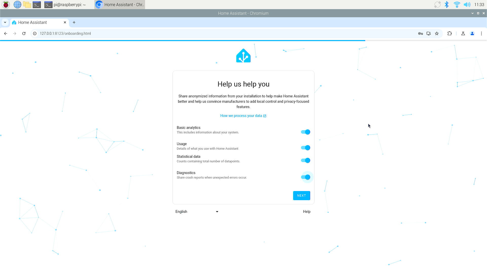

# Setup HomeAssistant Container

## Home Assistant Container

Home Assistant Container is a method of running Home Assistant using Docker, a platform that allows applications to be packaged and run in containers. This approach provides several advantages:

## Benefits of Home Assistant Containers

* **Isolation**: Containers run in isolated environments, ensuring that Home Assistant and its processes do not interfere with other applications or the host system.
* **Portability**: Home Assistant can be easily moved between different systems as the container is self-contained.
* **Scalability**: It's simple to scale up or down depending on your needs, whether you're running on a Raspberry Pi or a powerful server.
* **Easy Management**: Docker containers can be started, stopped, and updated with simple commands, making management straightforward.
* **Consistent Environment**: Docker ensures that Home Assistant runs in the same environment every time, which is beneficial for maintaining consistent behavior across different systems.

## How to Use Home Assistant Containers

To use Home Assistant in a Docker container, you need to have Docker installed on your system. Here are the general steps:

* **Install Docker**: Ensure Docker is installed on your machine. Follow the official Docker installation instructions for your operating system.
* **Pull the Home Assistant Image**: Use the Docker command to pull the Home Assistant image from Docker Hub.
* **Run the Container**: Start the Home Assistant container with the necessary configurations, such as volume mounts for your configuration files.
* **Access the Interface**: Once the container

## Considerations

- **Add-ons**: Home Assistant running in a Docker container does not support add-ons out of the box. However, you can manually set up services using Docker Compose or similar tools.
- **Backup**: Regularly back up your configuration files to prevent data loss, especially if you are managing the container yourself.
- **Updates**: Keep your Docker image up to date to ensure you have the latest features and security patches.

## Steps 

### Installation
* Open a terminal and typing following command:

```bash
sudo mkdir -pv /opt/homeassistant 
sudo docker run -d --name=homeassistant -v /opt/homeassistant:/config --net=host homeassistant/home-assistant 
```


### Result


Finished:


### Access from web browser

* Access Home Assistant via web browser, input `localhost` or IP address of the
docker server. and default port is: `8123`
     


* Create username and password 


* Setting up home location 


* Setting Country 


* About the feedback of usage. 



* Automatical found compatible devices


* Finshed setup


## Finished 

Congratulations!! you have installed home assistant container and make it works!
you can move to next step right now! 


