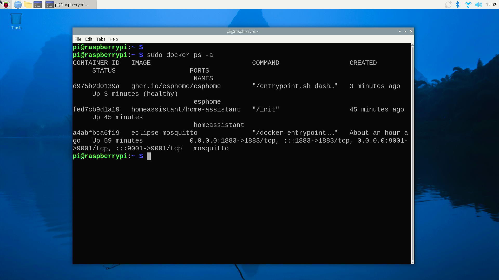
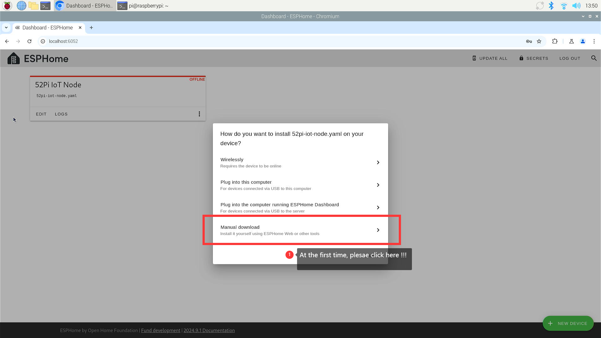
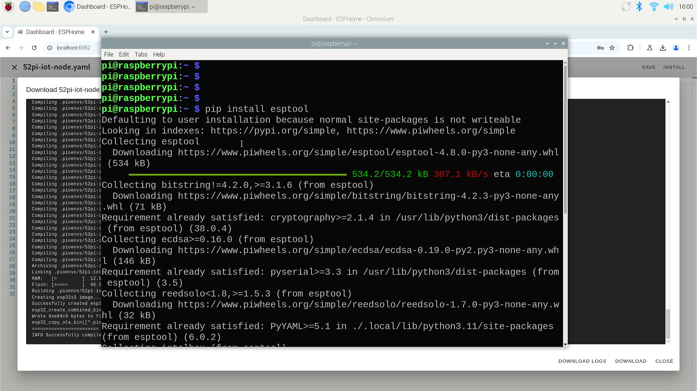

# Setup ESPHome container 

## What is an ESPHome Container?

ESPHome is an open-source system designed for controlling ESP8266/ESP32 and similar microcontrollers through simple yet powerful configuration files. When run in a Docker container, it allows for the creation of custom firmware for these devices, which can then be integrated into Home Automation systems like Home Assistant.

## Advantages of ESPHome Containers

* **Isolation**: Containers provide a secure environment where ESPHome runs independently of the host system, reducing the risk of conflicts and ensuring consistent behavior across different platforms.
* **Portability**: ESPHome containers can be easily moved and deployed across different systems, making it simple to maintain the same setup on multiple devices.
* **Scalability**: Docker containers can be scaled up or down as needed, allowing for efficient use of system resources and the ability to handle an increasing number of devices.
* **Version Control**: By using container images, you can ensure that you are always running the same version of ESPHome, which is crucial for maintaining stability and reproducibility.
* **Ease of Use**: ESPHome containers can simplify the installation and update process, as Docker handles the dependencies and environment setup automatically.

## How to Use ESPHome Containers

To use ESPHome in a Docker container, follow these general steps:

* **Install Docker**: Ensure that Docker is installed on your system. You can find installation instructions on the Docker website.
* **Pull the ESPHome Image**: Use Docker to pull the official ESPHome image from the Docker Hub.
* **Create a Configuration Directory**: Set up a directory on your host system to store your ESPHome configuration files.
* **Run the ESPHome Container**: Use Docker Compose or the Docker CLI to run the ESPHome container, mounting your configuration directory into the container.
* **Access the ESPHome Dashboard**: Once the container is running, you can access the ESPHome dashboard through your web browser to manage your devices.

## Installation 

* Create folder

```bash 
sudo mkdir -pv /opt/esphome/ 
```

* Install docker container 

```bash
sudo docker run -d --name esphome -v /opt/esphome:/config \
         -v /etc/localtime:/etc/localtime:ro \
         --restart always \
         --privileged \
         --network host \
         -e USERNAME=YOUR_NAME \ 
         -e PASSWORD=YOUR_PASSWORD \
         ghcr.io/esphome/esphome 
```


## Check docker status

```bash 
sudo docker ps -a 
```



## Access ESPHome from web browser

* Open a browser and input the IP address of you docker server and Default port:
`6052`, Create your new device in the page.

* Login with the `USERNAME` and `PASSWORD` which has been setup before.  


* Create new device 


 
Please input your device name and your 2.4GHz Network SSID and Password.


* Connect to ESP32S3 board to your Computer in USB port. 
* Click connect 


* Select the serial port 


* It will pop up a screen, you need to double click the `Encryptionkey` and
store it to a safe place, and then click `INSTALL`


* At the first time, You `must` select `Manual download`.



It will download the libraries and compiler tools automatically. 


* At the first time, you need to select Factory format 
as following figure:


and then, you will be able to download a firmware from web browser.
It's a binary format file. you can upload it to your ESP32S3 device via several
methods.


## Upload factory format firmware. 

* Window system 

Download: [flash_download_tool_3.9.1_1.zip](./assets/flash_download_tool_3.9.7_1.zip) 
<br>
Unzip and double click the icon. 


* Chip type: ESP32-S3, workMode: Develop, LoadMode: UART, and then click `ok`.


* Select the firmware you want to upload, address use: `0`, select the COM port.
and then click `START` icon to upload the firmware.


* Linux system(include Raspberry Pi OS 64bit bookworm) 

To flash ESPHome firmware with esptools first install esptools.

```bash
pip install esptool 
```



* Check if can read MAC address of ESP32S3 development board. 

```bash
esptool.py --chip esp32s3 --port /dev/ttyUSB0  read_mac 
```


Connect the ESP via USB to the PC. Monitor journalctl to know what TTY is used:
and then upload the firmware by following command:
```bash
journalctl --follow
```


```bash
esptool.py --chip esp32s3 --port /dev/ttyUSB0 write_flash 0x0 YOUR_FIRMWARE  
```
> NOTE: please replace `YOUR_FIRMWARE` to the firmware you download before. 
For example:
In my case, firmware called: `52pi-iot-node.factory.bin`


## Check Online status 
Once the firmware upload successfully, refresh the browser you will find that
    the device is online now! 


Right now, you can move to next step or read more about `esptool` below:

----

More information about `esptool`: [esptool github](https://github.com/espressif/esptool)

