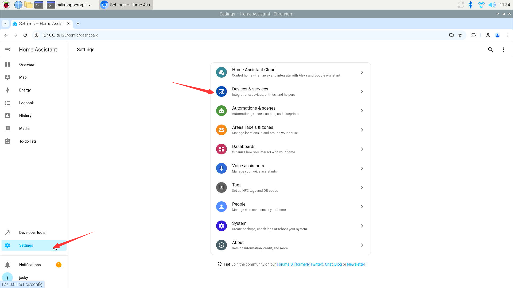
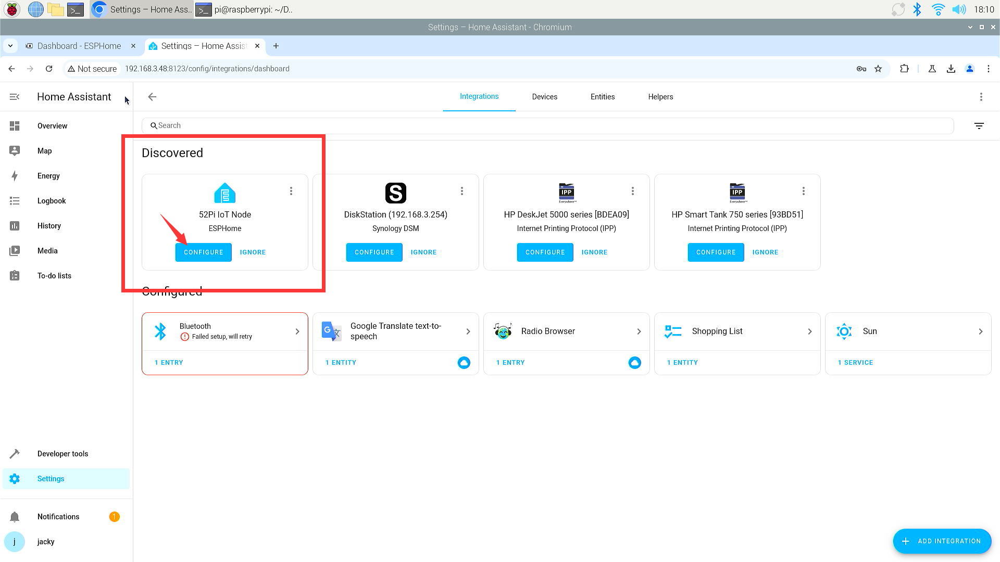
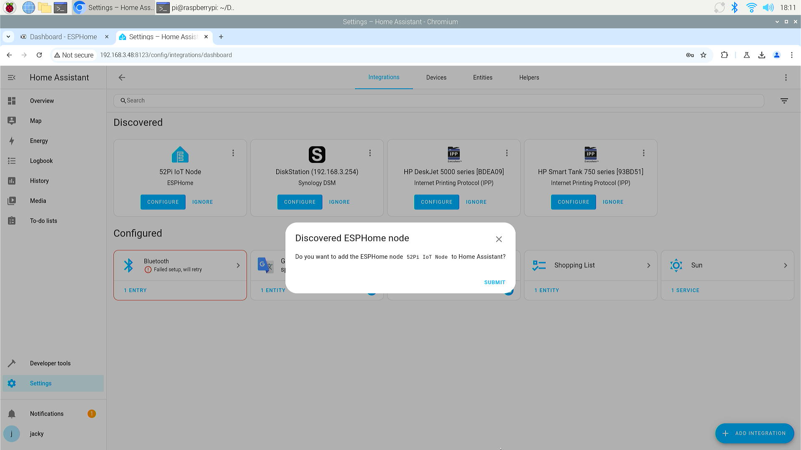
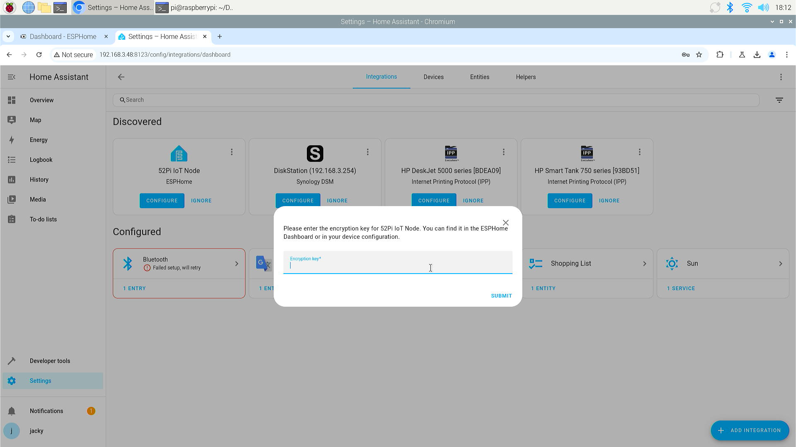
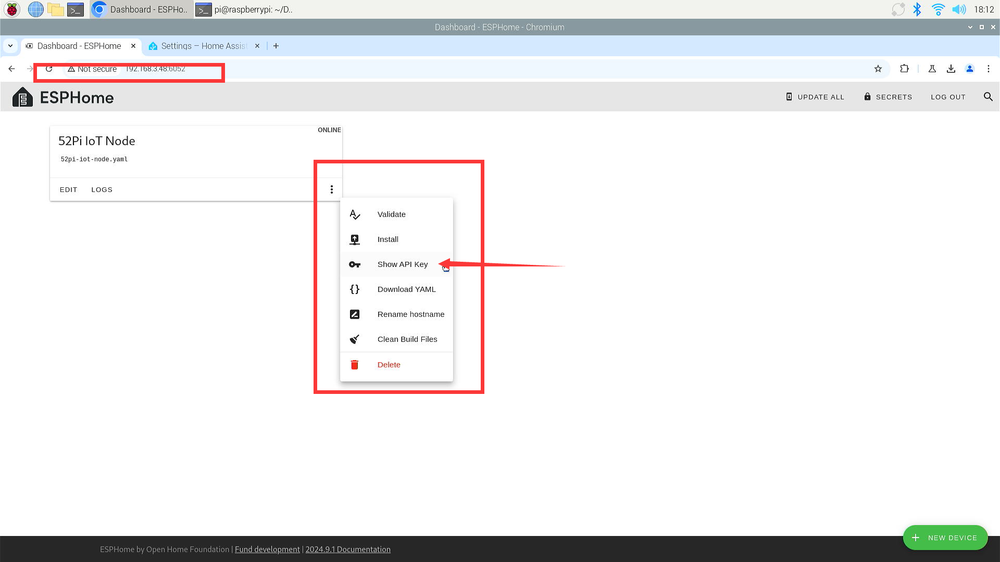
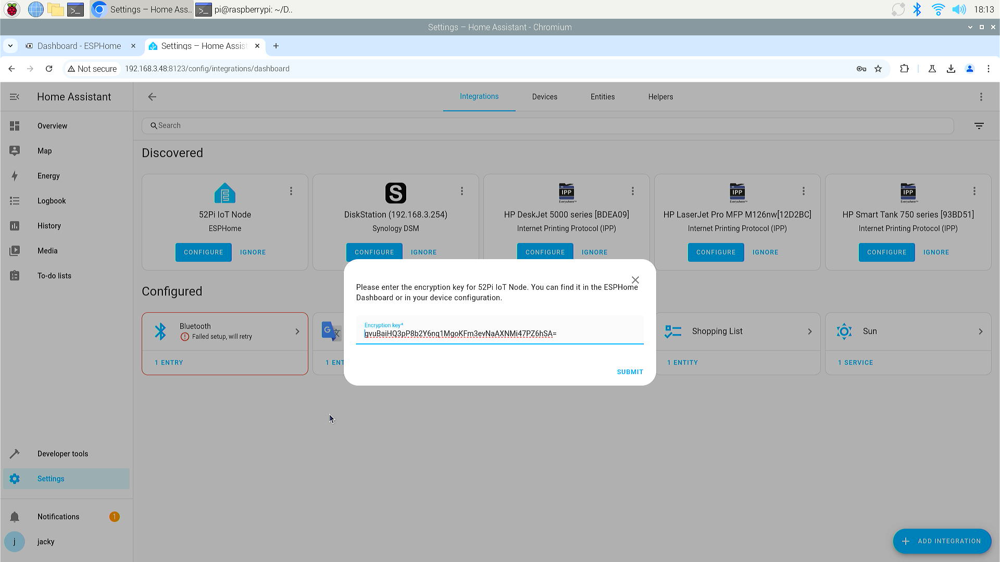
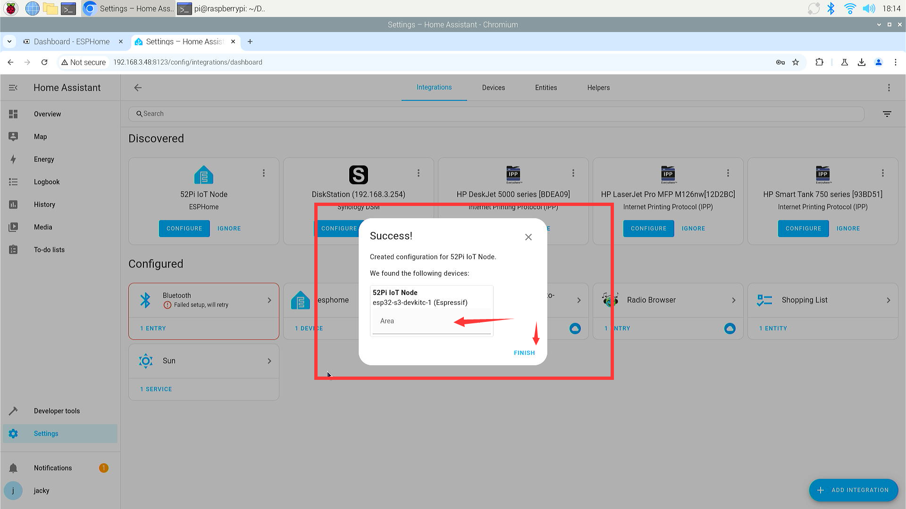
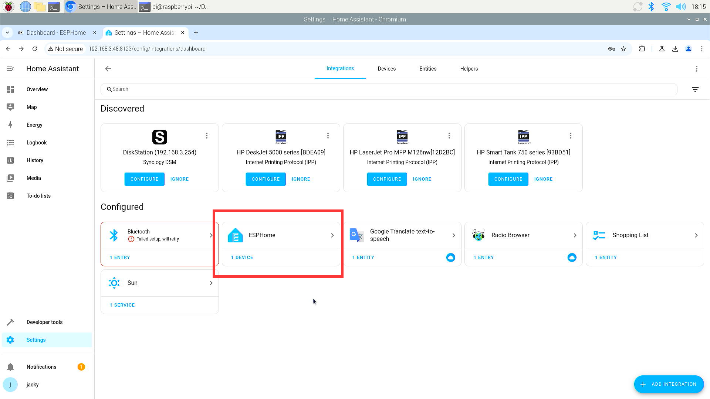

# Add ESPHome Intergration on HomeAssistant 

## Add Intergration

* Open browser and access to Home Asssistant managment page at
`http://localhost:8123` and login with your admin account. 

* add intergration From Discovered  

* Enter the `Encryption key` for your ESP32 device. 

You can find the key according to following figure:
 
Access ESPHome mainpage and then click three dots on the screen, and select
`show API Key`:

* Copy it and paste to Home Asssistant on the configuration page.

* Click `submit` and select `Area` your device will put to. 
* Click finish

* You will see the intergration on your Home Asssistant page.

If you see this figure means you have installed the Intergration for ESPHome.

