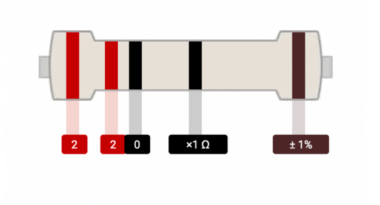

# **220-Ohm Resistor**

## Description
A 220-ohm resistor is a passive component that opposes the flow of electrical current in a circuit with a resistance value of 220 ohms. It is commonly used to control current, divide voltages, and terminate transmission lines.

## Characteristics

- **Resistance Value**: 220 ohms, which is the measure of its opposition to the flow of current.
- **Tolerance**: Typically ±5%, ±1%, or ±0.5%, indicating the possible variation in resistance value.
- **Power Rating**: Specified in watts, which is the maximum power the resistor can dissipate without overheating.
- **Physical Size**: Varies with power rating and current-carrying capacity.
- **Color Coding**: Resistors are often color-coded with bands that indicate their resistance value and tolerance.

## Identification Methods

- **Color Bands**: A 220-ohm resistor typically has a red, red, brown, and gold color sequence (from left to right) on its body.
  - **Red**: First band represents the first digit of the resistance value (2).
  - **Red**: Second band represents the second digit of the resistance value (2).
  - **Brown**: Third band represents the multiplier (10^1 or 100 ohms).
  - **Gold**: Fourth band indicates the tolerance (±5%).
- **Markings**: Some resistors have numerical markings directly printed on them.

## Common Applications

- **Current Limiting**: To limit the current flowing through a component or a branch of a circuit.
- **Voltage Divider**: In voltage divider circuits to create a specific output voltage.
- **Biasing**: In amplifiers and other analog circuits to set the operating point of transistors.
- **Pull-Up/Pull-Down Resistors**: To set the default state of a digital input.
- **Termination Resistors**: In transmission lines to minimize signal reflection.

## Usage Tips

- Ensure the resistor's power rating is adequate for the current flowing through it to avoid overheating.
- Pay attention to the resistor's tolerance when precision is required in the circuit design.
- Use the correct resistor value to avoid altering the intended circuit operation.
- Consider the physical size and form factor of the resistor for proper fit and PCB layout.

