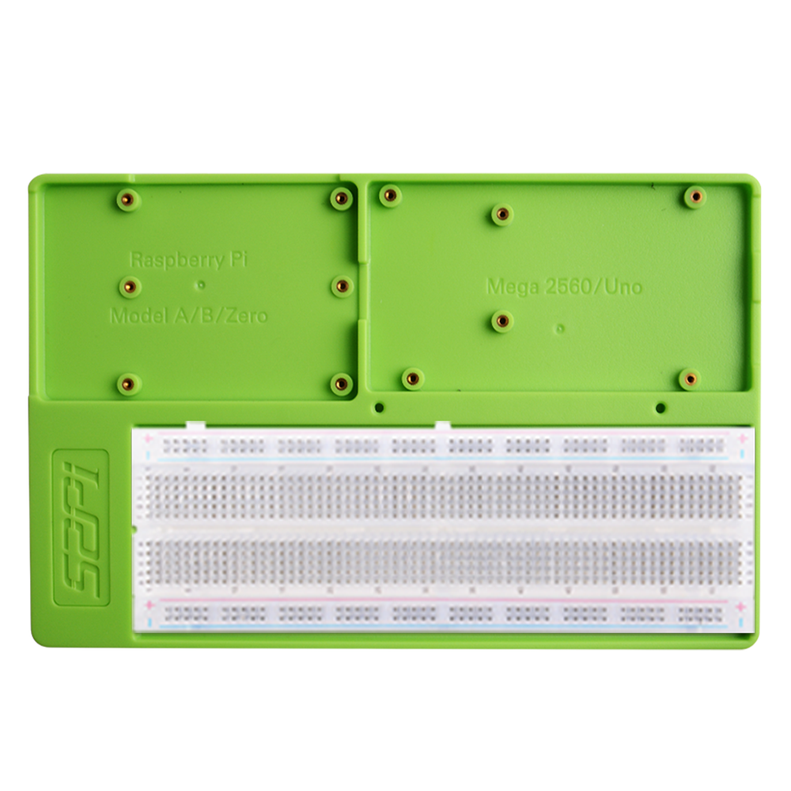

# 52Pi Experiment Trays

The **52Pi Experiment Trays** are versatile experimental platforms designed for ease in electronic prototyping. 

## Key features:

- **Material**: Made from durable ABS plastic.

- **Compatibility**: 
  - **Raspberry Pi**: Suitable for Model A, B, and Zero.
  - **Arduino**: Compatible with UNO series and Mega 2560.
- **Mounting**: Equipped with screw holes for secure attachment of the boards.
- **Utility**: Ideal for facilitating electronic experiments and projects.

