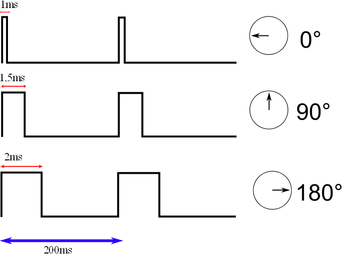
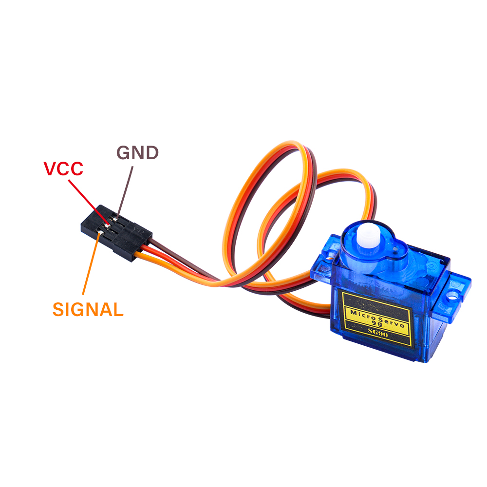

# **9g Servo**

## Description
Servo motors are high torque motors which are commonly used in robotics and several other applications due to the fact that it’s easy to control their rotation. Servo motors have a geared output shaft which can be electrically controlled to turn one (1) degree at a time. For the sake of control, unlike normal DC motors, servo motors usually have an additional pin asides the two power pins (Vcc and GND) which is the signal pin. The signal pin is used to control the servo motor, turning its shaft to any desired angle.
Servos are small devices used in a variety of applications, from robotics to remote-controlled vehicles to industrial automation. 
The fundamental principle behind how servos work involves converting an electrical signal into precise mechanical motion. 
Here's a breakdown of the key components and their functions:

- **DC Motor:** At the heart of a servo is a DC motor. This motor typically consists of a permanent magnet rotor and a wound wire coil (the armature) within a magnetic field. When an electrical current flows through the coil, it interacts with the magnetic field, causing the armature to rotate.
- **Gear Train:** Servos often employ a gear train to reduce the speed of the motor's rotation while increasing its torque. This gearing mechanism allows the servo to exert greater force while maintaining precise control over its movement.
- **Potentiometer (Feedback Device):** Most servos incorporate a potentiometer, also known as a variable resistor, as a feedback device. This potentiometer is mechanically coupled to the output shaft of the servo. As the shaft rotates, it changes the resistance of the potentiometer. This change in resistance provides feedback to the servo control circuitry, allowing it to accurately determine the position of the shaft.
- **Control Circuitry:** The control circuitry is the brains of the servo. It interprets incoming electrical signals (typically pulse-width modulation signals) and generates the appropriate output to drive the motor. The control circuitry compares the desired position (as indicated by the incoming signal) with the actual position (as determined by the feedback from the potentiometer) and adjusts the motor's speed and direction accordingly to minimize the error.
- **Feedback Loop:** The feedback loop is crucial for ensuring the servo reaches and maintains the desired position accurately. The control circuitry continuously monitors the feedback from the potentiometer and adjusts the motor's output to minimize any discrepancy between the desired and actual positions.

Overall, the combination of a DC motor, gear train, feedback device (potentiometer), and control circuitry allows servos to precisely control the position of their output shafts in response to incoming electrical signals, making them invaluable for various applications requiring accurate and controllable motion.

### How a servomotor works 

* Servo Positioning

Analog servo motors use PWM, or Pulse Width Modulation, to control the motor shaft position.

The PWM signal is usually about `50Hz`, which is a period of `20ms`. Within that period the pulse width is varied, a shorter pulse positions the servo towards the zero-degree mark while a longer one moves the motor shaft towards the 180 degree position.

The pulse is continually applied to the control lead on the motor, locking the shaft into the desired position.

### Pinout of Servo

| Wire | Color |
|:---: |:---:|
| Power | Red | 
| GND | Black or brown</brown> | 
| Signal | Yellow,orange, or white | 

###  Working Principles 

1. **Signal Reception**: The servo receives control signals in the form of Pulse Width Modulation (PWM). The standard PWM signal has a period of 20ms, with pulse widths varying from 0.5ms to 2.5ms to control the angle from 0 to 180 degrees linearly .

2. **Internal Circuitry**: Inside the servo, there is a reference circuit that generates a 20ms period signal with a 1.5ms width. A comparator within the servo compares the external PWM signal with this reference signal to determine the direction and magnitude of the motor's rotation .

3. **Motor Control**: The control circuit board accepts the PWM signal from the signal line and controls the motor's rotation. The motor drives a series of gears that reduce speed and transmit motion to the output arm .

4. **Feedback Mechanism**: The output shaft of the servo is connected to a position feedback potentiometer. As the arm rotates, it drives the potentiometer, which sends a voltage signal back to the control circuit board. The control circuit then decides the direction and speed of the motor based on the current position to achieve the target stop .

5. **Torque and Speed**: The 9g servo is designed to be lightweight yet capable of providing significant torque for its size. It can handle a torque of 1.5kg/cm to 2.5kg/cm and achieve speeds within 0.1 seconds to 0.12 seconds for a 60-degree rotation .

6. **Construction**: The servo consists of a high-strength ABS transparent casing, internal high-precision nylon gears, an accurate control circuit, and a high-grade lightweight hollow cup motor, which contributes to its light weight of only 9 grams .

7. **Control Requirements**: To control the servo, a Microcontroller Unit (MCU) must generate a pulse with a period of 20ms, using a high level from 0.5ms to 2.5ms to control the angle of rotation .

8. **Programming**: For programming, such as with Arduino, the servo has three wires: +5V, GND, and a data signal line. The rotation of the servo requires a significant amount of current, so it is recommended to provide power to the servo separately to avoid issues with the mainboard supply .

