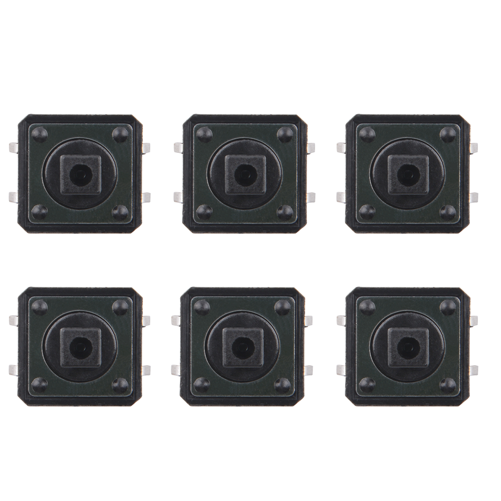
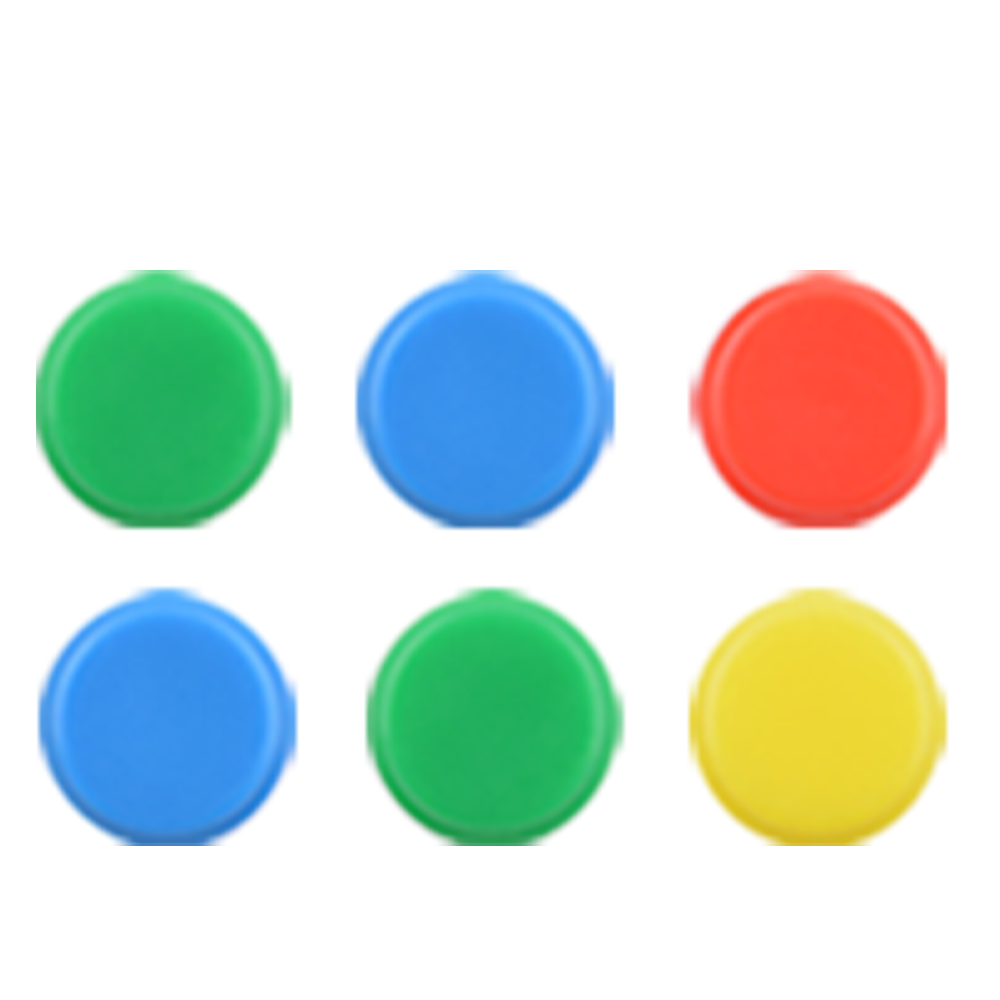

# **Push Button** 
A push button, also known as a pushbutton switch, is a type of electrical switch that is operated by pressing it with a finger or thumb. Here are its characteristics, usage methods, and precautions explained in English:

## Characteristics of Push Button:
1. **Mechanical Activation**: Push buttons are activated by a mechanical force applied by the user.
2. **Momentary Action**: They are typically momentary switches, meaning they only complete the circuit while being pressed.
3. **Durability**: They are designed to withstand repeated use without failure.
4. **Variety of Shapes and Sizes**: Push buttons come in a range of shapes and sizes to fit various applications.
5. **Different Colors**: They can be found in various colors, often used to indicate the function or status of the switch.
6. **Multiple Contacts**: Some push buttons have multiple contacts for different functions, such as latching or toggling.

## Usage Methods:
1. **Direct Activation**: Push buttons are used to directly activate or deactivate a circuit.
2. **Control Interface**: They are commonly used in control panels for machines, appliances, and electronic devices.
3. **Human-Machine Interaction**: In human-machine interfaces, they serve as a simple and intuitive method for user input.
4. **Safety Mechanisms**: In safety circuits, they can be used to initiate emergency stop functions.
5. **Signal Indication**: Some push buttons have built-in LEDs or other indicators to show the status of the device.

## Precautions:
1. **Appropriate Force**: Apply the correct amount of force when pressing the button to avoid damage.
2. **Correct Wiring**: Ensure the button is wired correctly according to the circuit diagram to prevent short circuits or malfunctions.
3. **Environmental Protection**: Protect the button from harsh environments that could affect its performance, such as extreme temperatures, moisture, or dust.
4. **Regular Maintenance**: Periodically check the button for wear and replace it if it becomes less responsive or damaged.
5. **Compliance with Standards**: Use push buttons that comply with safety and electrical standards relevant to the application.
6. **Avoid Overloading**: Do not use a push button for a load or voltage beyond its rated specifications.

Push buttons are a simple yet essential component in many electronic and mechanical systems, providing a reliable and user-friendly means of control.

## Product Outlook

* Push button

* Push button caps

## Example
* [Project_2 Blinking LED with Button Control Project with Arduino UNO R4 WiFi
](../../md/kz-0073/arduino/p2.md) 
