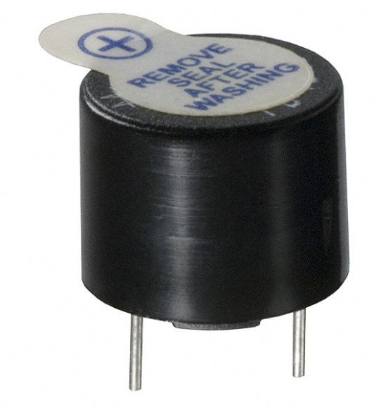

# **Buzzer**

## Description
A Buzzer is an electroacoustic device that produces sound when an electrical current passes through it. It consists of a diaphragm attached to a coil and a magnet, which interact to create vibrations that result in sound.

## Characteristics

- **Sound Output**: Buzzers can produce a range of sounds from simple beeps to complex tones.
- **Voltage Range**: Operates within a specific voltage range, typically from a few volts to around 24 volts.
- **Current Consumption**: The current drawn by a buzzer varies with its design and the sound level.
- **Frequency**: Some buzzers can emit sound at a fixed frequency, while others can produce different tones.
- **Size**: Available in various sizes, affecting the volume and pitch of the sound produced.
- **Polarity Sensitive**: The coil's polarity affects the direction of the diaphragm movement.

## Identification Methods

- **Visual Inspection**: Buzzers have a recognizable shape, often cylindrical or rectangular with a flat diaphragm.
- **Polarity Markings**: Some buzzers have polarity indicators, such as a '+' sign or different lengths of leads.
- **Datasheets**: The specifications, including voltage, current, and sound characteristics, are detailed in the datasheet.

## Common Applications

- **Alarms**: In security systems, timers, and other devices to alert users.
- **Indicators**: To signal the status of electronic devices, such as power on, error states, or confirmation of user input.
- **Gaming**: In arcade machines and video games for sound effects.
- **Automation**: In industrial automation systems for signaling process steps or alerts.
- **Telecommunications**: As a ringer in old-style telephones.
- **Accessibility**: In assistive devices to provide auditory feedback for visually impaired users.

## Usage Tips

- Ensure the voltage and current ratings of the buzzer match the supply voltage and current of the circuit.
- Check polarity when connecting to avoid damage to the buzzer.
- Consider the sound characteristics and select a buzzer that meets the desired tone and volume.
- Mount the buzzer securely to prevent vibrations from affecting other components.
- Use appropriate resistors if necessary to limit current and protect the buzzer.
