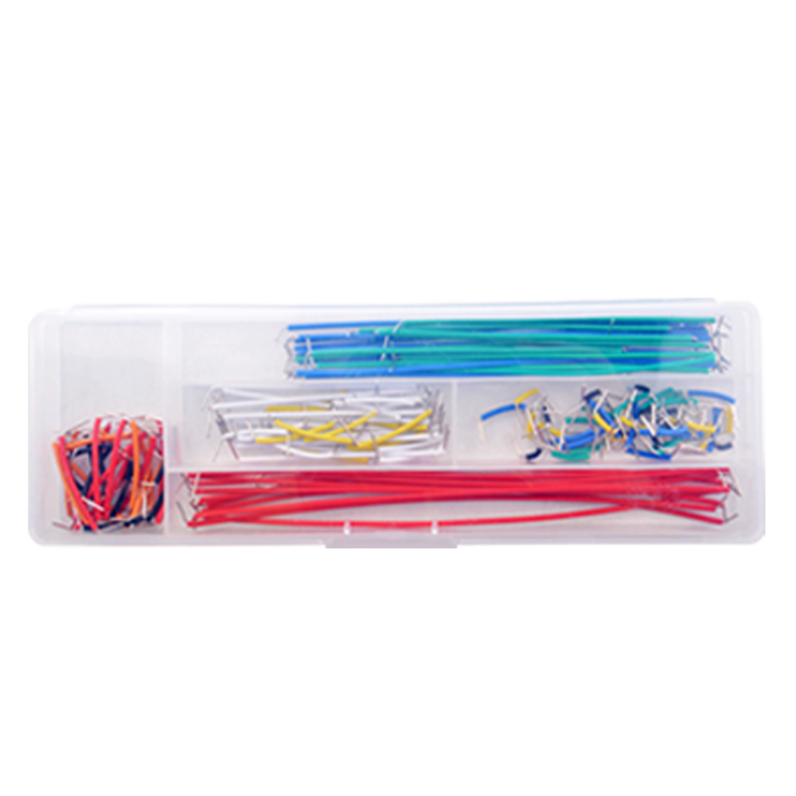
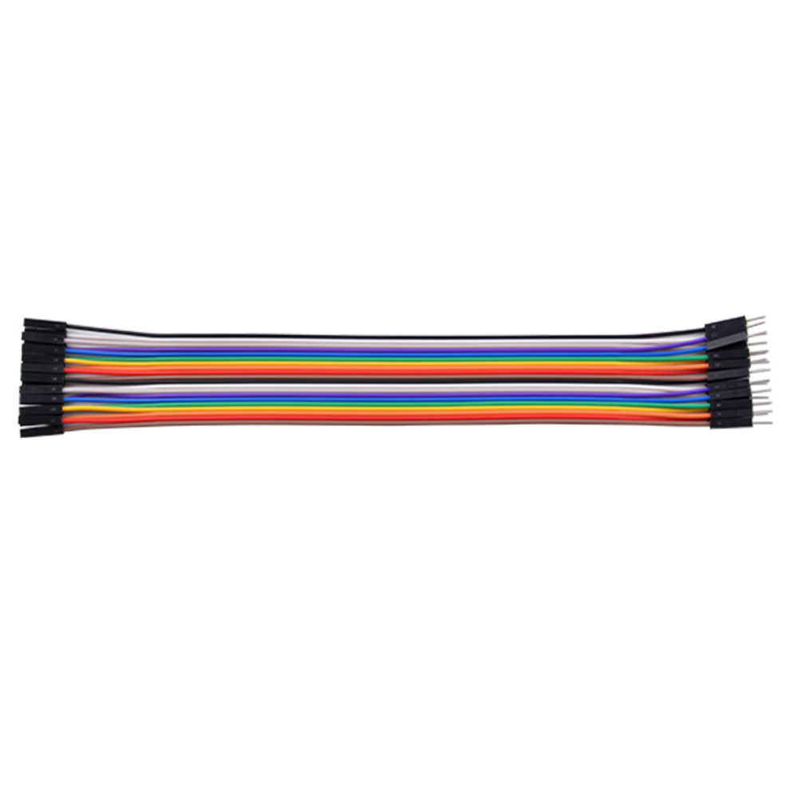
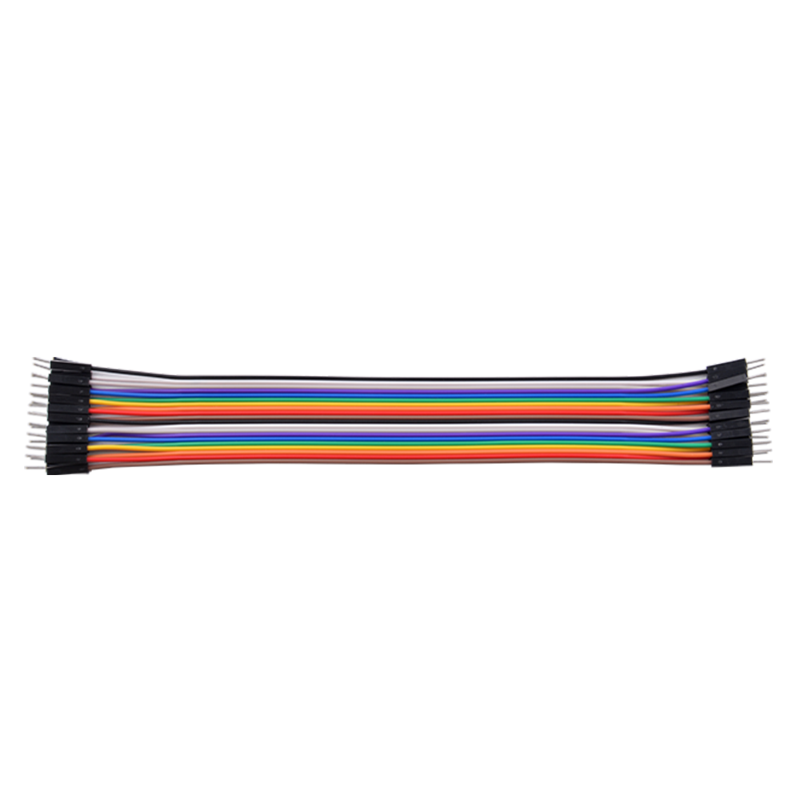

# **Jumper Wire Organizers** 

## Description

Jumper Wire Organizers are essential tools for any electronics enthusiast or professional. They are designed to keep your workspace neat and your circuit diagrams clear and understandable. Here's what makes them indispensable:

1. **Versatility**: These organizers come with a variety of jumper wires in different specifications, allowing you to connect components on a breadboard efficiently.

2. **Organization**: The neatly arranged wires help in reducing clutter, making it easier to follow the circuit paths and understand the connections at a glance.

3. **Aesthetics**: A well-organized breadboard not only looks professional but also enhances the readability of your circuit designs.

4. **Portability**: Many organizers are compact and portable, making them easy to carry around for on-the-go projects.

5. **Durability**: High-quality materials ensure that these jumpers can withstand repeated use without losing their functionality.

Whether you're a beginner or an experienced engineer, having a good set of jumper wire organizers can significantly improve your electronics projects.

### Breadboard Jumper Wire

### Dupong Wire 

* Male to Female:

* Male to male:

