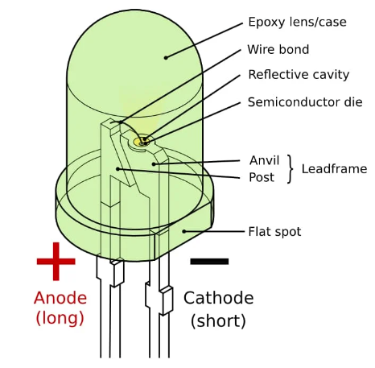

# **Light Emitting Diode (LED)**

## Description
A Light Emitting Diode (LED) is a semiconductor light source that emits light when an electrical current passes through it. LEDs are known for their energy efficiency, small size, and long operational lifetime.

## Characteristics

- **Efficiency**: LEDs are highly efficient and convert a greater proportion of energy into visible light rather than heat.
- **Durability**: They are robust and resistant to shock, vibration, and temperature changes.
- **Longevity**: LEDs have an extended lifespan, often lasting for tens of thousands of hours.
- **Brightness**: They offer high brightness with low power consumption.
- **Size**: LEDs are available in various sizes, allowing for compact designs.
- **Color**: LEDs come in a wide range of colors, including infrared and ultraviolet, with the ability to create white light.

## Identification Methods

- **Visual Inspection**: LEDs have a characteristic flat or hemispherical lens shape.
- **Polarity**: Identify the anode (longer lead) and cathode (shorter lead) using a multimeter or by observing the flat side on the lens, which indicates the cathode.
- **Color Coding**: The color of the LED can be an indicator of its peak emission wavelength.

## Common Applications

- **General Lighting**: In residential, commercial, and public spaces for energy-efficient lighting.
- **Automotive**: For brake lights, turn signals, and interior lighting in vehicles.
- **Electronics**: As indicator lights in various electronic devices such as computers, televisions, and smartphones.
- **Horticulture**: In grow lights for plants, providing specific light spectra for plant growth.
- **Signage and Displays**: For billboards, advertising displays, and digital signage.
- **Medical Devices**: In various diagnostic and therapeutic equipment.
- **Astronomy**: As light sources for telescopes and observational equipment.

## Usage Tips

- Ensure correct polarity when connecting LEDs to avoid damage.
- Use appropriate resistors to limit current and prevent overheating.
- Consider heat dissipation mechanisms for high-power LEDs to maintain efficiency and longevity.

## Examples 

* [Proejct 1 Blinking LED](../kz-0073/arduino/p1.md) (on Arduino) 

