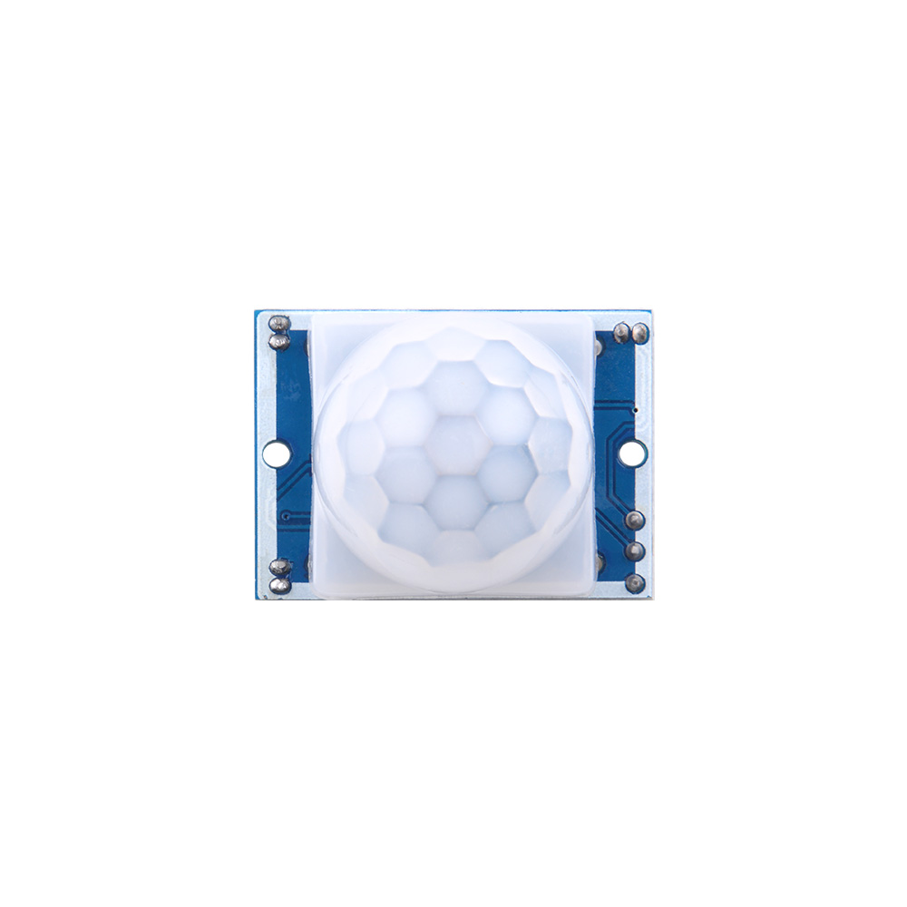

# PIR Sensor

## 
# PIR Sensor (Passive Infrared Sensor)

A PIR sensor, or Passive Infrared sensor, is a type of sensor that detects motion by detecting infrared (heat) radiation emitted by objects in its field of view. It's commonly used in security systems and automation applications to detect the presence of humans or animals.

## How It Works

1. **Detection Principle**: PIR sensors work on the principle that different objects emit different amounts of infrared radiation. Humans and warm-blooded animals emit infrared radiation with a wavelength that the PIR sensor can detect.

2. **Sensor Components**: A typical PIR sensor consists of a lens, a pyroelectric sensor element (usually made of materials like lead zirconate titanate or PZT), and a signal processing circuit.

3. **Operation**: The PIR sensor emits no light itself; it's "passive" because it only detects existing infrared radiation. When an object with a different temperature (like a human) moves within its detection range, it changes the pattern of infrared radiation that the sensor receives. This change triggers the sensor to send a signal.

4. **Signal Processing**: The signal from the sensor is then processed to determine if the detected movement is significant enough to warrant an alert. This can involve filtering out small, random movements and focusing on sustained changes.

5. **Applications**:
   - **Security Systems**: Used in home and business security systems to detect intruders.
   - **Automated Lighting**: Turns lights on when movement is detected, saving energy.
   - **Home Automation**: Can be used to trigger various automation tasks based on motion detection.

## Advantages

- **Energy Efficient**: Since they don't emit any light, they consume very little power.
- **Wide Detection Range**: Can cover a broad area, making them suitable for large spaces.
- **Low Cost**: Generally inexpensive compared to other motion detection technologies.

## Disadvantages

- **False Triggers**: Can be triggered by non-human sources of infrared radiation, like sunlight or heating elements.
- **Limited Range**: Effective range can be limited by environmental factors and the sensor's design.
- **Pet Tolerance**: Some PIR sensors are not pet-tolerant, meaning they might trigger on small animals.

## Technical Specifications

- **Detection Range**: Varies depending on the model but can range from a few meters to tens of meters.
- **Field of View**: Typically a wide angle, allowing for broad area coverage.
- **Sensitivity**: Adjustable in many models to fine-tune the detection threshold.
