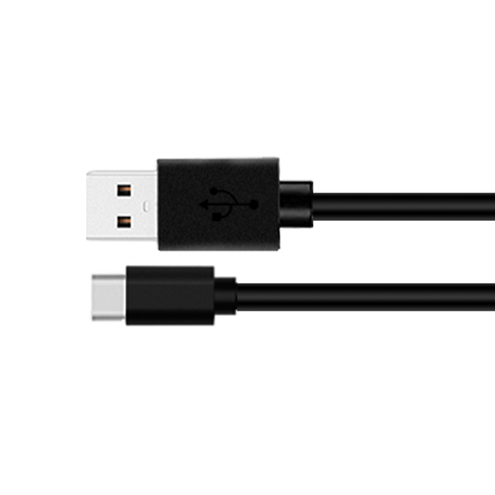

## What is a USB-C to USB 2.0 Programming Cable?

A **USB-C to USB 2.0 programming cable** is a type of cable used to connect devices that have a USB-C port to another device or a computer that has a USB 2.0 port. This type of cable is particularly useful in programming and data transfer scenarios where a newer device needs to communicate with an older system.

### Key Features:
- **Compatibility**: It bridges the gap between the newer USB-C standard and the older USB 2.0 standard, allowing for seamless data transfer and device communication.
- **Data Transfer**: Facilitates the transfer of data at speeds typical of USB 2.0, which is up to 480 Mbps.
- **Programming**: Often used in the development and testing of electronic devices, such as microcontrollers or embedded systems, where the device being programmed has a USB-C port.
- **Reversibility**: The USB-C connector is reversible, meaning it can be plugged in either way up, which is convenient for users.
- **Durability**: Typically made with high-quality materials to ensure a reliable connection and long-lasting use.

### Usage Scenarios:
- **Device Programming**: Connecting a microcontroller or other programmable device to a development board or computer.
- **Data Backup**: Transferring data from a USB-C device to a USB 2.0 storage device.
- **Peripheral Connection**: Connecting peripherals like keyboards, mice, or game controllers that use USB 2.0 to a USB-C equipped device.

### Technical Specifications:
- **Connector Type**: USB-C (male) to USB 2.0 (female)
- **Data Rate**: Up to 480 Mbps (USB 2.0 standard)
- **Power Delivery**: May support limited power delivery, depending on the cable's specifications.

This type of cable is essential for developers and tech enthusiasts who need to interface between modern and legacy systems in a variety of applications.
