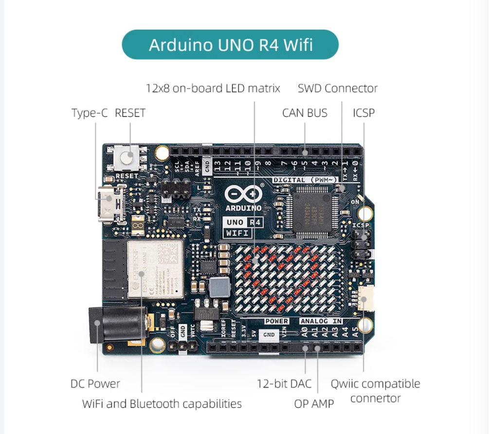

# Arduino UNO R4 Wifi 

## UNO R4 Wifi
The Arduino UNO R4 WiFi is designed around the 32-bit microcontroller RA4M1 from Renesas while also featuring a ESP32 module for Wi-Fi® and Bluetooth® connectivity. Its distinctive 12x8 LED matrix makes it possible to prototype visuals directly on the board, and with a Qwiic connector, you can create projects plug-and-play style.

## Feature

The MCU on the board is the high performance Renesas RA4M1 (Arm® Cortex®-M4) with a 48 MHz clock speed, 32 kB SRAM and 256 kB flash memory. This MCU features an RTC, a DAC and a CAN bus and has support for HID via USB.

The UNO R4 WiFi also features an ESP32-S3 for Wi-Fi®/Bluetooth® connectivity, which can also be separately programmed via a specific header.

## Details of UNO R4 WiFi

* Arduino Cloud
The UNO R4 WiFi is compatible with the Arduino Cloud platform. Build IoT projects in just minutes!
[Go to Platform](https://app.arduino.cc/)

* Cheat Sheet
A reference to all technical features on this board, with pointers to additional documents.
[Cheat Sheet](https://docs.arduino.cc/tutorials/uno-r4-wifi/cheat-sheet)

* 5 V Operating Voltage
The RA4M1 and the GPIOs of this board operates on 5 V.

* LED Matrix
Learn how to create animations and graphics on the 12x8 LED matrix.
[Documentation](https://docs.arduino.cc/tutorials/uno-r4-wifi/led-matrix)

* Real-Time Clock (RTC)
Keep track of time & date and set alarms with the built-in RTC.
[Documentation](https://docs.arduino.cc/tutorials/uno-r4-wifi/rtc)

* Digital-to-Analog Converter (DAC)
Use the onboard 12-bit DAC to build sophisticated audio projects.
[Documentation](https://docs.arduino.cc/tutorials/uno-r4-wifi/dac)

* Mouse/Keyboard Emulation (HID)
Build game controllers by emulating a mouse/keyboard.
[Documentation](https://docs.arduino.cc/tutorials/uno-r4-wifi/usb-hid)

* Input Voltage
Power your UNO R4 board through the VIN pin or the barrel jack at up to 6-24 V.

## Pinout
* [Click here for full pinout](../../imgs/ABX00087-full-pinout.pdf)
