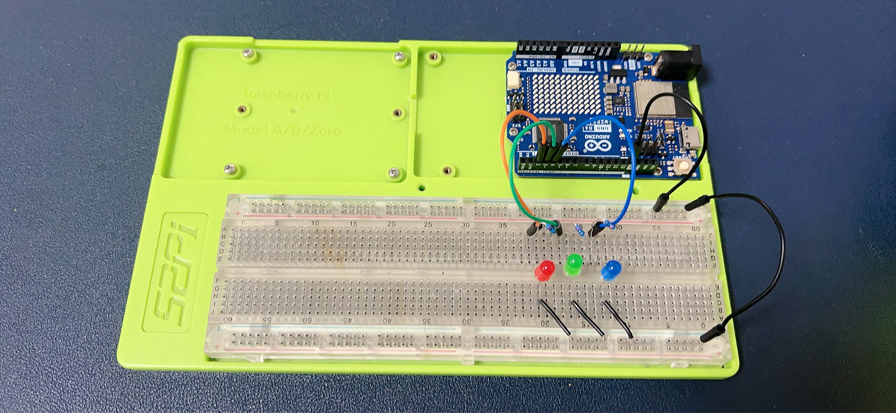
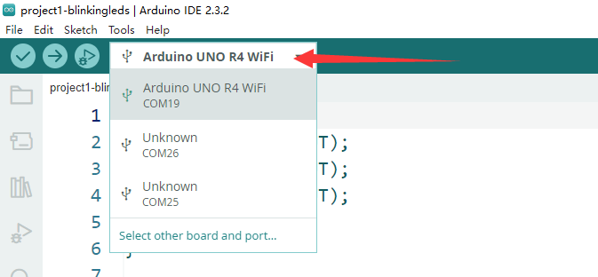
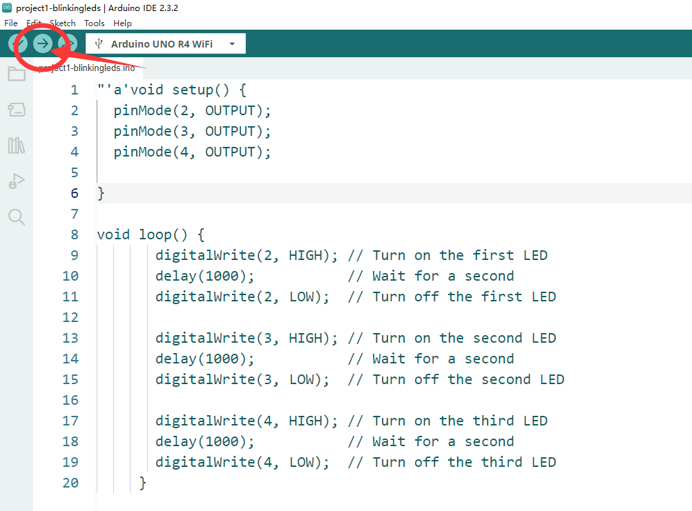
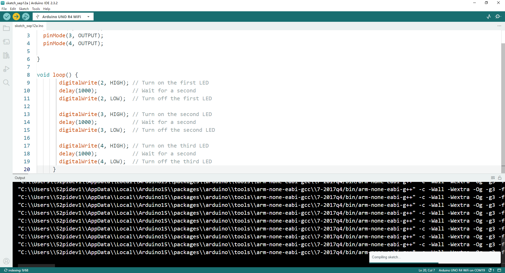

# Project 1 Blink LED

## Description 
In this demo, we are going to light up 3 LEDs by using Arduino UNO R4 WiFi.

## Setting Up a Simple LED Circuit with Arduino UNO R4 WiFi



## Materials Needed:
* 1 x Arduino UNO R4 WiFi(or other Arduino Board) 
* 3 x LED indicator (Red, Green, Blue) 
* 3 x 220 ohm resistor 
* 10 x Male-to-male Dupong wire
* 1 x USB-C programming cable
* 1 x 52Pi Experiment platform 

## Steps:

### **Prepare Your Workspace:**

    - Ensure your Arduino UNO R4 WiFi is powered off.
    - Lay out your LEDs, resistors, and jumper wires for easy access.

### **Connect the Resistors to the LEDs:**

       - Take one 220-ohm resistor and connect one end to the anode (longer leg) of an LED.
       - Connect the other end of the resistor to one of the digital output pins on the Arduino board.

### **Connect the LEDs to the Arduino:**

       - Insert the cathode (shorter leg) of each LED into a separate digital output pin on the Arduino board.

### **Secure the Connections:**

    - Use jumper wires to connect the resistors to the digital pins if the resistor leads are too short to reach directly.
    - Ensure all connections are secure to prevent loose connections.

### **Upload the Code:**

    - Write a simple program in the Arduino IDE to blink the LEDs. Here’s an example code snippet:
    - Upload the code to your Arduino UNO R4 WiFi.

```cpp
     void setup() {
       // Define the pins where the LEDs are connected
       pinMode(2, OUTPUT); // Replace 2 with the pin number you used for the first LED
       pinMode(3, OUTPUT); // Replace 3 with the pin number you used for the second LED
       pinMode(4, OUTPUT); // Replace 4 with the pin number you used for the third LED
     }

     void loop() {
       digitalWrite(2, HIGH); // Turn on the first LED
       delay(1000);           // Wait for a second
       digitalWrite(2, LOW);  // Turn off the first LED
       
       digitalWrite(3, HIGH); // Turn on the second LED
       delay(1000);           // Wait for a second
       digitalWrite(3, LOW);  // Turn off the second LED

       digitalWrite(4, HIGH); // Turn on the third LED
       delay(1000);           // Wait for a second
       digitalWrite(4, LOW);  // Turn off the third LED
     }

```
### Upload Sketch 

* Connect the Arduino UNO R4 wifi board to your PC or laptop via USB-C programming
cable. 

* Select the serial port to your Arduino UNO R4 wifi board.



* Click `Arrorw` icon to upload the sketch to your Arduino UNO R4 wifi board. 





### **Power On and Test:**

    - Power on your Arduino UNO R4 WiFi.
    - Observe the LEDs blinking in sequence as programmed.

## Notes:
- Make sure to follow the correct polarity when connecting the LEDs to avoid damaging them.
- Always double-check your connections before powering on the Arduino to prevent short circuits.
- You can modify the `delay()` function in the code to change the blinking speed of the LEDs.

## Demo Code Download:

* Demo Code sketch File: [Download](./imgs/project1-blinkingleds.zip)

## Demo Video:


