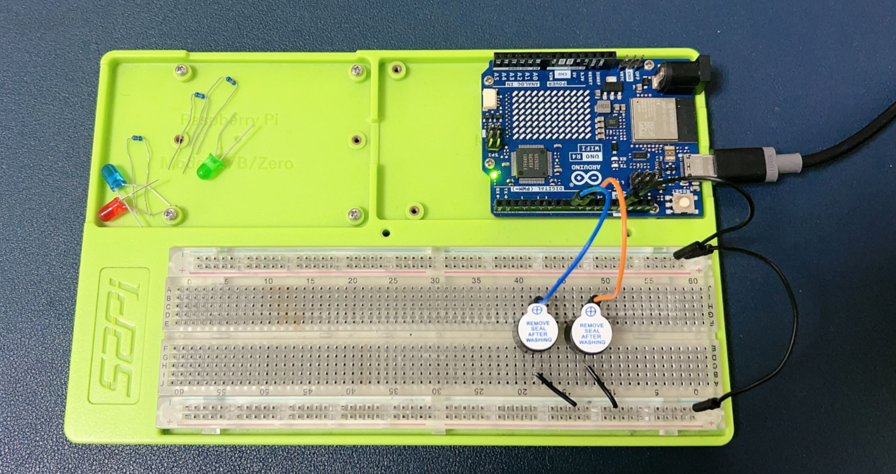
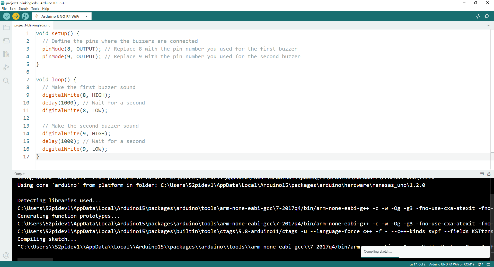

# Project 2 Buzzer Buzzer Ring

## Description 

In Project 2, we are going to show you how does a buzzer working on Arduino UNO
R4 wifi. 

## Setting Up a Buzzer Circuit with Arduino UNO R4 WiFi



## Materials Needed:

* 2 x Buzzers
* 6 x Jumper wires (also known as DuPont wires)
* 1 x Arduino UNO R4 WiFi
* 1 x 52Pi Experiment Platform
* 1 x USB-C programming cable

## Steps:

### **Prepare Your Workspace:**

    - Ensure your Arduino UNO R4 WiFi is powered off.
    - Lay out your buzzers and jumper wires for easy access.

### **Identify Buzzer Pins:**
    - Each buzzer typically has two pins: one for the positive voltage and one for the ground.
    - Mark or remember which pin is which for each buzzer.

### **Connect the Buzzers to the Arduino:**

   - Take a jumper wire and connect one pin of the first buzzer to a digital output pin on the Arduino (e.g., pin 8).
   - Connect the other pin of the first buzzer to one of the GND (ground) pins on the Arduino.
   - Repeat the process for the second buzzer, connecting it to another digital output pin (e.g., pin 9) and a GND pin.

### **Secure the Connections:**

   - Ensure all connections are secure to prevent loose connections.

### **Upload the Code:**

   - Write a simple program in the Arduino IDE to make the buzzers sound. Here’s an example code snippet:
   - Upload the code to your Arduino UNO R4 WiFi.


```cpp
void setup() {
  // Define the pins where the buzzers are connected
  pinMode(8, OUTPUT); // Replace 8 with the pin number you used for the first buzzer
  pinMode(9, OUTPUT); // Replace 9 with the pin number you used for the second buzzer
}

void loop() {
  // Make the first buzzer sound
  digitalWrite(8, HIGH);
  delay(1000); // Wait for a second
  digitalWrite(8, LOW);
  
  // Make the second buzzer sound
  digitalWrite(9, HIGH);
  delay(1000); // Wait for a second
  digitalWrite(9, LOW);
}

```
### **Upload Sketch** 



### **Power On and Test:**

    - Power on your Arduino UNO R4 WiFi.
    - Observe the buzzers sounding in sequence as programmed.

## Notes:

- Ensure you connect the buzzers to the correct digital output pins on the Arduino to avoid damaging the components.
- Always double-check your connections before powering on the Arduino to prevent short circuits.
- You can modify the `delay()` function in the code to change the duration of the buzzer sounds.
- For a more complex sound pattern, you can add more buzzers or use the `tone()` function to play tones at specific frequencies.

## Demo Code Download

* Demo Code Sketch: [Download](./imgs/project2_buzzer_buzzer_ring.zip)

## Demo Video:

