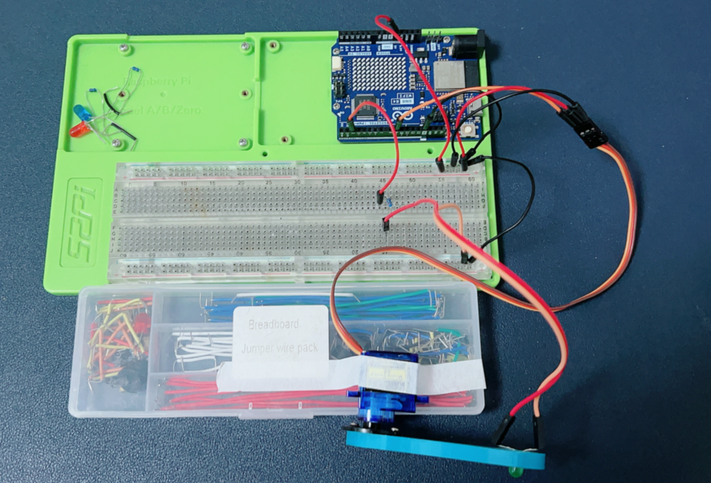

# Project 3 Drive a 9g Servo

## Setting Up a Servo Motor Circuit with Arduino UNO R4 WiFi



## Materials Needed:
* 1 x 9g Servo Motor
* 3 x Jumper wires (also known as DuPont wires)
* 1 x Arduino UNO R4 WiFi
* A power source for the servo (optional, depending on your setup)
* 1 x 52Pi experiment platform
* 1 x USB-C programming cable
* 1 x LED indicator
* 1 x 220 ohm resistor

## Steps:

### **Prepare Your Workspace:**

   - Ensure your Arduino UNO R4 WiFi is powered off.
   - Lay out your servo motor and jumper wires for easy access.

### **Identify Servo Wires:**

   - Most servos have three wires: power (usually red), signal (usually orange, yellow or white), and ground (usually black or brown).
   - Identify these wires on your 9g servo.

### **Connect the Servo to the Arduino:**

   - Connect the signal wire of the servo to a digital output pin on the Arduino (e.g., pin 9).
   - Connect the ground wire of the servo to one of the GND (ground) pins on the Arduino.
   - Connect the power wire of the servo to the 5V pin on the Arduino (or to an external power source if you prefer not to draw power from the Arduino).
   - Connect the LED with resistor to the Pin 2 on the Arduino. 

### **Secure the Connections:**

   - Use jumper wires to connect the servo wires to the Arduino if necessary.
   - Ensure all connections are secure to prevent loose connections.

### **Upload the Code:**

   - Write a simple program in the Arduino IDE to control the servo. Here’s an example code snippet:
   - Upload the code to your Arduino UNO R4 WiFi.


```cpp
#include <Servo.h>

Servo myServo;  // Create servo object to control a servo
int servoPin = 9; // Define the pin the servo is attached to

int LED = 2;  // Define the pin the led is connected to.

void setup() {
  pinMode(LED, OUTPUT); // init LED output direction.
  myServo.attach(servoPin);  // Attaches the servo on pin 9 to the servo object
}

void loop() {
  myServo.write(0); // Move the servo to 0 degrees
  digitalWrite(LED, HIGH); // turn on the led 
  delay(1000);      // Wait for a second
  myServo.write(180); // Move the servo to 180 degrees
  digitalWrite(LED, LOW); // turn off the led
  delay(1000);      // Wait for a second
}
```

### **Power On and Test:**

   - Power on your Arduino UNO R4 WiFi.
   - Observe the servo motor moving to 0 degrees and then to 180 degrees as programmed.

## Notes:

- Ensure you connect the servo to the correct pins on the Arduino to avoid damaging the components.
- Always double-check your connections before powering on the Arduino to prevent short circuits.
- The `Servo.h` library is used to control the servo motor, and it should be included in your Arduino IDE.
- You can modify the `myServo.write()` function in the code to move the servo to different positions.
- Be cautious when using the Arduino's 5V pin to power the servo, as drawing too much current can damage the board. Consider using an external power source if your servo requires more current than the Arduino can safely provide.

## Demo Code Download:

* Demo Code Sketch [Download](./imgs/project_3_led_waveing_by_servo.zip)

## Demo Video:


