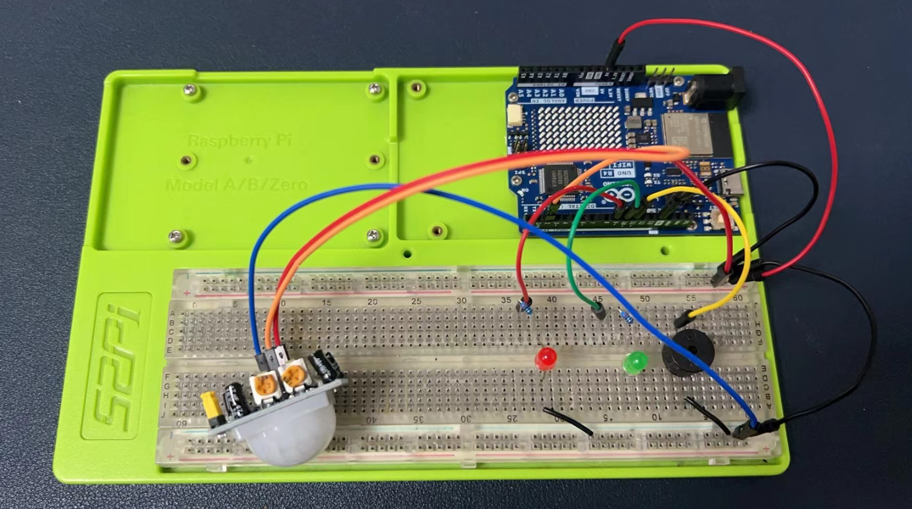
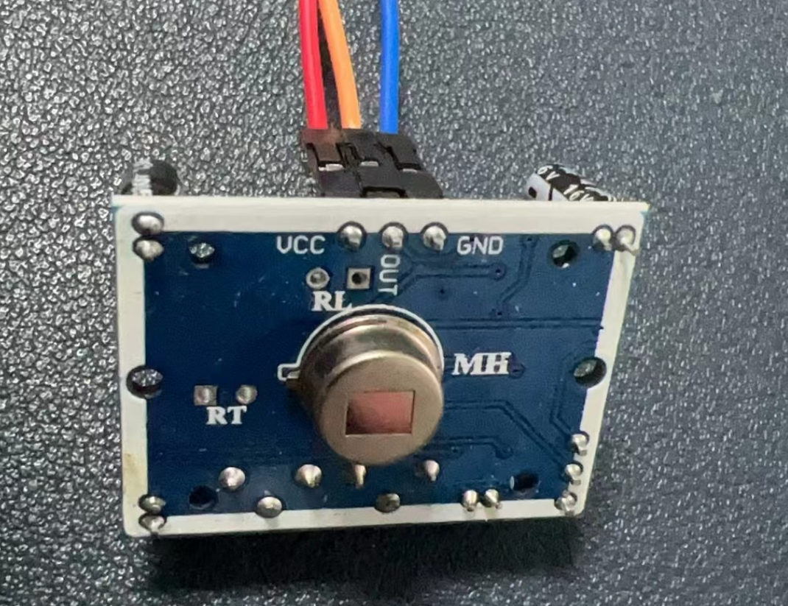
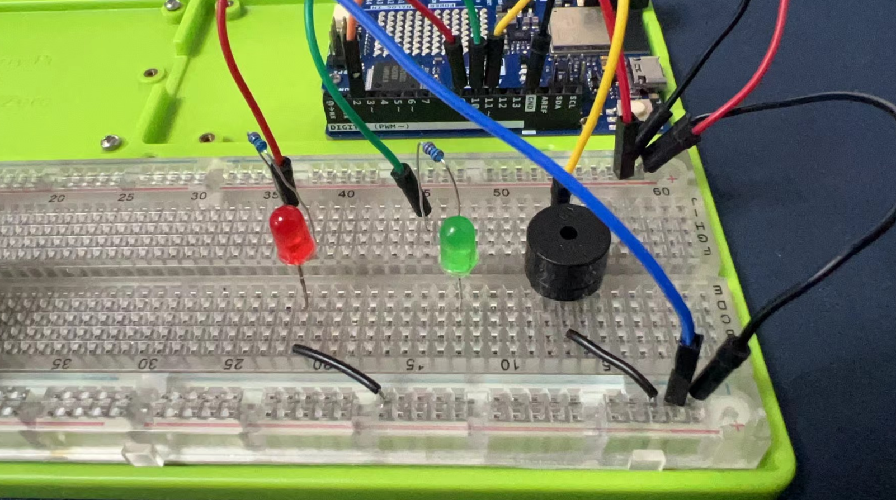
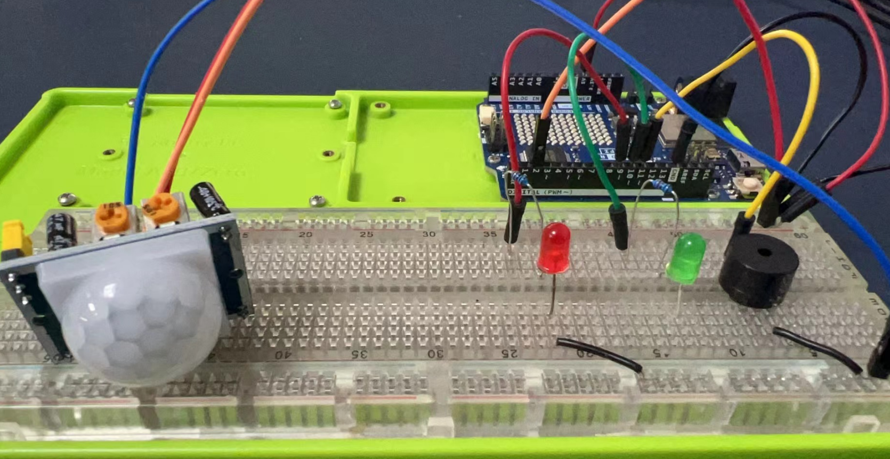
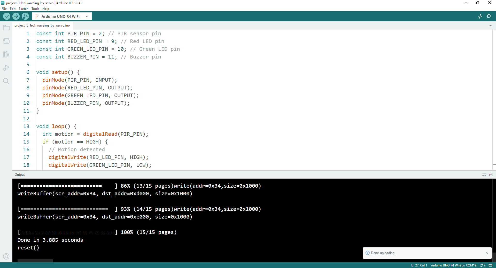

# Project 4 Motion Detection by using PIR Sensor

# Motion Detection Device with Arduino UNO R4 WiFi



## Materials Needed:
* 1 x PIR Motion Sensor
* 1 x Red LED
* 1 x Green LED
* 1 x Buzzer
* 10 x Jumper wires (DuPont wires)
* 1 x Arduino UNO R4 WiFi
* 1 x 52Pi Experiment Platform
* 1 x USB-C programming Cable
* 1 x Jumper wire box

## Circuit Setup:

### **Connect the PIR Sensor:**

- Connect the VCC pin of the PIR sensor to the 5V pin on the Arduino.
- Connect the GND pin of the PIR sensor to one of the GND pins on the Arduino.
- Connect the OUT pin of the PIR sensor to a digital pin on the Arduino (e.g., pin 2).




### **Connect the LEDs:**

- Connect the anode (longer leg) of the red LED to a digital pin through a 220-ohm resistor (e.g., pin 9).
- Connect the cathode (shorter leg) of the red LED to a GND pin.
- Repeat the process for the green LED with another digital pin and resistor (e.g., pin 10).

### **Connect the Buzzer:**

- Connect one pin of the buzzer to a digital pin on the Arduino (e.g., pin 11) through a 220-ohm resistor.
- Connect the other pin of the buzzer to a GND pin.






### **Secure the Connections:**

- Use jumper wires to ensure all components are securely connected to the Arduino.

## Arduino Code:

```cpp
const int PIR_PIN = 2; // PIR sensor pin
const int RED_LED_PIN = 9; // Red LED pin
const int GREEN_LED_PIN = 10; // Green LED pin
const int BUZZER_PIN = 11; // Buzzer pin

void setup() {
  pinMode(PIR_PIN, INPUT);
  pinMode(RED_LED_PIN, OUTPUT);
  pinMode(GREEN_LED_PIN, OUTPUT);
  pinMode(BUZZER_PIN, OUTPUT);
}

void loop() {
  int motion = digitalRead(PIR_PIN);
  if (motion == HIGH) {
    // Motion detected
    digitalWrite(RED_LED_PIN, HIGH);
    digitalWrite(GREEN_LED_PIN, LOW);
    digitalWrite(BUZZER_PIN, HIGH);
    delay(200);
  } else {
    // No motion
    digitalWrite(RED_LED_PIN, LOW);
    digitalWrite(GREEN_LED_PIN, HIGH);
    digitalWrite(BUZZER_PIN, LOW);
    delay(200);
  }
}
```
### Upload sketch:

* upload sketch as mentioned before.



### Code Explanation:

* The PIR sensor detects motion and outputs a HIGH signal on its OUT pin.
* When motion is detected, the red LED turns on, the green LED turns off, and the buzzer sounds.
* When no motion is detected, the green LED turns on, the red LED turns off, and the buzzer is silent.

## Notes:
* Ensure all connections are secure and correctly polarized to avoid damaging components.
* You can adjust the sensitivity and delay of the PIR sensor using the potentiometers on the sensor itself.
* Upload the code to your Arduino UNO R4 WiFi and test the motion detection functionality.

This setup provides a basic motion detection device that can be expanded with additional features such as wireless notifications or integration with home automation systems.

## Demo Code Download:

* Demo code sketch [Download](./imgs/project_4_Motion_detection_alarm.zip)

## Demo Video:


