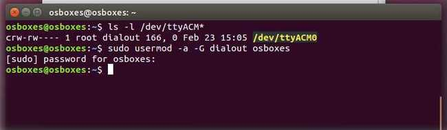

# Arduino UNO R4 Wi-Fi Introduction

## Overview
The Arduino UNO R4 Wi-Fi is designed around the 32-bit microcontroller RA4M1 from Renesas, which also features an ESP32 module for Wi-Fi® and Bluetooth® connectivity. Its distinctive 12x8 LED matrix allows for prototyping visuals directly on the board, and with a Qwiic connector, you can create projects in a plug-and-play style.

## Features
- The MCU on the board is the high-performance Renesas RA4M1 (Arm® Cortex®-M4) with a 48 MHz clock speed, 32 kB SRAM, and 256 kB flash memory.
- This MCU features an RTC, a DAC, a CAN bus, and has support for HID via USB.
- The UNO R4 Wi-Fi also features an ESP32-S3 for Wi-Fi®/Bluetooth® connectivity, which can also be separately programmed via a specific header.


## Tech Specs
Here are the technical specifications for the Arduino® UNO R4 Wi-Fi.

### Notes
- **ESP header:** The ESP32-S3 module on this board operates on 3.3 V. The ESP header located close to the USB-C® connector is 3.3V only and should not be connected to 5 V. Connecting to 5V may damage your board.
- **Qwiic connector:** The Qwiic connector on this board is connected to a secondary I2C bus, I2C0. This connector is 3.3 V only; connecting higher voltages may damage your board. To initialize this bus, use `Wire1.begin()` instead.
- **Maximum current draws per pin:** The UNO R4 series' maximum current draw per GPIO is 8 mA, which is significantly lower than previous versions. Exceeding this limit may damage your pin/board.


## Suggested Libraries
- **Wire:** This library allows you to communicate with I2C devices, a feature present on all Arduino boards. I2C is a very common protocol, primarily used for reading/sending data to/from external I2C components. [More info](https://www.arduino.cc/reference/en/language/functions/communication/wire/)
- **SPI:** This library allows you to communicate with SPI devices, with the Arduino as the controller device. This library is bundled with every Arduino platform (avr, megaavr, mbed, samd, sam, arc32), so you do not need to install it separately.
- **Servo:** Allows Arduino boards to control a variety of servo motors. This library can control a great number of servos, making careful use of timers: it can control 12 servos using only 1 timer. On the Arduino Due, you can control up to 60 servos.

## **Download Arduino IDE** 
* Official website: [ arduino.cc/en/software ](https://www.arduino.cc/en/software)

    
## **Installing the Arduino IDE 2** 
* Please refer to this URL:
[Downloading and installing the arduino IDE
2](https://docs.arduino.cc/software/ide-v2/tutorials/getting-started/ide-v2-downloading-and-installing/)

* Windows 

To install the Arduino IDE 2 on a Windows computer, simply run the file downloaded from the software page


Follow the instructions in the installation guide. The installation may take several minutes.


You can now use the Arduino IDE 2 on your Windows computer!   

* MacOS

To install the Arduino IDE 2 on a macOS computer, simply copy the downloaded file into your application folder.


You can now use the Arduino IDE 2 on your macOS computer!

* Linux 
To install the Arduino IDE 2 on Linux, first download the AppImage 64 bits (X86-64) from the [Arduino Software page](https://www.arduino.cc/en/software).

Before we can launch the editor, we need to first make it an executable file. This is done by:

1. `right-click` the file,
2. `choose Properties`,
3. `select Permissions tab`,
4. `tick the Allow executing file as program box`.


You can now double click the file to launch the Arduino IDE 2 on your Linux machine. In case you cannot run the AppImage file, make sure that FUSE is installed on your system.

In Ubuntu (>= 22.04):

```bash
sudo add-apt-repository universe
sudo apt install libfuse2
```

In Fedora:

```bash
dnf install FUSE
```

See instrucntions for installing FUSE on your distribution [here](https://github.com/AppImage/AppImageKit/wiki/FUSE)

To enable the Arduino IDE to access the serial port and upload code to your board, the following rule can be added to `/etc/udev/rules.d/99-arduino.rules`.

```bash
SUBSYSTEMS=="usb", ATTRS{idVendor}=="2341", GROUP="plugdev", MODE="0666"
```
## **How to upload a sketch with the Arduino IDE 2** 
In the Arduino environment, we write sketches that can be uploaded to Arduino boards. In this tutorial, we will go through how to select a board connected to your computer, and how to upload a sketch to that board, using the Arduino IDE 2.
You can easily download the editor from the Arduino Software page.
You can also follow the downloading and installing the Arduino IDE 2 tutorial for more detailed guide on how to install the editor.

### **Requirements**
* Arduino IDE 2 installed.  

### **Verify VS Upload** 
There are two main tools when uploading a sketch to a board: `verify` and `upload`. 
The verify tool simply goes through your sketch, checks for errors and compiles it. The upload tool does the same, but when it finishes compiling the code, it also uploads it to the board.

A good practice is to use the verifying tool before attempting to upload anything. This is a quick way of spotting any errors in your code, so you can fix them before actually uploading the code.

### **Uploading a Sketch** 
Uploading a sketch is quick and easy, but let's take a look at what we need to do.

* Open the Arduino IDE 2. 

* With the editor open, let's take a look at the toolbar at the top. 
At the very left, there is a `checkmark` and an `arrow pointing right`. 
The checkmark is used to `verify`, and the arrow is used to `upload`.

.

* But before doing any of that, we should choose what board we are uploading to.
Beside the verify and upload button you should see a a drop down menu, this will, in most cases, display Arduino boards that are connected to your computer. 
If your board is not automatically detected, you can either press "Select other board and port..." in the drop-down and follow the instructions, or go to `Tools` > `Board and Tools` > `Port` in the toolbar menu to select the board and port manually.

.

So connect your board to the computer and select it from the drop down menu. You'll know that there is a connection to the board when the board name appears in `bold`.

.

* Click on the verify tool (checkmark). 
Since we are verifying an empty sketch, we can be sure it is going to compile. 
After a few seconds, we can see the result of the action in the console (black box in the bottom).


* With the board selected, we are good to go! Click on the upload button, and it will start uploading the sketch to the board.

* When it is finished, a notification pops up in the bottom right of your IDE window. Of course, sometimes there are some complications when uploading, and these errors will be listed here as well.

.

Congratulations, you have now uploaded a sketch to your Arduino board!

### **Please Read (Only Linux Users)**

It might happen that when you upload a sketch - after you have selected your board and the serial port - you get an error such as "... Permission denied". 
If you get this error, you need to set serial port permission.

To do this, open your Terminal and type:

```bash
ls -l /dev/ttyACM*
```

you will get something like:

```bash
crw-rw---- 1 root dialout 188, 0 5 apr 23.01 ttyACM0
```

The "0" at the end of ACM might be a different number, or multiple entries might be returned. The data we need is "dialout" (is the group owner of the file).

Now we just need to add our user to the group:

```bash
sudo usermod -a -G dialout <username>
```

where <username> is your Linux user name. 

<br>You will need to log out and log in again for this change to take effect.

.

After this procedure, you should be able to proceed normally and upload the sketch to your board or use the Serial Monitor.


