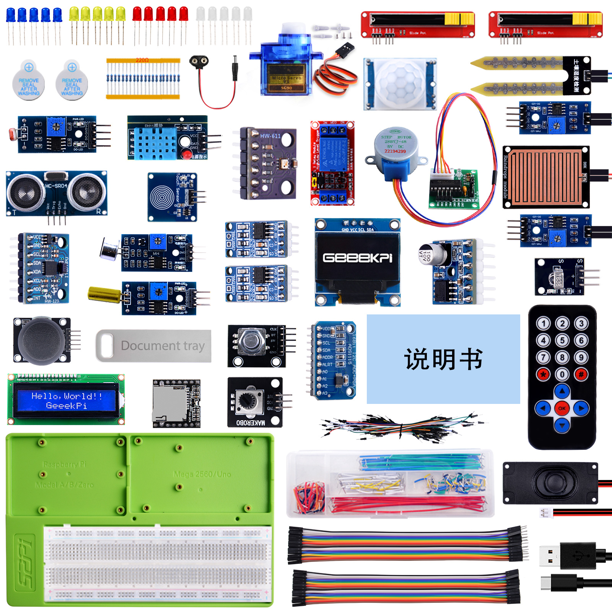

## What's in the Kit?

* **The SKU of the Kit**: `KZ-0068` 

* **Name of the Kit** : `Universal Sensor Kit`

## Package Includes

## About Universal Sensor Kit 

Unleash Your Creativity with Our Universal Sensor Kit!
Dive into the world of IoT and robotics with our comprehensive **Universal Sensor Kit**! Designed to support a variety of MCUs and Single Board Computers (SBCs), this kit is perfect for enthusiasts, educators, and developers.

## What's in the Kit?

- **LEDs and Buzzers**: For basic signaling and alerts.
- **Resistors (220ohm)**: To manage electrical current flow.
- **9g Servo Motors**: For precise movement control.
- **Linear Slide Potentiometers**: For variable resistance control.
- **9V Battery DC Jack**: For easy power supply integration.
- **PIR Sensor**: To detect motion in your projects.
- **Soil Moisture Sensor**: To monitor plant health.
- **Raindrop Sensor**: For weather-related applications.
- **Infrared (IR) Receiver Module** and **IR Remote Control**: For wireless operations.
- **DHT11 Temperature and Humidity Sensor**: For environmental monitoring.
- **Photoresistor**: For light sensing.
- **BMP280 Barometric Pressure Sensor**: For altitude and pressure readings.
- **MPU6050 Gyroscope and Accelerometer**: For motion tracking.
- **Sound Sensor**: To detect and measure noise levels.
- **Tilt Sensor**: For stability and orientation detection.
- **CAN Bus Modules**: For communication between microcontrollers.
- **OLED 0.96 Inch Display**: For a clear visual interface.
- **DAC Amplifier Module**: For high-quality audio output.
- **3W Speaker**: For audible feedback.
- **Single Channel Relay**: For controlling high voltage or high current devices.
- **Stepper Motor** and its **Driver Board**: For precise rotational control.
- **Rotary Encoder**: For accurate position tracking.
- **LCD1602 Display**: For text and data presentation.
- **PS/2 Joystick**: For interactive control.
- **Mini MP3 Module**: For audio playback.
- **Potentiometer Module**: For adjustable resistance.
- **ADS1115 ADC Module**: For analog-to-digital conversion.
- **DuPont Wires** and **Jumper Wires**: For easy connections.
- **Jumper Box**: For organized wiring.
- **USB Programming Cable**: For device programming.
- **52Pi Experiment Tray**: For a convenient and organized workspace.

## Get Ready to Explore, Innovate, and Create!

With our kit, you'll receive not only the hardware but also a treasure trove of **documentation and example codes** for Arduino, Raspberry Pi Pico, and ESP32, ensuring a smooth and educational experience. Whether you're building a home automation system, a weather station, or a robot, our Universal Sensor Kit has everything you need to bring your ideas to life. Get ready to explore, innovate, and create with our Ultimate Sensor Kit!

### Components Details

- ** [Arduino UNO R4 WiFi](../components/arduino_uno_r4_wifi.md) **: The Arduino UNO R4 WiFi is powerfull development board.

- ** [9g Servo](../components/9g_Servos.md) **: A device for converting electrical signals into precise mechanical motion.

- ** [52Pi Experiment Platform](../components/52Pi_Experiment_Trays.md) **: A platform for conducting experiments.

- ** [USB-C Programming Cable](../components/USB-C.md) **: For programming the Arduino UNO WiFi.

- ** [Jumper Wire Box](../components/Jumper_Wire_Organizers.md) **: Contains pre-cut wires with connectors for temporary electrical connections.

- ** [LED Indicator Pack](../components/LED_lights.md) **: Includes LEDs for visual indication in circuits.

- ** [Push Button](../components/Button.md) **: Used for manual input in electronic circuits.

- ** [Buzzer](../components/Buzzers.md) **: An audio signaling device.

- ** [Battery Cap](../components/9V_Battery_Clips.md) **: For powering the Arduino board.

- ** [Slide Potentiometer](../components/Slide_Potentiometers.md) **: For powering the Arduino board.

- ** [PIR Sensor](../components/PIR_sensor.md) **: For powering the Arduino board.

## Next Steps

