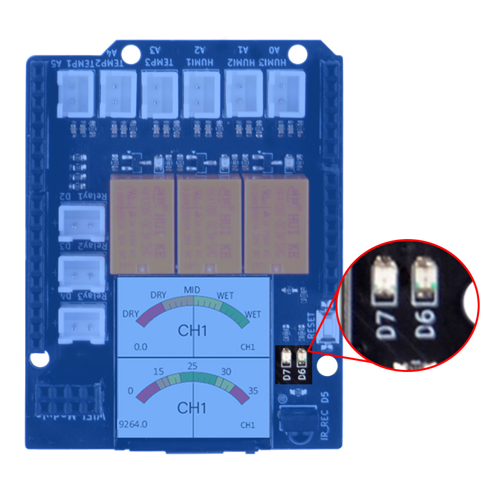
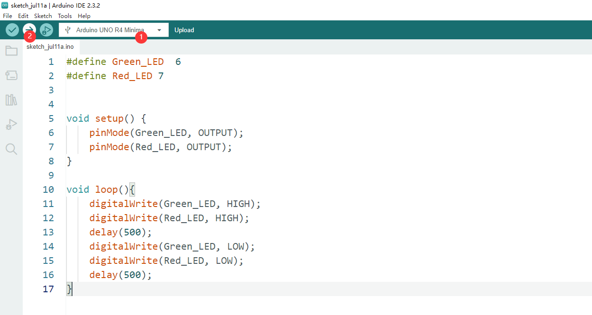

# Basic Usage 1 

## Blinking LED on board

This is the basic experiment for learning the plant watering kit, it will help you to know about the pinout of electronics components onboard and help you understand how to use those components individual. 

OK, let’s begin the basic learning. 

In this experiment, we are going to blink the two LEDs on the plant watering hat board. 

## Hardware Overview

The shield provides the following interfaces:

* 3 x Soil Moisture Sensors (Analog Inputs A0, A1, A2)
* 3 x NTC Temperature Sensors (Analog Inputs A4, A5, A6)
* 3 x 3.3V Relay Modules (Digital Outputs 2, 3, 4)
* 3 x Mini Water Pumps
* 1.3-inch IPS RGB TFT Screen (ST7789 Controller)

## Pinout Chart

* Details of the expansion board.

|Plant Watering Kit Hat Board | Arduino UNO R4 WiFi Board|
|:---:|:---:|
| <font color=Green>HUMI3 </font>| <font color=green>A0</font> |
| <font color=Green>HUMI2 </font>| <font color=green>A1</font> |
| <font color=Green>HUMI1 </font>| <font color=green>A2</font> |
| <font color=BROWN>TEMP3</font>| <font color=BROWN>A3</font> |
| <font color=BROWN>TEMP2</font>| <font color=BROWN>A4</font> |
| <font color=BROWN>TEMP1 </font>| <font color=BROWN>A5</font> |
| <font color=red>IR_RSV</font>| <font color=red>D5</font> |
| <font color=blue>Relay 1</font>| <font color=blue>D2</font> |
| <font color=blue>Relay 2</font>| <font color=blue>D3</font> |
| <font color=blue>Relay 3</font>| <font color=blue>D4</font> |
| <font color=pink> TFT_SCLK </font>| <font color=pink>D13 </font>|
| <font color=pink> TFT_MOSI</font>| <font color=pink>D11 </font>|
| <font color=pink> TFT_CS </font>| <font color=pink>D10 </font>|
| <font color=pink> TFT_DC </font>| <font color=pink>D9 </font>|
| <font color=pink> TFT_RST </font>| <font color=pink>D8 </font>|
| <font color=red> RX</font>| <font color=red>TX->1 </font>|
| <font color=red> TX</font>| <font color=red>RX<-0 </font>|
| <font color=green>Green LED </font>|<font color=green>D6</font> |
| <font color=red>Red LED</font> | <font color=red>D7</font> |

## Circuit Diagram 


## LEDs on board Position Detail 



## Connecting the Shield

- place the arduino uno r4 on a flat surface.
- align the shield with the headers of the arduino board and gently press it down until it clicks into place.
- plug the plant watering hat board on top of arduino uno r4 on gpio pins. 

## Programming 

Open arduino IDE and create a new sketch by clicking `file`-> `New Sketch` 


### Define LED Pin number 

```cpp
#define Green_LED 6
#define Red_LED 7
```

### Initializing Pin Mode 

Set the pin direction to `OUTPUT` in setup function sector.

```cpp
void setup() {
    pinMode(Green_LED, OUTPUT);
    pinMode(Red_LED, OUTPUT);
}
```

### Modify loop section 

```cpp
void loop() {
  digitalWrite(Green_LED, HIGH);
  digitalWrite(Red_LED, HIGH);
  delay(500);
  digitalWrite(Green_LED, LOW);
  digitalWrite(Red, LOW);
  delay(500);
}
```

It will light up Red LED after Green_LED and wait for 500 milliseconds and then
turn off the LEDs.

### Upload the sketch to Arduino UNO R4 WiFi board.

* Connect the Arduino UNO R4 WiFi board to your computer via USB-C cable on USB port 

* Select the serial device on your arduino IDE and click upload icon as following figure:

 

You may try to modify the code in loop section to change the behavior of the LED indicators. 

## Demo Code Sketch Download 
* [Basic_1_Blinking_LED_onboard Sketch Download](./imgs/Basic_1_Blinking_LED_onboard.zip)
### Finally 
* If you can see the LED lights are blinking means that you have finished this
task. Let us remove to next chapter. 


