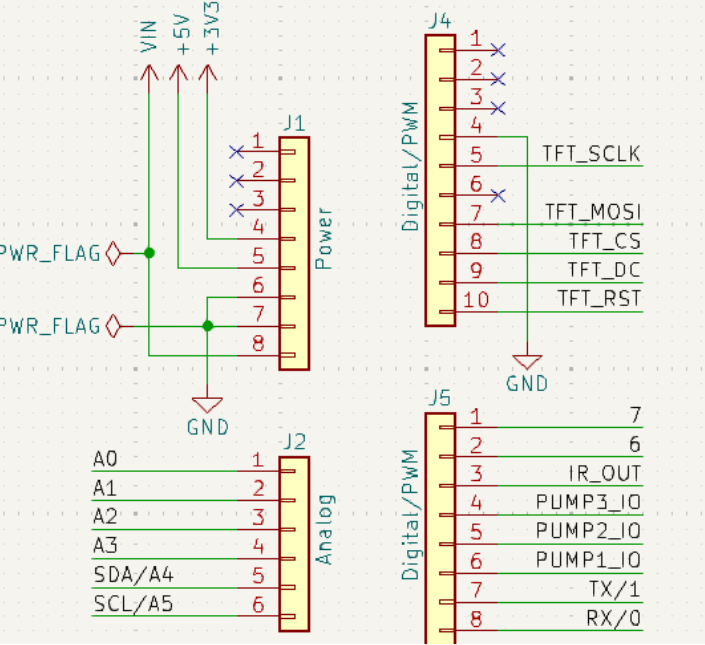

# Basic Usage 2

## Read data from soil moisture sensor

This is the basic experiment for learning the plant watering kit, it will help you to know about the pinout of electronics components onboard and help you understand how to use those components individual.

OK, let’s begin the basic learning.

In this experiment, we are going to read raw data from soil moisture sensors on the plant watering hat board.

## Hardware Overview

The shield provides the following interfaces:

* 3 x Soil Moisture Sensors (Analog Inputs A0, A1, A2)
* 3 x NTC Temperature Sensors (Analog Inputs A4, A5, A6)
* 3 x 3.3V Relay Modules (Digital Outputs 2, 3, 4)
* 3 x Mini Water Pumps
* 1.3-inch IPS RGB TFT Screen (ST7789 Controller)

## Soil Moisture sensor Details


## Pinout Chart

* Details of the expansion board.

|Plant Watering Kit Hat Board | Arduino UNO R4 WiFi Board|
|:---:|:---:|
| <font color=Green>HUMI3 </font>| <font color=green>A0</font> |
| <font color=Green>HUMI2 </font>| <font color=green>A1</font> |
| <font color=Green>HUMI1 </font>| <font color=green>A2</font> |
| <font color=BROWN>TEMP3</font>| <font color=BROWN>A3</font> |
| <font color=BROWN>TEMP2</font>| <font color=BROWN>A4</font> |
| <font color=BROWN>TEMP1 </font>| <font color=BROWN>A5</font> |
| <font color=red>IR_RSV</font>| <font color=red>D5</font> |
| <font color=blue>Relay 1</font>| <font color=blue>D2</font> |
| <font color=blue>Relay 2</font>| <font color=blue>D3</font> |
| <font color=blue>Relay 3</font>| <font color=blue>D4</font> |
| <font color=pink> TFT_SCLK </font>| <font color=pink>D13 </font>|
| <font color=pink> TFT_MOSI</font>| <font color=pink>D11 </font>|
| <font color=pink> TFT_CS </font>| <font color=pink>D10 </font>|
| <font color=pink> TFT_DC </font>| <font color=pink>D9 </font>|
| <font color=pink> TFT_RST </font>| <font color=pink>D8 </font>|
| <font color=red> RX</font>| <font color=red>TX->1 </font>|
| <font color=red> TX</font>| <font color=red>RX<-0 </font>|
| <font color=green>Green LED </font>|<font color=green>D6</font> |
| <font color=red>Red LED</font> | <font color=red>D7</font> |

## Circuit Diagram 



## Soil moistrue socket position 


## Connecting the Shield
- place the arduino uno r4 on a flat surface.
- align the shield with the headers of the arduino board and gently press it down until it clicks into place.
- plug the plant watering hat board on top of arduino uno r4 on gpio pins. 

## Programming 

Open arduino IDE and create a new sketch by clicking `file`-> `New Sketch` 


### Define LED Pin number 

```cpp
#define HUMI3 A0 
#define HUMI2 A1
#define HUMI1 A2
```

### Initializing Pin and Serial port for monitoring.

```cpp
void setup() {
    Serial.begin(9600);  // Initializing Serial monitor 
}
```

### Modify loop section 

```cpp
void loop() {
    int HUMI1_Raw_data = analogRead(HUMI1);
    int HUMI2_Raw_data = analogRead(HUMI2);
    int HUMI3_Raw_data = analogRead(HUMI3);

    Serial.print("Soil Moisture sensor raw data:");
    Serial.print("CH1: ");
    Serial.print(HUMI1_Raw_data);
    Serial.print("CH2: ");
    Serial.print(HUMI2_Raw_data);
    Serial.print("CH3: ");
    Serial.println(HUMI3_Raw_data);
    delay(1000); //wait for a second.
}
```

### Upload the sketch to Arduino UNO R4 WiFi board.

* Connect the Arduino UNO R4 WiFi board to your computer via USB-C cable on USB port 

* Select the serial device on your arduino IDE and click upload icon as following figure:

 
 
 

### Open Serial monitor 

* Click this icon on right up cornner to open `serial monitor`.


 

## Demo Code Sketch Download 

[Basic_2_demo_code_sketch_download](./imgs/Basic_2_reading_analog_data_soil_moisture_sensor.zip) 


### Finally 
* Check if the three channel has outputs on the serial monitor, and try to put
one of them into the water, and observe the output data on screen. 
If you can see the data changed when you insert the sensor into water, it means
you finished this task. Let us remove to next chapter. 


