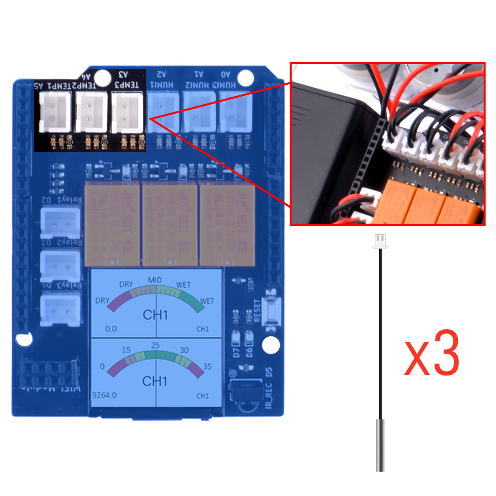

# Basic Usage 3

## Reading NTC raw data and convert it into temperature. 

Next, we will calculate the current temperature information by converting the readings from the NTC.

## Hardware Overview

The shield provides the following interfaces:

* 3 x Soil Moisture Sensors (Analog Inputs A0, A1, A2)
* 3 x NTC Temperature Sensors (Analog Inputs A4, A5, A6)
* 3 x 3.3V Relay Modules (Digital Outputs 2, 3, 4)
* 3 x Mini Water Pumps
* 1.3-inch IPS RGB TFT Screen (ST7789 Controller)

## What is NTC temperature sensor?

NTC temperature sensors, which stand for **Negative Temperature Coefficient** thermistors, are a type of thermistor whose resistance decreases as the temperature increases. They are characterized by a negative correlation between resistance value and temperature within their operating range, meaning the resistance decreases with an increase in temperature.


### Working Principle

The working principle of NTC thermistors is based on the properties of semiconductor materials. Unlike metals, whose resistance increases with temperature due to increased lattice vibrations, in semiconductors, the number of free electrons and holes increases with heat, which outweighs the reduction in their average speed. This results in a decrease in resistance with an increase in temperature. Additionally, the energy band gap in semiconductors allows electrons to move from the valence band to the conduction band when heated, enhancing conductivity and further decreasing resistance.

### Applications

NTC thermistors are widely used in household appliances for functions such as:

- Automatic gain adjustment
- Overload protection
- Temperature control
- Temperature compensation
- Voltage stabilization

For example, in devices like air conditioners or smartphones, NTC thermistors can measure internal temperatures for control and protection of sensitive components.

### Design Considerations

When designing an NTC temperature measurement system, consider:

- Selection of NTC thermistors
- Choice and configuration of ADCs (Analog-to-Digital Converters)
- Methods of using NTC thermistors for temperature measurement

One can choose between current excitation or voltage excitation and dynamically adjust gain or excitation current based on the thermistor's signal level to optimize accuracy.

### Resistance-Temperature Relationship

The relationship between the resistance value of an NTC thermistor and temperature is given by:


Where:

- \( R_t \) is the resistance at temperature \( T \) (Kelvin)
- \( R_0 \) is the reference resistance at temperature \( T_0 \)
- \( B \) is the material constant
- \( \exp \) is the exponential function

### Sensitivity and B Value

The B value is a key parameter that determines the sensitivity of the thermistor to temperature changes. A higher B value indicates a faster rate of resistance change with temperature, increasing the sensor's sensitivity.

## Pinout Chart

* Details of the expansion board.

|Plant Watering Kit Hat Board | Arduino UNO R4 WiFi Board|
|:---:|:---:|
| <font color=Green>HUMI3 </font>| <font color=green>A0</font> |
| <font color=Green>HUMI2 </font>| <font color=green>A1</font> |
| <font color=Green>HUMI1 </font>| <font color=green>A2</font> |
| <font color=BROWN>TEMP3</font>| <font color=BROWN>A3</font> |
| <font color=BROWN>TEMP2</font>| <font color=BROWN>A4</font> |
| <font color=BROWN>TEMP1 </font>| <font color=BROWN>A5</font> |
| <font color=red>IR_RSV</font>| <font color=red>D5</font> |
| <font color=blue>Relay 1</font>| <font color=blue>D2</font> |
| <font color=blue>Relay 2</font>| <font color=blue>D3</font> |
| <font color=blue>Relay 3</font>| <font color=blue>D4</font> |
| <font color=pink> TFT_SCLK </font>| <font color=pink>D13 </font>|
| <font color=pink> TFT_MOSI</font>| <font color=pink>D11 </font>|
| <font color=pink> TFT_CS </font>| <font color=pink>D10 </font>|
| <font color=pink> TFT_DC </font>| <font color=pink>D9 </font>|
| <font color=pink> TFT_RST </font>| <font color=pink>D8 </font>|
| <font color=red> RX</font>| <font color=red>TX->1 </font>|
| <font color=red> TX</font>| <font color=red>RX<-0 </font>|
| <font color=green>Green LED </font>|<font color=green>D6</font> |
| <font color=red>Red LED</font> | <font color=red>D7</font> |

## Circuit Diagram 


## NTC thermistors socket position



## Connecting the Shield
- place the arduino uno r4 on a flat surface.
- align the shield with the headers of the arduino board and gently press it down until it clicks into place.
- plug the plant watering hat board on top of arduino uno r4 on gpio pins. 

## Programming 

Open arduino IDE and create a new sketch by clicking `file`-> `New Sketch` 


### Import Header files

```cpp
#include <Math.h>         // import Math library
#include <vector>         // import vector library
#include <string.h>
```

### Define NTC thermistors Pin number 

* The pins and the sensors are limited by the circuit on arduino Hat board.
* Please refer to `Pinout Chart` section.

```cpp
#define TEMP3 A3
#define TEMP2 A4
#define TEMP1 A5
```

### Define function for NTC formula 

```cpp
// setting a structure to store tempvalue and index information
struct TempValue {
  int value;
  size_t index;
};

// here stored the temp_table of the temperatue -> resistor table and it has been convert to ADC reading range from 0-1023.
// check the table of NTC 10K resister table and convert it to adc reading range by following formula
//  resister number / (resister number + 10000.0)
// for example:  when temperatrue is 25 degree, the NTC's resistor number is 10000.0 ohm, so the adc number will be:
//  10000.0 / (10000.0 + 10000.0) = 512, so, if you reading from adc and get 512 +/- 10 equals 25 degree.
// dut to the NTC dose not a linear component, so you need to check the table to grab the temperature value.
std::vector<int> temp_table = {
  994, 992, 990, 988, 986, 983, 981, 978, 975, 972, 969, 966, 962, 959, 955, 951, 947, 943, 938, 933,
  928, 923, 918, 912, 907, 901, 894, 888, 881, 874, 867, 860, 852, 845, 837, 828, 820, 811, 802, 793,
  784, 774, 765, 755, 745, 735, 724, 714, 703, 692, 682, 671, 659, 648, 637, 626, 614, 603, 592, 580,
  569, 557, 546, 535, 523, 512, 501, 490, 479, 468, 457, 446, 436, 425, 415, 405, 395, 385, 375, 365,
  356, 347, 338, 329, 320, 311, 303, 295, 287, 279, 271, 264, 256, 249, 242, 235, 229, 222, 216, 210,
  204, 198, 193, 187, 182, 176, 172, 167, 162, 157, 153, 148, 144, 140, 136, 132, 128, 125, 121, 118,
  114, 111, 108, 105, 102, 99, 96, 94, 91, 88, 86, 84, 81, 79, 77, 75, 73, 71, 69, 67, 65, 63, 62, 60,
  58, 57, 55, 54, 52, 51, 50, 48, 47, 46, 45, 44, 43, 41, 40, 39, 38, 37, 36, 36, 35, 34, 33, 32, 31, 31,
  30, 29, 28, 28, 27, 26, 26, 25, 25, 24, 23, 23, 22, 22, 21, 21, 20, 20, 20, 19, 19
};

// customize the abs value
int custom_abs(int x) {
  return (x >= 0) ? x : -x;
}

// function  to check the temp_table by sending adc reading value.
TempValue closestNumber(const std::vector<int>& temp_table, int value) {
  TempValue result;
  result.value = temp_table[0];
  result.index = 0;

  int min_diff = custom_abs(temp_table[0] - value);

  for (size_t i = 1; i < temp_table.size(); ++i) {
    int diff = custom_abs(temp_table[i] - value);
    if (diff < min_diff) {
      min_diff = diff;
      result.value = temp_table[i];
      result.index = i;
    }
  }
  result.index -= 40;
  return result;
}
```

### Initializing Pin Mode 

* Initializing serial port for serial monitor.

```cpp
void setup() {
    Serial.begin(9600);
}
```

### Modify loop section 

```cpp
void loop() {

    float ntc_1_raw_data = analogRead(TEMP1);
    float ntc_2_raw_data = analogRead(TEMP2);
    float ntc_3_raw_data = analogRead(TEMP3);

    TempValue ntc_1_temp = closestNumber(temp_table, ntc_1_raw_data);
    TempValue ntc_2_temp = closestNumber(temp_table, ntc_2_raw_data);
    TempValue ntc_3_temp = closestNumber(temp_table, ntc_3_raw_data);

    Serial.print("Temperature of NTC thermistors:");
    Serial.print("\tNTC1: ");
    Serial.print(ntc_1_temp.index);
    Serial.print("\tNTC2: ");
    Serial.print(ntc_2_temp.index);
    Serial.print("\tNTC3: ");
    Serial.print(ntc_3_temp.index);

    delay(200); // wait for a while.

}
```

### Upload the sketch to Arduino UNO R4 WiFi board.

* Connect the Arduino UNO R4 WiFi board to your computer via USB-C cable on USB port 

* Select the serial device on your arduino IDE and click upload icon as following figure:

 

### Open serial monitor and observe the result. 


## Demo Code Sketch Download 

* [Basic_3_reading_NTC_raw_data_convert_to_temperature](./imgs/Basic_3_reading_NTC_raw_data_convert_to_temperature.zip)

### Finally 

Congratulations! 

* If you can see the temperature of the NTC thermistors have shown on the serial
monitor's output, you can hold one of the NTC thermistor sensor and observe the
temperature of it. if the data changed when you hold it, it means that you have
finished the tast in this section, please move on to next chapter!

