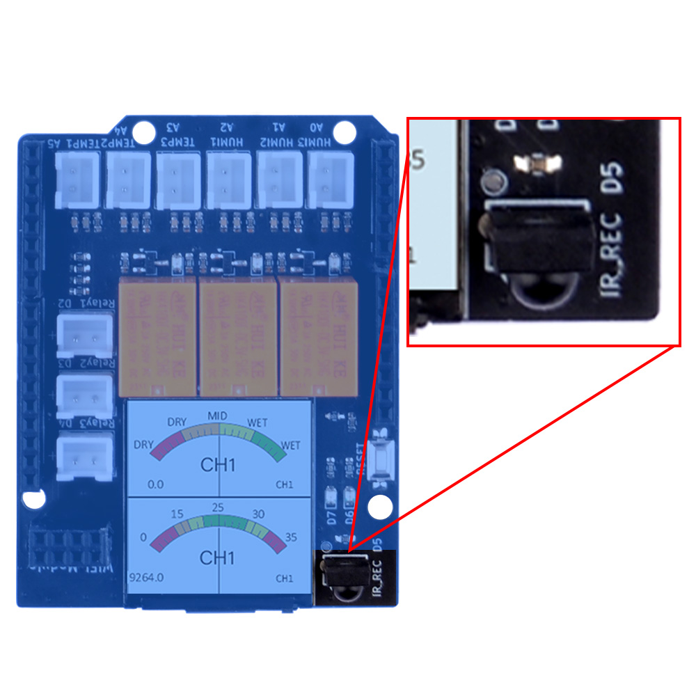
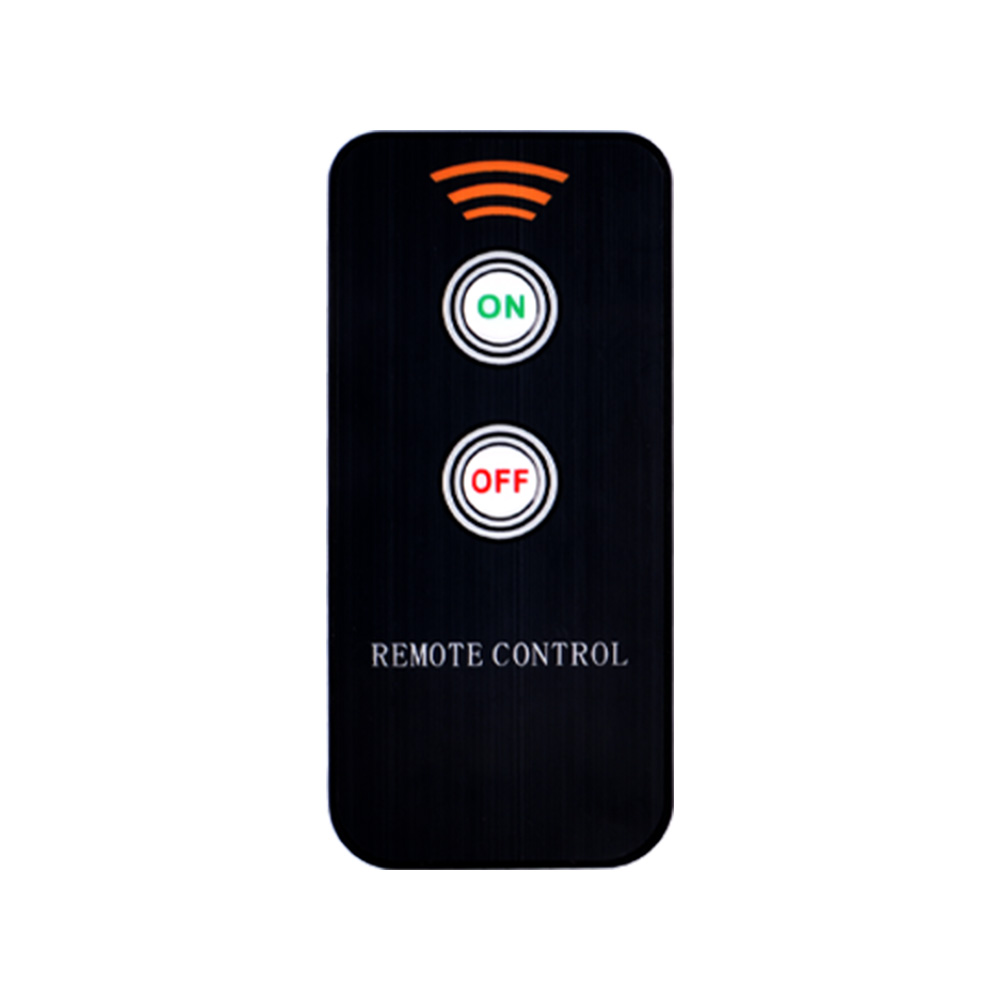
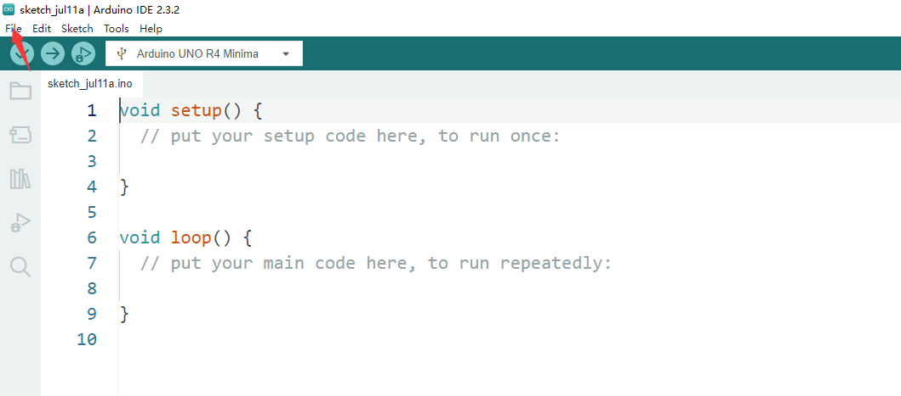

# Basic Usage 5

## IR Remote controller turns ON/OFF Water Pump via relays.

Next, we will use an IR remote controller to control the relay switch to operate the water pump for pumping water and stopping the water pumping.

OK, let’s begin the basic learning. 


## Hardware Overview

The shield provides the following interfaces:

* 3 x Soil Moisture Sensors (Analog Inputs A0, A1, A2)
* 3 x NTC Temperature Sensors (Analog Inputs A4, A5, A6)
* 3 x 3.3V Relay Modules (Digital Outputs 2, 3, 4)
* 3 x Mini Water Pumps
* 1 x 1.3-inch IPS RGB TFT Screen (ST7789 Controller)
* 1 x IR Receiver onboard 
* 1 x IR remote controller 
<font color=red>NOTE: you may need to purchase battery for the IR remote con
troller. </font></br>

## IR Receiver position on board

* IR receiver



* IR remote controller



## Pinout Chart

* Details of the expansion board.

|Plant Watering Kit Hat Board | Arduino UNO R4 WiFi Board|
|:---:|:---:|
| <font color=Green>HUMI3 </font>| <font color=green>A0</font> |
| <font color=Green>HUMI2 </font>| <font color=green>A1</font> |
| <font color=Green>HUMI1 </font>| <font color=green>A2</font> |
| <font color=BROWN>TEMP3</font>| <font color=BROWN>A3</font> |
| <font color=BROWN>TEMP2</font>| <font color=BROWN>A4</font> |
| <font color=BROWN>TEMP1 </font>| <font color=BROWN>A5</font> |
| <font color=red>IR_RSV</font>| <font color=red>D5</font> |
| <font color=blue>Relay 1</font>| <font color=blue>D2</font> |
| <font color=blue>Relay 2</font>| <font color=blue>D3</font> |
| <font color=blue>Relay 3</font>| <font color=blue>D4</font> |
| <font color=pink> TFT_SCLK </font>| <font color=pink>D13 </font>|
| <font color=pink> TFT_MOSI</font>| <font color=pink>D11 </font>|
| <font color=pink> TFT_CS </font>| <font color=pink>D10 </font>|
| <font color=pink> TFT_DC </font>| <font color=pink>D9 </font>|
| <font color=pink> TFT_RST </font>| <font color=pink>D8 </font>|
| <font color=red> RX</font>| <font color=red>TX->1 </font>|
| <font color=red> TX</font>| <font color=red>RX<-0 </font>|
| <font color=green>Green LED </font>|<font color=green>D6</font> |
| <font color=red>Red LED</font> | <font color=red>D7</font> |

## Circuit Diagram 


## Water pump socks on board Position 


## Connecting the Shield

- Place the arduino uno r4 on a flat surface.
- Align the shield with the headers of the arduino board and gently press it down until it clicks into place.
- Plug the plant watering hat board on top of arduino uno r4 on gpio pins. 
- Fix the water pump motor to acrylic panel by using 2 of rubber rings. 

## Programming 

Open arduino IDE and create a new sketch by clicking `file`-> `New Sketch` 



### Install IRremove Library

Please refer to: [Basic_Usage 4](./basic_usage_4.md)

### Import header files

```cpp
#include <IRremote.h>     // IR remote header file
#include <Arduino.h>
#include "PinDefinitionsAndMore.h"
#include <IRremote.hpp>  // include the library
```

### Define water pump relay pin number and IR receiver pinand IR receiver pin

```cpp
#define water_pump_1 2 
#define water_pump_2 3 
#define water_pump_3 4 

#define IR_RECEIVER_PIN 5
#define DECODE_NEC

#define LED_G  6  // Green_LED
#define LED_R  7  // Red_LED
```

### Initializing Pin Mode 

Set the pin direction to `OUTPUT` in setup function sector.

```cpp
void setup() {
    Serial.begin(115200);

    pinMode(LED_G, OUTPUT);
    pinMode(LED_R, OUTPUT);

    pinMode(water_pump_1, OUTPUT);
    pinMode(water_pump_2, OUTPUT);
    pinMode(water_pump_3, OUTPUT);

    // enable IR
    IrReceiver.begin(IR_RECEIVE_PIN, ENABLE_LED_FEEDBACK);

    printActiveIRProtocols(&Serial);

}
```

### Modify loop section 

```cpp
#include <IRremote.h>     // Include the IRremote library header file for handling IR signals.
#include <Arduino.h>      // Include the main Arduino library.
#include "PinDefinitionsAndMore.h" // Include a custom header file for pin definitions and possibly other configurations.
#include <IRremote.hpp>  // Include the library for handling IR remotes (note: this seems redundant as .h is usually sufficient).

#define water_pump_1 2   // Define pin 2 as water_pump_1.
#define water_pump_2 3   // Define pin 3 as water_pump_2.
#define water_pump_3 4   // Define pin 4 as water_pump_3.

#define IR_RECEIVER_PIN 5 // Define pin 5 as the input pin for the IR receiver.
#define DECODE_NEC        // Define a preprocessor directive to specify NEC as the IR decoding protocol.

#define LED_G  6  // Define pin 6 as the Green LED.
#define LED_R  7  // Define pin 7 as the Red LED.

void setup() {
    Serial.begin(115200); // Start serial communication at a baud rate of 115200.

    pinMode(LED_G, OUTPUT); // Set pin 6 as an output for the Green LED.
    pinMode(LED_R, OUTPUT); // Set pin 7 as an output for the Red LED.

    pinMode(water_pump_1, OUTPUT); // Set pin 2 as an output for water pump 1.
    pinMode(water_pump_2, OUTPUT); // Set pin 3 as an output for water pump 2.
    pinMode(water_pump_3, OUTPUT); // Set pin 4 as an output for water pump 3.

    // Initialize the IR receiver on pin 5 with LED feedback enabled.
    IrReceiver.begin(IR_RECEIVER_PIN, ENABLE_LED_FEEDBACK);

    // Print the active IR protocols.
    printActiveIRProtocols(&Serial);
}

int count = 3; // Initialize a global variable 'count' to 3.
int channel = 0; // Initialize a global variable 'channel' to 0.
const int flag = 3; // Define a constant 'flag' with a value of 3, representing the number of channels.

void loop() {
    if (IrReceiver.decode()) { // If the IR receiver has successfully decoded a signal.
        // Print a summary of the received data.
        if (IrReceiver.decodedIRData.protocol == UNKNOWN) {
            // If the protocol is unknown, print a message.
            Serial.println(F("Received noise or an unknown (or not yet enabled )protocol"));
            // Print extended information about the received signal.
            IrReceiver.printIRResultRawFormatted(&Serial, true);
            IrReceiver.resume(); // Resume the IR receiver to prepare for the next signal.
        } else {
            IrReceiver.resume(); // If the protocol is known, resume the IR receiver.
            IrReceiver.printIRResultShort(&Serial); // Print a short summary of the decoded signal.
            IrReceiver.printIRSendUsage(&Serial); // Print information on how to send the received signal.
        }
        Serial.println(); // Print a newline for readability.
        // Print the command received from the IR signal.
        Serial.println(IrReceiver.decodedIRData.command);

        // The following are conditional statements that check the received command and the 'count' variable,
        // then perform actions such as turning on LEDs and water pumps based on the conditions.

        // If the received command is 0x40 and 'count' modulo 'flag' equals 0, turn on the green LED and water pump 1.
        if (IrReceiver.decodedIRData.command == 0x40 && count % flag == 0) {
            digitalWrite(LED_G, HIGH); // Turn on the green LED.
            count++; // Increment the 'count' variable.
            digitalWrite(water_pump_1, HIGH); // Turn on water pump 1.
            IrReceiver.resume(); // Resume the IR receiver.
            digitalWrite(LED_G, LOW); // Turn off the green LED after action.
        }
        // Similar conditions for when 'count' modulo 'flag' equals 1 or 2, turning on different water pumps and LEDs.

        // If the received command is 0x19 and 'count' modulo 'flag' equals 1 or 2, turn on the red LED and turn off different water pumps.
        if (IrReceiver.decodedIRData.command == 0x19 && count % flag == 1) {
            digitalWrite(LED_R, HIGH); // Turn on the red LED.
            count++; // Increment the 'count' variable.
            digitalWrite(water_pump_1, LOW); // Turn off water pump 1.
            IrReceiver.resume();
            digitalWrite(LED_R, LOW); // Turn off the red LED after action.
        }
        // Similar conditions for when 'count' modulo 'flag' equals 2 or 0, turning off different water pumps and LEDs.
    }
}
```

### Full demo code 

```cpp
#include <IRremote.h>     // IR remote header file
#include <Arduino.h>
#include "PinDefinitionsAndMore.h"
#include <IRremote.hpp>  // include the library

#define water_pump_1 2 
#define water_pump_2 3 
#define water_pump_3 4 

#define IR_RECEIVER_PIN 5
#define DECODE_NEC

#define LED_G  6  // Green_LED
#define LED_R  7  // Red_LED

void setup() {
    Serial.begin(115200);

    pinMode(LED_G, OUTPUT);
    pinMode(LED_R, OUTPUT);

    pinMode(water_pump_1, OUTPUT);
    pinMode(water_pump_2, OUTPUT);
    pinMode(water_pump_3, OUTPUT);

    // enable IR
    IrReceiver.begin(IR_RECEIVER_PIN, ENABLE_LED_FEEDBACK);

    printActiveIRProtocols(&Serial);
}

int count = 3;
int channel = 0; 
const int flag = 3;  // three channels 

void loop() {
   if (IrReceiver.decode()) {
    /*
      * print a summary of received data
      */
    if (IrReceiver.decodedIRData.protocol == UNKNOWN) {
      Serial.println(F("Received noise or an unknown (or not yet enabled )protocol"));
      // we have an unknown protocol here, print extend info
      IrReceiver.printIRResultRawFormatted(&Serial, true);
      IrReceiver.resume();
      // Do it here to preserve raw data for printing with printIRResultRawFormatted()
    } else {
      IrReceiver.resume();
      IrReceiver.printIRResultShort(&Serial);
      IrReceiver.printIRSendUsage(&Serial);
    }
    Serial.println();
    Serial.println(IrReceiver.decodedIRData.command);

    if (IrReceiver.decodedIRData.command == 0x40 && count % flag == 0) {
      // press on button on IR controller will generate this data 0x40
      digitalWrite(LED_G, HIGH); // turn on green led 
      count+=1;  // add to count variable  
      digitalWrite(water_pump_1, HIGH); // turn on the water pump 1.
      IrReceiver.resume(); // resume IR 
      digitalWrite(LED_G, LOW);

    } else if (IrReceiver.decodedIRData.command == 0x40 && count % flag == 1) {
      digitalWrite(LED_G, HIGH); // turn on green led 
      count+=1;  // add to count variable  
      digitalWrite(water_pump_2, HIGH); // turn on the water pump 2.
      IrReceiver.resume(); // resume IR 
       digitalWrite(LED_G, LOW);
    } else if (IrReceiver.decodedIRData.command == 0x40 && count % flag == 2) {
      digitalWrite(LED_G, HIGH); // turn on green led 
      count+=1;  // add to count variable  
      digitalWrite(water_pump_3, HIGH); // turn on the water pump 3.
      IrReceiver.resume(); // resume IR
       digitalWrite(LED_G, LOW); 
    } else if (IrReceiver.decodedIRData.command == 0x19 && count % flag == 1) {
      digitalWrite(LED_R, HIGH); // turn off green led 
      count+=1;  // add to count variable  
      digitalWrite(water_pump_1, LOW); // turn on the water pump 1.
      IrReceiver.resume();
      digitalWrite(LED_R, LOW); // turn on red led 

    } else if (IrReceiver.decodedIRData.command == 0x19 && count % flag == 2) {
      digitalWrite(LED_R, HIGH); // turn off green led 
      count+=1;  // add to count variable  
      digitalWrite(water_pump_2, LOW); // turn on the water pump 1.
      IrReceiver.resume();
      digitalWrite(LED_R, LOW); // turn on red led 

    } else if (IrReceiver.decodedIRData.command == 0x19 && count % flag == 0) {
      digitalWrite(LED_R, HIGH); // turn off green led 
      count+=1;  // add to count variable  
      digitalWrite(water_pump_3, LOW); // turn on the water pump 1.
      IrReceiver.resume();
      digitalWrite(LED_R, LOW); // turn on red led 
    }  
   }
}
```

### Upload the sketch to Arduino UNO R4 WiFi board.

* Connect the Arduino UNO R4 WiFi board to your computer via USB-C cable on USB port 

* Select the serial device on your arduino IDE and click upload icon as following figure:

 

<font color=red>NOTE: </font></br>

Please note that when we press the button for a longer duration, the button's function may be continuously triggered. As a result, you may observe that each relay is quickly lit up or turned off. Therefore, when pressing the button, it should be done quickly and lightly. Of course, you can also use the debounce method to eliminate false triggering. This leaves a small suspense for everyone to see if you can figure out the trick to avoid repeated triggering of the button.

## Demo Code Sketch Download 

* [Basic_5_IR_remote_control_Water_pumps](./imgs/Basic_5_IR_remote_control_water_pumps.zip)

## Demo Video


### Finally 
* If you can control the water pump by using IR remote controller means that you have finished this
task. Let us remove to next chapter. 

