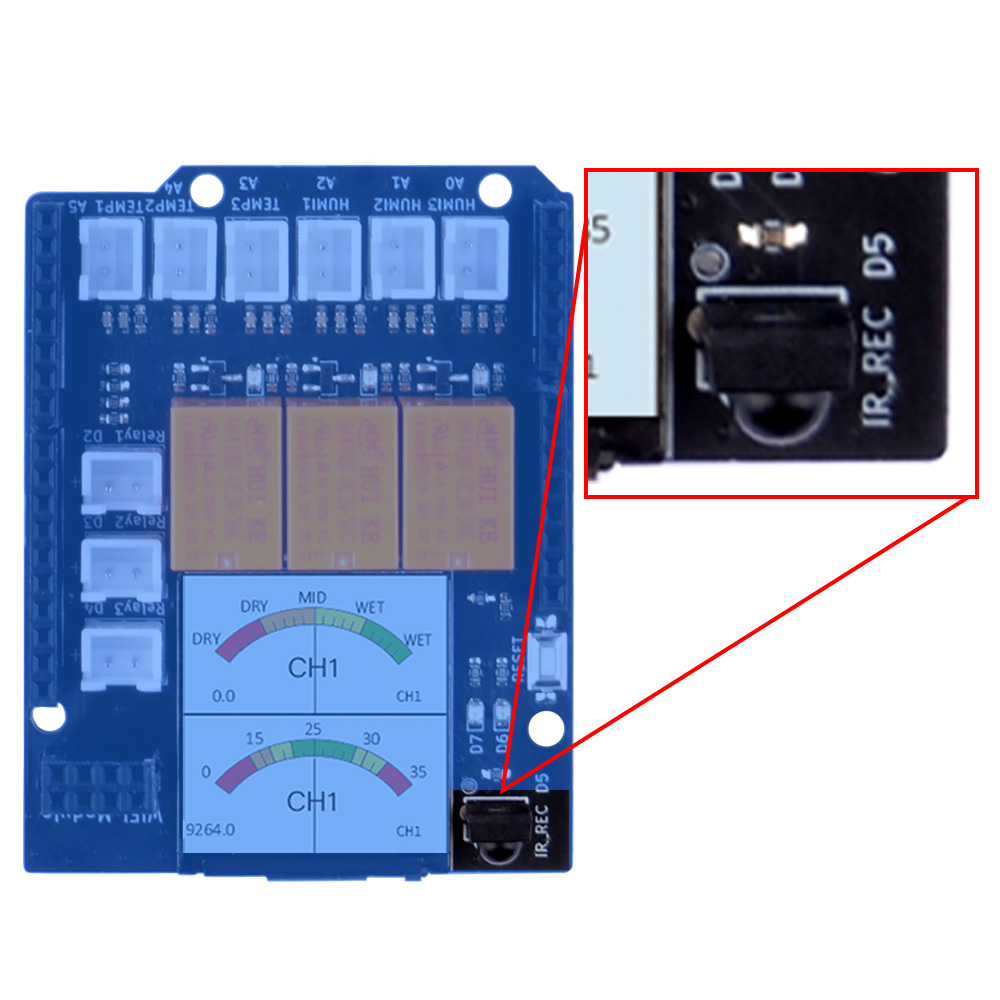
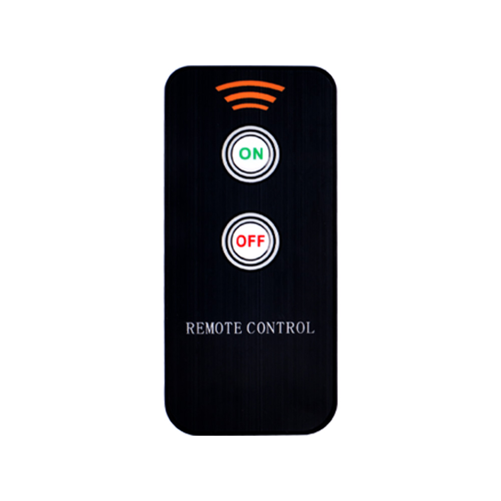
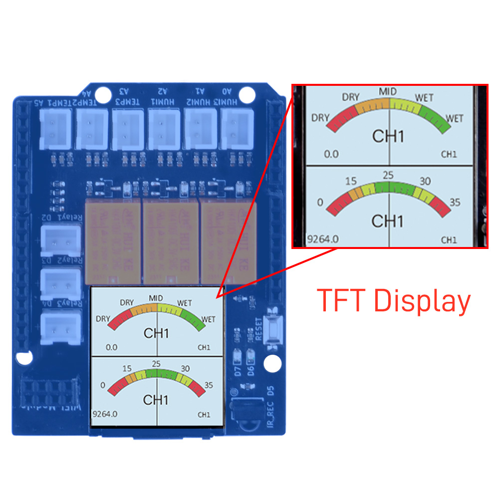
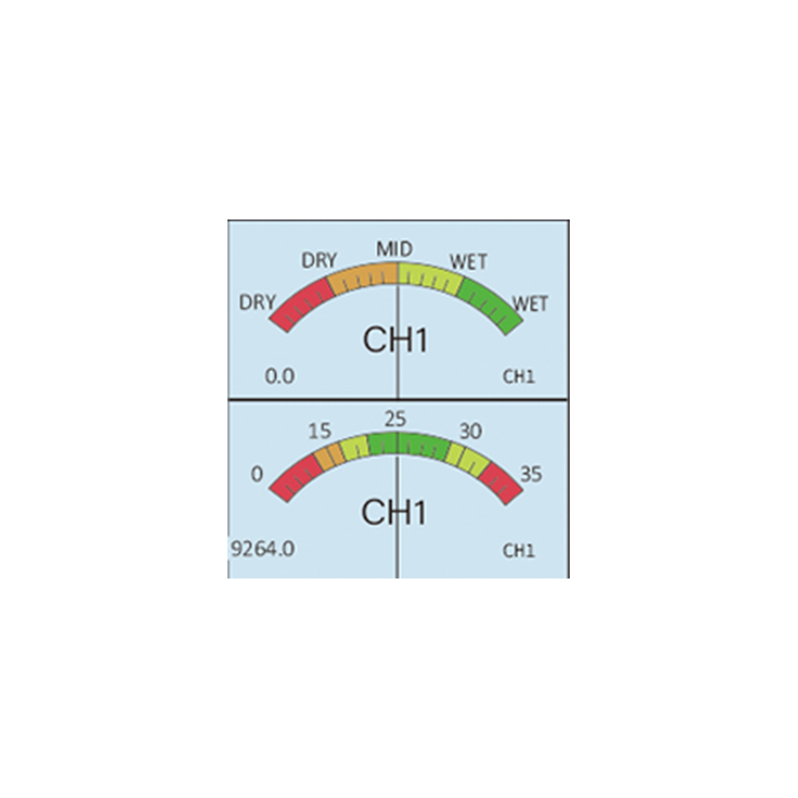
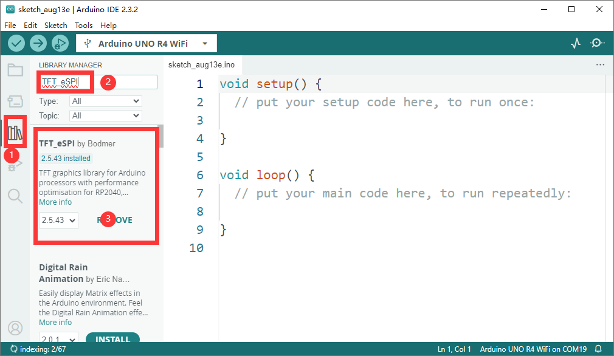
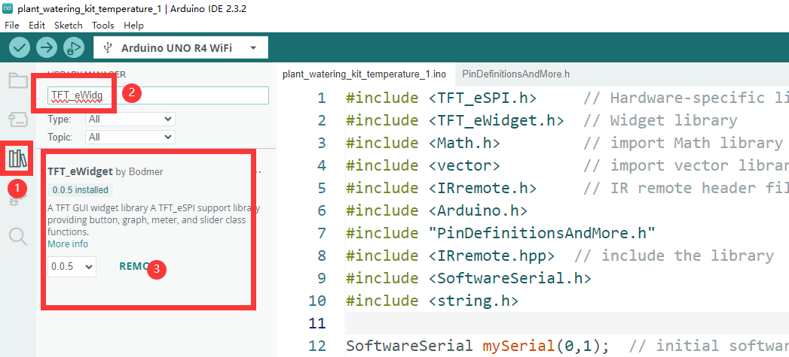
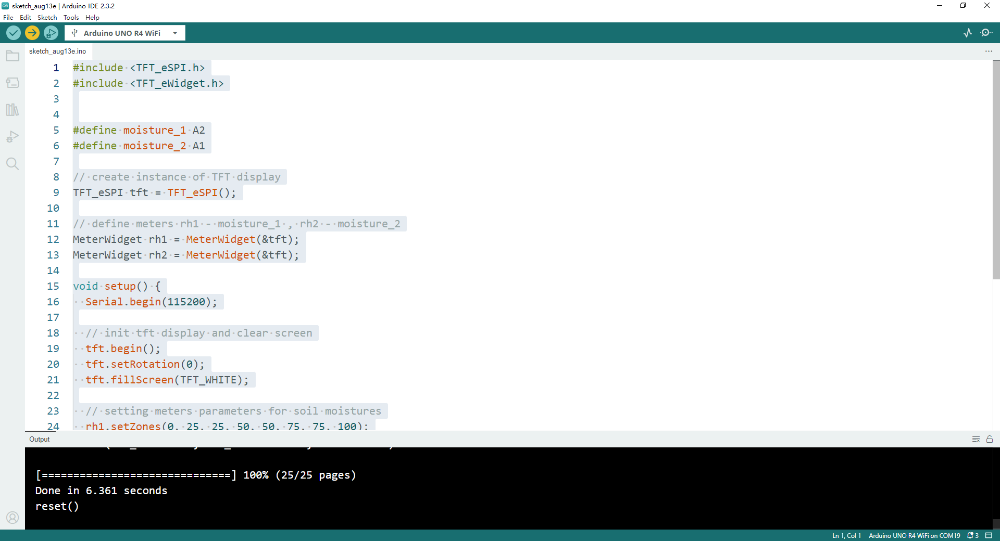
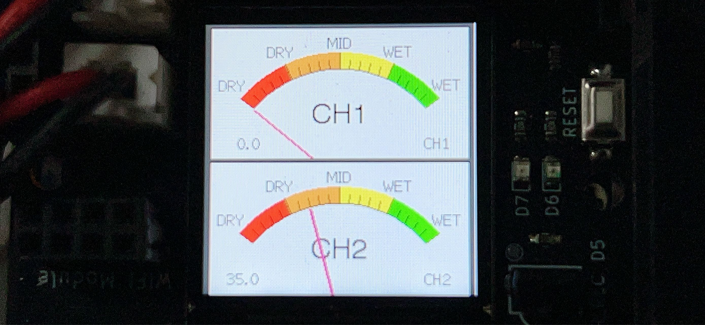

# Basic Usage 6

## Lights up 1.3 inch TFT RGB 240x240 pixels Display on board 

Next, we will use the onboard TFT display to show some basic informations.

OK, let’s begin the basic learning. 


## Hardware Overview

The shield provides the following interfaces:

* 3 x Soil Moisture Sensors (Analog Inputs A0, A1, A2)
* 3 x NTC Temperature Sensors (Analog Inputs A4, A5, A6)
* 3 x 3.3V Relay Modules (Digital Outputs 2, 3, 4)
* 3 x Mini Water Pumps
* 1 x 1.3-inch IPS RGB TFT Screen (ST7789 Controller)
* 1 x IR receiver 
* 1 x IR remote controller
<font color=red>NOTE: you may need to purchase battery for the IR remote controller. </font></br>

## IR Receiver position on board 

* IR receiver 

 

* IR remote controller

 

* TFT screen onboard 



* The screen in the middle 



## Pinout Chart

* Details of the expansion board.

|Plant Watering Kit Hat Board | Arduino UNO R4 WiFi Board|
|:---:|:---:|
| <font color=Green>HUMI3 </font>| <font color=green>A0</font> |
| <font color=Green>HUMI2 </font>| <font color=green>A1</font> |
| <font color=Green>HUMI1 </font>| <font color=green>A2</font> |
| <font color=BROWN>TEMP3</font>| <font color=BROWN>A3</font> |
| <font color=BROWN>TEMP2</font>| <font color=BROWN>A4</font> |
| <font color=BROWN>TEMP1 </font>| <font color=BROWN>A5</font> |
| <font color=red>IR_RSV</font>| <font color=red>D5</font> |
| <font color=blue>Relay 1</font>| <font color=blue>D2</font> |
| <font color=blue>Relay 2</font>| <font color=blue>D3</font> |
| <font color=blue>Relay 3</font>| <font color=blue>D4</font> |
| <font color=pink> TFT_SCLK </font>| <font color=pink>D13 </font>|
| <font color=pink> TFT_MOSI</font>| <font color=pink>D11 </font>|
| <font color=pink> TFT_CS </font>| <font color=pink>D10 </font>|
| <font color=pink> TFT_DC </font>| <font color=pink>D9 </font>|
| <font color=pink> TFT_RST </font>| <font color=pink>D8 </font>|
| <font color=red> RX</font>| <font color=red>TX->1 </font>|
| <font color=red> TX</font>| <font color=red>RX<-0 </font>|
| <font color=green>Green LED </font>|<font color=green>D6</font> |
| <font color=red>Red LED</font> | <font color=red>D7</font> |

## Circuit Diagram 


## Connecting the Shield

- place the arduino uno r4 on a flat surface.
- align the shield with the headers of the arduino board and gently press it down until it clicks into place.
- plug the plant watering hat board on top of arduino uno r4 on gpio pins. 

## Programming 

Open arduino IDE and create a new sketch by clicking `file`-> `New Sketch` 


## Install TFT_eSPI library 

* Click `book` icon to open library manager and then input `TFT_eSPI`, install
library as following figure.



* Install `TFT_eWidget` library. 



## Modify the TFT_eSPI library's configure

* Navigate to Arduino IDE installation location and find the `libraries` folder

* Modify `user_setup.h` configure file's following lines, make sure you have
following parameters in that file:

```cpp
#define ST7789_DRIVER  
#define TFT_RGB_ORDER TFT_BGR
#define TFT_WIDTH 240
#define TFT_HIGHT 240

#define TFT_MOSI  12 
#define TFT_MISO  11 
#define TFT_SCLK  13 
#define TFT_CS    10 
#define TFT_DC     9
#define TFT_RST    8
#define SPI_FREQUENCY  27000000
#define SPI_READ_FREQUENCY  20000000
#define SPI_TOUCH_FREQUENCY  2500000
```
### Import header files 

```cpp
#include <TFT_eSPI.h>     // Hardware-specific library
#include <TFT_eWidget.h>  // Widget library
```

### Define the Soil moisture sensor pin 

```cpp
#define moisture_1 A2 
#define moisture_2 A1 
```

### Create instance of TFT display.

```cpp
// create instance of TFT display
TFT_eSPI tft = TFT_eSPI();
```

### define meters for the moisture Sensor.

* rh1 for moisture_1, rh2 for moisture_2.

```cpp
MeterWidget rh1 = MeterWidget(&tft);
MeterWidget rh2 = MeterWidget(&tft);
```

### Initializing Pin Mode 

Set the pin direction to `OUTPUT` in setup function sector.

```cpp
void setup() {

    Serial.begin(115200); // note the baudrate is changed to 115200 

    // init tft display and clear screen
    tft.begin();
    tft.setRotation(0);
    tft.fillScreen(TFT_WHITE);

    // setting meters parameters for soil moisture
    rh1.setZones(0, 25, 25, 50, 50, 75, 75, 100);
    rh1.analogMeter(0, 0, 100.0, "CH1", "DRY", "DRY", "MID", "WET", "WET");

    rh2.setZones(0, 25, 25, 50, 50, 75, 75, 100);
    rh2.analogMeter(0, 120, 100.0, "CH1", "DRY", "DRY", "MID", "WET", "WET");

}
```

### Modify loop section 

```cpp
void loop() {
    float value_1 = analogRead(moisture_1);
    float value_2 = analogRead(moisture_2);

    rh1.updateNeedle((100 - value_1 / 10.24), 0);
    rh2.updateNeedle((100 - value_2 / 10.24), 0);

    delay(20);
}
```

### Demo code examples 

```cpp
#include <TFT_eSPI.h>
#include <TFT_eWidget.h>


#define moisture_1 A2
#define moisture_2 A1

// create instance of TFT display
TFT_eSPI tft = TFT_eSPI();

// define meters rh1 - moisture_1 , rh2 - moisture_2
MeterWidget rh1 = MeterWidget(&tft);
MeterWidget rh2 = MeterWidget(&tft);


void setup() {
  Serial.begin(115200);

  // init tft display and clear screen
  tft.begin();
  tft.setRotation(0);
  tft.fillScreen(TFT_WHITE);

  // setting meters parameters for soil moistures
  rh1.setZones(0, 25, 25, 50, 50, 75, 75, 100);
  rh1.analogMeter(0, 0, 100.0, "CH1", "DRY", "DRY", "MID", "WET", "WET");
  
  rh2.setZones(0, 25, 25, 50, 50, 75, 75, 100);
  rh2.analogMeter(0, 120, 100.0, "CH2", "DRY", "DRY", "MID", "WET", "WET");
}

void loop() {
  float value_1 = analogRead(moisture_1);
  float value_2 = analogRead(moisture_2);

  rh1.updateNeedle((100 - value_1 / 10.24), 0);
  rh2.updateNeedle((100 - value_2 / 10.24), 0);

  delay(20);
}
```

### Explaination of the demo code 

This code snippet is written in C++ and is designed to be used with an Arduino board and a TFT (Thin Film Transistor) display. 

Here's an explanation of what the code does:


1. `#include <TFT_eSPI.h>` and `#include <TFT_eWidget.h>`: These two lines include the necessary header files for the TFT display library and the widget library, which are used to control the display and create graphical elements like meters.

2. `#define moisture_1 A2` and `#define moisture_2 A1`: These lines define two analog input pins on the Arduino board, A2 and A1, which are used to read the soil moisture levels from two different sensors.

3. `TFT_eSPI tft = TFT_eSPI();`: This line creates an instance of the TFT display object, which is used to interact with the display.

4. `MeterWidget rh1 = MeterWidget(&tft);` and `MeterWidget rh2 = MeterWidget(&tft);`: These lines create two instances of the `MeterWidget` class, which represent analog meters that will be displayed on the TFT screen. The `&tft` argument is a pointer to the TFT display object.

5. `void setup() { ... }`: This function is the setup function that runs once when the Arduino is powered on or reset. It initializes the serial communication, sets up the TFT display, and configures the parameters for the two analog meters.

6. `Serial.begin(115200);`: This line initializes the serial communication at a baud rate of 115200, which is used for debugging purposes.

7. `tft.begin();`: This line initializes the TFT display.

8. `tft.setRotation(0);`: This line sets the rotation of the display to 0 degrees, which is the default orientation.

9. `tft.fillScreen(TFT_WHITE);`: This line fills the screen with a white color.

10. `rh1.setZones(...)` and `rh2.setZones(...)`: These lines set the color zones for the meters, defining the colors for different ranges of the needle's position.

11. `rh1.analogMeter(...)` and `rh2.analogMeter(...)`: These lines configure the appearance and labels of the analog meters.

12. `void loop() { ... }`: This function is the main loop that runs continuously after the setup function. It reads the analog values from the moisture sensors, updates the needle position on the meters, and then waits for a short period before repeating.

13. `float value_1 = analogRead(moisture_1);` and `float value_2 = analogRead(moisture_2);`: These lines read the analog values from the two moisture sensors.

14. `rh1.updateNeedle(...)` and `rh2.updateNeedle(...)`: These lines update the position of the needle on each meter based on the analog values read from the sensors.

15. `delay(20);`: This line introduces a short delay to slow down the loop and prevent it from running too fast.

Overall, this code is part of a project that uses a TFT display to show the soil moisture levels from two sensors in a graphical form, with the needle of the meters moving based on the moisture levels.


### Upload the sketch to Arduino UNO R4 WiFi board.

* Connect the Arduino UNO R4 WiFi board to your computer via USB-C cable on USB port 

* Select the serial device on your arduino IDE and click upload icon as following figure:

 

### Observe the needle on TFT screen. 

* You can see the CH1 on the first right corner, and if you place a wet paper or
put the soil moisture sensor into water, the number will change and the needle
    will spin on the meter. 




## Demo Code Sketch Download 

* [Basic_6_TFT_display_moisture_sensor_data](./imgs/Basic_6_TFT_display_moisture_sensor_data.zip)

## Demo Video


----

### Finally 
* Did you see that needle spinning when you put a wet paper on the soil moisutre
sensor ? If you finished this task, you are going to build more complex
experiment right now! 

Let us remove to next chapter!  


