# Home Assistant 

## What is Home Assistant 

Home Assistant is an open-source home automation system that prioritizes local control and privacy protection, suitable for running on Raspberry Pi or local servers. It is supported by a community of developers and DIY enthusiasts from around the world and is built in a modular way, making it easy to support different devices and actions. Home Assistant can connect to various external devices, such as smart devices and cameras, and can be automated to build personalized smart spaces. However, due to its DIY nature, it has a relatively high threshold for use and may require users to configure and modify configuration files on their own.

In addition, Home Assistant supports connecting devices through the MQTT protocol and can interact with Apple's HomeKit through plug-ins, enabling Siri voice control of smart devices. It also integrates with some third-party intelligent voice platforms, as well as cloud services for weather, exchange rates, online music, etc. The control page can be displayed through a web page or mobile app, supporting Android and iOS systems.

Home Assistant consists of a core component and multiple components. The core component is responsible for general functions such as launching applications and managing states, while components are responsible for interacting with smart devices, cloud services, etc. It supports hundreds of device interaction protocols and cloud services, and users can also add support for specific protocols or devices by adding components.

For the requirement of sending soil moisture (A2) information from the plant watering kit to the MQTT broker through MQTT and displaying it on the Home Assistant page, users need to configure the MQTT component and create corresponding automation rules to achieve data collection and display. For specific configuration methods, you can refer to the official documentation of Home Assistant and tutorials provided by the community.

## NOTE
Our primary aim in demonstrating the installation and configuration on a Raspberry Pi is to help everyone understand the interconnection between Home Assistant and its suite, thereby gaining a better grasp of the IoT operating environment. This part of the content is not a necessary component of the kit. If you are interested, you can try to set up a home-based Home Assistant. Here are some key steps for configuration, which should be modified according to the actual situation of your current device to suit your equipment.

## How to setup home assistant and MQTT broker server on Raspberry Pi. 

### Hardware 

* 1 x Raspberry Pi (in this case, I am using Raspberry Pi 5 8GB RAM) 
* 1 x 64GB MicroSD card v60 
* 1 x USB-C Power supply (5.1V/5A) 
* 1 x MicroHDMI cable to Standard HDMI cable 
* 1 x Monitor (support HDMI input signal) 
* 1 x USB Mouse 
* 1 x USB keyboard 
* 1 x WiFi access point (WiFi router) 

### Software 

* OS: Raspberry Pi OS (64bit) bookworm 2024-07-04 

### Other Information 

* IP Address of Raspberry Pi 5: `192.168.3.218/24`

### MQTT topics

* led/switch1/set
* led/switch1/available

* led/switch2/set
* led/switch2/available

* uno/soil_moisture_ch1
* uno/soil_moisture_ch2
* uno/soil_moisture_ch3

* uno/ntc_temperature_ch1
* uno/ntc_temperature_ch2
* uno/ntc_temperature_ch3

### 1. Install Docker service

* Please make sure your Raspberry Pi can access internet. 

* Open a terminal and typing following command:
```bash 
curl -fsSL https://get.docker.com -o get-docker.sh 
sh get-docker.sh 
``` 

### 2. Install Home assistant container 

* Install container 

```bash 
sudo docker run -d --name=homeassistant -v /opt/homeassistant:/config --net=host homeassistant/home-assistant 
```
* Edit configuration file 

```bash 
sudo vim.tiny /opt/homeassistant/configuration.yaml 
```
* Examples: 
```yaml
# Loads default set of integrations. Do not remove.
default_config:

# Load frontend themes from the themes folder
frontend:
  themes: !include_dir_merge_named themes

automation: !include automations.yaml
script: !include scripts.yaml
scene: !include scenes.yaml

mqtt:
  switch:
    - name: "LED Switch 1"
      command_topic: "led/switch1/set"
      availability:
        - topic: "led/switch1/available"
      payload_on: "ON"
      payload_off: "OFF"
      qos: 0
      retain: true

    - name: "LED Switch 2"
      command_topic: "led/switch2/set"
      availability:
        - topic: "led/switch2/available"
      payload_on: "ON"
      payload_off: "OFF"
      qos: 0
      retain: true

  sensor:
    - name: "Moisture Input 1"
      state_topic: "uno/soil_moisture_ch1"
      unit_of_measurement: "%"
      value_template: "{{ value }}"

    - name: "Moisture Input 2"
      state_topic: "uno/soil_moisture_ch2"
      unit_of_measurement: "%"
      value_template: "{{ value }}"

    - name: "Moisture Input 3"
      state_topic: "uno/soil_moisture_ch3"
      unit_of_measurement: "%"
      value_template: "{{ value }}"

    - name: "NTC temperature Input 1"
      state_topic: "uno/ntc_temperature_ch1"
      unit_of_measurement: "℃"
      value_template: "{{ value }}"

    - name: "NTC temperature Input 2"
      state_topic: "uno/ntc_temperature_ch2"
      unit_of_measurement: "℃"
      value_template: "{{ value }}"

    - name: "NTC temperature Input 3"
      state_topic: "uno/ntc_temperature_ch3"
      unit_of_measurement: "℃"
      value_template: "{{ value }}"
```

### 3. Install MQTT broker container 

* Create folders for mosquitto server 

```bash 
sudo mkdir -pv /opt/mosquitto/config 
sudo mkdir -pv /opt/mosquitto/data 
sudo mkdir -pv /opt/mosquitto/log 
```
* Create mosquitto's configuration file 

```bash 
sudo vim.tiny /opt/mosquitto/config/mosquitto.conf 
```
Copy and paste following lines 
```text
listener 1883 0.0.0.0
persistence true
persistence_location /mosquitto/data/
log_dest file /mosquitto/log/mosquitto.log
# password_file /mosquitto/config/password
per_listener_settings false
allow_anonymous false
```

* Save it and install mosquitto container.

```bash 
sudo docker run -it -d --name=mosquitto -p 1883:1883 -p 9001:9001 \
    -v /opt/mosquitto/config:/mosquitto/config \
    -v /opt/mosquitto/data:/mosquitto/data \
    -v /opt/mosquitto/log:/mosquitto/log \
    eclipse-mosquitto
```

* Entering into container and create password file 

```bash 
sudo docker exec -it mosquitto sh 
touch /mosquitto/config/password 
chmod 0700 /mosquitto/config/password 
mosquitto_passwd -b /mosquitto/config/password YOUR_NAME YOUR_PASSWORD 
exit 
```
> NOTE: Do remember replease `YOUR_NAME` and `YOUR_PASSWORD` to your own.

### 4. Restart the docker containers 

```bash 
sudo docker restart $(sudo docker ps -aq) 
```

### 5. Login Home assistant 

* Open a browser and login 

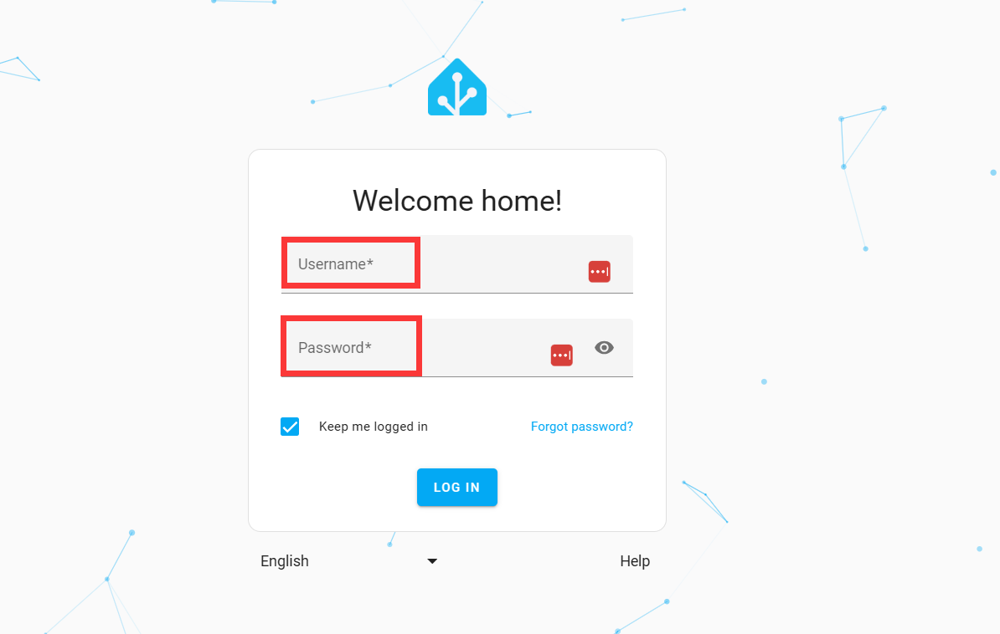

Input your username and password. select language and then login. 

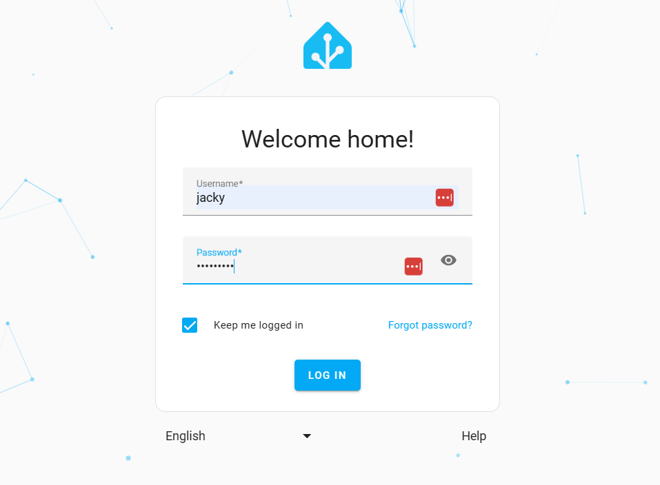

* HA configuration 

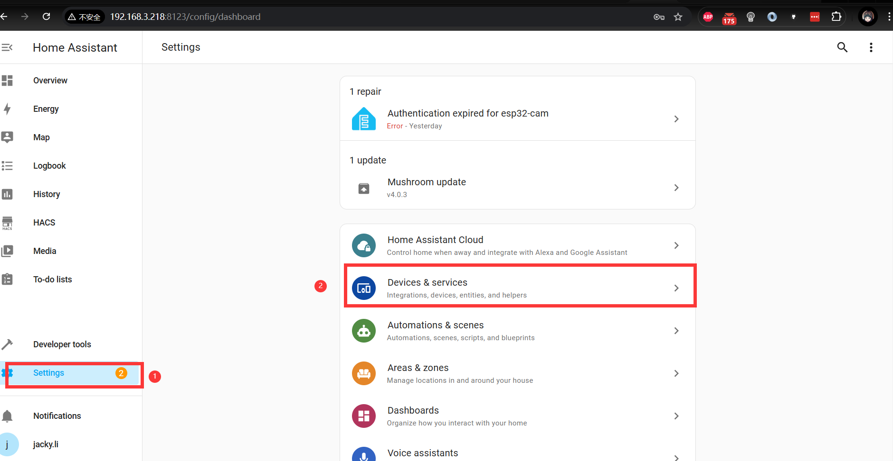

* Adding integration

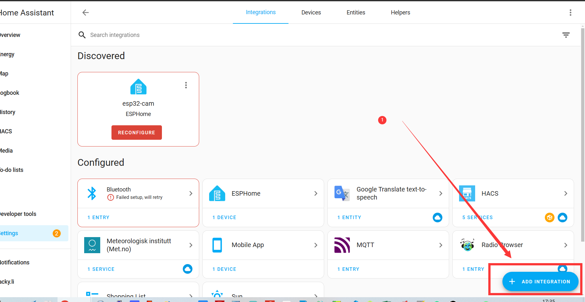

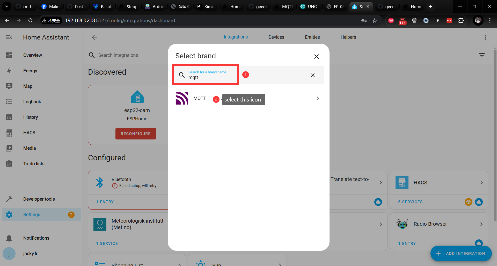

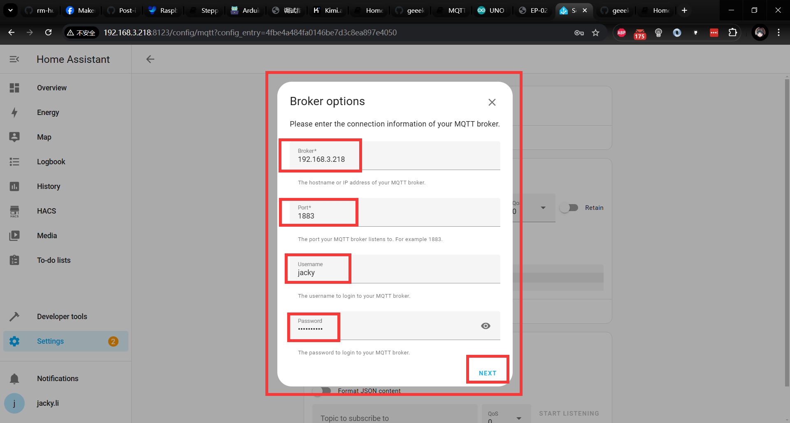

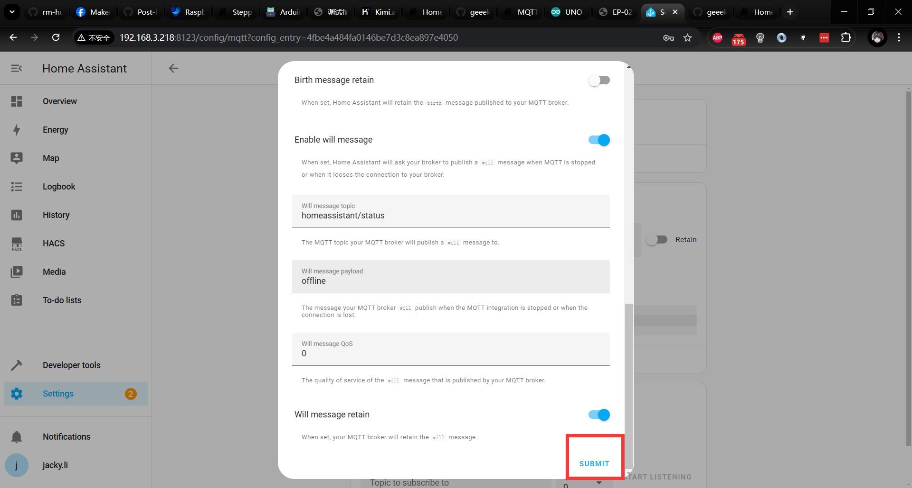

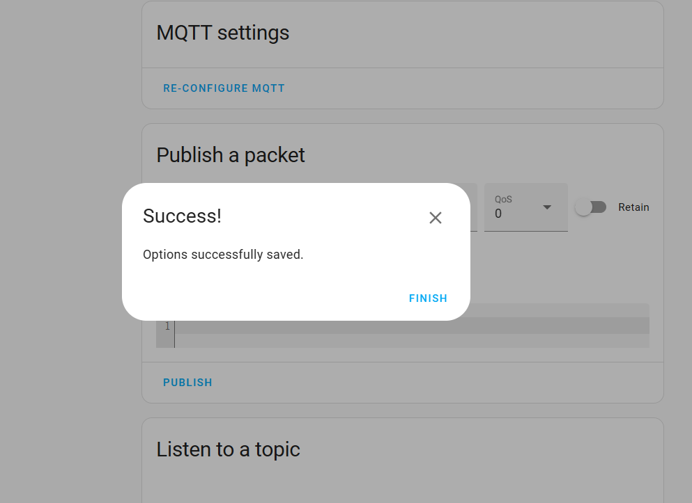

* Adding card in overview dashboard 
Please add card according to following figures

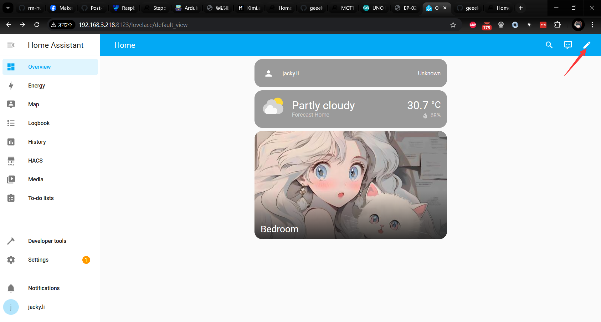

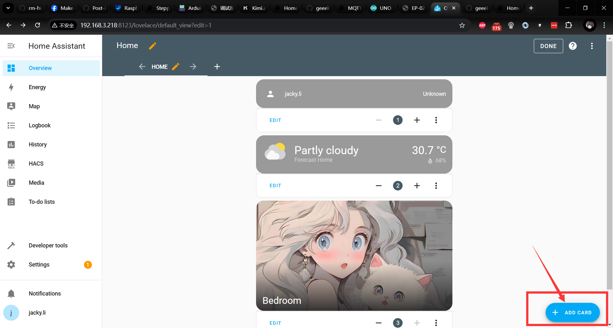

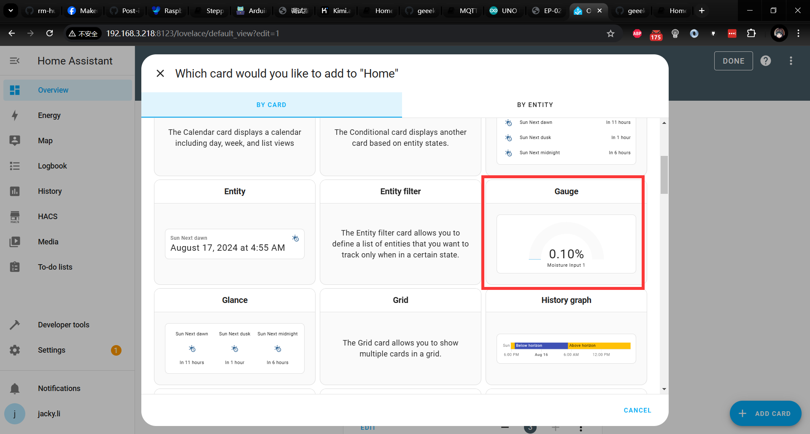

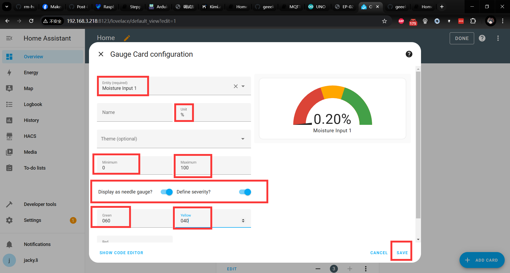

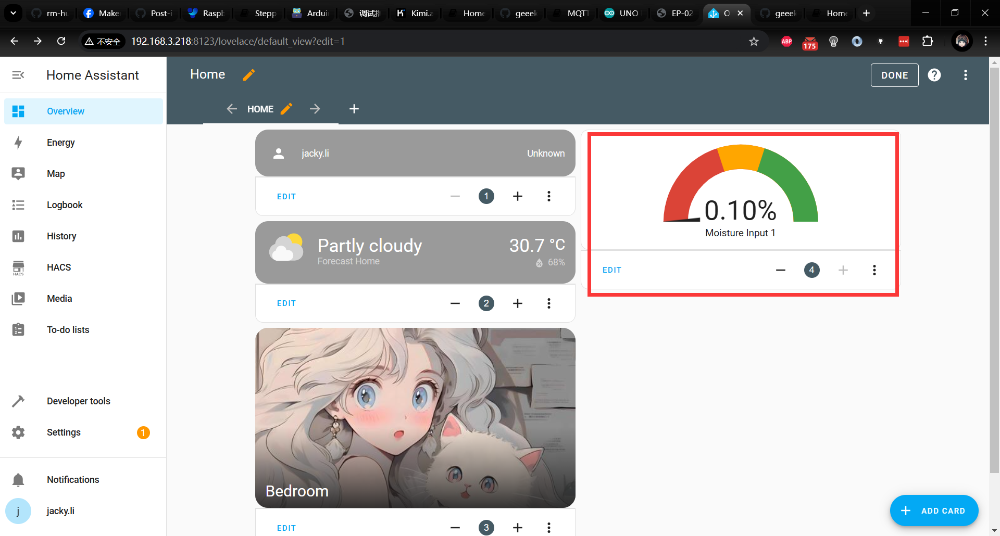

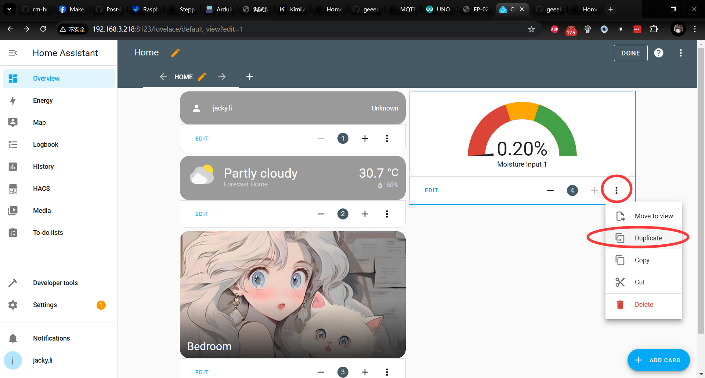

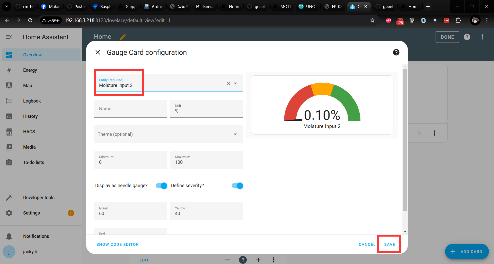

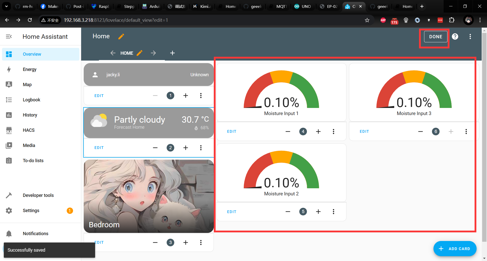

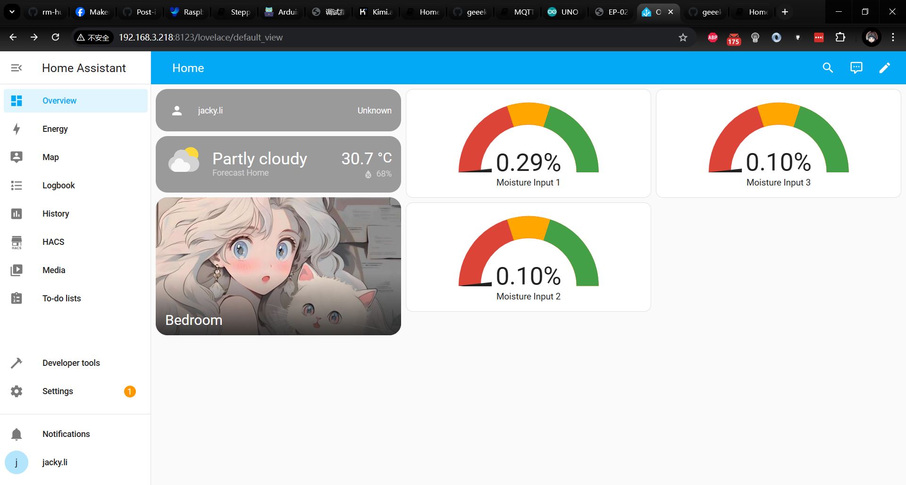

## Finished installation  
Next, you can use your Arduino UNO R4 WiFi kit to connect to the internet and send corresponding data to the MQTT broker server's topic via the network, allowing it to be displayed on the Home Assistant (HA) dashboard. Of course, for the HA part, you still need to add a card to display the data collected by your Arduino. I have specifically recorded a demo video for this, and those who are interested can watch it on our official YouTube channel. Please feel free to follow, like, subscribe, and share!"

## Demo code on Arduino Side 
```cpp 
#include <ArduinoMqttClient.h>
#include <WiFiS3.h>
#include <string.h>
#include "arduino_secrets.h"


//please enter your sensitive data in the Secret tab/arduino_secrets.h
char ssid[] = SECRET_SSID;  // your network SSID (name)
char pass[] = SECRET_PASS;  // your network password (use for WPA, or use as key for WEP)

//define soil moisture sensor pin
#define humi1 A2
#define humi2 A1
#define humi3 A0

// set variable
int status = WL_IDLE_STATUS;

// init wificlient
WiFiClient wifiClient;
MqttClient mqttClient(wifiClient);

// MQTT Broker infor
const char broker[] = "192.168.3.218";
int port = 1883;

// topic infor
const char topic1[] = "uno/soil_moisture_ch1";
const char topic2[] = "uno/soil_moisture_ch2";
const char topic3[] = "uno/soil_moisture_ch3";

void setup() {
  // Initialize serial port
  Serial.begin(9600);

  // attempt to connect to WiFi network
  Serial.print("attempt to connect to WPA SSID: ");
  Serial.println(ssid);

  while (WiFi.begin(ssid, pass) != WL_CONNECTED) {
    // if failed on connecting wifi, retry again.
    Serial.print(".");
    delay(5000);  // wait for 5 seconds and then retry to connect to wifi.
  }

  Serial.println("Connecting to wifi successful");
  Serial.println("More infor:");
  IPAddress ip = WiFi.localIP();
  Serial.print("IP Address: ");
  Serial.println(ip);

  // You can provide a unique client ID, if not set the library uses Arduino-millis()
  // Each client must have a unique client ID
  // mqttClient.setId("clientId");

  mqttClient.setId("Plant_watering_kit");

  // You can provide a username and password for authentication
  // mqttClient.setUsernamePassword("username", "password");

  mqttClient.setUsernamePassword("jacky", "mypassword");

  Serial.print("Attempting to connect to the MQTT broker: ");

  Serial.println(broker);

  while (!mqttClient.connect(broker, port)) {

    Serial.print("MQTT connection failed! Error code = ");
    Serial.println(mqttClient.connectError());
  }

  Serial.println("You're connected to the MQTT broker!");
  Serial.println();
}

void loop() {
  // call poll() regularly to allow the library to send MQTT keep alives which
  // avoids being disconnected by the broker
  mqttClient.poll();

  // reading data from soil moisture
  float raw_data_moisture1 = analogRead(humi1);
  float raw_data_moisture2 = analogRead(humi2);
  float raw_data_moisture3 = analogRead(humi3);

  // print on serial monitor
  // Serial.print("Sending message to topic: ");
  // Serial.println(topic1);
  // Serial.print("Soil moisture raw data:");
  // Serial.println(100.0 - (raw_data_moisture / 10.24));

  // send meassage, the print interface can be used to set the message contents
  mqttClient.beginMessage(topic1);
  mqttClient.print(100.0 - (raw_data_moisture1 / 10.24));
  mqttClient.endMessage();

  mqttClient.beginMessage(topic2);
  mqttClient.print(100.0 - (raw_data_moisture2 / 10.24));
  mqttClient.endMessage();

  mqttClient.beginMessage(topic3);
  mqttClient.print(100.0 - (raw_data_moisture3 / 10.24));
  mqttClient.endMessage();

  delay(200); // sleep for a while
  }
```
## Demo video 


----

