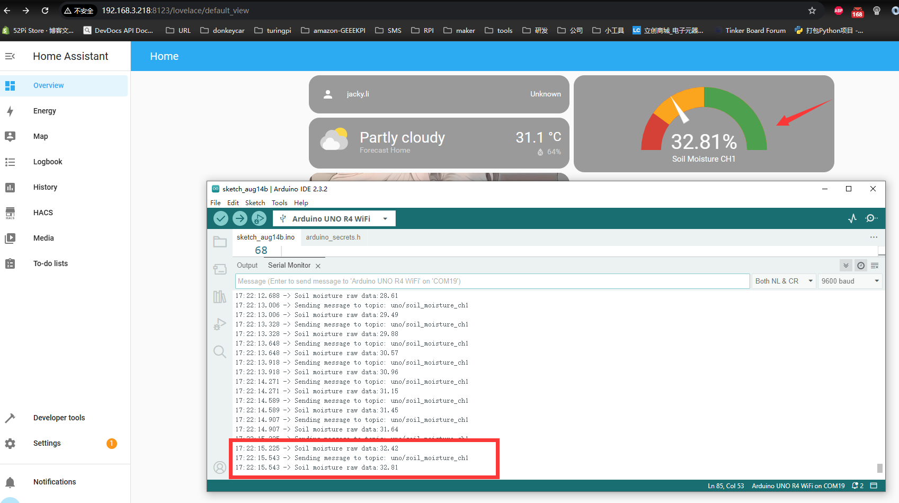

# MQTT Overview and Benefits with Arduino UNO R4 WiFi

## What is MQTT?
MQTT, or Message Queuing Telemetry Transport, is a lightweight messaging protocol for small sensors and mobile devices, to connect through a broker. It was released by IBM in 1999 and is designed for connections with remote devices to provide real-time and reliable messaging services, making it particularly suitable for the Internet of Things (IoT) and small devices.

## Benefits of MQTT

* **Low Overhead and Bandwidth Usage**: Ideal for IoT and mobile applications.
* **Supports Continuous Session Control**: Understands that client computing power may be low.
* **Provides Quality of Service Management**: Ensures messages are delivered as needed.
* **Flexible Data Format**: Does not dictate the type or format of the transmitted data.

## What Can Arduino UNO R4 WiFi Do with MQTT?

- **Publish Sensor Data**: Send sensor data to designated MQTT topics.
- **Subscribe to Topics**: Receive messages from other devices or services that publish to MQTT topics.
- **Integrate with Smart Home Systems**: Work with MQTT-supported smart home systems for automation control.

Specifically, the Arduino Uno R4 WiFi can communicate with other devices or applications through the MQTT protocol. For example, you can connect it to a device running Home Assistant and create custom home automation devices or sensors through MQTT integration. 
With MQTT, the Arduino Uno R4 WiFi can publish messages to topics like `/sensors/temperature` and also subscribe to messages published by other devices.

Additionally, MQTTX is a full-featured MQTT client tool suitable for desktop, command line, and WebSocket. It helps simplify and make the development and testing of MQTT applications more efficient. In IoT education and development, MQTTX has become a great choice due to its graphical interface and beginner-friendly features.

In summary, MQTT is a communication protocol highly suitable for IoT applications. The Arduino UNO R4 WiFi can easily achieve device-to-device communication and data exchange with MQTT, and the MQTTX tool provides convenience for the development and testing of MQTT applications.

## How to install mqtt library?

- **Open Arduino IDE**: Launch the Arduino Integrated Development Environment (IDE) on your computer.

- **Access Library Manager**: Go to the "Sketch" menu at the top of the IDE, then select "Include Library" and click on "Manage Libraries..." to open the Library Manager.

- **Search for the MQTT Library**: In the Library Manager, there is a search bar at the top. Type "MQTT" into the search bar and press Enter to search for the library.

- **Select the MQTT Library**: From the search results, find the library you want to install. A popular choice is the "ArduinoMqttClient" by Joël Gähwiler.

- **View Library Details**: Click on the library name to view more details about it, including a description, the number of downloads, and user ratings.

- **Install the Library**: On the library details page, click the "Install" button to begin the installation process.


- **Confirm Installation**: A confirmation dialog will appear, click "Confirm" to proceed with the installation.

- **Check Installation**: After the installation is complete, you can check if the library is installed by going to "File" > "Examples" and looking for the MQTT examples in the list.

- **Restart Arduino IDE**: Sometimes, it's necessary to restart the Arduino IDE for the new library to be fully integrated.

- **Start a New Project**: Once the library is installed, you can start a new project by going to "File" > "New" and then adding `#include <ArduinoMqttClient.h>` at the beginning of your sketch to include the MQTT library.

- **Configure MQTT Settings**: In your sketch, you will need to configure the MQTT settings such as the broker address, port, client ID, username, and password if required.

- **Upload Your Sketch**: After configuring the MQTT settings and writing your code, you can upload your sketch to your Arduino board by clicking the "Upload" button.

## Demonstration 

* Assuming that we now have an MQTT broker server, and also a HomeAssistant server with the address `192.168.3.218`, port `1883`, and the MQTT broker server's access request username is `Jacky`, password is `mypassword`. We want to send the information collected by one of the soil moisture (A2) in our plant watering kit through the MQTT protocol to the MQTT broker server and display the reading information on the Home Assistant page. How should we proceed with such an experiment? 

### Step 1. Assemble the Hat to Arduino UNO R4 WiFi. 

#### Hardware Overview

The shield provides the following interfaces:

* 3 x Soil Moisture Sensors (Analog Inputs A0, A1, A2)
* 3 x NTC Temperature Sensors (Analog Inputs A4, A5, A6)
* 3 x 3.3V Relay Modules (Digital Outputs 2, 3, 4)
* 3 x Mini Water Pumps
* 1 x 1.3-inch IPS RGB TFT Screen (ST7789 Controller)
* 1 x IR Receiver on board
* 1 x IR remote controller 

#### Pinout Chart

* Details of the expansion board.

|Plant Watering Kit Hat Board | Arduino UNO R4 WiFi Board|
|:---:|:---:|
| <font color=Green>HUMI3 </font>| <font color=green>A0</font> |
| <font color=Green>HUMI2 </font>| <font color=green>A1</font> |
| <font color=Green>HUMI1 </font>| <font color=green>A2</font> |
| <font color=BROWN>TEMP3</font>| <font color=BROWN>A3</font> |
| <font color=BROWN>TEMP2</font>| <font color=BROWN>A4</font> |
| <font color=BROWN>TEMP1 </font>| <font color=BROWN>A5</font> |
| <font color=red>IR_RSV</font>| <font color=red>D5</font> |
| <font color=blue>Relay 1</font>| <font color=blue>D2</font> |
| <font color=blue>Relay 2</font>| <font color=blue>D3</font> |
| <font color=blue>Relay 3</font>| <font color=blue>D4</font> |
| <font color=pink> TFT_SCLK </font>| <font color=pink>D13 </font>|
| <font color=pink> TFT_MOSI</font>| <font color=pink>D11 </font>|
| <font color=pink> TFT_CS </font>| <font color=pink>D10 </font>|
| <font color=pink> TFT_DC </font>| <font color=pink>D9 </font>|
| <font color=pink> TFT_RST </font>| <font color=pink>D8 </font>|
| <font color=red> RX</font>| <font color=red>TX->1 </font>|
| <font color=red> TX</font>| <font color=red>RX<-0 </font>|
| <font color=green>Green LED </font>|<font color=green>D6</font> |
| <font color=red>Red LED</font> | <font color=red>D7</font> |

#### Connecting the Shield

- place the arduino uno r4 on a flat surface.
- align the shield with the headers of the arduino board and gently press it down until it clicks into place.
- plug the plant watering hat board on top of arduino uno r4 on gpio pins. 

### Step 2. Create a new sketch 


### Step 3. Programming

- Adding header File

```cpp
#include <ArduinoMqttClient.h>
#include <WiFiS3.h> 
#include <string.h>
#include "arduino_secrets.h"
```

- Define variables 

```cpp
// define WiFi connection information 
char ssid[] = SECURE_SSID;
char pass[] = SECURE_PASS;

// define sensor pin 
#define humi1  A2 

// setting variables
int status = WL_IDLE_STATUS;
```
- Initialize wifiClient and MqttClient 

```cpp
WiFiClient wifiClient;
MqttClient mqttClient(wifiClient);
```
- Define MQTT broker server informations 

```cpp
const char broker[] = "192.168.3.218";  // replace this IP to your MQTT broker server's IP address. 
int port = 1883;   // MQTT broker server listen port number. 
const char topic1[] = "uno/soil_moisture_ch1";  // mqtt broker's topic name 
```

- Modifying setup() function

```cpp
void setup() {
    // Initialize serial port 
    Serial.begin(9600);

    // attempt to connect to WiFi network
    Serial.print("attempt to connect to WPA SSID: ");
    Serial.println(ssid);

    while(WiFi.begin(ssid, pass) != WL_CONNECTED) {
        // if failed on connecting wifi, retry again.
        Serial.print(".");
        delay(5000); // wait for 5 seconds and then retry to connect to wifi. 
    }

    Serial.println("Connecting to wifi successful");
    Serial.println("More infor:");
    IPAddress ip = WiFi.localIP();
    Serial.print("IP Address: ");
    Serial.println(ip);

    // You can provide a unique client ID, if not set the library uses Arduino-millis()
    // Each client must have a unique client ID
    // mqttClient.setId("clientId");

    mqttClient.setId("Plant_watering_kit");

    // You can provide a username and password for authentication
    // mqttClient.setUsernamePassword("username", "password");

    mqttClient.setUsernamePassword("Jacky", "mypassword");

    Serial.print("Attempting to connect to the MQTT broker: ");

    Serial.println(broker);

    while (!mqttClient.connect(broker, port)) {

        Serial.print("MQTT connection failed! Error code = ");
        Serial.println(mqttClient.connectError());
        }

  Serial.println("You're connected to the MQTT broker!");
  Serial.println();
}

```

- Modifying loop() function 

```cpp
void loop() {
  // call poll() regularly to allow the library to send MQTT keep alives which
  // avoids being disconnected by the broker
  mqttClient.poll();

  // reading data from soil moisture
  float raw_data_moisture = analogRead(humi1); 

  // print on serial monitor 
  Serial.print("Sending message to topic: ");
  Serial.println(topic1);
  Serial.print("Soil moisture raw data:");
  Serial.println(100.0 - (raw_data_moisture / 10.24));

  // send meassage, the print interface can be used to set the message contents
  mqttClient.beginMessage(topic1);
  mqttClient.print(100.0 - (raw_data_moisture / 10.24));
  mqttClient.endMessage();

  delay(200); // sleep for a while 
  }
```

### Upload sketch and ovserve results on Home assistant's dashboard


### Open Serial monitor


### HomeAssistant server web admin page



### Full demo code 
```cpp
#include <ArduinoMqttClient.h>
#include <WiFiS3.h>
#include <string.h>
#include "arduino_secrets.h"


//please enter your sensitive data in the Secret tab/arduino_secrets.h
char ssid[] = SECRET_SSID;  // your network SSID (name)
char pass[] = SECRET_PASS;  // your network password (use for WPA, or use as key for WEP)

//define soil moisture sensor pin
#define humi1 A2

// set variable
int status = WL_IDLE_STATUS;

// init wificlient
WiFiClient wifiClient;
MqttClient mqttClient(wifiClient);

// MQTT Broker infor
const char broker[] = "192.168.3.218";
int port = 1883;

// topic infor
const char topic1[] = "uno/soil_moisture_ch1";

void setup() {
  // Initialize serial port
  Serial.begin(9600);

  // attempt to connect to WiFi network
  Serial.print("attempt to connect to WPA SSID: ");
  Serial.println(ssid);

  while (WiFi.begin(ssid, pass) != WL_CONNECTED) {
    // if failed on connecting wifi, retry again.
    Serial.print(".");
    delay(5000);  // wait for 5 seconds and then retry to connect to wifi.
  }

  Serial.println("Connecting to wifi successful");
  Serial.println("More infor:");
  IPAddress ip = WiFi.localIP();
  Serial.print("IP Address: ");
  Serial.println(ip);

  // You can provide a unique client ID, if not set the library uses Arduino-millis()
  // Each client must have a unique client ID
  // mqttClient.setId("clientId");

  mqttClient.setId("Plant_watering_kit");

  // You can provide a username and password for authentication
  // mqttClient.setUsernamePassword("username", "password");

  mqttClient.setUsernamePassword("jacky", "mypassword");

  Serial.print("Attempting to connect to the MQTT broker: ");

  Serial.println(broker);

  while (!mqttClient.connect(broker, port)) {

    Serial.print("MQTT connection failed! Error code = ");
    Serial.println(mqttClient.connectError());
  }

  Serial.println("You're connected to the MQTT broker!");
  Serial.println();
}

void loop() {
  // call poll() regularly to allow the library to send MQTT keep alives which
  // avoids being disconnected by the broker
  mqttClient.poll();

  // reading data from soil moisture
  float raw_data_moisture = analogRead(humi1);

  // print on serial monitor
  Serial.print("Sending message to topic: ");
  Serial.println(topic1);
  Serial.print("Soil moisture raw data:");
  Serial.println(100.0 - (raw_data_moisture / 10.24));

  // send meassage, the print interface can be used to set the message contents
  mqttClient.beginMessage(topic1);
  mqttClient.print(100.0 - (raw_data_moisture / 10.24));
  mqttClient.endMessage();

  delay(200); // sleep for a while
  }
```
## Demo code download 
* Download: [Basic_8_MQTT_basic](./imgs/Basic_8_MQTT_basic.zip)

## Demo Video 


----
