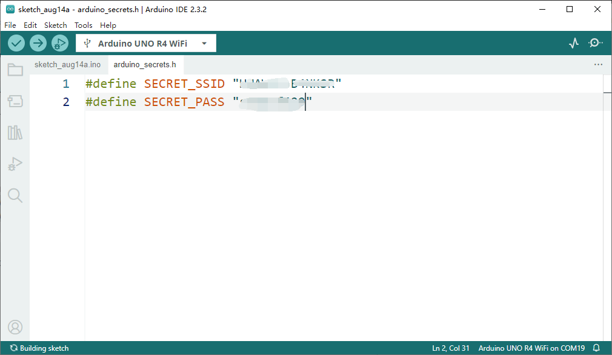

# Networking 

## Arduino UNO R4 WiFi Network Examples
The Arduino UNO R4 WiFi has a built in ESP32-S3 module that enables you to connect to Wi-Fi® networks, and perform network operations. Protocols including HTTPS, MQTT, UDP are tested and supported, and in this article, you will find a number of examples that will get you started.

Wi-Fi® support is enabled via the built-in WiFiS3 library that is shipped with the Arduino UNO R4 Board Package. Installing the Board Package automatically installs the WiFiS3 library.

## Connect to 2.4GHz WiFi Access point
Examples listed in this section have been tested and verified to work. Most examples require you to input the SSID and PASSWORD for your local Wi-Fi® network. As a standard practice, in all of our examples, we store this in a separate header file (called arduino_secrets.h).

You will need to create this file, or remove the #include "arduino_secrets.h" file at the top of each example. The file should contain:

```cpp
//arduino_secrets.h header file
#define SECRET_SSID "yournetwork"
#define SECRET_PASS "yourpassword"
```
> Storing your network & password in a separate file minimizes the risk of you accidentally sharing your Wi-Fi® credentials.

### Access Point 

```cpp 
/*
  WiFi Web Server LED Blink

  A simple web server that lets you blink an LED via the web.
  This sketch will create a new access point (with no password).
  It will then launch a new server and print out the IP address
  to the Serial Monitor. From there, you can open that address in a web browser
  to turn on and off the LED on pin 13.

  If the IP address of your board is yourAddress:
    http://yourAddress/H turns the LED on
    http://yourAddress/L turns it off

  created 25 Nov 2012
  by Tom Igoe
  adapted to WiFi AP by Adafruit

  Find the full UNO R4 WiFi Network documentation here:
  https://docs.arduino.cc/tutorials/uno-r4-wifi/wifi-examples#access-point
 */

#include "WiFiS3.h"

#include "arduino_secrets.h"

///////please enter your sensitive data in the Secret tab/arduino_secrets.h
char ssid[] = SECRET_SSID;        // your network SSID (name)
char pass[] = SECRET_PASS;        // your network password (use for WPA, or use as key for WEP)
int keyIndex = 0;                 // your network key index number (needed only for WEP)

int led =  LED_BUILTIN;
int status = WL_IDLE_STATUS;
WiFiServer server(80);

void setup() {
  //Initialize serial and wait for port to open:
  Serial.begin(9600);
  while (!Serial) {
    ; // wait for serial port to connect. Needed for native USB port only
  }
  Serial.println("Access Point Web Server");

  pinMode(led, OUTPUT);      // set the LED pin mode

  // check for the WiFi module:
  if (WiFi.status() == WL_NO_MODULE) {
    Serial.println("Communication with WiFi module failed!");
    // don't continue
    while (true);
  }

  String fv = WiFi.firmwareVersion();
  if (fv < WIFI_FIRMWARE_LATEST_VERSION) {
    Serial.println("Please upgrade the firmware");
  }

  // by default the local IP address will be 192.168.4.1
  // you can override it with the following:
  WiFi.config(IPAddress(192,48,56,2));

  // print the network name (SSID);
  Serial.print("Creating access point named: ");
  Serial.println(ssid);

  // Create open network. Change this line if you want to create an WEP network:
  status = WiFi.beginAP(ssid, pass);
  if (status != WL_AP_LISTENING) {
    Serial.println("Creating access point failed");
    // don't continue
    while (true);
  }

  // wait 10 seconds for connection:
  delay(10000);

  // start the web server on port 80
  server.begin();

  // you're connected now, so print out the status
  printWiFiStatus();
}


void loop() {

  // compare the previous status to the current status
  if (status != WiFi.status()) {
    // it has changed update the variable
    status = WiFi.status();

    if (status == WL_AP_CONNECTED) {
      // a device has connected to the AP
      Serial.println("Device connected to AP");
    } else {
      // a device has disconnected from the AP, and we are back in listening mode
      Serial.println("Device disconnected from AP");
    }
  }

  WiFiClient client = server.available();   // listen for incoming clients

  if (client) {                             // if you get a client,
    Serial.println("new client");           // print a message out the serial port
    String currentLine = "";                // make a String to hold incoming data from the client
    while (client.connected()) {            // loop while the client's connected
      delayMicroseconds(10);                // This is required for the Arduino Nano RP2040 Connect - otherwise it will loop so fast that SPI will never be served.
      if (client.available()) {             // if there's bytes to read from the client,
        char c = client.read();             // read a byte, then
        Serial.write(c);                    // print it out to the serial monitor
        if (c == '\n') {                    // if the byte is a newline character

          // if the current line is blank, you got two newline characters in a row.
          // that's the end of the client HTTP request, so send a response:
          if (currentLine.length() == 0) {
            // HTTP headers always start with a response code (e.g. HTTP/1.1 200 OK)
            // and a content-type so the client knows what's coming, then a blank line:
            client.println("HTTP/1.1 200 OK");
            client.println("Content-type:text/html");
            client.println();

            // the content of the HTTP response follows the header:
            client.print("<p style=\"font-size:7vw;\">Click <a href=\"/H\">here</a> turn the LED on<br></p>");
            client.print("<p style=\"font-size:7vw;\">Click <a href=\"/L\">here</a> turn the LED off<br></p>");

            // The HTTP response ends with another blank line:
            client.println();
            // break out of the while loop:
            break;
          }
          else {      // if you got a newline, then clear currentLine:
            currentLine = "";
          }
        }
        else if (c != '\r') {    // if you got anything else but a carriage return character,
          currentLine += c;      // add it to the end of the currentLine
        }

        // Check to see if the client request was "GET /H" or "GET /L":
        if (currentLine.endsWith("GET /H")) {
          digitalWrite(led, HIGH);               // GET /H turns the LED on
        }
        if (currentLine.endsWith("GET /L")) {
          digitalWrite(led, LOW);                // GET /L turns the LED off
        }
      }
    }
    // close the connection:
    client.stop();
    Serial.println("client disconnected");
  }
}

void printWiFiStatus() {
  // print the SSID of the network you're attached to:
  Serial.print("SSID: ");
  Serial.println(WiFi.SSID());

  // print your WiFi shield's IP address:
  IPAddress ip = WiFi.localIP();
  Serial.print("IP Address: ");
  Serial.println(ip);

  // print where to go in a browser:
  Serial.print("To see this page in action, open a browser to http://");
  Serial.println(ip);

}

```
### Connect With WPA 
```cpp
/*
  This example connects to an unencrypted WiFi network.
  Then it prints the MAC address of the WiFi module,
  the IP address obtained, and other network details.

  created 13 July 2010
  by dlf (Metodo2 srl)
  modified 31 May 2012
  by Tom Igoe

  Find the full UNO R4 WiFi Network documentation here:
  https://docs.arduino.cc/tutorials/uno-r4-wifi/wifi-examples#connect-with-wpa
 */
#include <WiFiS3.h>

#include "arduino_secrets.h" 
///////please enter your sensitive data in the Secret tab/arduino_secrets.h
char ssid[] = SECRET_SSID;        // your network SSID (name)
char pass[] = SECRET_PASS;    // your network password (use for WPA, or use as key for WEP)
int status = WL_IDLE_STATUS;     // the WiFi radio's status

void setup() {
  //Initialize serial and wait for port to open:
  Serial.begin(9600);
  while (!Serial) {
    ; // wait for serial port to connect. Needed for native USB port only
  }

  // check for the WiFi module:
  if (WiFi.status() == WL_NO_MODULE) {
    Serial.println("Communication with WiFi module failed!");
    // don't continue
    while (true);
  }

  String fv = WiFi.firmwareVersion();
  if (fv < WIFI_FIRMWARE_LATEST_VERSION) {
    Serial.println("Please upgrade the firmware");
  }

  // attempt to connect to WiFi network:
  while (status != WL_CONNECTED) {
    Serial.print("Attempting to connect to WPA SSID: ");
    Serial.println(ssid);
    // Connect to WPA/WPA2 network:
    status = WiFi.begin(ssid, pass);

    // wait 10 seconds for connection:
    delay(10000);
  }

  // you're connected now, so print out the data:
  Serial.print("You're connected to the network");
  printCurrentNet();
  printWifiData();

}

void loop() {
  // check the network connection once every 10 seconds:
  delay(10000);
  printCurrentNet();
}

void printWifiData() {
  // print your board's IP address:
  IPAddress ip = WiFi.localIP();
  Serial.print("IP Address: ");
  
  Serial.println(ip);

  // print your MAC address:
  byte mac[6];
  WiFi.macAddress(mac);
  Serial.print("MAC address: ");
  printMacAddress(mac);
}

void printCurrentNet() {
  // print the SSID of the network you're attached to:
  Serial.print("SSID: ");
  Serial.println(WiFi.SSID());

  // print the MAC address of the router you're attached to:
  byte bssid[6];
  WiFi.BSSID(bssid);
  Serial.print("BSSID: ");
  printMacAddress(bssid);

  // print the received signal strength:
  long rssi = WiFi.RSSI();
  Serial.print("signal strength (RSSI):");
  Serial.println(rssi);

  // print the encryption type:
  byte encryption = WiFi.encryptionType();
  Serial.print("Encryption Type:");
  Serial.println(encryption, HEX);
  Serial.println();
}

void printMacAddress(byte mac[]) {
  for (int i = 0; i < 6; i++) {
    if (i > 0) {
      Serial.print(":");
    }
    if (mac[i] < 16) {
      Serial.print("0");
    }
    Serial.print(mac[i], HEX);
  }
  Serial.println();
}
```

### Scan Networks
```cpp
/*
  This example  prints the board's MAC address, and
  scans for available WiFi networks using the NINA module.
  Every ten seconds, it scans again. It doesn't actually
  connect to any network, so no encryption scheme is specified.

  Circuit:
   * Uno R4 WiFi

  created 13 July 2010
  by dlf (Metodo2 srl)
  modified 21 Junn 2012
  by Tom Igoe and Jaymes Dec

  Find the full UNO R4 WiFi Network documentation here:
  https://docs.arduino.cc/tutorials/uno-r4-wifi/wifi-examples#scan-networks
 */


#include <WiFiS3.h>

void setup() {
  //Initialize serial and wait for port to open:
  Serial.begin(9600);
  while (!Serial) {
    ; // wait for serial port to connect. Needed for native USB port only
  }

  // check for the WiFi module:
  if (WiFi.status() == WL_NO_MODULE) {
    Serial.println("Communication with WiFi module failed!");
    // don't continue
    while (true);
  }

  String fv = WiFi.firmwareVersion();
  if (fv < WIFI_FIRMWARE_LATEST_VERSION) {
    Serial.println("Please upgrade the firmware");
  }
}

void loop() {
  byte mac[6];
  // scan for existing networks:
  Serial.println("Scanning available networks...");
  listNetworks();
  WiFi.macAddress(mac);
  Serial.println();
  Serial.print("Your MAC Address is: ");
  printMacAddress(mac);
  delay(10000);
}

void listNetworks() {
  // scan for nearby networks:
  Serial.println("** Scan Networks **");
  int numSsid = WiFi.scanNetworks();
  if (numSsid == -1) {
    Serial.println("Couldn't get a WiFi connection");
    while (true);
  }

  // print the list of networks seen:
  Serial.print("number of available networks:");
  Serial.println(numSsid);

  // print the network number and name for each network found:
  for (int thisNet = 0; thisNet < numSsid; thisNet++) {
    Serial.print(thisNet);
    Serial.print(") ");
    Serial.print(WiFi.SSID(thisNet));
    Serial.print(" Signal: ");
    Serial.print(WiFi.RSSI(thisNet));
    Serial.print(" dBm");
    Serial.print(" Encryption: ");
    printEncryptionType(WiFi.encryptionType(thisNet));
  }
}

void printEncryptionType(int thisType) {
  // read the encryption type and print out the name:
  switch (thisType) {
    case ENC_TYPE_WEP:
      Serial.println("WEP");
      break;
    case ENC_TYPE_WPA:
      Serial.println("WPA");
      break;
    case ENC_TYPE_WPA2:
      Serial.println("WPA2");
      break;
    case ENC_TYPE_WPA3:
      Serial.print("WPA3");
      break;
    case ENC_TYPE_NONE:
      Serial.println("None");
      break;
    case ENC_TYPE_AUTO:
      Serial.println("Auto");
      break;
    case ENC_TYPE_UNKNOWN:
    default:
      Serial.println("Unknown");
      break;
  }
}


void printMacAddress(byte mac[]) {
  for (int i = 0; i < 6; i++) {
    if (i > 0) {
      Serial.print(":");
    }
    if (mac[i] < 16) {
      Serial.print("0");
    }
    Serial.print(mac[i], HEX);
  }
  Serial.println();
}
```
### Scan Networks (Advanced) 
```cpp
/*
  This example  prints the board's MAC address, and
  scans for available WiFi networks using the NINA module.
  Every ten seconds, it scans again. It doesn't actually
  connect to any network, so no encryption scheme is specified.
  BSSID and WiFi channel are printed

  Circuit:
  * Uno R4 WiFi

  This example is based on ScanNetworks

  created 1 Mar 2017
  by Arturo Guadalupi

  Find the full UNO R4 WiFi Network documentation here:
  https://docs.arduino.cc/tutorials/uno-r4-wifi/wifi-examples#scan-networks-advanced
*/


#include <WiFiS3.h>

void setup() {
  //Initialize serial and wait for port to open:
  Serial.begin(9600);
  while (!Serial) {
    ; // wait for serial port to connect. Needed for native USB port only
  }

  // check for the WiFi module:
  if (WiFi.status() == WL_NO_MODULE) {
    Serial.println("Communication with WiFi module failed!");
    // don't continue
    while (true);
  }

  String fv = WiFi.firmwareVersion();
  if (fv < WIFI_FIRMWARE_LATEST_VERSION) {
    Serial.println("Please upgrade the firmware");
  }

  // scan for existing networks:
  Serial.println();
  Serial.println("Scanning available networks...");
  listNetworks();

  // print your MAC address:
  byte mac[6];
  WiFi.macAddress(mac);
  Serial.print("MAC: ");
  printMacAddress(mac);
}

void loop() {
  delay(10000);
  // scan for existing networks:
  Serial.println("Scanning available networks...");
  listNetworks();
}

void listNetworks() {
  // scan for nearby networks:
  Serial.println("** Scan Networks **");
  int numSsid = WiFi.scanNetworks();
  if (numSsid == -1)
  {
    Serial.println("Couldn't get a WiFi connection");
    while (true);
  }

  // print the list of networks seen:
  Serial.print("number of available networks: ");
  Serial.println(numSsid);

  // print the network number and name for each network found:
  for (int thisNet = 0; thisNet < numSsid; thisNet++) {
    Serial.print(thisNet + 1);
    Serial.print(") ");
    Serial.print("Signal: ");
    Serial.print(WiFi.RSSI(thisNet));
    Serial.print(" dBm");
    Serial.print("\tChannel: ");
    Serial.print(WiFi.channel(thisNet));
    byte bssid[6];
    Serial.print("\t\tBSSID: ");
    printMacAddress(WiFi.BSSID(thisNet, bssid));
    Serial.print("\tEncryption: ");
    printEncryptionType(WiFi.encryptionType(thisNet));
    Serial.print("\t\tSSID: ");
    Serial.println(WiFi.SSID(thisNet));
    Serial.flush();
  }
  Serial.println();
}

void printEncryptionType(int thisType) {
  // read the encryption type and print out the name:
  switch (thisType) {
    case ENC_TYPE_WEP:
      Serial.print("WEP");
      break;
    case ENC_TYPE_WPA:
      Serial.print("WPA");
      break;
    case ENC_TYPE_WPA2:
      Serial.print("WPA2");
      break;
    case ENC_TYPE_WPA3:
      Serial.print("WPA3");
      break;
    case ENC_TYPE_NONE:
      Serial.print("None");
      break;
    case ENC_TYPE_AUTO:
      Serial.print("Auto");
      break;
    case ENC_TYPE_UNKNOWN:
    default:
      Serial.print("Unknown");
      break;
  }
}

void print2Digits(byte thisByte) {
  if (thisByte < 0xF) {
    Serial.print("0");
  }
  Serial.print(thisByte, HEX);
}

void printMacAddress(byte mac[]) {
  for (int i = 0; i < 6; i++) {
    if (i > 0) {
      Serial.print(":");
    }
    if (mac[i] < 16) {
      Serial.print("0");
    }
    Serial.print(mac[i], HEX);
  }
  Serial.println();
}
```
### Simple Webserver 
```cpp
/*
  WiFi Web Server LED Blink

  A simple web server that lets you blink an LED via the web.
  This sketch will print the IP address of your WiFi module (once connected)
  to the Serial Monitor. From there, you can open that address in a web browser
  to turn on and off the LED_BUILTIN.

  If the IP address of your board is yourAddress:
  http://yourAddress/H turns the LED on
  http://yourAddress/L turns it off

  This example is written for a network using WPA encryption. For
  WEP or WPA, change the WiFi.begin() call accordingly.

  Circuit:
  * Board with NINA module (Arduino MKR WiFi 1010, MKR VIDOR 4000 and Uno WiFi Rev.2)
  * LED attached to pin 9

  created 25 Nov 2012
  by Tom Igoe

  Find the full UNO R4 WiFi Network documentation here:
  https://docs.arduino.cc/tutorials/uno-r4-wifi/wifi-examples#simple-webserver
 */

#include "WiFiS3.h"

#include "arduino_secrets.h"
///////please enter your sensitive data in the Secret tab/arduino_secrets.h
char ssid[] = SECRET_SSID;        // your network SSID (name)
char pass[] = SECRET_PASS;    // your network password (use for WPA, or use as key for WEP)
int keyIndex = 0;                 // your network key index number (needed only for WEP)

int led =  LED_BUILTIN;
int status = WL_IDLE_STATUS;
WiFiServer server(80);

void setup() {
  Serial.begin(9600);      // initialize serial communication
  pinMode(led, OUTPUT);      // set the LED pin mode

  // check for the WiFi module:
  if (WiFi.status() == WL_NO_MODULE) {
    Serial.println("Communication with WiFi module failed!");
    // don't continue
    while (true);
  }

  String fv = WiFi.firmwareVersion();
  if (fv < WIFI_FIRMWARE_LATEST_VERSION) {
    Serial.println("Please upgrade the firmware");
  }

  // attempt to connect to WiFi network:
  while (status != WL_CONNECTED) {
    Serial.print("Attempting to connect to Network named: ");
    Serial.println(ssid);                   // print the network name (SSID);

    // Connect to WPA/WPA2 network. Change this line if using open or WEP network:
    status = WiFi.begin(ssid, pass);
    // wait 10 seconds for connection:
    delay(10000);
  }
  server.begin();                           // start the web server on port 80
  printWifiStatus();                        // you're connected now, so print out the status
}


void loop() {
  WiFiClient client = server.available();   // listen for incoming clients

  if (client) {                             // if you get a client,
    Serial.println("new client");           // print a message out the serial port
    String currentLine = "";                // make a String to hold incoming data from the client
    while (client.connected()) {            // loop while the client's connected
      if (client.available()) {             // if there's bytes to read from the client,
        char c = client.read();             // read a byte, then
        Serial.write(c);                    // print it out to the serial monitor
        if (c == '\n') {                    // if the byte is a newline character

          // if the current line is blank, you got two newline characters in a row.
          // that's the end of the client HTTP request, so send a response:
          if (currentLine.length() == 0) {
            // HTTP headers always start with a response code (e.g. HTTP/1.1 200 OK)
            // and a content-type so the client knows what's coming, then a blank line:
            client.println("HTTP/1.1 200 OK");
            client.println("Content-type:text/html");
            client.println();

            // the content of the HTTP response follows the header:
            client.print("<p style=\"font-size:7vw;\">Click <a href=\"/H\">here</a> turn the LED on<br></p>");
            client.print("<p style=\"font-size:7vw;\">Click <a href=\"/L\">here</a> turn the LED off<br></p>");

            // The HTTP response ends with another blank line:
            client.println();
            // break out of the while loop:
            break;
          } else {    // if you got a newline, then clear currentLine:
            currentLine = "";
          }
        } else if (c != '\r') {  // if you got anything else but a carriage return character,
          currentLine += c;      // add it to the end of the currentLine
        }

        // Check to see if the client request was "GET /H" or "GET /L":
        if (currentLine.endsWith("GET /H")) {
          digitalWrite(LED_BUILTIN, HIGH);               // GET /H turns the LED on
        }
        if (currentLine.endsWith("GET /L")) {
          digitalWrite(LED_BUILTIN, LOW);                // GET /L turns the LED off
        }
      }

    }
    // close the connection:
    client.stop();
    Serial.println("client disconnected");
  }
}

void printWifiStatus() {
  // print the SSID of the network you're attached to:
  Serial.print("SSID: ");
  Serial.println(WiFi.SSID());

  // print your board's IP address:
  IPAddress ip = WiFi.localIP();
  Serial.print("IP Address: ");
  Serial.println(ip);

  // print the received signal strength:
  long rssi = WiFi.RSSI();
  Serial.print("signal strength (RSSI):");
  Serial.print(rssi);
  Serial.println(" dBm");
  // print where to go in a browser:
  Serial.print("To see this page in action, open a browser to http://");
  Serial.println(ip);
}
```
### Wi-Fi® Chat Server
```cpp
/*
  Chat  Server

  A simple server that distributes any incoming messages to all
  connected clients. To use, telnet to your device's IP address and type.
  You can see the client's input in the serial monitor as well.

  This example is written for a network using WPA encryption. For
  WEP or WPA, change the WiFi.begin() call accordingly.


  Circuit:
  * Board with NINA module (Arduino MKR WiFi 1010, MKR VIDOR 4000 and Uno WiFi Rev.2)

  created 18 Dec 2009
  by David A. Mellis
  modified 31 May 2012
  by Tom Igoe

  Find the full UNO R4 WiFi Network documentation here:
  https://docs.arduino.cc/tutorials/uno-r4-wifi/wifi-examples#wi-fi-chat-server
 */


#include <WiFiS3.h>

#include "arduino_secrets.h"
///////please enter your sensitive data in the Secret tab/arduino_secrets.h
char ssid[] = SECRET_SSID;        // your network SSID (name)
char pass[] = SECRET_PASS;    // your network password (use for WPA, or use as key for WEP)

int keyIndex = 0;            // your network key index number (needed only for WEP)

int status = WL_IDLE_STATUS;

WiFiServer server(23);

boolean alreadyConnected = false; // whether or not the client was connected previously

void setup() {
  //Initialize serial and wait for port to open:
  Serial.begin(9600);
  while (!Serial) {
    ; // wait for serial port to connect. Needed for native USB port only
  }

  // check for the WiFi module:
  if (WiFi.status() == WL_NO_MODULE) {
    Serial.println("Communication with WiFi module failed!");
    // don't continue
    while (true);
  }

  String fv = WiFi.firmwareVersion();
  if (fv < WIFI_FIRMWARE_LATEST_VERSION) {
    Serial.println("Please upgrade the firmware");
  }

  // attempt to connect to WiFi network:
  while (status != WL_CONNECTED) {
    Serial.print("Attempting to connect to SSID: ");
    Serial.println(ssid);
    // Connect to WPA/WPA2 network. Change this line if using open or WEP network:
    status = WiFi.begin(ssid, pass);

    // wait 10 seconds for connection:
    delay(10000);
  }

  // start the server:
  server.begin();
  // you're connected now, so print out the status:
  printWifiStatus();
}


void loop() {

  // wait for a new client:
  WiFiClient client = server.available();


  // when the client sends the first byte, say hello:
  if (client) {
    if (!alreadyConnected) {
      // clear out the input buffer:
      client.flush();
      Serial.println("We have a new client");
      client.println("Hello, client!");
      alreadyConnected = true;
    }

    if (client.available() > 0) {
      // read the bytes incoming from the client:
      char thisChar = client.read();
      // echo the bytes back to the client:
      server.write(thisChar);
      // echo the bytes to the server as well:
      Serial.write(thisChar);
    }
  }
}


void printWifiStatus() {
  // print the SSID of the network you're attached to:
  Serial.print("SSID: ");
  Serial.println(WiFi.SSID());

  // print your board's IP address:
  IPAddress ip = WiFi.localIP();
  Serial.print("IP Address: ");
  Serial.println(ip);

  // print the received signal strength:
  long rssi = WiFi.RSSI();
  Serial.print("signal strength (RSSI):");
  Serial.print(rssi);
  Serial.println(" dBm");
}
```
### Wi-Fi® UDP NTP Client
```cpp
/*
  Udp NTP Client

  Get the time from a Network Time Protocol (NTP) time server
  Demonstrates use of UDP sendPacket and ReceivePacket
  For more on NTP time servers and the messages needed to communicate with them,
  see http://en.wikipedia.org/wiki/Network_Time_Protocol

  created 4 Sep 2010
  by Michael Margolis
  modified 9 Apr 2012
  by Tom Igoe
  modified May, 4th 2023
  by Daniele Aimo

  This code is in the public domain.

  Find the full UNO R4 WiFi Network documentation here:
  https://docs.arduino.cc/tutorials/uno-r4-wifi/wifi-examples#wi-fi-udp-ntp-client
 */


#include <WiFiS3.h>

int status = WL_IDLE_STATUS;
#include "arduino_secrets.h"
///////please enter your sensitive data in the Secret tab/arduino_secrets.h
char ssid[] = SECRET_SSID;        // your network SSID (name)
char pass[] = SECRET_PASS;    // your network password (use for WPA, or use as key for WEP)
int keyIndex = 0;            // your network key index number (needed only for WEP)

unsigned int localPort = 2390;      // local port to listen for UDP packets

IPAddress timeServer(162, 159, 200, 123); // pool.ntp.org NTP server

const int NTP_PACKET_SIZE = 48; // NTP timestamp is in the first 48 bytes of the message

byte packetBuffer[NTP_PACKET_SIZE]; //buffer to hold incoming and outgoing packets

// A UDP instance to let us send and receive packets over UDP
WiFiUDP Udp;

void setup() {
  // Open serial communications and wait for port to open:
  Serial.begin(9600);
  while (!Serial) {
    ; // wait for serial port to connect. Needed for native USB port only
  }

  // check for the WiFi module:
  if (WiFi.status() == WL_NO_MODULE) {
    Serial.println("Communication with WiFi module failed!");
    // don't continue
    while (true);
  }

  String fv = WiFi.firmwareVersion();
  if (fv < WIFI_FIRMWARE_LATEST_VERSION) {
    Serial.println("Please upgrade the firmware");
  }

  // attempt to connect to WiFi network:
  while (status != WL_CONNECTED) {
    Serial.print("Attempting to connect to SSID: ");
    Serial.println(ssid);
    // Connect to WPA/WPA2 network. Change this line if using open or WEP network:
    status = WiFi.begin(ssid, pass);

    // wait 10 seconds for connection:
    delay(10000);
  }

  Serial.println("Connected to WiFi");
  printWifiStatus();

  Serial.println("\nStarting connection to server...");
  Udp.begin(localPort);
}

void loop() {
  sendNTPpacket(timeServer); // send an NTP packet to a time server
  // wait to see if a reply is available
  delay(1000);
  if (Udp.parsePacket()) {
    Serial.println("packet received");
    // We've received a packet, read the data from it
    Udp.read(packetBuffer, NTP_PACKET_SIZE); // read the packet into the buffer

    //the timestamp starts at byte 40 of the received packet and is four bytes,
    // or two words, long. First, extract the two words:

    unsigned long highWord = word(packetBuffer[40], packetBuffer[41]);
    unsigned long lowWord = word(packetBuffer[42], packetBuffer[43]);
    // combine the four bytes (two words) into a long integer
    // this is NTP time (seconds since Jan 1 1900):
    unsigned long secsSince1900 = highWord << 16 | lowWord;
    Serial.print("Seconds since Jan 1 1900 = ");
    Serial.println(secsSince1900);

    // now convert NTP time into everyday time:
    Serial.print("Unix time = ");
    // Unix time starts on Jan 1 1970. In seconds, that's 2208988800:
    const unsigned long seventyYears = 2208988800UL;
    // subtract seventy years:
    unsigned long epoch = secsSince1900 - seventyYears;
    // print Unix time:
    Serial.println(epoch);


    // print the hour, minute and second:
    Serial.print("The UTC time is ");       // UTC is the time at Greenwich Meridian (GMT)
    Serial.print((epoch  % 86400L) / 3600); // print the hour (86400 equals secs per day)
    Serial.print(':');
    if (((epoch % 3600) / 60) < 10) {
      // In the first 10 minutes of each hour, we'll want a leading '0'
      Serial.print('0');
    }
    Serial.print((epoch  % 3600) / 60); // print the minute (3600 equals secs per minute)
    Serial.print(':');
    if ((epoch % 60) < 10) {
      // In the first 10 seconds of each minute, we'll want a leading '0'
      Serial.print('0');
    }
    Serial.println(epoch % 60); // print the second
  }
  // wait ten seconds before asking for the time again
  delay(10000);
}

// send an NTP request to the time server at the given address
unsigned long sendNTPpacket(IPAddress& address) {
  //Serial.println("1");
  // set all bytes in the buffer to 0
  memset(packetBuffer, 0, NTP_PACKET_SIZE);
  // Initialize values needed to form NTP request
  // (see URL above for details on the packets)
  //Serial.println("2");
  packetBuffer[0] = 0b11100011;   // LI, Version, Mode
  packetBuffer[1] = 0;     // Stratum, or type of clock
  packetBuffer[2] = 6;     // Polling Interval
  packetBuffer[3] = 0xEC;  // Peer Clock Precision
  // 8 bytes of zero for Root Delay & Root Dispersion
  packetBuffer[12]  = 49;
  packetBuffer[13]  = 0x4E;
  packetBuffer[14]  = 49;
  packetBuffer[15]  = 52;

  //Serial.println("3");

  // all NTP fields have been given values, now
  // you can send a packet requesting a timestamp:
  Udp.beginPacket(address, 123); //NTP requests are to port 123
  //Serial.println("4");
  Udp.write(packetBuffer, NTP_PACKET_SIZE);
  //Serial.println("5");
  Udp.endPacket();
  //Serial.println("6");
}


void printWifiStatus() {
  // print the SSID of the network you're attached to:
  Serial.print("SSID: ");
  Serial.println(WiFi.SSID());

  // print your board's IP address:
  IPAddress ip = WiFi.localIP();
  Serial.print("IP Address: ");
  Serial.println(ip);

  // print the received signal strength:
  long rssi = WiFi.RSSI();
  Serial.print("signal strength (RSSI):");
  Serial.print(rssi);
  Serial.println(" dBm");
}
```
### Wi-Fi® UDP Send Receive String
```cpp
/*
  WiFi UDP Send and Receive String

  This sketch waits for a UDP packet on localPort using the WiFi module.
  When a packet is received an Acknowledge packet is sent to the client on port remotePort

  created 30 December 2012
  by dlf (Metodo2 srl)

  Find the full UNO R4 WiFi Network documentation here:
  https://docs.arduino.cc/tutorials/uno-r4-wifi/wifi-examples#wi-fi-udp-send-receive-string
 */


#include <WiFiS3.h>

int status = WL_IDLE_STATUS;
#include "arduino_secrets.h"
///////please enter your sensitive data in the Secret tab/arduino_secrets.h
char ssid[] = SECRET_SSID;        // your network SSID (name)
char pass[] = SECRET_PASS;    // your network password (use for WPA, or use as key for WEP)
int keyIndex = 0;            // your network key index number (needed only for WEP)

unsigned int localPort = 2390;      // local port to listen on

char packetBuffer[256]; //buffer to hold incoming packet
char  ReplyBuffer[] = "acknowledged\n";       // a string to send back

WiFiUDP Udp;

void setup() {
  //Initialize serial and wait for port to open:
  Serial.begin(9600);
  while (!Serial) {
    ; // wait for serial port to connect. Needed for native USB port only
  }

  // check for the WiFi module:
  if (WiFi.status() == WL_NO_MODULE) {
    Serial.println("Communication with WiFi module failed!");
    // don't continue
    while (true);
  }

  String fv = WiFi.firmwareVersion();
  if (fv < WIFI_FIRMWARE_LATEST_VERSION) {
    Serial.println("Please upgrade the firmware");
  }

  // attempt to connect to WiFi network:
  while (status != WL_CONNECTED) {
    Serial.print("Attempting to connect to SSID: ");
    Serial.println(ssid);
    // Connect to WPA/WPA2 network. Change this line if using open or WEP network:
    status = WiFi.begin(ssid, pass);

    // wait 10 seconds for connection:
    delay(10000);
  }
  Serial.println("Connected to WiFi");
  printWifiStatus();

  Serial.println("\nStarting connection to server...");
  // if you get a connection, report back via serial:
  Udp.begin(localPort);
}

void loop() {

  // if there's data available, read a packet
  int packetSize = Udp.parsePacket();
  if (packetSize) {
    Serial.print("Received packet of size ");
    Serial.println(packetSize);
    Serial.print("From ");
    IPAddress remoteIp = Udp.remoteIP();
    Serial.print(remoteIp);
    Serial.print(", port ");
    Serial.println(Udp.remotePort());

    // read the packet into packetBuffer
    int len = Udp.read(packetBuffer, 255);
    if (len > 0) {
      packetBuffer[len] = 0;
    }
    Serial.println("Contents:");
    Serial.println(packetBuffer);

    // send a reply, to the IP address and port that sent us the packet we received
    Udp.beginPacket(Udp.remoteIP(), Udp.remotePort());
    Udp.write(ReplyBuffer);
    Udp.endPacket();
  }
}


void printWifiStatus() {
  // print the SSID of the network you're attached to:
  Serial.print("SSID: ");
  Serial.println(WiFi.SSID());

  // print your board's IP address:
  IPAddress ip = WiFi.localIP();
  Serial.print("IP Address: ");
  Serial.println(ip);

  // print the received signal strength:
  long rssi = WiFi.RSSI();
  Serial.print("signal strength (RSSI):");
  Serial.print(rssi);
  Serial.println(" dBm");
}
```
### Wi-Fi® Web Client
```cpp
/*
  Web client

  This sketch connects to a website (http://www.google.com)
  using the WiFi module.

  This example is written for a network using WPA encryption. For
  WEP or WPA, change the WiFi.begin() call accordingly.

  This example is written for a network using WPA encryption. For
  WEP or WPA, change the WiFi.begin() call accordingly.


  created 13 July 2010
  by dlf (Metodo2 srl)
  modified 31 May 2012
  by Tom Igoe

  Find the full UNO R4 WiFi Network documentation here:
  https://docs.arduino.cc/tutorials/uno-r4-wifi/wifi-examples#wi-fi-web-client
 */


#include "WiFiS3.h"


#include "arduino_secrets.h"

///////please enter your sensitive data in the Secret tab/arduino_secrets.h
char ssid[] = SECRET_SSID;        // your network SSID (name)
char pass[] = SECRET_PASS;    // your network password (use for WPA, or use as key for WEP)
int keyIndex = 0;            // your network key index number (needed only for WEP)

int status = WL_IDLE_STATUS;
// if you don't want to use DNS (and reduce your sketch size)
// use the numeric IP instead of the name for the server:
//IPAddress server(74,125,232,128);  // numeric IP for Google (no DNS)
char server[] = "www.google.com";    // name address for Google (using DNS)

// Initialize the Ethernet client library
// with the IP address and port of the server
// that you want to connect to (port 80 is default for HTTP):
WiFiClient client;

/* -------------------------------------------------------------------------- */
void setup() {
/* -------------------------------------------------------------------------- */
  //Initialize serial and wait for port to open:
  Serial.begin(9600);
  while (!Serial) {
    ; // wait for serial port to connect. Needed for native USB port only
  }

  // check for the WiFi module:
  if (WiFi.status() == WL_NO_MODULE) {
    Serial.println("Communication with WiFi module failed!");
    // don't continue
    while (true);
  }

  String fv = WiFi.firmwareVersion();
  if (fv < WIFI_FIRMWARE_LATEST_VERSION) {
    Serial.println("Please upgrade the firmware");
  }

  // attempt to connect to WiFi network:
  while (status != WL_CONNECTED) {
    Serial.print("Attempting to connect to SSID: ");
    Serial.println(ssid);
    // Connect to WPA/WPA2 network. Change this line if using open or WEP network:
    status = WiFi.begin(ssid, pass);

    // wait 10 seconds for connection:
    delay(10000);
  }

  printWifiStatus();

  Serial.println("\nStarting connection to server...");
  // if you get a connection, report back via serial:
  if (client.connect(server, 80)) {
    Serial.println("connected to server");
    // Make a HTTP request:
    client.println("GET /search?q=arduino HTTP/1.1");
    client.println("Host: www.google.com");
    client.println("Connection: close");
    client.println();
  }
}

/* just wrap the received data up to 80 columns in the serial print*/
/* -------------------------------------------------------------------------- */
void read_response() {
/* -------------------------------------------------------------------------- */
  uint32_t received_data_num = 0;
  while (client.available()) {
    /* actual data reception */
    char c = client.read();
    /* print data to serial port */
    Serial.print(c);
    /* wrap data to 80 columns*/
    received_data_num++;
    if(received_data_num % 80 == 0) {
      Serial.println();
    }
  }
}

/* -------------------------------------------------------------------------- */
void loop() {
/* -------------------------------------------------------------------------- */
  read_response();

  // if the server's disconnected, stop the client:
  if (!client.connected()) {
    Serial.println();
    Serial.println("disconnecting from server.");
    client.stop();

    // do nothing forevermore:
    while (true);
  }
}

/* -------------------------------------------------------------------------- */
void printWifiStatus() {
/* -------------------------------------------------------------------------- */
  // print the SSID of the network you're attached to:
  Serial.print("SSID: ");
  Serial.println(WiFi.SSID());

  // print your board's IP address:
  IPAddress ip = WiFi.localIP();
  Serial.print("IP Address: ");
  Serial.println(ip);

  // print the received signal strength:
  long rssi = WiFi.RSSI();
  Serial.print("signal strength (RSSI):");
  Serial.print(rssi);
  Serial.println(" dBm");
}
```
### Wi-Fi® Web Client Repeating
```cpp
/*
  Repeating WiFi Web Client

 This sketch connects to a a web server and makes a request
 using a WiFi equipped Arduino board.

 created 23 April 2012
 modified 31 May 2012
 by Tom Igoe
 modified 13 Jan 2014
 by Federico Vanzati

 This code is in the public domain.

  Find the full UNO R4 WiFi Network documentation here:
  https://docs.arduino.cc/tutorials/uno-r4-wifi/wifi-examples#wi-fi-web-client-repeating
 */

#include "WiFiS3.h"


#include "arduino_secrets.h"
///////please enter your sensitive data in the Secret tab/arduino_secrets.h
char ssid[] = SECRET_SSID;        // your network SSID (name)
char pass[] = SECRET_PASS;    // your network password (use for WPA, or use as key for WEP)
int keyIndex = 0;            // your network key index number (needed only for WEP)

int status = WL_IDLE_STATUS;

// Initialize the WiFi client library
WiFiClient client;

// server address:
char server[] = "example.org";
//IPAddress server(64,131,82,241);

unsigned long lastConnectionTime = 0;            // last time you connected to the server, in milliseconds
const unsigned long postingInterval = 10L * 1000L; // delay between updates, in milliseconds

/* -------------------------------------------------------------------------- */
void setup() {
/* -------------------------------------------------------------------------- */
  //Initialize serial and wait for port to open:
  Serial.begin(9600);
  while (!Serial) {
    ; // wait for serial port to connect. Needed for native USB port only
  }

  // check for the WiFi module:
  if (WiFi.status() == WL_NO_MODULE) {
    Serial.println("Communication with WiFi module failed!");
    // don't continue
    while (true);
  }

  String fv = WiFi.firmwareVersion();
  if (fv < WIFI_FIRMWARE_LATEST_VERSION) {
    Serial.println("Please upgrade the firmware");
  }

  // attempt to connect to WiFi network:
  while (status != WL_CONNECTED) {
    Serial.print("Attempting to connect to SSID: ");
    Serial.println(ssid);
    // Connect to WPA/WPA2 network. Change this line if using open or WEP network:
    status = WiFi.begin(ssid, pass);

    // wait 10 seconds for connection:
    //delay(10000);
  }
  // you're connected now, so print out the status:
  printWifiStatus();
}

/* just wrap the received data up to 80 columns in the serial print*/
/* -------------------------------------------------------------------------- */
void read_request() {
/* -------------------------------------------------------------------------- */
  uint32_t received_data_num = 0;

  while (client.available()) {
    /* actual data reception */
    char c = client.read();
    /* print data to serial port */
    Serial.print(c);
    /* wrap data to 80 columns*/
    received_data_num++;
    if(received_data_num % 80 == 0) {

    }

  }
}

/* -------------------------------------------------------------------------- */
void loop() {
/* -------------------------------------------------------------------------- */
  // if there's incoming data from the net connection.
  // send it out the serial port.  This is for debugging
  // purposes only:
  read_request();

  // if ten seconds have passed since your last connection,
  // then connect again and send data:
  if (millis() - lastConnectionTime > postingInterval) {
    httpRequest();
  }

}

// this method makes a HTTP connection to the server:
/* -------------------------------------------------------------------------- */
void httpRequest() {
/* -------------------------------------------------------------------------- */
  // close any connection before send a new request.
  // This will free the socket on the NINA module
  client.stop();

  // if there's a successful connection:
  if (client.connect(server, 80)) {
    Serial.println("connecting...");
    // send the HTTP GET request:
    client.println("GET / HTTP/1.1");
    client.println("Host: example.org");
    client.println("User-Agent: ArduinoWiFi/1.1");
    client.println("Connection: close");
    client.println();
    // note the time that the connection was made:
    lastConnectionTime = millis();
  } else {
    // if you couldn't make a connection:
    Serial.println("connection failed");
  }
}

/* -------------------------------------------------------------------------- */
void printWifiStatus() {
/* -------------------------------------------------------------------------- */
  // print the SSID of the network you're attached to:
  Serial.print("SSID: ");
  Serial.println(WiFi.SSID());

  // print your board's IP address:
  IPAddress ip = WiFi.localIP();
  Serial.print("IP Address: ");
  Serial.println(ip);

  // print the received signal strength:
  long rssi = WiFi.RSSI();
  Serial.print("signal strength (RSSI):");
  Serial.print(rssi);
  Serial.println(" dBm");
}
```
### Wi-Fi® Web Client SSL 
```cpp
/*
  TLS WiFi Web client

  Board CA Root certificate bundle is embedded inside WiFi firmware:
  https://github.com/arduino/uno-r4-wifi-usb-bridge/blob/main/certificates/cacrt_all.pem

  Find the full UNO R4 WiFi Network documentation here:
  https://docs.arduino.cc/tutorials/uno-r4-wifi/wifi-examples#wi-fi-web-client-ssl
*/

#include "WiFiS3.h"
#include "WiFiSSLClient.h"
#include "IPAddress.h"

#include "arduino_secrets.h"

///////please enter your sensitive data in the Secret tab/arduino_secrets.h
char ssid[] = SECRET_SSID;        // your network SSID (name)
char pass[] = SECRET_PASS;        // your network password (use for WPA, or use as key for WEP)

int status = WL_IDLE_STATUS;
// if you don't want to use DNS (and reduce your sketch size)
// use the numeric IP instead of the name for the server:
//IPAddress server(74,125,232,128);  // numeric IP for Google (no DNS)
char server[] = "www.google.com";    // name address for Google (using DNS)

// Initialize the Ethernet client library
// with the IP address and port of the server
// that you want to connect to (port 80 is default for HTTP):
WiFiSSLClient client;

/* -------------------------------------------------------------------------- */
void setup() {
/* -------------------------------------------------------------------------- */
  //Initialize serial and wait for port to open:
  Serial.begin(115200);
  while (!Serial) {
    ; // wait for serial port to connect. Needed for native USB port only
  }

  // check for the WiFi module:
  if (WiFi.status() == WL_NO_MODULE) {
    Serial.println("Communication with WiFi module failed!");
    // don't continue
    while (true);
  }

  String fv = WiFi.firmwareVersion();
  if (fv < WIFI_FIRMWARE_LATEST_VERSION) {
    Serial.println("Please upgrade the firmware");
  }

  // attempt to connect to WiFi network:
  while (status != WL_CONNECTED) {
    Serial.print("Attempting to connect to SSID: ");
    Serial.println(ssid);
    // Connect to WPA/WPA2 network.
    status = WiFi.begin(ssid, pass);

    // wait 10 seconds for connection:
    delay(10000);
  }

  printWifiStatus();

  Serial.println("\nStarting connection to server...");
  // if you get a connection, report back via serial:

  if (client.connect(server, 443)) {
    Serial.println("connected to server");
    // Make a HTTP request:
    client.println("GET / HTTP/1.1");
    client.println("Host: www.google.com");
    client.println("Connection: close");
    client.println();
  }
}

/* just wrap the received data up to 80 columns in the serial print*/
/* -------------------------------------------------------------------------- */
void read_response() {
/* -------------------------------------------------------------------------- */
  uint32_t received_data_num = 0;
  while (client.available()) {
    /* actual data reception */
    char c = client.read();
    /* print data to serial port */
    Serial.print(c);
    /* wrap data to 80 columns*/
    received_data_num++;
    if(received_data_num % 80 == 0) {
      Serial.println();
    }
  }
}

/* -------------------------------------------------------------------------- */
void loop() {
/* -------------------------------------------------------------------------- */
  read_response();

  // if the server's disconnected, stop the client:
  if (!client.connected()) {
    Serial.println();
    Serial.println("disconnecting from server.");
    client.stop();

    // do nothing forevermore:
    while (true);
  }
}

/* -------------------------------------------------------------------------- */
void printWifiStatus() {
/* -------------------------------------------------------------------------- */
  // print the SSID of the network you're attached to:
  Serial.print("SSID: ");
  Serial.println(WiFi.SSID());

  // print your board's IP address:
  IPAddress ip = WiFi.localIP();
  Serial.print("IP Address: ");
  Serial.println(ip);

  // print the received signal strength:
  long rssi = WiFi.RSSI();
  Serial.print("signal strength (RSSI):");
  Serial.print(rssi);
  Serial.println(" dBm");
}
```
### Wi-Fi® Web Server
```cpp
/*
  WiFi Web Server

 A simple web server that shows the value of the analog input pins.

 This example is written for a network using WPA encryption. For
 WEP or WPA, change the WiFi.begin() call accordingly.

 Circuit:
 * Analog inputs attached to pins A0 through A5 (optional)

 created 13 July 2010
 by dlf (Metodo2 srl)
 modified 31 May 2012
 by Tom Igoe


  Find the full UNO R4 WiFi Network documentation here:
  https://docs.arduino.cc/tutorials/uno-r4-wifi/wifi-examples#wi-fi-web-server
 */

#include "WiFiS3.h"


#include "arduino_secrets.h"
///////please enter your sensitive data in the Secret tab/arduino_secrets.h
char ssid[] = SECRET_SSID;        // your network SSID (name)
char pass[] = SECRET_PASS;    // your network password (use for WPA, or use as key for WEP)
int keyIndex = 0;                 // your network key index number (needed only for WEP)

int status = WL_IDLE_STATUS;

WiFiServer server(80);

void setup() {
  //Initialize serial and wait for port to open:
  Serial.begin(9600);
  while (!Serial) {
    ; // wait for serial port to connect. Needed for native USB port only
  }

  // check for the WiFi module:
  if (WiFi.status() == WL_NO_MODULE) {
    Serial.println("Communication with WiFi module failed!");
    // don't continue
    while (true);
  }

  String fv = WiFi.firmwareVersion();
  if (fv < WIFI_FIRMWARE_LATEST_VERSION) {
    Serial.println("Please upgrade the firmware");
  }

  // attempt to connect to WiFi network:
  while (status != WL_CONNECTED) {
    Serial.print("Attempting to connect to SSID: ");
    Serial.println(ssid);
    // Connect to WPA/WPA2 network. Change this line if using open or WEP network:
    status = WiFi.begin(ssid, pass);

    // wait 10 seconds for connection:
    delay(10000);
  }
  server.begin();
  // you're connected now, so print out the status:
  printWifiStatus();
}


void loop() {
  // listen for incoming clients
  WiFiClient client = server.available();
  if (client) {
    Serial.println("new client");
    // an HTTP request ends with a blank line
    boolean currentLineIsBlank = true;
    while (client.connected()) {
      if (client.available()) {
        char c = client.read();
        Serial.write(c);
        // if you've gotten to the end of the line (received a newline
        // character) and the line is blank, the HTTP request has ended,
        // so you can send a reply
        if (c == '\n' && currentLineIsBlank) {
          // send a standard HTTP response header
          client.println("HTTP/1.1 200 OK");
          client.println("Content-Type: text/html");
          client.println("Connection: close");  // the connection will be closed after completion of the response
          client.println("Refresh: 5");  // refresh the page automatically every 5 sec
          client.println();
          client.println("<!DOCTYPE HTML>");
          client.println("<html>");
          // output the value of each analog input pin
          for (int analogChannel = 0; analogChannel < 6; analogChannel++) {
            int sensorReading = analogRead(analogChannel);
            client.print("analog input ");
            client.print(analogChannel);
            client.print(" is ");
            client.print(sensorReading);
            client.println("<br />");
          }
          client.println("</html>");
          break;
        }
        if (c == '\n') {
          // you're starting a new line
          currentLineIsBlank = true;
        } else if (c != '\r') {
          // you've gotten a character on the current line
          currentLineIsBlank = false;
        }
      }
    }
    // give the web browser time to receive the data
    delay(1);

    // close the connection:
    client.stop();
    Serial.println("client disconnected");
  }
}


void printWifiStatus() {
  // print the SSID of the network you're attached to:
  Serial.print("SSID: ");
  Serial.println(WiFi.SSID());

  // print your board's IP address:
  IPAddress ip = WiFi.localIP();
  Serial.print("IP Address: ");
  Serial.println(ip);

  // print the received signal strength:
  long rssi = WiFi.RSSI();
  Serial.print("signal strength (RSSI):");
  Serial.print(rssi);
  Serial.println(" dBm");
}
```
### How to display IP on TFT screen 

## Programming 

Open arduino IDE and create a new sketch by clicking `file`-> `New Sketch` 


### Create a new tab 


adding your wifi access point `ssid` and `password` information. 

> NOTE: Arduino UNO R4 WiFi supports 2.4GHz wifi only. 


    
### Create new sketch 

* Click `file` icon and `new sketch`.


### Import Header files

```cpp
#include "WiFiS3.h"
#include "arduino_secrets.h"

#include <TFT_eSPI.h>     // Hardware-specific library
#include <TFT_eWidget.h>  // Widget library 
```

### Define variables 

```cpp
char ssid[] = SECRET_SSID;        // your network SSID (name)
char pass[] = SECRET_PASS;        // your network password (use for WPA, or use as key for WEP)

#define LED_OFFLINE  7
#define LED_ONLINE  6

// define soil moisture sensor pin 
#define humi1  A2 

// define WiFi status 
int status = WL_IDLE_STATUS

```
### Initialize TFT display 
```cpp
// create instance of TFT display
TFT_eSPI tft = TFT_eSPI();
```

### Setup function initialization 

```cpp
void setup() {
    // Initialize LEDs 
    pinMode(LED_OFFLINE, OUTPUT);
    pinMode(LED_ONLINE, OUTPUT);

    // Initialize serial port 
    Serial.begin(9600);

    // init tft display and clear screen
    tft.begin();
    tft.setRotation(0);
    tft.fillScreen(TFT_BLACK);
    tft.setCursor(0,0);
    tft.setTextColor(TFT_RED);
    tft.setTextSize(3);
    tft.println("Attempting to connect to wifi network!!!");
    tft.println("Please wait for a while....");

    digitalWrite(LED_OFFLINE, HIGH); // turn on Red led unless wifi is connected.


    // attempt to connect to WiFi network:
    while (status != WL_CONNECTED) {
        Serial.print("Attempting to connect to WPA SSID: ");
        Serial.println(ssid);

        // Connect to WPA/WPA2 network:
        status = WiFi.begin(ssid, pass);

        // wait 10 seconds for connection;
        delay(10000);
        digitalWrite(LED_OFFLINE, HIGH);
    }
    
    digitalWrite(LED_OFFLINE, LOW);
    digitalWrite(LED_ONLINE, HIGH);

}
```
### Loop section 
```cpp 
void loop() {
    // get IP address 
    IPAddress ip = WiFi.localIP();
    //  Serial.print("IP address: ");
    //  Serial.println(ip);

    //reading soil moisture sensor's raw data. 
    float humi1_value = analogRead(humi1);

    tft.fillScreen(TFT_BLACK);
    tft.setCursor(0,0);
    tft.setTextColor(TFT_GREEN);
    tft.setTextSize(3);
    tft.println("IP address: ");
    tft.println(ip);
    tft.println("HUMI1 Rawdata:");
    tft.println(humi1_value);
    delay(3000);
}
```

### Upload sketch and observe the result

* Click `upload arrow` icon to upload sketch and open serial monitor. 

 

* Serial monitor output  

 

### Full demo code 
```cpp
#include "WiFiS3.h"
#include "arduino_secrets.h"

#include <TFT_eSPI.h>   // Hardware-specific library
#include <TFT_eWidget.h>  //widget library

char ssid[] = SECRET_SSID;  // your network SSDI(name)
char pass[] = SECRET_PASS;  // your network password (use for WPA, or use as key for WEP)

// define leds
#define LED_OFFLINE 7
#define LED_ONLINE 6

// define soil moisture sensor pin
#define humi1  A2

// define wifi status i
int status = WL_IDLE_STATUS;

// create instance of TFT　display
TFT_eSPI tft = TFT_eSPI();

void setup() {
  // init serial port
  Serial.begin(9600);

  // init leds
  pinMode(LED_OFFLINE, OUTPUT);
  pinMode(LED_ONLINE, OUTPUT);

  // init tft display and clear screen
  tft.begin();
  tft.setRotation(0);
  tft.fillScreen(TFT_BLACK);
  tft.setCursor(0,0);
  tft.setTextColor(TFT_RED);
  tft.setTextSize(3);
  tft.println("Attempting to connect to wifi network!!!");
  tft.println("Please wait for a while....");

  digitalWrite(LED_OFFLINE, HIGH); // turn on Red led unless wifi is connected.

  // attempt to connect to WiFi network:
  while (status != WL_CONNECTED) {
    Serial.print("Attempting to connect to WPA SSID: ");
    Serial.println(ssid);
    // connect to WPA/WPA2 network:
    status = WiFi.begin(ssid, pass);

    // wait 10 seconds for connection;
    delay(10000);

  }
    digitalWrite(LED_OFFLINE, LOW); // turn off red led
    digitalWrite(LED_ONLINE, HIGH); // turn on green led means that wifi connection is ok.
}

void loop() {

   IPAddress ip = WiFi.localIP();
  //  Serial.print("IP address: ");
  //  Serial.println(ip);
   //reading soil moisture sensor's raw data.
   float humi1_value = analogRead(humi1);

   tft.fillScreen(TFT_BLACK);
   tft.setCursor(0,0);
   tft.setTextColor(TFT_GREEN);
   tft.setTextSize(3);
   tft.println("IP address: ");
   tft.println(ip);
   tft.println("HUMI1 Rawdata:");
   tft.println(humi1_value);
   delay(3000);
}
```

### Demo Video 


----

### Demo codo sketch download 

* [Basic_7_Networking_TFT_display](./imgs/Basic_7_Networking_TFT_display.zip)

### Summary 

* So far, you have learned how to connect the Arduino UNO R4 WiFi to the internet and display IP address information and sensor data on the TFT screen. Let's continue to explore and take a look at the chapter on the MQTT protocol. Keep it up!


