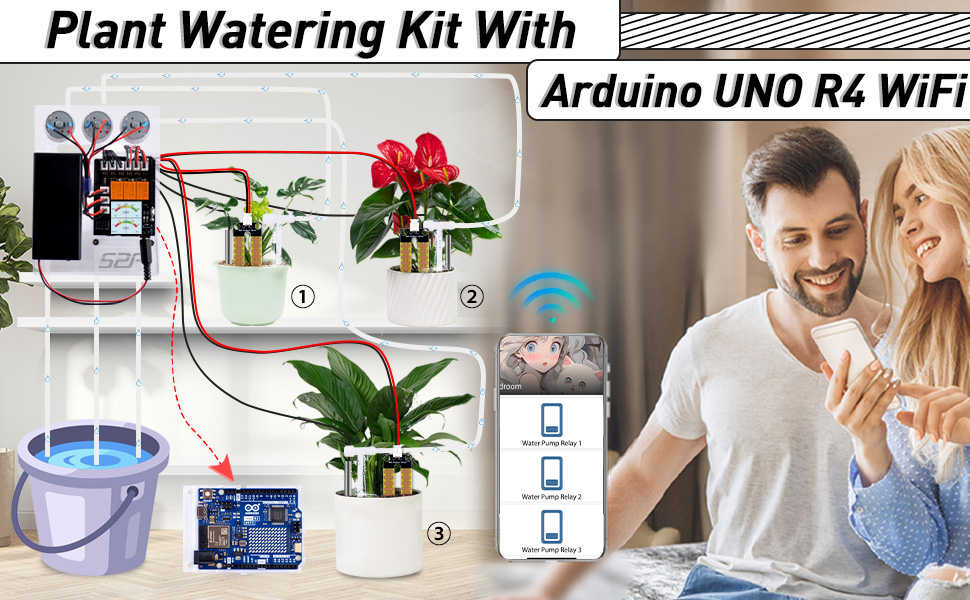
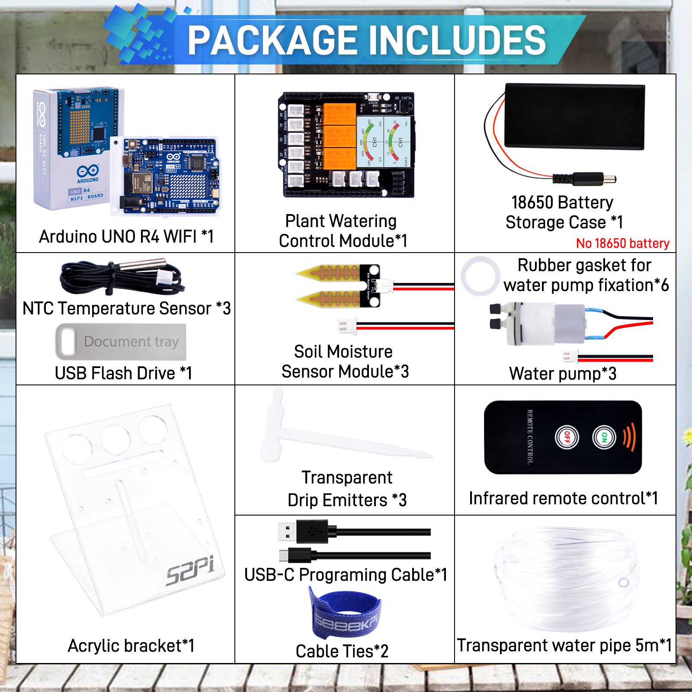
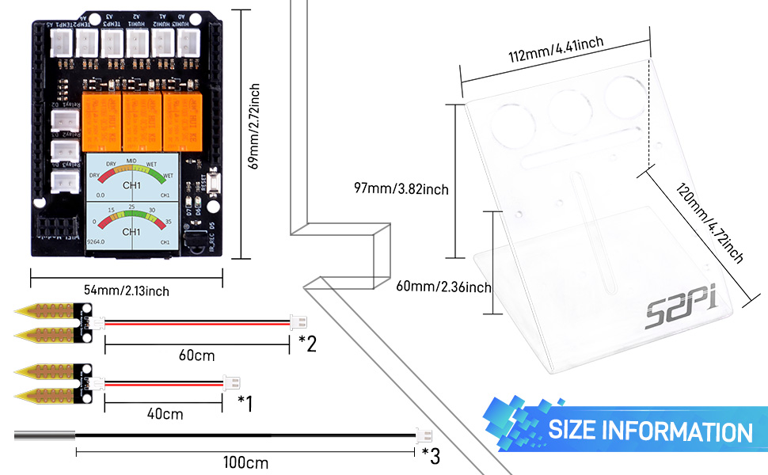

# What components are in the kit?
* Product Name: Plant Watering Kit with Arduino UNO R4 WiFi 
* SKU: KZ-0069

# Plant Watering Kit with Arduino UNO R4 WiFi Manual

##  Introduction

Welcome to the Arduino UNO R4 WiFi Shield Kit! This kit is designed to provide a comprehensive solution for environmental monitoring and control with the integration of soil moisture sensors, NTC temperature sensors, relay modules, and water pumps, all managed through a 1.3-inch IPS RGB TFT screen. This manual will guide you through the setup process, from preparing the Arduino IDE to configuring the hardware and software components.

## Compatibility
|Arduino Product Name|Compatibility|TFT Screen Support |WiFi Support|
|:---:|:---:|:---:|:---:|
|Arduino UNO R4 WiFi |YES | YES| YES | 
|Arduino UNO R4 Minima |YES | YES| Need ESP01S module | 
|Arduino UNO R3 |YES | NO| Need ESP01S module | 
|Arduino Leonardo |YES | YES| Need ESP01S module | 
|Arduino Due|YES | YES| Need ESP01S module | 
|Arduino YUN|YES | YES| YES| 
|Arduino Mega 2560|YES | NO|Need  ESP01S module| 
|Arduino UNO|YES | NO|Need  ESP01S module| 
|Arduino NANO|NO | NO|NO| 
|Arduino MINI Pro|NO | NO|NO| 
|Arduino UNO Mini Limited Edition|YES | NO|YES| 
|Arduino Zero|YES | YES| YES| 
|Arduino UNO WiFi Rev2|YES | YES| YES| 

## Package Includes

## Dimension 

## Tech Support 
* If you have any question on how to assmeble it, please kindly send email to
us by click here: [Tech Support](mailto:tech@52pi.net) 
* or send E-mail to : tech@52pi.net

----
