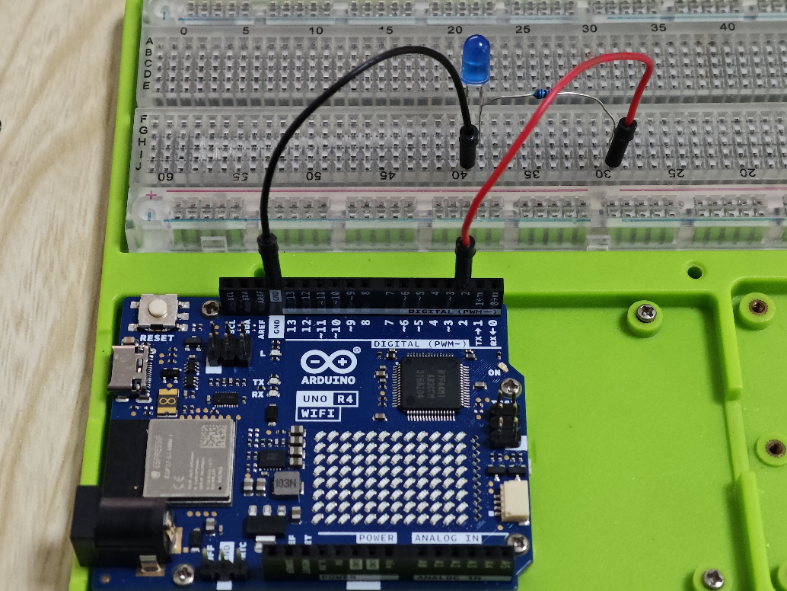
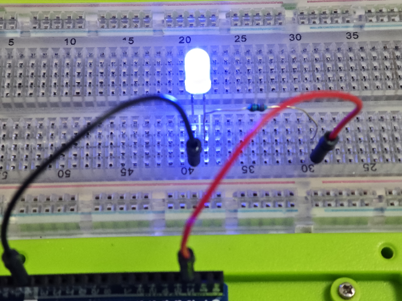
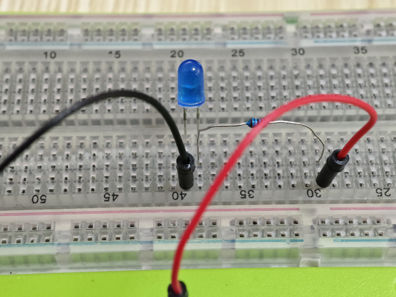

# Blinking LED Project with Arduino

## Project Introduction
This project demonstrates a simple blinking LED experiment using an Arduino board. It's an excellent starting point for beginners to understand basic programming and circuit setup with Arduino.

## Project Principle
The principle behind this project is to use the Arduino's digital output pin to control the state of an LED. By setting the pin HIGH, the LED turns on, and by setting it LOW, the LED turns off. The Arduino repeatedly toggles the pin state, causing the LED to blink.

## Project Setup Method

### Materials Needed
- 1 x Arduino board (e.g., Arduino Uno R4 Wi-Fi)
- 1 x LED
- 1 x 220-ohm resistor
- 1 x Breadboard
- Jumper wires

### Circuit Setup
1. Insert the long leg (anode) of the LED into a breadboard row, and place the 220-ohm resistor next to it.
2. Connect the other end of the resistor to the breadboard row, ensuring they share the same electrical connection.
3. Insert the short leg (cathode) of the LED into another breadboard row.
4. Connect one end of a jumper wire to the cathode's breadboard row.
5. Connect the other end of the jumper wire to one of the Arduino's digital output pins (e.g., pin 13).
6. Connect the anode's breadboard row to the Arduino's ground (GND) through another jumper wire.



## Code

```bash

// Define the pin where the LED is connected
int ledPin = 13;

void setup() {
  // Set the LED pin as an output
  pinMode(ledPin, OUTPUT);
}

void loop() {
  // Turn the LED on
  digitalWrite(ledPin, HIGH);
  // Wait for a delay of 1000 milliseconds (1 second)
  delay(1000);
  // Turn the LED off
  digitalWrite(ledPin, LOW);
  // Wait again for a delay of 1000 milliseconds (1 second)
  delay(1000);
}
```





## Line-by-Line Code Explanation
* Line 1-2: Define the pin number where the LED is connected. Here, pin 13 is used.

* Line 5: The setup() function is used to initialize the Arduino. It runs once when the board starts.

* Line 7-8: Inside setup(), the LED pin is set as an output using pinMode().

* Line 11: The loop() function is the main part of the program that runs repeatedly.

* Line 13: The digitalWrite() function sets the LED pin HIGH, which turns the LED on.

* Line 16: The delay() function pauses the program for 1000 milliseconds (1 second).

* Line 19: The digitalWrite() function sets the LED pin LOW, which turns the LED off.

* Line 22: Another delay() function call to create a pause, allowing the LED to stay off for 1 second before the cycle repeats.

This simple code creates a blinking effect with the LED by alternating between on and off states with a 1-second interval between each change.

