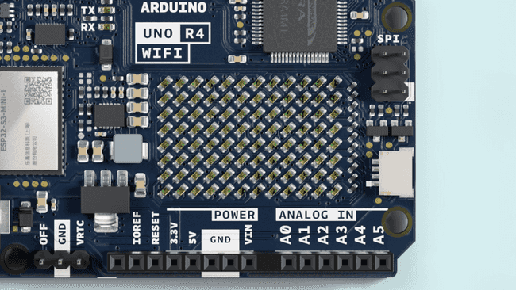
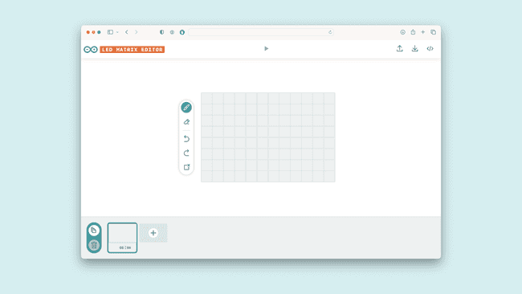

# **Lighting up LED matrix onboard the Arduino UNO R4 WIFI**

## Project Introduction
The Arduino UNO R4 WiFi comes with a built in 12x8 LED Matrix, that is available to be programmed to display graphics, animations, act as an interface, or even play games on.
The matrix and its API are developed to be programmed in a few different ways, each suited for different applications. This guide will walk you through the basic concepts for programming the LED matrix, and get you started with creating your own animations, while highlighting two different ways of handling the LEDs to create animations and images. This makes it easier for you to decide what method fits your needs best!



## Project Principle
The LED matrix on an Arduino UNO R3 with a WiFi module typically works based on the principles of digital electronics and microcontroller programming. 

1. **Matrix Configuration**: An LED matrix is an array of LEDs arranged in rows and columns. Each LED acts as a pixel that can be individually controlled.

2. **Microcontroller Control**: The Arduino UNO R3 acts as the microcontroller that sends signals to control the LEDs. It processes input and outputs digital signals to control the state of each LED (on or off).

3. **Multiplexing**: To control a large matrix with a limited number of pins, the Arduino uses a technique called multiplexing. This involves scanning the rows and columns in a pattern to light up the desired LEDs. The human eye perceives the rapid switching as a static image.

4. **Driving the Matrix**: Each row of the matrix is connected to a digital output pin on the Arduino. The columns are driven by transistors or MOSFETs that can handle the current required by the LEDs. When a row is selected, the corresponding column drivers are activated to light up the LED at the intersection.

5. **Programming**: The Arduino is programmed using the Arduino Integrated Development Environment (IDE). The code defines patterns, animations, or text to be displayed on the matrix. It uses functions to set the state of each LED and refreshes the display at a rate that is fast enough to avoid flickering.

6. **Refresh Rate**: The matrix is refreshed at a high enough frequency that the human eye cannot detect the individual frames, resulting in a smooth animation or image.

7. **WiFi Module Integration**: The WiFi module on the Arduino can be used to receive commands or data over a network. This could be used to update the display on the LED matrix remotely.

8. **Power Supply**: The matrix requires a power supply that can deliver enough current for all the LEDs. This is typically managed by the power supply to the Arduino board and possibly additional current-limiting resistors or drivers.

In summary, the LED matrix on an Arduino UNO R3 with WiFi is controlled by the microcontroller, which uses digital signals to activate individual LEDs in a pattern that creates images or animations. The process involves multiplexing to manage the large number of LEDs with a limited number of pins and programming to define what is displayed.


## Project Setup Method 
* Just Connect `Arduino UNO R4 WIFI` board to PC via `USB-C Programming cable`.  

## Code
* Open a new sketch and paste following code:

```cpp
#include "Arduino_LED_Matrix.h"

ArduinoLEDMatrix matrix;

void setup() {
  Serial.begin(115200);
  matrix.begin();
}

const uint32_t happy[] = {
    0x19819,
    0x80000001,
    0x81f8000
};
const uint32_t heart[] = {
    0x3184a444,
    0x44042081,
    0x100a0040
};

void loop(){
  matrix.loadFrame(happy);
  delay(500);

  matrix.loadFrame(heart);
  delay(500);
}
```


## Line-by-Line Code Explanation
* Initializing Matrix
To use the LED Matrix library, there are a few things that need to be added to your sketch to get off the ground.

First, include the library at the top of your sketch, like this:

```cpp
#include "Arduino_LED_Matrix.h"
```

Then, you'll need to create a LED Matrix object in your sketch, by adding the following line directly underneath the first one:

```cpp
ArduinoLEDMatrix matrix;
```

And then lastly, start the LED Matrix by adding this line in void setup():

```cpp
matrix.begin();
```

The entire thing should look like this;

```cpp
#include "Arduino_LED_Matrix.h"

ArduinoLEDMatrix matrix;

void setup() {
  Serial.begin(115200);
  matrix.begin();
}
```

### How to Write a Frame

The LED Matrix library for the UNO R4 WiFi works on the principle of creating a frame, and then loading it into a buffer which displays the frame.

A frame is what we call the "image" that is displayed at any given moment on the matrix. If an animation is a series of images, a frame is one of those images in the series.

In order to control the 12x8 LED matrix on the UNO R4 WiFi, you need a space in memory that's at least 96 bits in size. The library provides two ways to do this.

The first is simply to make a two-dimensional array of bytes like so:

```cpp
byte frame[8][12] = {
  { 0, 0, 1, 1, 0, 0, 0, 1, 1, 0, 0, 0 },
  { 0, 1, 0, 0, 1, 0, 1, 0, 0, 1, 0, 0 },
  { 0, 1, 0, 0, 0, 1, 0, 0, 0, 1, 0, 0 },
  { 0, 0, 1, 0, 0, 0, 0, 0, 1, 0, 0, 0 },
  { 0, 0, 0, 1, 0, 0, 0, 1, 0, 0, 0, 0 },
  { 0, 0, 0, 0, 1, 0, 1, 0, 0, 0, 0, 0 },
  { 0, 0, 0, 0, 0, 1, 0, 0, 0, 0, 0, 0 },
  { 0, 0, 0, 0, 0, 0, 0, 0, 0, 0, 0, 0 }
};
```

This option is simple to understand, because you can see the image in the pattern of the array, and it is easy to edit in runtime. The ones in the array above form a heart, and that's the image you'd see on the screen.

To target an individual pixel you select its address and change the value, remember that you'll need to start counting at 0. So, the following line will target the third pixel from the left and the second from the top, then turn it on:

```cpp
frame[2][1] = 1;

matrix.renderBitmap(frame, 8, 12);
```

This method takes more memory than is needed, however. 
Even though each LED needs only a single bit to store its state, you're using eight bits (a byte). The more memory-efficient method to store a frame is to use an array of 32-bit integers.

In this section we'll walk through the process and the concept of how you may create one of these frames yourself. Though we have developed a tool that can do this for you, so you can click here if you want to skip this exercise.

Here's the same heart in that form:

```cpp
unsigned long frame[] = {
  0x3184a444,
  0x42081100,
  0xa0040000
};
```

An unsigned long variable holds 32 bits, and 96/32 is 3, so an unsigned long array is an efficient way to hold all the bits you need for the LED matrix.

But how do those hexadecimal values relate to the positions of the pixels? To find out, convert the hexadecimal values to binary values. Here's a code snippet that will do this:

```cpp
for (int b = 0; b < 3; b++) {
    Serial.println(frame[b], BIN);
  }
```

This will print out all the bit values of the array. 
The output will look like this:

```cpp
110001100001001010010001000100
1000010000010000001000100000000
10100000000001000000000000000000
```
This method doesn't show you all the bits, though. Each array element should have 32 bits. If you add zeros to show all 32 bits of each element, you get:

```cpp
00110001100001001010010001000100
01000010000010000001000100000000
10100000000001000000000000000000
```

Now divide it into groups of 12 bits and you've got the heart back:

```cpp
001100011000
010010100100
010001000100
001000001000
000100010000
000010100000
000001000000
000000000000
```

> Hint: You can see the heart easier if you highlight all "1"s on the page by pressing CTRL/command + F and search for "1".

If you've got several different frames, you can load and display them like this:

```cpp
const uint32_t happy[] = {
    0x19819,
    0x80000001,
    0x81f8000
};

const uint32_t heart[] = {
    0x3184a444,
    0x44042081,
    0x100a0040
};

  matrix.loadFrame(happy);
  delay(500);

  matrix.loadFrame(heart);
  delay(500);

```

## Testing It Out

Let's apply these concepts, with two basic sketches that display different frames on your board. First, let's create 3x32-bit integer frames and load them one by one.
This sketch that will first load a smiley face on your matrix, and then change it to a heart.

The sketch is pretty simple, and yet the outcome is very expressive and can help you easily indicate states of your projects.

Now let's change approach and create a bitmap that we change in runtime. This sketch includes several functions that each draw part of a face, and then winks the left eye by turning off certain pixels.

```cpp
#include "Arduino_LED_Matrix.h"

ArduinoLEDMatrix matrix;

void setup() {
  Serial.begin(115200);
  matrix.begin();
}

uint8_t frame[8][12] = {
  { 0, 0, 0, 0, 0, 0, 0, 0, 0, 0, 0, 0 },
  { 0, 0, 0, 0, 0, 0, 0, 0, 0, 0, 0, 0 },
  { 0, 0, 0, 0, 0, 0, 0, 0, 0, 0, 0, 0 },
  { 0, 0, 0, 0, 0, 0, 0, 0, 0, 0, 0, 0 },
  { 0, 0, 0, 0, 0, 0, 0, 0, 0, 0, 0, 0 },
  { 0, 0, 0, 0, 0, 0, 0, 0, 0, 0, 0, 0 },
  { 0, 0, 0, 0, 0, 0, 0, 0, 0, 0, 0, 0 },
  { 0, 0, 0, 0, 0, 0, 0, 0, 0, 0, 0, 0 }
};

void leftEye(){
  //Left eye
  frame[1][3] = 1;
  frame[1][4] = 1;
  frame[2][3] = 1;
  frame[2][4] = 1;
}

void wink(){
  //Wink with the left eye
  frame[1][3] = 0;
  frame[1][4] = 0;
  frame[2][3] = 1;
  frame[2][4] = 1;
}

void rightEye(){
  //Right eye
  frame[1][8] = 1;
  frame[1][9] = 1;
  frame[2][8] = 1;
  frame[2][9] = 1;
}

void mouth(){
  //Mouth
  frame[5][3] = 1;
  frame[5][9] = 1;
  frame[6][3] = 1;
  frame[6][4] = 1;
  frame[6][5] = 1;
  frame[6][6] = 1;
  frame[6][7] = 1;
  frame[6][8] = 1;
  frame[6][9] = 1;
}

void loop(){
leftEye();
rightEye();
mouth();

matrix.renderBitmap(frame, 8, 12);

delay(1000);
wink();

matrix.renderBitmap(frame, 8, 12);
delay(1000);
}
```

## Resources
The rest of this article is a collection of resources, such as functioning examples, a gallery of frames, and tools that can help you get started with the LED Matrix in different ways.

## Scrolling Text Example
The LED Matrix now supports printing characters via the [ArduinoGraphics](https://github.com/arduino-libraries/ArduinoGraphics) library. With it, you are able to:

Set a start location for the text via `matrix.beginText(x,y, 0xFFFFFF)`. The "0xFFFFFF" represents the default color (red). As the ** ArduinoGraphics ** library supports other hardware with multiple colors, we need to specify it.
Print the text via `matrix.printText("This message is printed")`
End the print and (optionally) specify scroll direction with `matrix.endText(direction)`
`SCROLL_LEFT`, `SCROLL_RIGHT` are supported. Leave blank if no scroll is desired.
The example below simply prints out ** "Hello World!" ** on the matrix.

```cpp
// To use ArduinoGraphics APIs, please include BEFORE Arduino_LED_Matrix
#include "ArduinoGraphics.h"
#include "Arduino_LED_Matrix.h"

ArduinoLEDMatrix matrix;

void setup() {
  Serial.begin(115200);
  matrix.begin();

  matrix.beginDraw();
  matrix.stroke(0xFFFFFFFF);
  // add some static text
  // will only show "UNO" (not enough space on the display)
  const char text[] = "UNO r4";
  matrix.textFont(Font_4x6);
  matrix.beginText(0, 1, 0xFFFFFF);
  matrix.println(text);
  matrix.endText();

  matrix.endDraw();

  delay(2000);
}

void loop() {

  // Make it scroll!
  matrix.beginDraw();

  matrix.stroke(0xFFFFFFFF);
  matrix.textScrollSpeed(50);

  // add the text
  const char text[] = "    Hello World!    ";
  matrix.textFont(Font_5x7);
  matrix.beginText(0, 1, 0xFFFFFF);
  matrix.println(text);
  matrix.endText(SCROLL_LEFT);

  matrix.endDraw();
}
```

## Frame Gallery
We've designed a gallery of frames and animations that are included in the library! 
You may load and display them on your UNO R4 WiFi with the following code snippet:

```cpp
#include "Arduino_LED_Matrix.h"   // Include the LED_Matrix library

ArduinoLEDMatrix matrix;          // Create an instance of the ArduinoLEDMatrix class

void setup() {
  Serial.begin(115200);           // Initialize serial communication at a baud rate of 115200
  matrix.begin();                 // Initialize the LED matrix

}

void loop() {
  // Load and display the basic emoji frame on the LED matrix
  matrix.loadFrame(LEDMATRIX_EMOJI_BASIC);
}
```

By changing the parameter in `matrix.loadFrame()` in the loop, you can choose among the available frames we designed.

The available frames are:

* LEDMATRIX_BLUETOOTH
* LEDMATRIX_BOOTLOADER_ON
* LEDMATRIX_CHIP
* LEDMATRIX_CLOUD_WIFI
* LEDMATRIX_DANGER
* LEDMATRIX_EMOJI_BASIC
* LEDMATRIX_EMOJI_HAPPY
* LEDMATRIX_EMOJI_SAD
* LEDMATRIX_HEART_BIG
* LEDMATRIX_HEART_SMALL
* LEDMATRIX_LIKE
* LEDMATRIX_MUSIC_NOTE
* LEDMATRIX_RESISTOR
* LEDMATRIX_UNO

Alternatively, play one of the animations on the LED matrix like this:

```cpp
#include "Arduino_LED_Matrix.h"   //Include the LED_Matrix library

// Create an instance of the ArduinoLEDMatrix class
ArduinoLEDMatrix matrix;

void setup() {
  Serial.begin(115200);
  // you can also load frames at runtime, without stopping the refresh
  matrix.loadSequence(LEDMATRIX_ANIMATION_STARTUP);
  matrix.begin();
  matrix.play(true);
}

void loop() {
}

```

In this case, you change the parameter of `matrix.loadSequence()` in the setup to one of the available ones to display.

The available animations are:

* LEDMATRIX_ANIMATION_STARTUP
* LEDMATRIX_ANIMATION_TETRIS_INTRO
* LEDMATRIX_ANIMATION_ATMEGA
* LEDMATRIX_ANIMATION_LED_BLINK_HORIZONTAL
* LEDMATRIX_ANIMATION_LED_BLINK_VERTICAL
* LEDMATRIX_ANIMATION_ARROWS_COMPASS
* LEDMATRIX_ANIMATION_AUDIO_WAVEFORM
* LEDMATRIX_ANIMATION_BATTERY
* LEDMATRIX_ANIMATION_BOUNCING_BALL
* LEDMATRIX_ANIMATION_BUG
* LEDMATRIX_ANIMATION_CHECK
* LEDMATRIX_ANIMATION_CLOUD
* LEDMATRIX_ANIMATION_DOWNLOAD
* LEDMATRIX_ANIMATION_DVD
* LEDMATRIX_ANIMATION_HEARTBEAT_LINE
* LEDMATRIX_ANIMATION_HEARTBEAT
* LEDMATRIX_ANIMATION_INFINITY_LOOP_LOADER
* LEDMATRIX_ANIMATION_LOAD_CLOCK
* LEDMATRIX_ANIMATION_LOAD
* LEDMATRIX_ANIMATION_LOCK
* LEDMATRIX_ANIMATION_NOTIFICATION
* LEDMATRIX_ANIMATION_OPENSOURCE
* LEDMATRIX_ANIMATION_SPINNING_COIN
* LEDMATRIX_ANIMATION_TETRIS
* LEDMATRIX_ANIMATION_WIFI_SEARCH

## Animation Generation

We have developed a tool that is used to generate frames and animations to be rendered on the LED Matrix in your browser. 
This tool is part of [Arduino labs](https://labs.arduino.cc/), and is therefore considered experimental software.

To use the tool you need to upload the following sketch, allowing the board to read serial inputs send by the browser.

You can also find the sketch in `File` > `Examples` > `LED_Matrix` > `LivePreview`

```cpp
#include "Arduino_LED_Matrix.h"

ArduinoLEDMatrix matrix;

void setup() {
  Serial.begin(115200);
  matrix.begin();
}

uint32_t frame[] = {
  0, 0, 0, 0xFFFF
};

void loop() {
  if(Serial.available() >= 12){
    frame[0] = Serial.read() | Serial.read() << 8 | Serial.read() << 16 | Serial.read() << 24;
    frame[1] = Serial.read() | Serial.read() << 8 | Serial.read() << 16 | Serial.read() << 24;
    frame[2] = Serial.read() | Serial.read() << 8 | Serial.read() << 16 | Serial.read() << 24;
    matrix.loadFrame(frame);
  }
}
```

## LED Matrix Tool
* [LED matrix tool](https://ledmatrix-editor.arduino.cc/)



Once you've made your animations, you can export them from the tool in the format that lets you use them like previously discussed.
You can find more tips on how to use this tool on [its site](https://ledmatrix-editor.arduino.cc/).

## API 

To write more advanced sketches on your own, you may use the full API of the library as found below.

|Members | Descriptions |
|---|---|
|public  ** ArduinoLEDMatrix()	** | The main class for controlling the LED matrix.|
|public void autoscroll(int32_t interval_ms) | Sets the time in ms for each frame to be displayed.|
|public void begin()|	Start the LED matrix.|
|public void next()	|Manually move to the next frame in the sequence.|
|public void loadFrame(const uint32_t buffer[3])|	Load a new single frame that is not in any sequence.|
|public void renderFrame(uint8:t frameNumber)	| Render the loaded frame.|
|public void loadSequence(const uint32_t frames[][4])| 	Loads an animation sequence into the buffer but does not display it.|
|public void play(bool loop = false)	|Start playing the sequence of frames, with the option to loop indefinitely or play once.|
|public bool sequenceDone()	| checks if the sequence has finished playing.|

## Members
* <strong><font color=red>ArduinoLEDMatrix()</font></strong>

Construct a new LED matrix object. This will be used to access the methods in the library.

```cpp
ArduinoLEDMatrix LEDMatrix;
```

* <strong><font color=red>autoscroll()</font></strong>

Enable autoscrolling through the frames in a sequence.

**Parameters** 

`interval_ms` Sets the time in milliseconds that should be spent on a frame before switching to the next frame in the sequence.

* <strong><font color=red>begin()</font></strong>

Starts the LED matrix.

```cpp
LEDMatrix.begin()
```

* <strong><font color=red>next()</font></strong>

Manually moves to the next frame in the sequence.

```cpp
LEDMatrix.next()
```

* <strong><font color=red>loadFrame()</font></strong>

Loads a single frame that is not part of a sequence.

```cpp
LEDMatrix.loadFrame(buffer[i])
```

**Parameters** 

`buffer[3]` an array of three 32bit integers, where each bit represents an LED.

* <strong><font color=red>renderFrame()</font></strong>

Render a specific frame from a sequence.

```cpp
LEDMatrix.renderFrame(frameNumber)
```

**Parameters** 

`int` - frame to load.

* <strong><font color=red>loadSequence()</font></strong>

Loads an animation sequence into the buffer but does not display it.

```cpp
LEDMatrix.frames[][4]
```

**Parameters** 

`frameNumber` Specifies which frame of the sequence should be rendered.

* <strong><font color=red>play()</font></strong>

Starts playing the loaded sequence.

```cpp
LEDMatrix.play(state) //true or false
```

**Parameters** 

`loop` true to enable looping the sequence, false to play once.

* <strong><font color=red>sequenceDone()</font></strong>

Check for if the sequence is finished playing or if the frame should be advanced another step.

**Returns** 
`false` if the sequence is not finished, `true` if it is.


