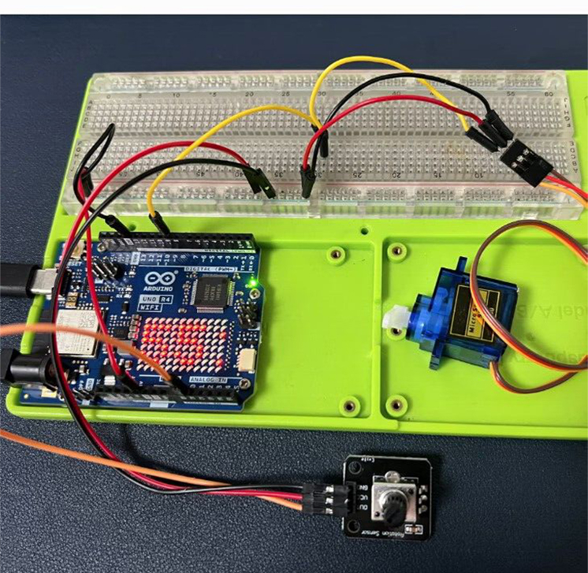

# **Controlling a Servo Motor with Arduino UNO R4 WiFi** 

## Introduction

Servo motors are widely used in robotics for precise control of movement. The Arduino UNO R4 WiFi, with its enhanced capabilities, makes it an ideal platform for controlling servos over the internet. This tutorial will guide you through the process of setting up a servo motor with the Arduino UNO R4 WiFi and controlling it via a simple web interface.

## Materials Needed

* 1 x Arduino UNO R4 WiFi
* 1 x Servo motor
* 1 x Breadboard
* Jumper wires
* A computer with Arduino IDE installed

## Hardware Setup

* Connect the Servo Motor.

* Connect the servo's power and ground wires to the breadboard.

> NOTE: Red color wire is power, Brown color wire is GND, orange color wire is signal. 
>       Connect the signal wire from the servo to one of the digital pins on the Arduino UNO R4 WiFi (e.g., pin 9).

### Wiring Diagram 

| Arduino UNO R4 WiFi | 	Servo |
| --- | --- | 
|5V |	Red wire | 
|GND| 	Brown wire | 
|9	| Orange wire | 

* Photograph of a physical object 


### Power the Arduino

* Connect the Arduino UNO R4 WiFi to your computer via a USB-C cable for power and programming.

### Software Setup
* Install the Servo Library:

* Open the Arduino IDE, go to `Sketch` > `Include Library` > `Manage Libraries`.

* Search for "Servo" and install the library by Michael Margolis.

### Write the Code

* Create a new sketch in the Arduino IDE and name it "ServoControl".


## Example Code

```cpp
#include <Servo.h>  // Include the Servo library
Servo myservo;  // Create a servo object
int pos = 0;    // Variable to store the servo position

void setup() {
  myservo.attach(9);  // Attach the servo to digital pin 9
  Serial.begin(9600); // Start serial communication at 9600bps
}

void loop() {
  // Read the position value from the serial port
  if (Serial.available()) {
    pos = Serial.parseInt();  // Parse the integer value
  }
  // Set the servo angle to the position received
  myservo.write(pos);
  // Wait for the servo to get to the position
  delay(15); 
}
```

## Code Explanation
* Include the Servo Library: This line includes the Servo library, which provides simplified functions to control servos.
* Create a Servo Object: myservo is an object that represents the servo motor.
* Setup Function: Initializes the servo attached to pin 9 and starts serial communication.
* Loop Function: Continuously checks for new position values from the serial port, sets the servo to that position, and waits for the servo to move.

## Controlling the Servo Over WiFi

To control the servo over WiFi, you would need to extend the code to handle HTTP requests. 
However, this requires additional libraries and is beyond the scope of this basic tutorial. 
You can explore the Arduino's built-in WiFi capabilities or use external libraries such as ESP8266 for more advanced control over the internet.

## Conclusion
This guide has provided you with the basic steps and code to control a servo motor using an Arduino UNO R4 WiFi. With the servo motor controlled via serial commands, you can further develop this project to create a web interface for remote control over WiFi.
Remember to always power down your Arduino and disconnect it from the power source when making changes to the wiring to avoid potential damage.


