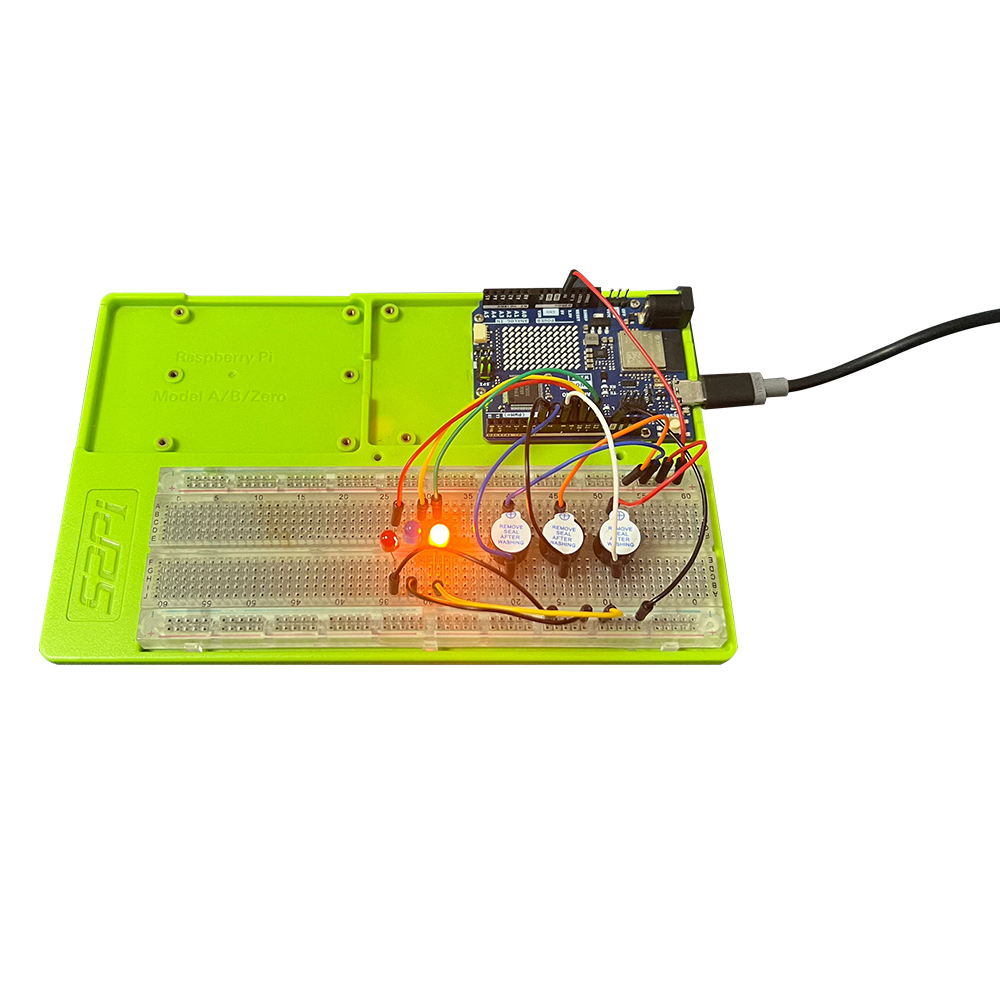

# **Musical LED Show with Arduino UNO R4 Wi-Fi** 

## Project Introduction
This project showcases how to use an Arduino UNO R4 Wi-Fi development board to control three LEDs and three buzzers to play a simple tune. It's an engaging way to learn about digital outputs, timing, and basic sound synthesis with Arduino.

## Project Principle
The core principle is to utilize the Arduino's digital output pins to control the state of the LEDs and buzzers. By toggling the pins HIGH and LOW, you can turn the LEDs on and off and generate sound pulses with the buzzers. By timing these actions, you can create a sequence that plays a tune.

## Project Setup Method

### Materials Needed
- 1 x Arduino UNO R4 Wi-Fi
- 3 x LEDs (Red, Green, Blue)
- 3 x Buzzers
- 3 x 220-ohm resistors for LEDs
- 1 x Breadboard
- Jumper wires

### Circuit Setup

-  Insert the anode (long leg) of each LED into a separate row on the breadboard, and place a 220-ohm resistor next to each LED.
-  Connect the other end of each resistor to the corresponding LED, ensuring they share the same electrical connection.
-  Insert the cathode (short leg) of each LED into another row on the breadboard.
-  Connect one end of a jumper wire to each cathode's breadboard row.
-  Connect the other end of each jumper wire to a digital output pin on the Arduino (e.g., pins 9, 10, and 11 for the LEDs).
-  Connect the anode's breadboard row of each LED to the Arduino's ground (GND) through jumper wires.
-  Connect the other end of each resistor to a separate digital output pin on the Arduino (e.g., pins 6, 7, and 8 for the buzzers).
-  Connect the negative terminal of each buzzer to the Arduino's ground (GND).

### Photograph of physical object



## Code

```cpp
// Define the pins where the LEDs and buzzers are connected
int ledPins[] = {9, 10, 11}; // Red, Green, Blue LEDs
int buzzerPins[] = {6, 7, 8}; // Buzzers

void setup() {
  // Set the LED pins as outputs
  for (int i = 0; i < 3; i++) {
    pinMode(ledPins[i], OUTPUT);
  }
  
  // Set the buzzer pins as outputs
  for (int i = 0; i < 3; i++) {
    pinMode(buzzerPins[i], OUTPUT);
  }
}

void loop() {
  // Play a simple tune
  playTune();
}

void playTune() {
  // Define the tune as an array of pairs (note, duration)
  int notes[] = {262, 294, 330}; // C4, D4, E4
  int durations[] = {400, 400, 400}; // milliseconds
  
  for (int i = 0; i < 3; i++) {
    // Play the note
    int note = notes[i];
    int duration = durations[i] / 1000.0;
    tone(buzzerPins[i], note, duration);
    
    // Set the corresponding LED to high
    digitalWrite(ledPins[i], HIGH);
    
    // Wait for the duration of the note
    delay(duration * 2); // Wait for the note to play and a pause
    
    // Turn off the LED
    digitalWrite(ledPins[i], LOW);
  }
}

```

## Line-by-Line Code Explanation

- **Lines 1-6**: Define the pin numbers for the LEDs and buzzers.
- **Lines 9-14**: The `setup()` function initializes the Arduino, setting the LED and buzzer pins as outputs.
- **Lines 17-21**: The `loop()` function calls `playTune()` to start the musical sequence.
- **Lines 24-35**: The `playTune()` function defines a simple tune and plays it. It uses the `tone()` function to generate sound on the buzzers and `digitalWrite()` to control the LEDs.
- **Lines 28-33**: For each note, the corresponding LED is turned on, the buzzer plays the note, and then the LED is turned off after the note duration.

This project provides a basic framework for playing a tune with LEDs and buzzers. You can expand upon this by adding more notes, creating different tunes, or synchronizing the LEDs and buzzers in more complex ways.

## Demo Video


---

Remember to adjust the pin numbers and the tune according to your specific project requirements.
