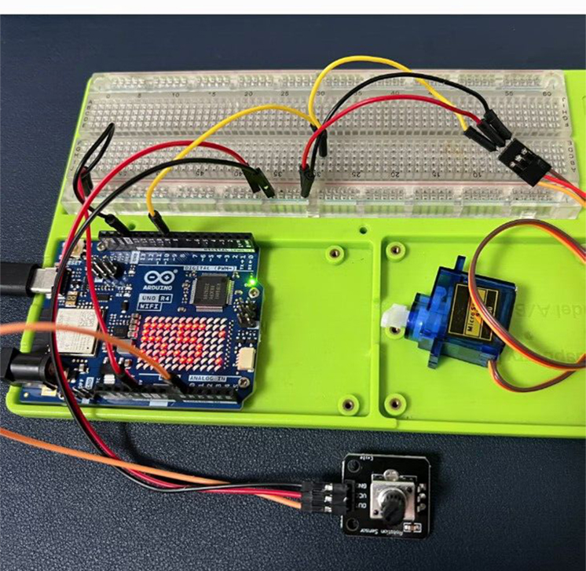

# Controlling a Servo Motor with a Potentiometer using Arduino UNO R4 WiFi

## Introduction

In this tutorial, you'll learn how to control a servo motor using a potentiometer with an Arduino UNO R4 WiFi. The potentiometer will act as an input device to vary the angle of the servo motor, and we'll also explore how to send this data over WiFi for potential remote monitoring or control.

## Materials Needed
*	1 x Arduino UNO R4 WiFi
*	1 x Servo motor
*	1 x Potentiometer (10kΩ is common)
*	1 x Breadboard
*	Jumper wires
*	1 x 220Ω Resistor (for the potentiometer)
*	A computer with Arduino IDE installed

## Hardware Setup
### Connect the Servo Motor
- Connect the servo's signal pin to a digital pin on the Arduino (e.g., pin 9).
- Connect the servo's power and ground pins to the appropriate power and ground on the Arduino.

* Wiring Circuit

|Arduino UNO R4 WiFi | Servo | 
| :---: | :---:| 
| 5V | Red wire | 
| GND | Brown wire| 
| 9 | Orange wire| 

---
 


### Connect the Potentiometer:
- Connect one end of the potentiometer to the 5V pin on the Arduino.
- Connect the other end to the ground pin.
- Connect the middle pin (wiper) to an analog input pin on the Arduino (e.g., A0).
- Place a 220Ω resistor between the 5V and the middle pin to form a voltage divider.

|Arduino UNO R4 WiFi | Potentiometer| 
| :---: | :---:| 
| 5V  | VCC | 
| GND | GND | 
| A0  | OUT | 

### Power the Arduino
- Connect the Arduino to your computer via the USB-C cable for power and programming.

### Software Setup
- Install the Servo Library:
- In the Arduino IDE, go to Sketch > Include Library > Manage Libraries.
- Search for "Servo" and install the library by Michael Margolis.

## Write the Code:
* Create a new sketch in the Arduino IDE.

Example Code

```cpp
#include <Servo.h>  // Include the Servo library

Servo myservo;  // Create a servo object
int potPin = A0;  // Define the potentiometer input pin
int potValue = 0; // Variable to read the value from the potentiometer
int angle = 0;    // Variable to store the angle for the servo

void setup() {
  myservo.attach(9);  // Attach the servo to digital pin 9
  Serial.begin(9600); // Start serial communication at 9600bps
}

void loop() {
  potValue = analogRead(potPin);  // Read the value from the potentiometer (0-1023)
  angle = map(potValue, 0, 1023, 0, 180); // Map the potValue to a servo angle (0-180)
  myservo.write(angle);  // Set the servo to the angle
  delay(15);  // Wait for the servo to reach the position

  // Optional: Send the angle over WiFi for remote monitoring
  // This part of the code requires additional setup and is not included here
}
```

## Code Explanation
* Include the Servo Library: This line includes the Servo library for controlling the servo motor.
* Create a Servo Object: myservo is an object that represents the servo motor.
* Define the Potentiometer Pin: potPin is the analog input pin connected to the potentiometer.
* Setup Function: Initializes the servo attached to pin 9 and starts serial communication.
* Loop Function: Reads the potentiometer's value, maps it to a range suitable for the servo, sets the servo angle, and waits for the servo to move.

## Demo Video


## Optional WiFi Integration
To integrate WiFi capabilities, you would need to include the appropriate WiFi library and configure the Arduino to connect to your network. This would allow you to send the servo's position over the internet for remote monitoring or control. The specifics of this integration depend on the WiFi library you choose and your project requirements.

## Conclusion
This tutorial has provided you with the steps and code needed to control a servo motor using a potentiometer with an Arduino UNO R4 WiFi. With the potentiometer providing a variable input and the servo responding accordingly, you can create interactive projects that can be further enhanced with WiFi capabilities for remote operation.

