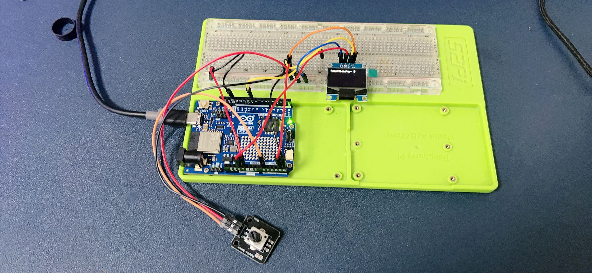
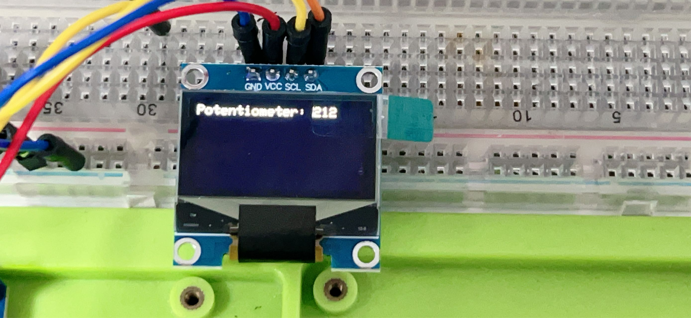

# Potentiometer Reading Display with Arduino Uno R4 WiFi and OLED
This project demonstrates how to read the value from a potentiometer and display it on a 0.96 inch OLED display using an Arduino Uno R4 WiFi board.

## Project Introduction
This project is a great way for beginners to understand analog input, serial communication, and interfacing with an OLED display using an Arduino board.

## Project Principle
The principle behind this project is to use the Arduino's analog input pin to read the value from a potentiometer. The value is then processed and sent to an OLED display to show the current position of the potentiometer.

## Project Setup Method

### Materials Needed
- 1 x Arduino Uno R4 WiFi
- 1 x 0.96 inch OLED display (I2C interface)
- 1 x Potentiometer
- 1 x Breadboard
- Jumper wires

### Circuit Setup
1. Connect the potentiometer's center pin to one of the Arduino's analog input pins (e.g., A0).
2. Connect the potentiometer's side pins to the 5V and GND on the Arduino.
3. Connect the OLED display's VCC to 5V and GND to the ground on the Arduino.
4. Connect the OLED display's SDA and SCL pins to the corresponding SDA and SCL pins on the Arduino (usually A4 and A5 on Uno).
5. Place the potentiometer and OLED display on the breadboard and use jumper wires to make connections.



## Code

```cpp
#include <Wire.h>
#include <Adafruit_GFX.h>
#include <Adafruit_SSD1306.h>

#define OLED_RESET 4
Adafruit_SSD1306 display(OLED_RESET);

void setup() {
  Wire.begin();
  display.begin(SSD1306_SWITCHCAPVCC, 0x3C); // Initialize with the I2C addr 0x3C
  display.clearDisplay();
  display.setTextSize(2);      // Set text size to no scaling
  display.setTextColor(SSD1306_WHITE);
  display.setCursor(0,0);     // Start at top-left corner
}

void loop() {
  int sensorValue = analogRead(A0);  // Read the value from the potentiometer
  display.clearDisplay();           // Clear the display
  display.print("Value: ");
  display.print(sensorValue);      // Print the value
  display.display();                // Display the text
  delay(100);                      // Delay to avoid flickering
}
```

## Line-by-Line Code Explanation

* Include Libraries: Include the necessary libraries for I2C communication and for the OLED display.

* Define Reset Pin: Define the reset pin for the OLED display.

* Initialize Display: Initialize the OLED display with the appropriate I2C address.

* Setup Function: The setup() function initializes the display and sets the text size and color.

* Loop Function: The loop() function reads the potentiometer's value, clears the display, prints the value, and updates the display.

* Read Analog Value: Use analogRead() to get the potentiometer's position.

* Display Update: Clear the display and print the new value each time the loop runs.

* Delay: A short delay to make the display updates visible.

This simple code will continuously read the potentiometer's value and display it on the OLED screen, updating every 100 milliseconds.

## Demo Video

