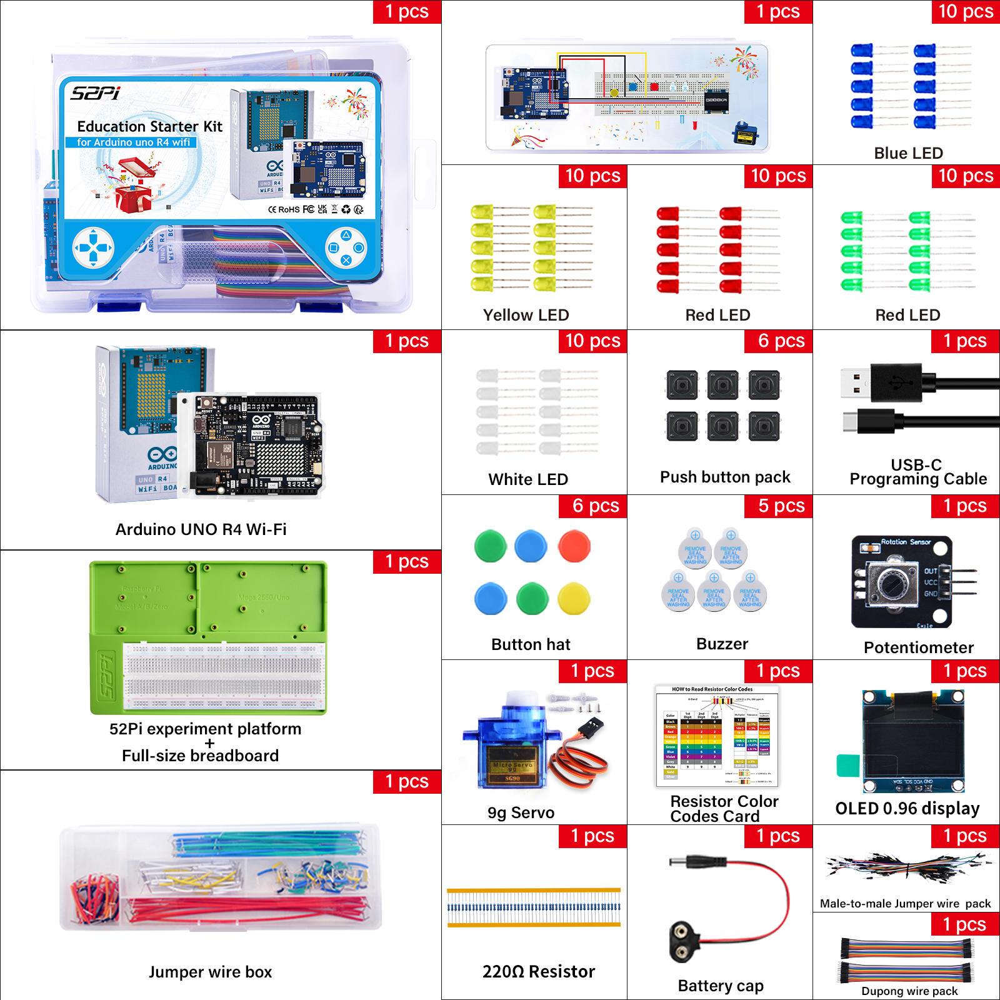
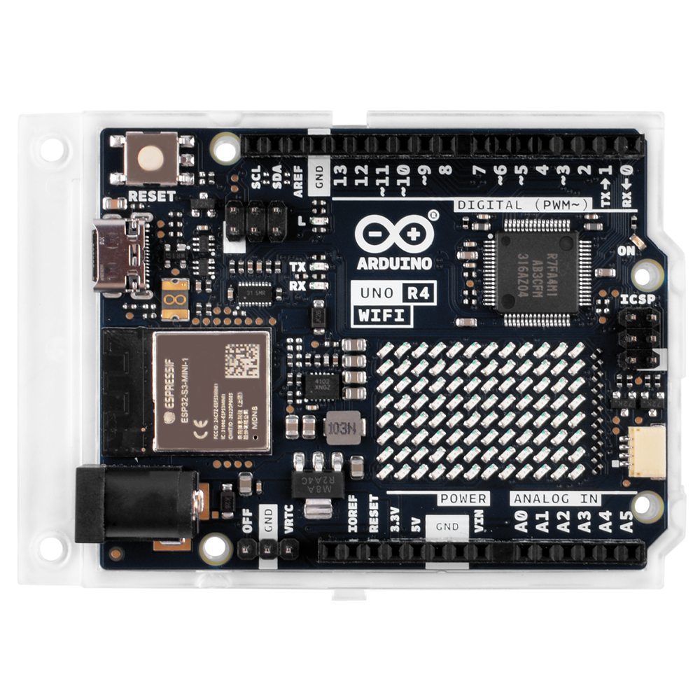

## What's in the Kit?

* **The SKU of the Kit**: `KZ-0073` 

* **Name of the Kit** : `Education Starter Kit for Arduino uno R4 wifi`

## Package Includes

The kit contains an Arduino UNO R4 WiFi board and various electronic components suitable for beginners.

### Arduino UNO R4 WiFi

Features a 32-bit microcontroller RA4M1 and an ESP32 module for Wi-Fi and Bluetooth connectivity, along with a 12x8 LED matrix and other capabilities.

### Components

- **[Arduino UNO R4 WiFi](../../md/components/arduino_uno_r4_wifi.md)**: The Arduino UNO R4 WiFi is powerfull development board.

- **[9g Servo](../../md/components/9g_Servos.md)**: A device for converting electrical signals into precise mechanical motion.

- **[52Pi Experiment Platform](../../md/components/52Pi_Experiment_Trays.md)**: A platform for conducting experiments.

- **[USB-C Programming Cable](../../md/components/USB-C.md)**: For programming the Arduino UNO WiFi.

- **[Jumper Wire Box](../../md/components/Jumper_Wire_Organizers.md)**: Contains pre-cut wires with connectors for temporary electrical connections.

- **[LED Indicator Pack](../../md/components/LED_lights.md)**: Includes LEDs for visual indication in circuits.

- **[Push Button](../../md/components/Button.md)**: Used for manual input in electronic circuits.

- **[Buzzer](../../md/components/Buzzers.md)**: An audio signaling device.

- **[Battery Cap](../../md/components/9V_Battery_Clips.md)**: For powering the Arduino board.

## Next Steps

With the knowledge of the components in this kit, you are ready to explore more interesting projects!
