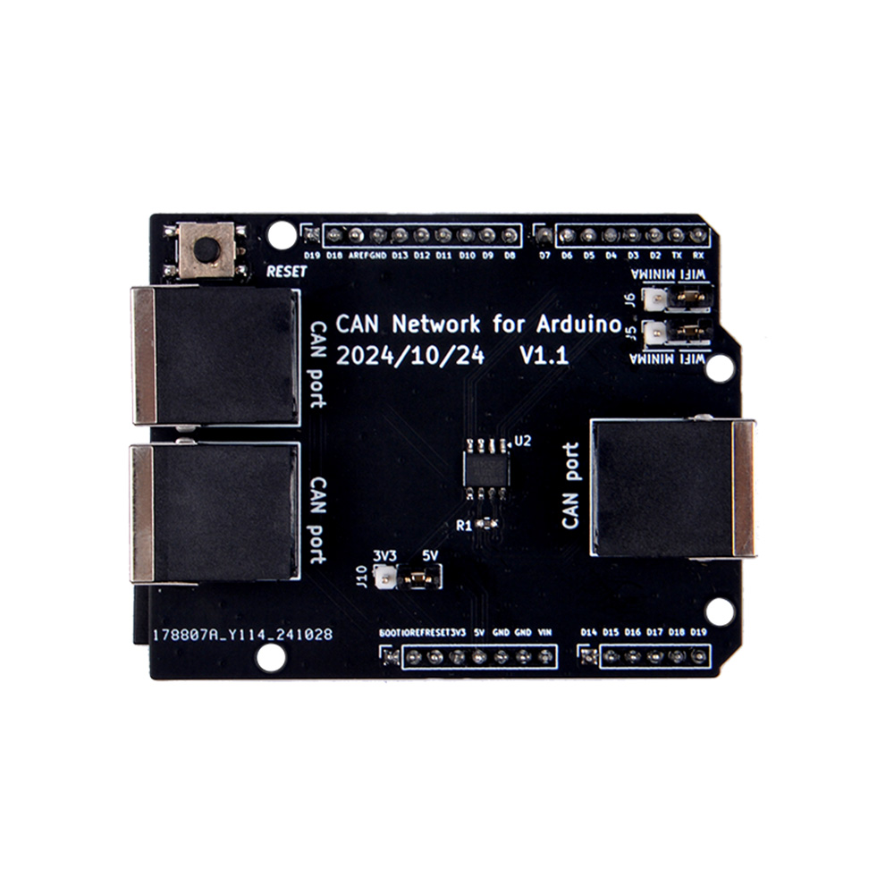

# CAN Node Controller Board for Arduino UNO R4 

* Product SKU: EP-0243
* Product Name:  CAN Node Controller Board for Arduino UNO R4 

## Description

CAN Node Controller Board for Arduino UNO R4 series, it is actually an Arduino UNO R4 Series CAN Node Controller Shield.
This is a shield specifically designed for the Arduino UNO R4 series. 
It can be plugged into the Arduino UNO R4 series motherboard, much like other shields such as Minima and Wi-Fi, using the CAN interface of the Arduino UNO R4 series to communicate with external modules.

## Features

- **Compatibility**: Compatible with Arduino UNO R4 series, including models like Minima and Wi-Fi.
- **Communication Interface**: Utilizes the CAN interface of the Arduino UNO R4 series to communicate with external modules.
- **Ethernet Connection**: Features an Ethernet interface designed for anti-misinsertion, ensuring reliable and error-free connections.
- **Easy Deployment**: Facilitates easy deployment in smart home applications due to its user-friendly design.
- **System Core**: Acts as the central unit of the system, managing data from various sensors.
- **Data Analysis**: Responsible for data analysis and decision-making for subsequent actions based on sensor inputs.
- **Multiple Ports**: Equipped with three Ethernet ports, enabling the connection of multiple sensors or devices.
- **Sensor Integration**: Supports the integration of various sensors, such as temperature sensors, for monitoring environmental conditions in smart homes.
- **Daisy-Chaining Capability**: Allows for the near-unlimited daisy-chaining of sensors on the CAN bus, expanding the system's reach and capabilities.
- **Versatile Sensor Deployment**: Ideal for deploying in various smart home locations, such as kitchens or near water pipes, for temperature monitoring and other environmental sensing needs.

## Applications

- **Smart Home Sensors**: Can be used as a sensor device in smart homes, deployed in kitchens or next to water pipes for temperature monitoring.
- **Arduino UNO R4 Series**: Compatible with the Arduino UNO R4 series for seamless integration and functionality.

This shield is a powerful addition to the Arduino UNO R4 series, enhancing its capabilities in smart home automation and sensor management.

## Gallery

