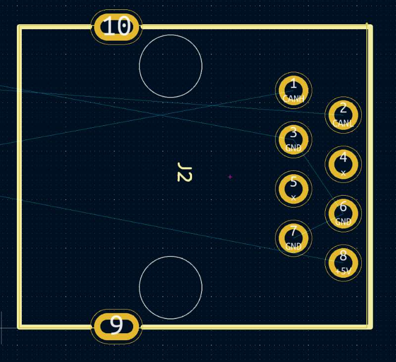
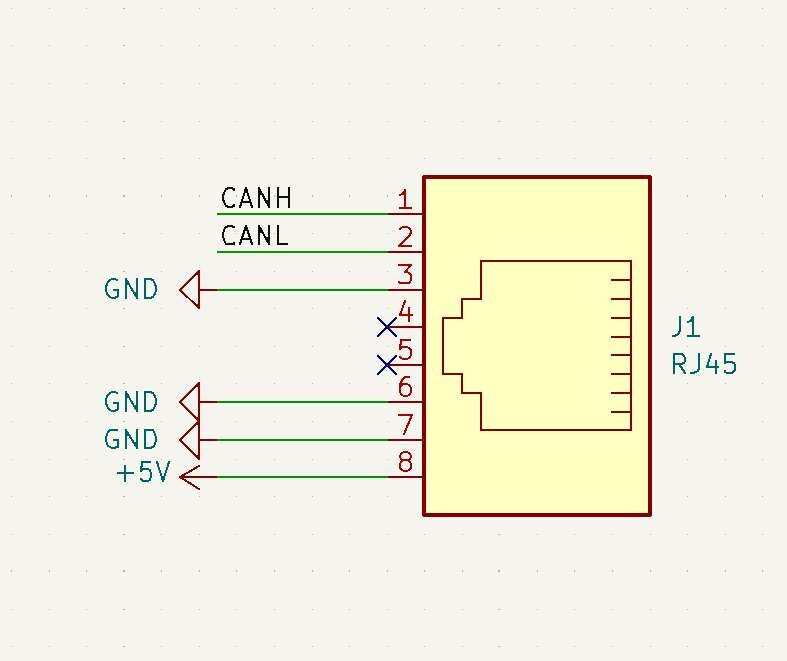
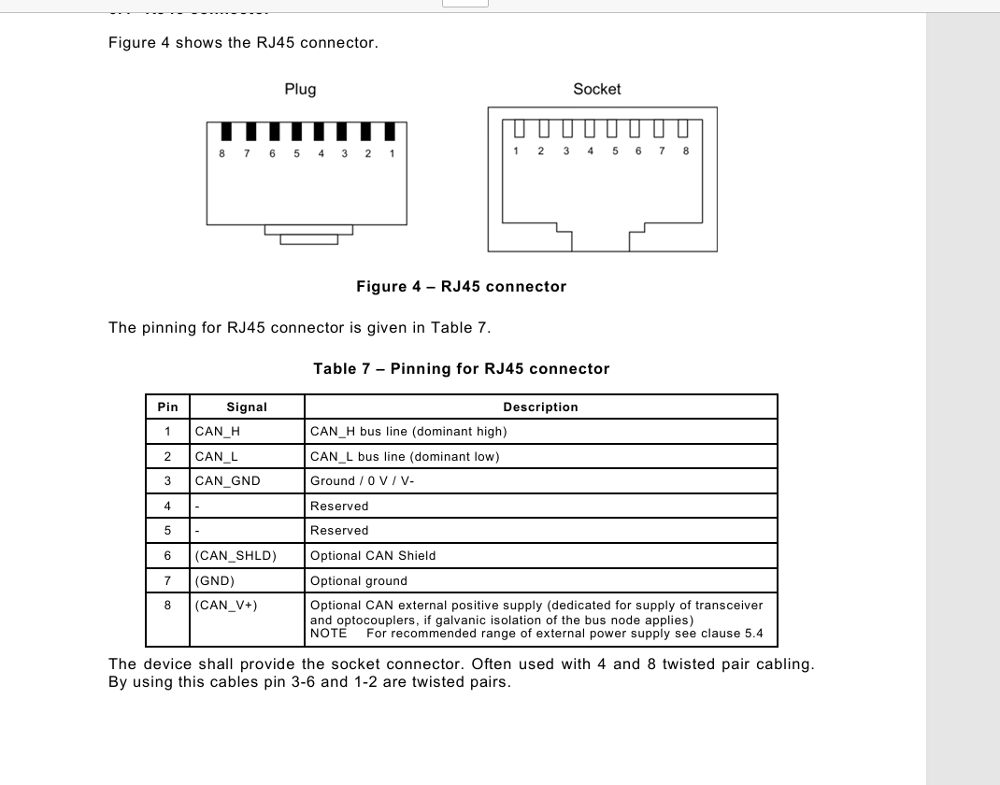

# CAN NODE Temperature Sensor Module 

## About the Product 

* Product SKU: EP-0244
* Product Name: CAN NODE Temperature Sensor Module 

## Description 

The CAN NODE Temperature module is a sophisticated device designed for temperature monitoring and control within networked systems. 

## Features

1. **Ethernet Connectivity**: Equipped with an RJ-45 port, facilitating easy integration into Ethernet-based networks.

2. **Standard Compliant Cabling**: Compatible with both EIA/TIA568A and EIA/TIA568B wiring standards, ensuring broad compatibility with existing network infrastructure.

3. **Wide Operating Voltage Range**: Operates on a DC voltage between 4.95V and 5.5V, providing flexibility in power supply options.

4. **Low Power Consumption**: Consumes a modest 0.2A of current, making it energy-efficient and suitable for battery-operated environments.

5. **Advanced MCU**: Powered by the CH32V203G6U6 chipset from WCH, offering robust processing capabilities for complex tasks.

6. **Reliable CAN Communication**: Utilizes the TJA1051T/3 chipset for reliable CAN bus communication, essential for real-time data exchange in networked systems.

7. **High-Precision Temperature Sensing**: Features the NXP LM75B temperature sensor with a resolution of 0.125℃, allowing for precise temperature measurements.

8. **Broad Temperature Monitoring Range**: Capable of monitoring temperatures from -40℃ to 80℃, suitable for a wide range of environments and applications.

9. **Built-in CAN Termination**: Includes a 120-ohm termination resistor to ensure signal integrity over long bus lengths.

10. **Dynamic Message ID Generation**: The CAN message ID is dynamically generated by the MCU's UUID1, providing a unique identifier for each message (ESIG register R32_ESIG_UNIID1).

11. **Edge Network Compatibility**: Designed with a termination pin that, when shorted, ensures proper signal termination when the module is the last one on the network edge.

## Specifications

- **Ethernet Connection**: RJ-45
- **Ethernet Cable Standard**: EIA/TIA568A-to-EIA/TIA568A or EIA/TIA568B-to-EIA/TIA568B
- **Work Voltage**: DC 4.95~5.5V
- **Work Current**: 0.02A
- **MCU Chipset**: CH32V203G6U6
- **MCU Brand**: WCH
- **CAN Chipset**: TJA1051T/3
- **Temperature Sensor**: NXP LM75B
- **Temperature Resolution**: 0.125℃
- **Temperature Range**: -40~80℃
- **CAN Termination Resistor**: 120 ohm
- **CAN MSG ID**: Generated by MCU's UUID1 as Message ID (ESIG register R32_ESIG_UNIID1)

### Additional Notes

- **Termination Pin Requirement**: The Termination Pin of the CAN NODE Temperature module must be shorted when this CAN NODE is the last module on the edge network.

## RJ-45 Pinout 

* Detials on soldering pads

* Schamatic drawing

* Pinning for RJ45 connector 

