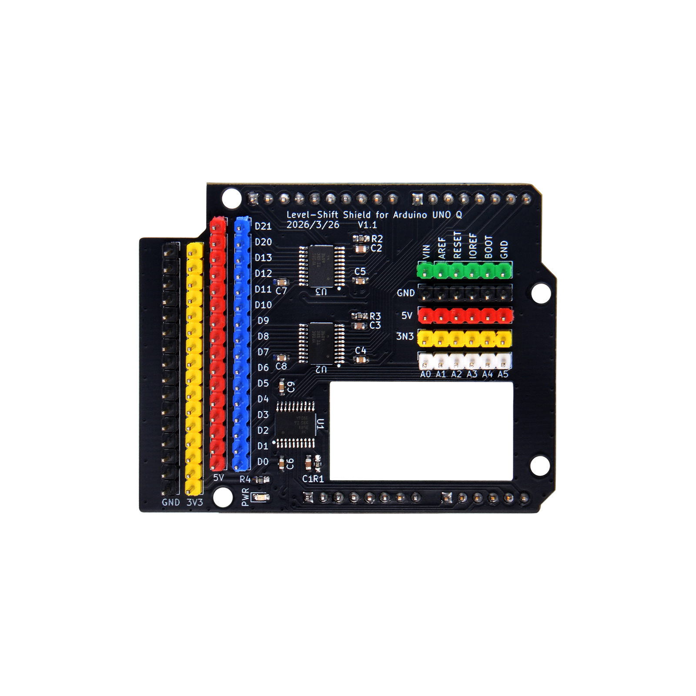
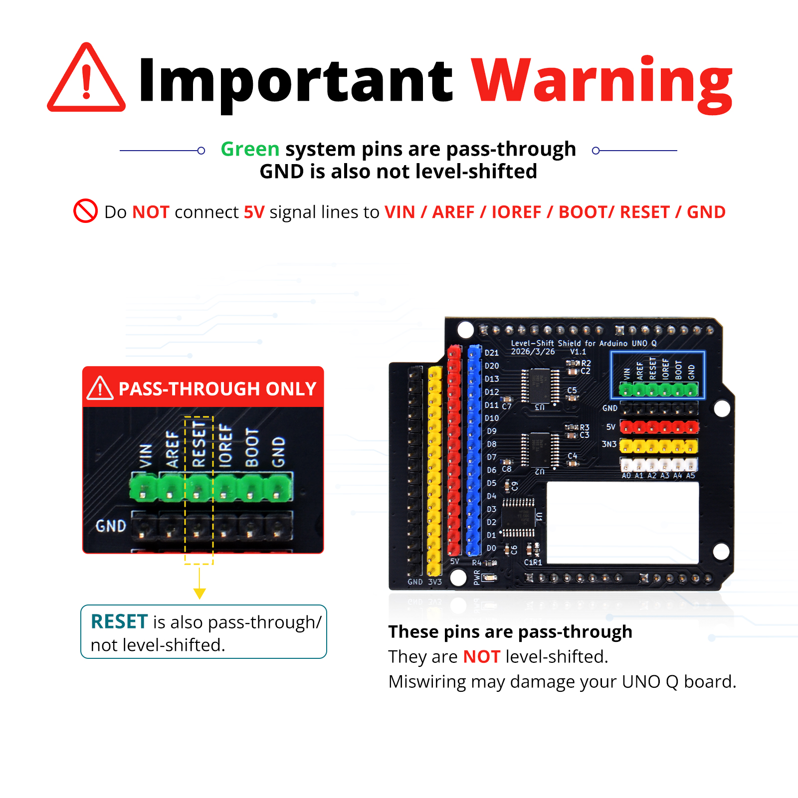
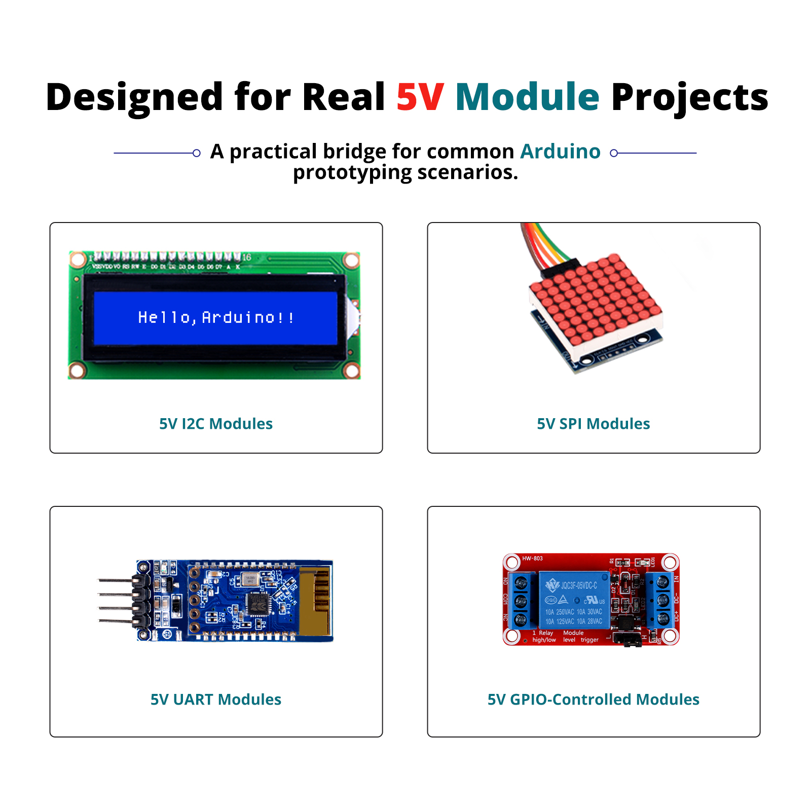
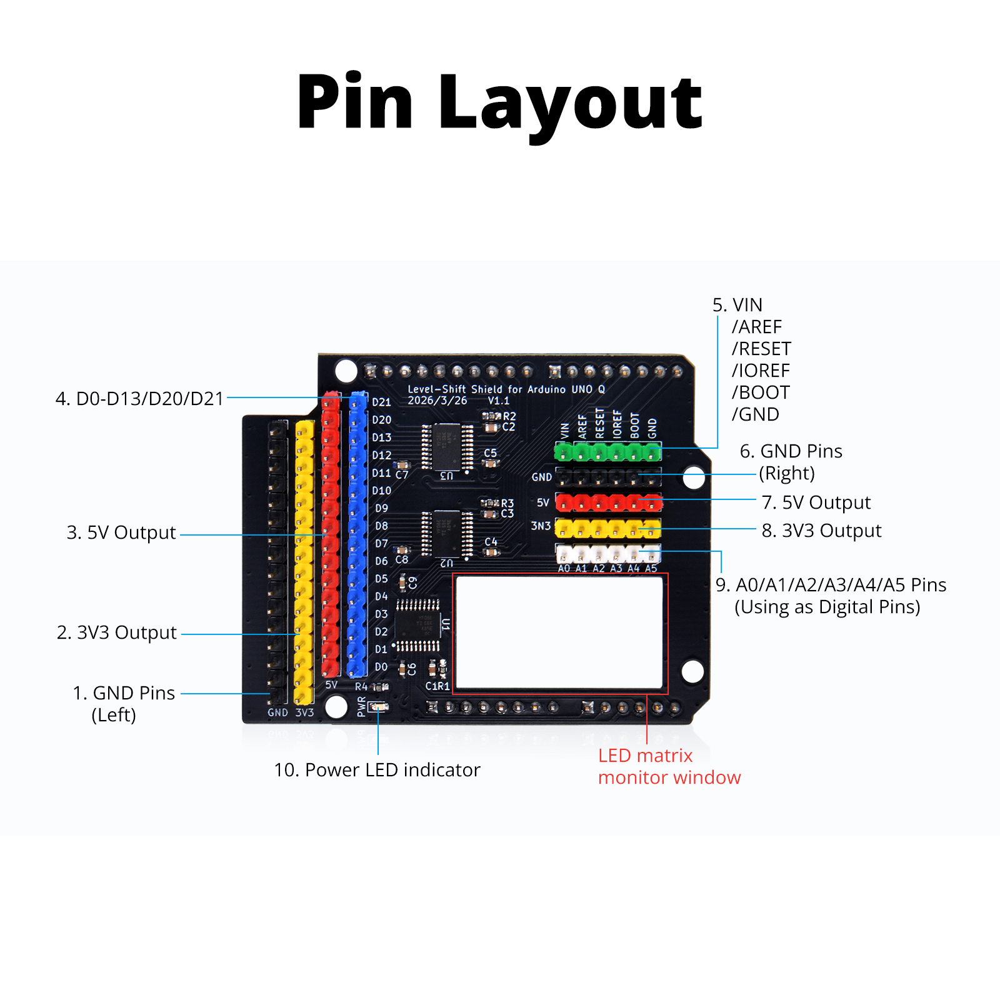
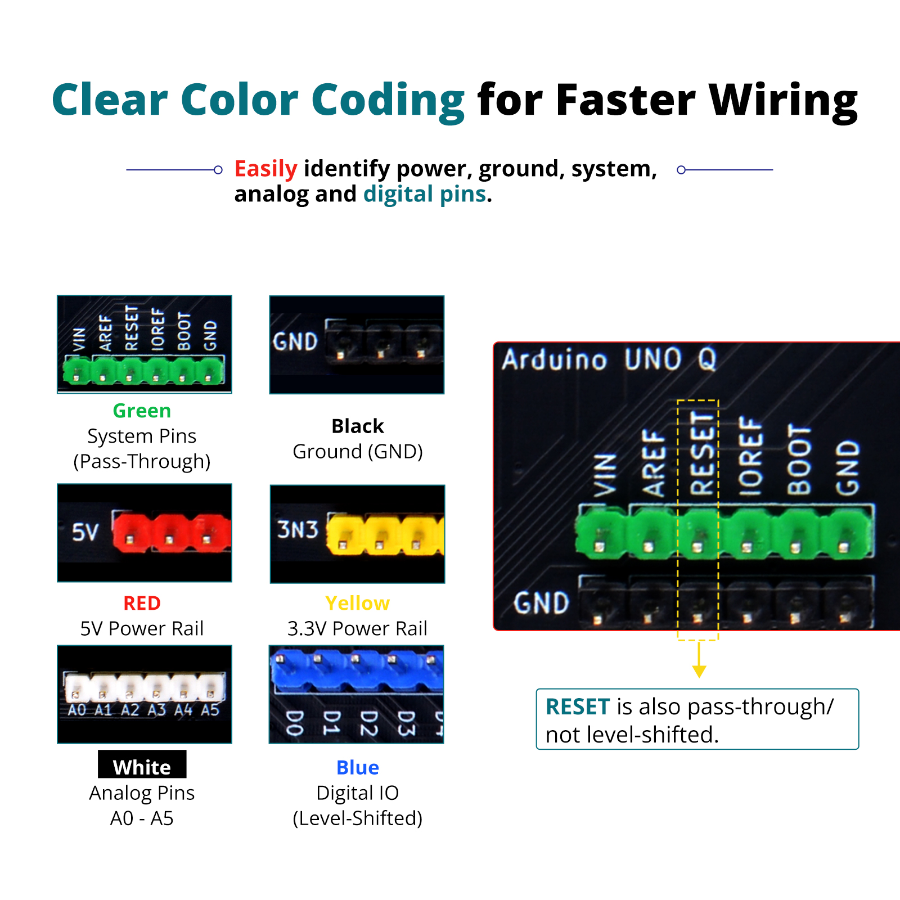
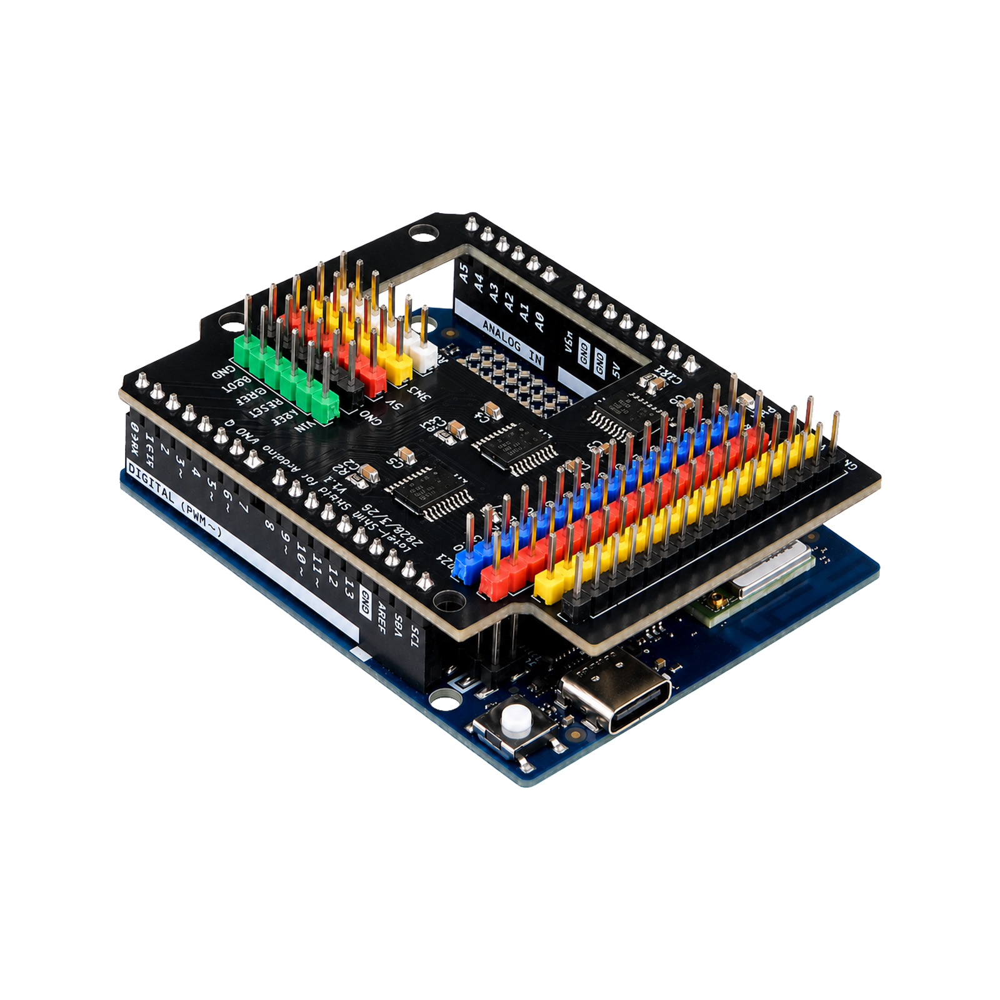
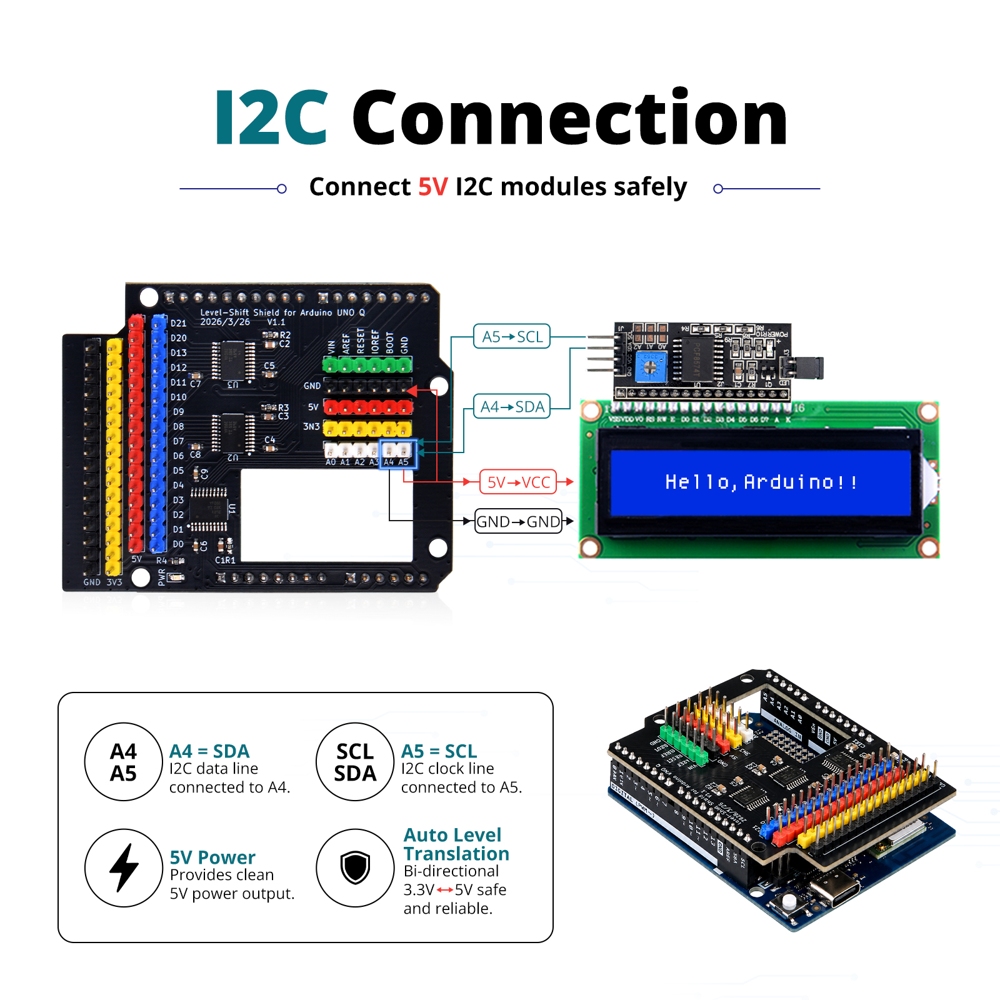
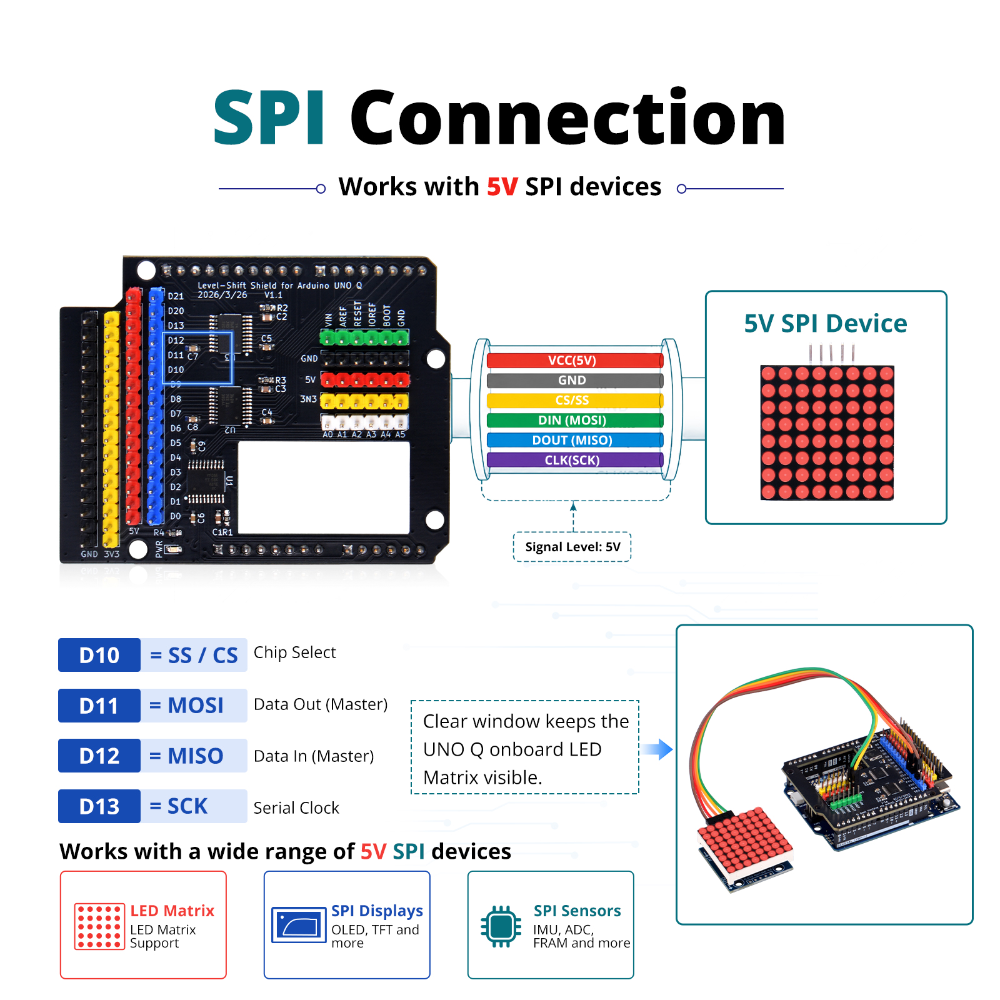
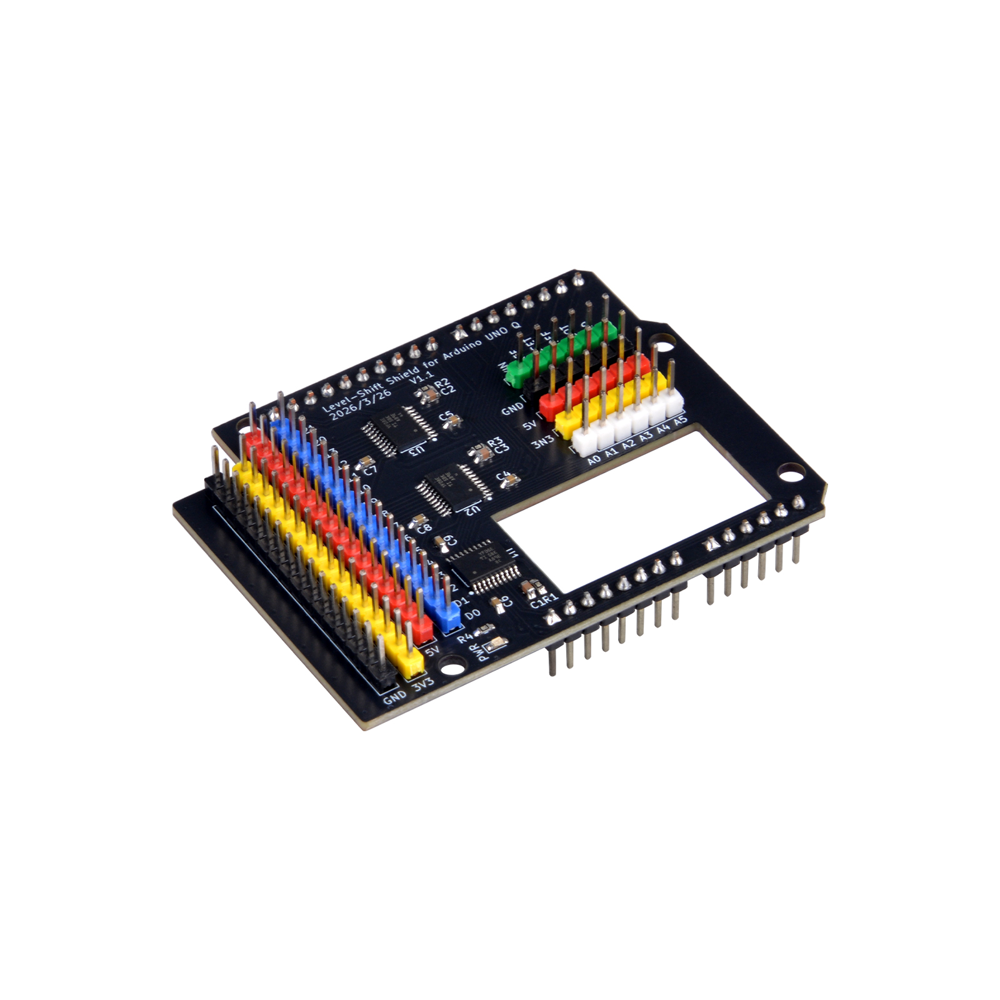
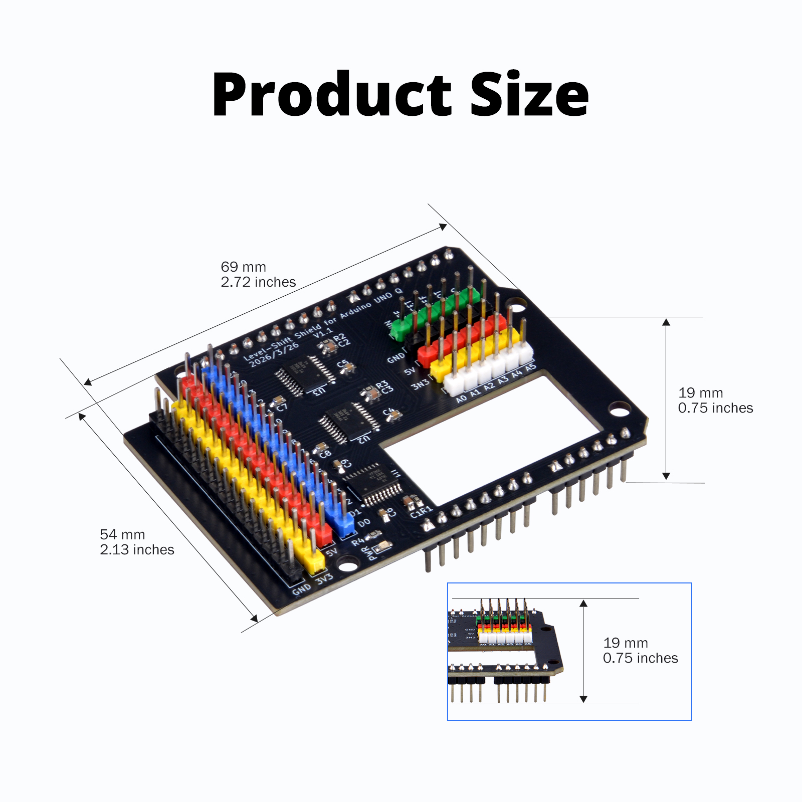

# EP-0257 - 52Pi Wiki

## Level-Shift Shield for Arduino UNO Q

**SKU: EP-0257**



## Description

The Level-Shift Shield for Arduino UNO Q is a bidirectional level translation shield purpose-built for the Arduino UNO Q platform. Featuring a standard Shield plug-and-play form factor, it stacks directly onto the mainboard. The core employs the Texas Instruments (TI) TXS0108EPWR auto-direction sensing bidirectional voltage-level translator.

This shield is intended for bidirectional level translation between the Arduino UNO Q's 3.3V IO and 5V devices/modules, suitable for interfacing with 5V sensors, communication modules (such as I2C, SPI, and UART devices), and other GPIO peripherals, helping reduce risks of communication failures and device damage caused by logic level mismatches under recommended conditions.

**Special Design:** The board features a rectangular central cutout positioned above the Arduino UNO Q onboard LED Matrix, preserving visibility of LED status indicators during Shield operation.

**IMPORTANT NOTE:**
**Do not connect 5V signal lines to VIN, AREF, IOREF, BOOT, or GND — these pins are direct pass-through to the Arduino UNO Q (Green color headers). Incorrect wiring may permanently damage or destroy the Arduino UNO Q. Please exercise extreme caution.**



## Features

- Standard Arduino UNO Q Shield form factor, stacks directly with zero additional wiring
- Rectangular central cutout preserves visibility of Arduino UNO Q mainboard LED Matrix
- 8-bit parallel conversion with fully independent per-channel operation
- Supports Partial Power-Down mode with automatic high-impedance I/O state
- Color-coded headers (red/yellow/blue/black/white) for quick identification and wiring



### Electrical Specifications

| Parameter | Value |
| --- | --- |
| Product Name | Level-Shift Shield for Arduino UNO Q |
| Version | V1.1 (2026/3/26) |
| Core IC | Texas Instruments TXS0108EPWR (TSSOP-20) |
| ESD Protection | IEC 61000-4-2 ESD |
| Operating Temperature | -40 °C to +85 °C |

### Level-Shift Shield Pin Conversion Status Summary

| Pin / Area | Color | Conversion Status | Direction | Description |
| --- | --- | --- | --- | --- |
| D0 (RX) | Blue | ✅ Converted | Bidirectional | 3.3V ↔ 5V auto-direction |
| D1 (TX) | Blue | ✅ Converted | Bidirectional | 3.3V ↔ 5V auto-direction |
| D2–D9 | Blue | ✅ Converted | Bidirectional | 3.3V ↔ 5V digital I/O |
| D10 (SS) | Blue | ✅ Converted | Bidirectional | SPI Chip Select |
| D11 (MOSI) | Blue | ✅ Converted | Bidirectional | SPI Master Out Slave In |
| D12 (MISO) | Blue | ✅ Converted | Bidirectional | SPI Master In Slave Out |
| D13 (SCK) | Blue | ✅ Converted | Bidirectional | SPI Clock |
| D20–D21 | Blue | ✅ Converted | Bidirectional | 3.3V ↔ 5V digital I/O |
| A0 | White | ✅ Converted | Bidirectional | 3.3V ↔ 5V digital I/O |
| A1 | White | ✅ Converted | Bidirectional | 3.3V ↔ 5V digital I/O |
| A2 | White | ✅ Converted | Bidirectional | 3.3V ↔ 5V digital I/O |
| A3 | White | ✅ Converted | Bidirectional | 3.3V ↔ 5V digital I/O |
| A4 (SDA) | White | ✅ Converted | Bidirectional | I2C Data, 3.3V ↔ 5V |
| A5 (SCL) | White | ✅ Converted | Bidirectional | I2C Clock, 3.3V ↔ 5V |
| VIN | Green | ❌ Not Converted (Pass-through) | — | Arduino UNO Q external voltage input pass-through |
| AREF | Green | ❌ Not Converted (Pass-through) | — | Voltage reference pass-through |
| RESET | Green | ❌ Not Converted (Pass-through) | — | System reset pass-through |
| IOREF | Green | ❌ Not Converted (Pass-through) | — | I/O reference voltage pass-through |
| BOOT | Green | ❌ Not Converted (Pass-through) | — | Boot mode select pass-through |
| GND (System Area) | Black | ❌ Not Converted (Pass-through) | — | System ground pass-through |
| 5V (Power Rail) | Red | ❌ Not Converted (Power Output) | — | Arduino UNO Q regulated 5V output for external use |
| 3V3 (Power Rail) | Yellow | ❌ Not Converted (Power Output) | — | Arduino UNO Q regulated 3.3V output for external use |
| GND (Left Side / Power Rail) | Black | ❌ Not Converted (Power Ground) | — | Common ground reference |

### Interface Layout

- Pinout:



Based on the physical board design, the interface layout is organized as follows:

#### Left Side — Digital Level-Shift Area

| Pin Label | Color | Function |
| --- | --- | --- |
| GND | Black | Ground reference |
| 3V3 | Yellow | 3.3V power output |
| 5V | Red | 5V power output |
| D0–D13/D20-D21 | Blue | Digital I/O level-shifted channels (Arduino UNO Q D0–D13/D20-D21 mapped to 3.3V-compatible signals) |

```
NOTE: Three TXS0108EPWR devices provide level translation for all digital pins D0 through D13, D20 and D21, with color-coded headers for quick identification and wiring.
```

---

#### Right Side — System & Analog Area

- **Upper Section (Green/Black Headers)**

| Pin Label | Color | Function |
| --- | --- | --- |
| VIN | Green | Arduino UNO Q external voltage input (pass-through) |
| AREF | Green | Voltage reference (pass-through) |
| RESET | Green | System reset (pass-through) |
| IOREF | Green | I/O reference voltage (pass-through) |
| BOOT | Green | Boot mode select (pass-through) |
| GND | Black | Ground reference (pass-through) |

```
NOTE: System control pins are routed through via pass-through headers, maintaining full compatibility with Arduino UNO Q standard pinout.
```

---

- **Middle Section (Power Rails)**

| Pin Label | Color | Voltage | Current Capability |
| --- | --- | --- | --- |
| 5V | Red | 5.0V | Sourced from Arduino UNO Q regulated 5V rail |
| 3V3 | Yellow | 3.3V | Sourced from Arduino UNO Q onboard 3.3V regulator |

```
Note: Dedicated power rail headers provide easy access for external 5V peripherals and modules.
```

---

- **Lower Section (White Headers)**

**NOTE：Using A0-A5 as Digital Pins**

| Pin Label | Color | Function |
| --- | --- | --- |
| A0 | White | Using A0 as Digital Pin |
| A1 | White | Using A1 as Digital Pin |
| A2 | White | Using A2 as Digital Pin |
| A3 | White | Using A3 as Digital Pin |
| A4(SDA) | White | Using A4 as Digital Pin |
| A5(SCL) | White | Using A5 as Digital Pin |

---

- **Central Cutout**

| Feature | Description |
| --- | --- |
| Rectangular opening | Strategic cutout positioned directly above the Arduino UNO Q onboard LED Matrix |
| Purpose | Preserves full visual access to LED Matrix status indicators during Shield operation |
| Benefit | Eliminates need to remove Shield for visual debugging or status monitoring |

---

### Color Code Reference

| Color | Category |
| --- | --- |
| Black | Ground (GND) |
| Yellow | 3.3V power / low-voltage side reference |
| Red | 5V power / high-voltage side reference |
| Blue | Digital I/O signals |
| Green | System control pass-through |
| White | Analog input signals |




## Installation Guide

### Step 1: Pre-Installation Check

Before installing the Level-Shift Shield, verify the following:

- Ensure the Arduino UNO Q mainboard is powered off and disconnected from USB or external power.
- Confirm all pins on the Shield are straight and properly aligned—no bent pins.
- Check that the central cutout orientation matches the LED Matrix position on the Arduino UNO Q.

### Step 2: Physical Installation

- Align the Shield's female headers with the male pin headers on the Arduino UNO Q.
- The USB connector side of the Shield faces the same direction as the Arduino UNO Q USB port.
- Gently press the Shield down evenly until all pins are fully seated and the boards are parallel.
- The central cutout should sit directly above the LED Matrix with no obstruction.



---

### I2C Bus Connection

The Arduino UNO Q uses A4 (SDA) and A5 (SCL) on the Shield:

| Signal | Shield Pin | Connect To |
| --- | --- | --- |
| SDA | A4 (white) | SDA of 5V I2C sensor/module |
| SCL | A5 (white) | SCL of 5V I2C sensor/module |
| GND | GND (black) | GND of sensor/module |
| 5V | 5V(red) | VCC of sensor/module |



**Example: Connect a LCD1602 Display Module:**

- LCD1602 VCC → Shield 5V (Red)
- LCD1602 GND → Shield GND (black)
- LCD1602 SDA → Shield A4 (white)
- LCD1602 SCL → Shield A5 (white)

Use the standard Arduino Wire.h library. The Shield handles all level translation automatically.

---

### SPI Bus Connection

SPI pins D10–D13:

| Signal | Shield Pin | Connect To |
| --- | --- | --- |
| SS | D10 (blue) | CS of 5V SPI device |
| MOSI | D11 (blue) | DIN/SDI of 5V SPI device |
| MISO | D12 (blue) | DOUT/SDO of 5V SPI device |
| SCK | D13 (blue) | CLK of 5V SPI device |



**Example: Connect a Max7219 LED matrix module:**

- LED Matrix VCC → Shield 5V (red)
- LED Matrix GND → Shield GND (black)
- LED Matrix CS → Shield D10 (blue)
- LED Matrix DI → Shield D11 (blue)
- LED Matrix DO → Shield D12 (blue)
- LED Matrix CLK → Shield D13 (blue)

Use the standard Arduino SPI.h library to communicate with SPI peripherals.

---

### UART Serial Connection

Digital pins D0 (RX) and D1 (TX):

| Signal | Shield Pin | Connect To |
| --- | --- | --- |
| RX | D0 (blue) | TX of 5V UART module |
| TX | D1 (blue) | RX of 5V UART module |

**Example:** If you want to connect to the shield via the serial port of an Arduino UNO board, you can simply follow the connection method shown in the figure above without worrying about the voltage level:

- Arduino UNO VCC → Shield 5 (red)
- Arduino UNO GND → Shield GND (black)
- Arduino UNO TX → Shield D0 (blue)
- Arduino UNO RX → Shield D1 (blue)

Use `Serial.begin(115200)` or higher baud rates. The Shield automatically translates both directions.

---

### Power Output Usage

The power rail headers supply regulated voltage for external peripherals:

| Rail | Color | Voltage | Typical Use |
| --- | --- | --- | --- |
| 5V | Red | 5.0V | 5V sensors, relay modules, servos |
| 3V3 | Yellow | 3.3V | 3.3V sensors, wireless modules, displays |
| GND | Black | 0V | Common ground reference |

```
NOTE: Current Budget: Do not exceed the Arduino UNO Q onboard regulator current limits (typically 150 mA for 3.3V rail, 500 mA total via USB). For high-current loads, use external power with common ground.
```

---

### LED Matrix Monitoring

With the Shield installed:

- The central cutout provides unobstructed view of the Arduino UNO Q LED Matrix.
- Use the LED Matrix for runtime status indication, error codes, or animation feedback.
- No disassembly required for visual debugging.

---

## Disassembly

1. Power off and disconnect all cables from the Arduino UNO Q.
2. Grasp the edges of the Level-Shift Shield firmly.
3. Pull straight up evenly to avoid bending pins.
4. Store in anti-static packaging if not in immediate use.

## Gallery

- **Product Outlook**



- **Product dimension information**



## Package Includes
* 1 x Level-Shift Shield for Arduino UNO Q Pack

## More information 
* Please visit:  [https://52pi.com](https://52pi.com)
