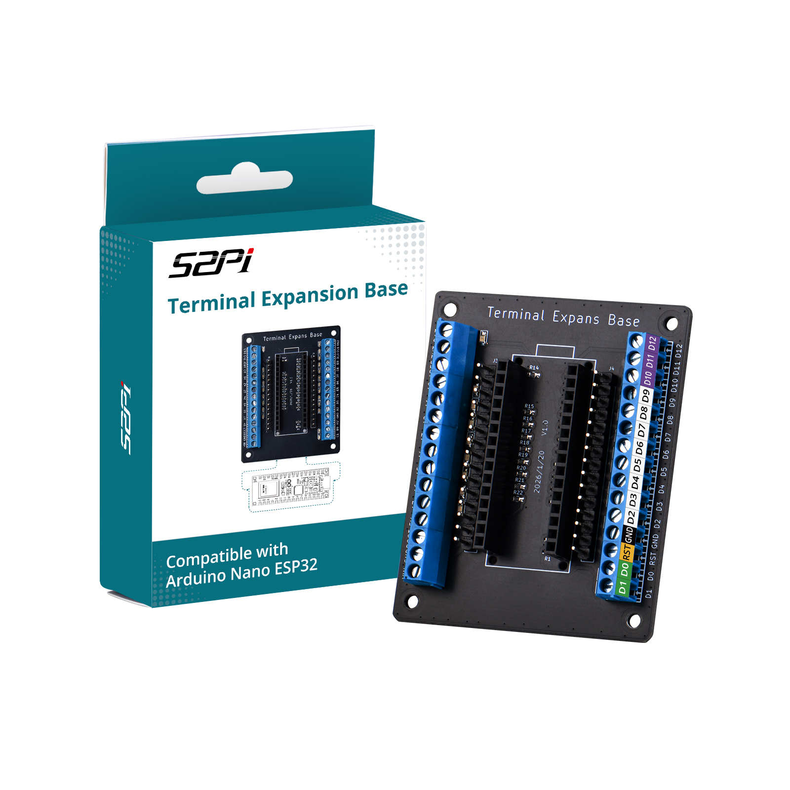
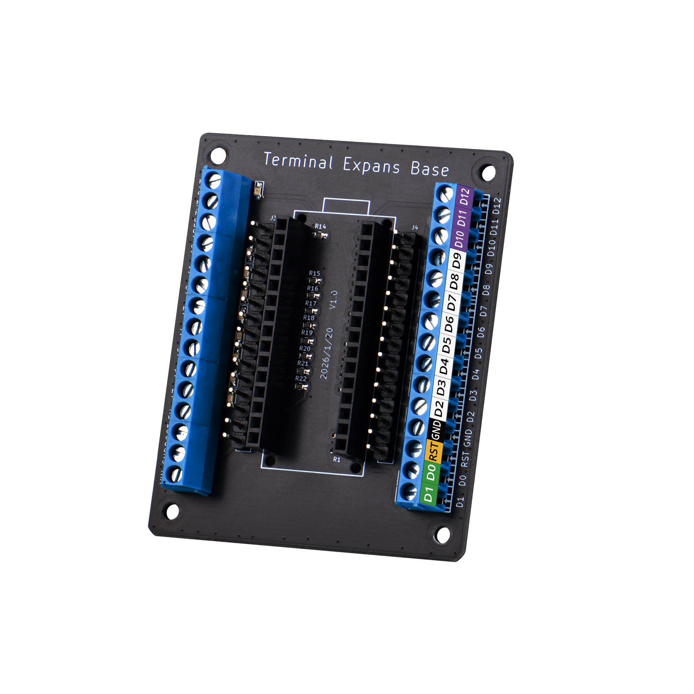
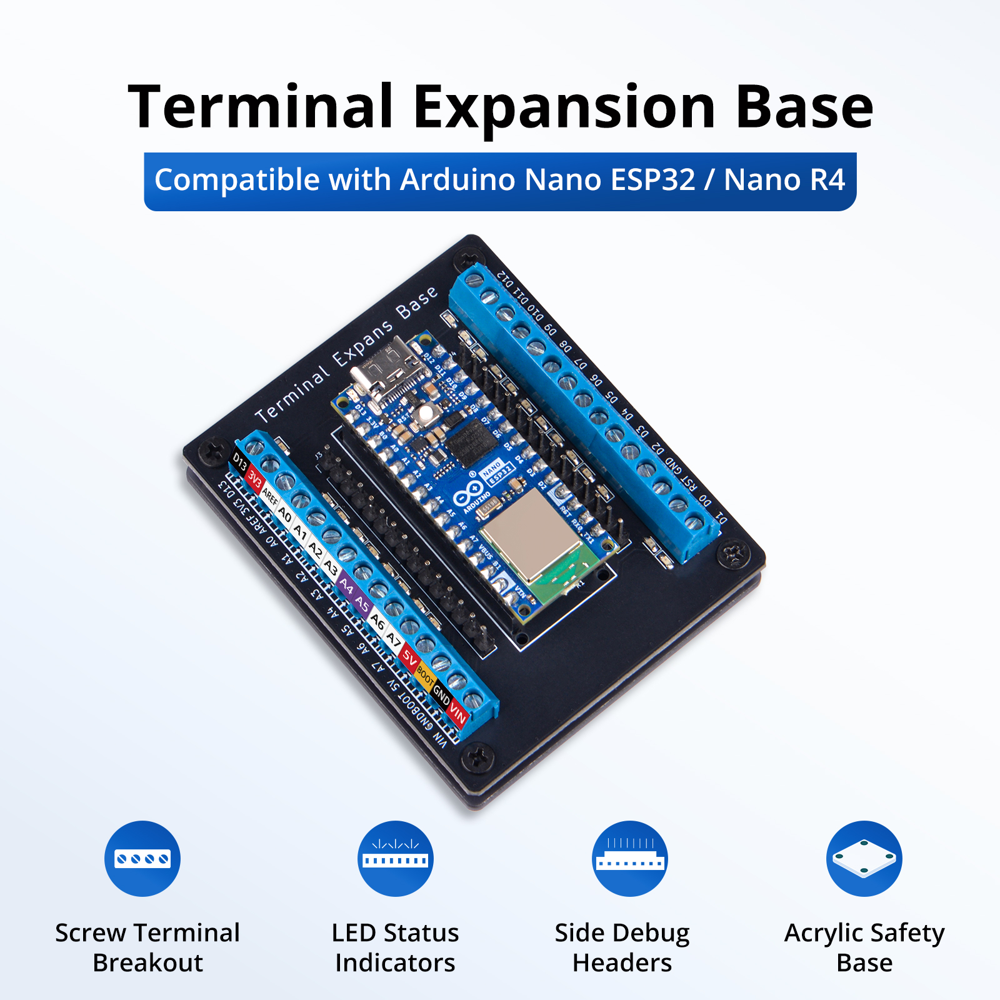
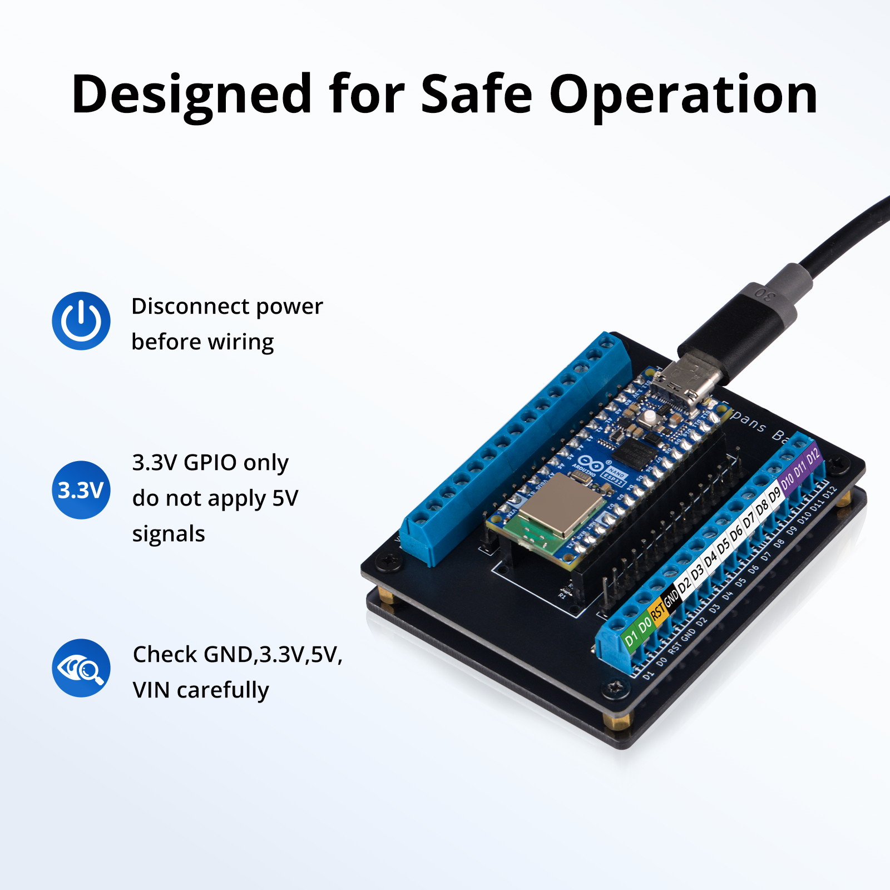
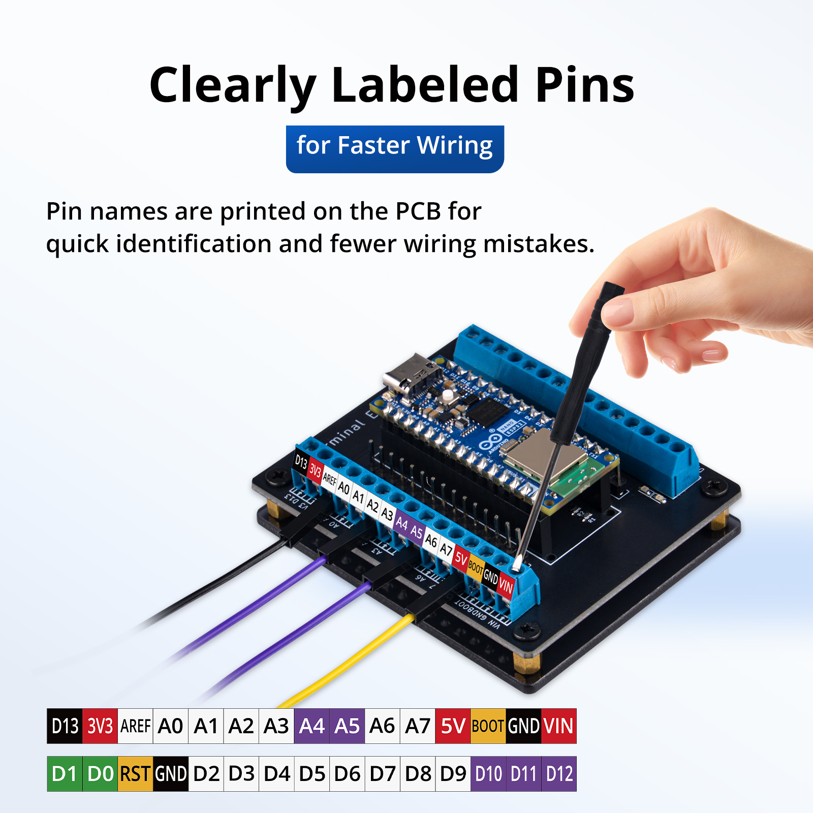
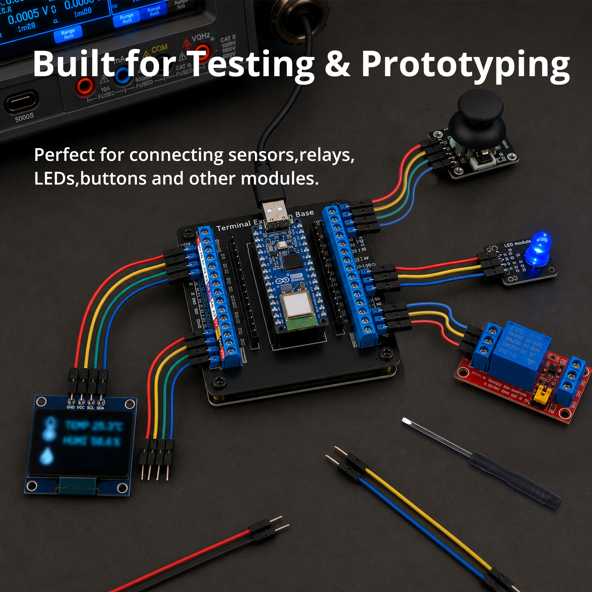
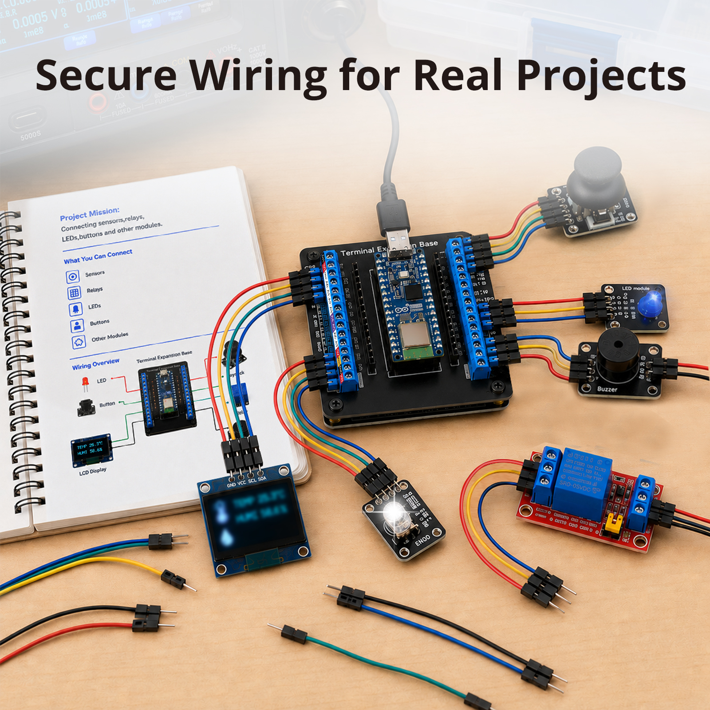
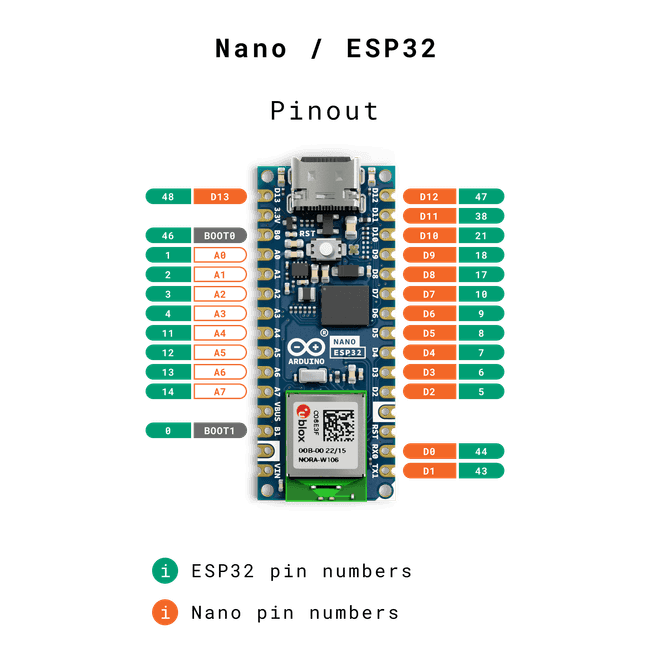

# EP-0262 - 52Pi Wiki

## Terminal Expansion Base for Arduino NANO ESP32

**SKU:** EP-0262

## Description

The Terminal Expansion Base is a professional breakout board designed specifically for the Arduino Nano ESP32. It routes all MCU pins through female headers to robust screw terminals, providing a secure and solderless wiring solution. Each channel features a dedicated LED indicator for real-time logic level visualization. Additional debug pin headers are accessible from the side of the main socket for convenient probing and development. The board is mounted on an acrylic base to prevent accidental short circuits against conductive surfaces.

## Key Features

- **Screw Terminal Access** — All Nano ESP32 pins broken out to labeled, pluggable screw terminals; eliminates the need for soldering and ensures reliable connections.
- **Real-Time LED Indicators** — Individual LEDs on the PCB correspond to each pin, allowing instant visual feedback of logic state changes.
- **Side Debug Headers** — Extra pin headers adjacent to the main socket provide easy oscilloscope or multimeter access during prototyping.
- **Acrylic Insulating Base** — Integrated acrylic standoff prevents bottom-side PCB contacts from shorting on metal workbenches.
- **Clear Silkscreen Labeling** — Pin names and functions are clearly marked on the PCB to accelerate wiring and reduce connection errors.
- **Durable Construction** — High-quality PCB with secure mounting hardware suitable for repeated use in lab and field environments.

## Gallery

- **Product Outlook**

- **Compatibility**

- **Features**

- **Product scenario**

**Scenario 1:**

**Scenario 2:**

**Scenario 3:**

## Target Audience

- Electronics hobbyists and makers transitioning from breadboard prototypes to semi-permanent installations
- Educators and students requiring visible, hands-on demonstrations of digital I/O behavior
- Industrial prototyping engineers needing quick, reconfigurable wiring without soldering
- IoT developers deploying ESP32-based sensor or actuator nodes

## Installation

1. **Mount the Base** — Secure the acrylic base to the work surface if desired; ensure the bottom of the PCB is clear of conductive debris.
2. **Install the Nano ESP32** — Gently insert the Arduino Nano ESP32 into the central female headers, aligning pin 1 as indicated by the board silkscreen.
3. **Connect Wiring** — Loosen the screw terminals, insert stripped wire ends (recommended 22–26 AWG), and tighten securely.
4. **Apply Power** — Power the Nano ESP32 via USB-C or the VIN terminal; verify that the onboard and terminal LEDs respond correctly to your sketch.

## Pinout Reference

## Precautions

- **Power Down Before Wiring** — Always disconnect power when attaching or removing wires to prevent short circuits or damage to the ESP32.
- **Observe Voltage Limits** — Do not exceed the rated voltage of the Nano ESP32 GPIO pins (3.3 V logic); applying 5 V directly to inputs may damage the MCU.
- **Polarity Awareness** — Pay close attention to GND, 3.3 V, and 5 V labels on the silkscreen; reverse polarity can destroy connected devices.
- **Terminal Torque** — Tighten screws firmly but do not overtighten, as excessive force may deform the terminal blocks or sever fine wires.
- **ESD Protection** — Handle the board in an electrostatic-safe environment when the Nano ESP32 is installed.

## Package Includes

- 1 x Terminal Expansion Base for Arduino NANO ESP32 Pack
