# EP-0263 - 52Pi Wiki

## RGB LED Matrix Shield for Arduino NANO R4/ESP32

**SKU:** EP-0263

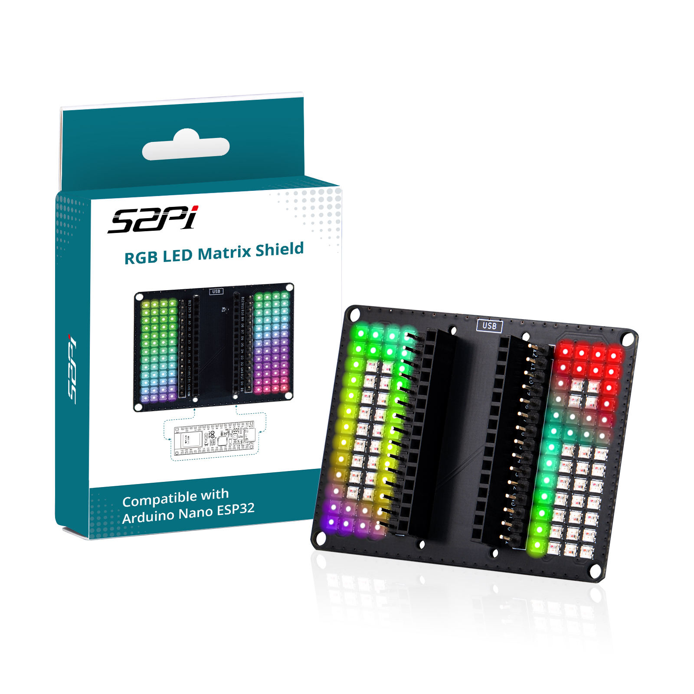

## Description

The RGB LED Matrix Shield for Arduino NANO R4/ESP32 is a custom-designed expansion board tailored specifically for the Arduino Nano ESP32 or Arduino NANO R4 development platform. It integrates a high-density matrix of RGB LEDs, enabling developers, makers, and hobbyists to create stunning visual effects, dynamic light animations, and interactive displays with minimal wiring.

This shield adopts the compact Nano form factor, allowing it to mate seamlessly with the Arduino Nano ESP32 via standard pin headers.

Each LED on the matrix is individually addressable through a single digital control line, supporting 24-bit full-color rendering (8 bits per channel for Red, Green, and Blue) and cascading data transmission. By leveraging the powerful ESP32-S3 dual-core microcontroller (up to 240 MHz) embedded in the Arduino Nano ESP32, users can implement complex lighting algorithms, IoT-connected visual feedback systems, and real-time responsive light installations.

## Compatibility

- **Arduino NANO ESP32：** Supports Web UI/RMT demo
- **Arduino NANO R4:** Supports basic Neopixel demo only

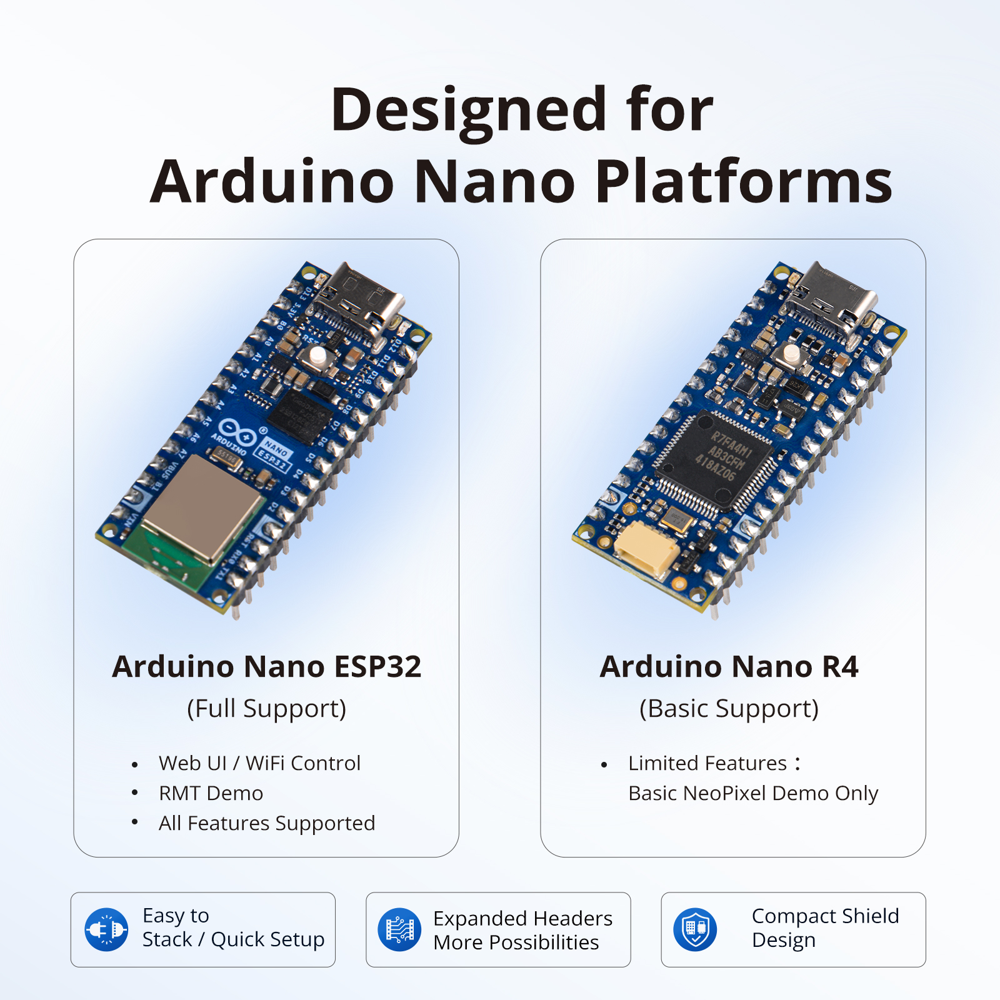

## Gallery

- **Product Outlook**

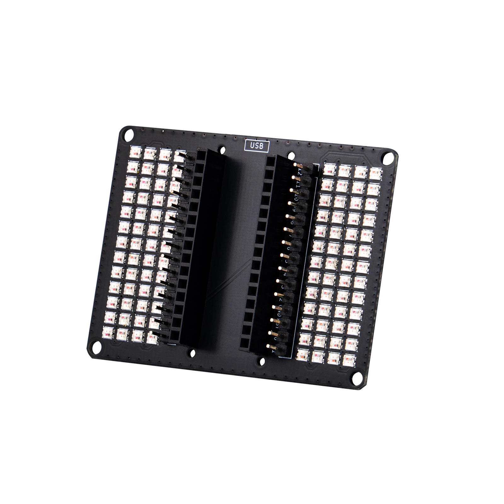

- **Product Dimension**

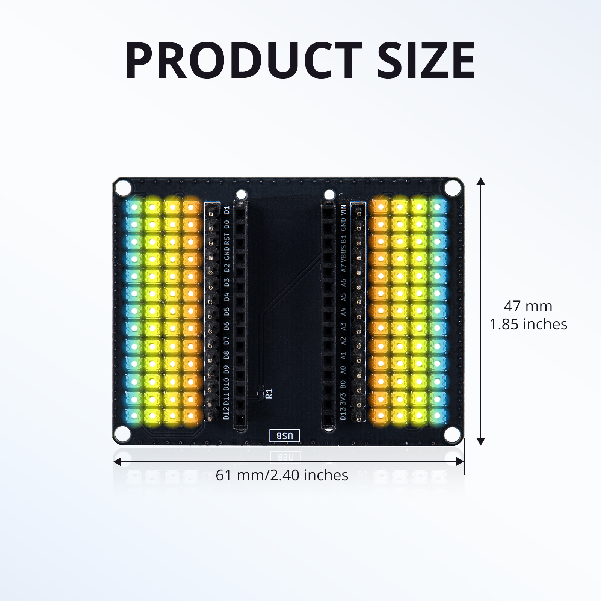

- **Power Consumption note**

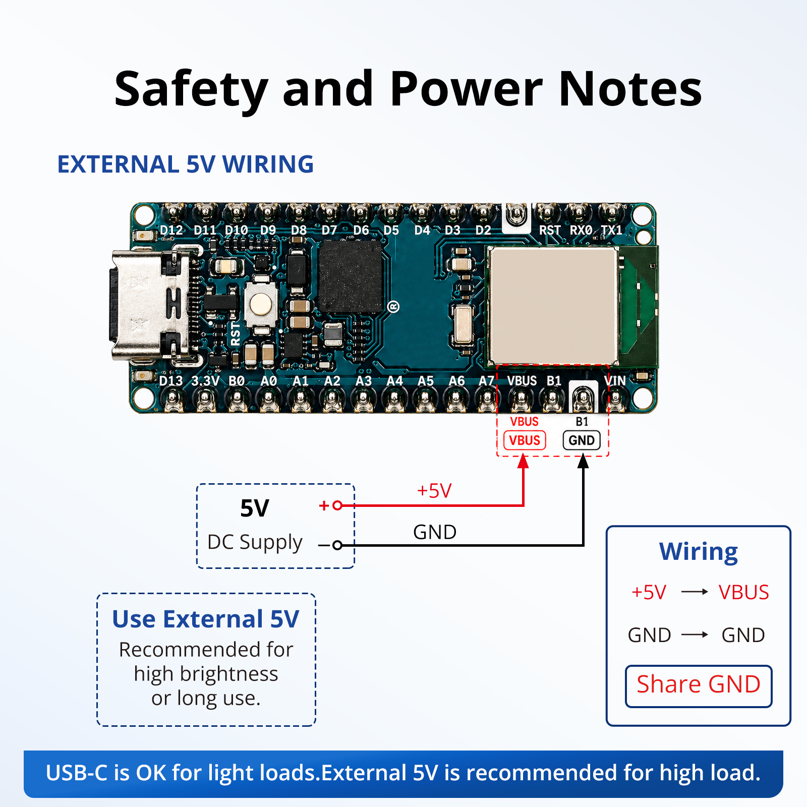

- **Product Compatibility**

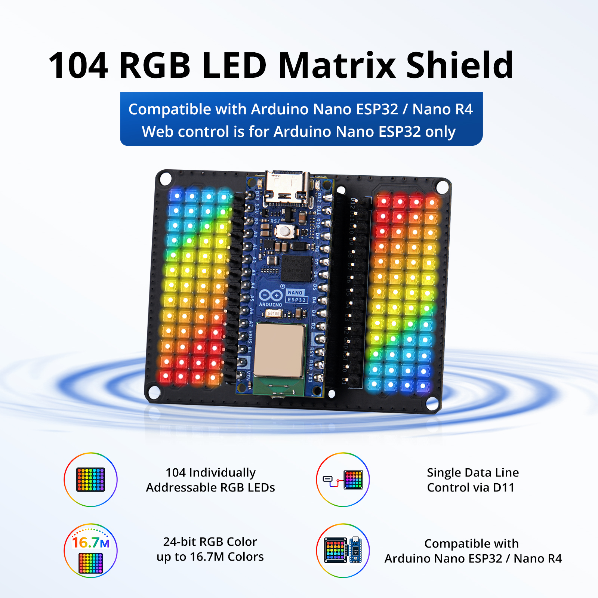

- **Product Demostration effect**

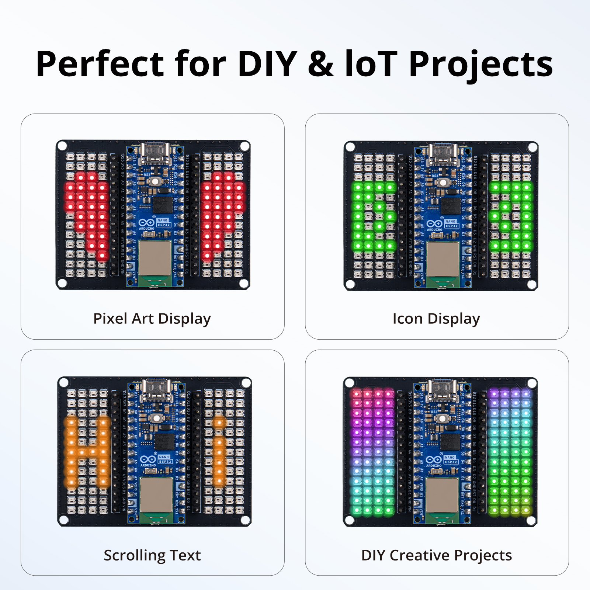

## IMPORTANT NOTE

<font color=red>

**Please note: This RGB LED matrix generates significant heat as brightness increases. To prevent burns, do not set the brightness to maximum during initial debugging. When testing, avoid staring directly at the matrix for extended periods, as this may cause eye strain or discomfort; use a semi-transparent diffuser or cover to reduce glare if necessary. For prolonged operation, additional cooling or heat-dissipation equipment is strongly recommended to avoid high-temperature contact burns.**

**NOTE2: USB power is for low-brightness testing only**

</font>

----

## Key Features

| Feature | Description |
| --- | --- |
| Tailored Form Factor | Custom-designed mechanical outline that perfectly matches the Arduino Nano ESP32 board, ensuring compact and reliable stacking. |
| Programmable RGB LEDs | Programmable RGB LEDs; each pixel is independently addressable via a one-wire interface. |
| High-Density Matrix Layout | Dense grid arrangement of RGB LEDs (visible as dual matrix arrays on the shield) for smooth graphics, icons, and animation rendering. |
| Single-Pin Control | Requires only one GPIO pin (D11) to drive the entire LED matrix, freeing up other I/O for sensors and peripherals. |
| Rich Color Depth | 256 brightness levels per color channel, supporting up to 16.7 million colors (24-bit RGB) per LED. |
| Expandable Interface | Broken-out pin headers (D0-D10, D12, D13, 3V3, A0–A7, VBUS, GND, VIN, etc.) allow easy integration of additional modules, sensors, and external power. |
| Plug-and-Play USB-C | Combined with the Nano ESP32's USB-C connector for both power and programming, simplifying the development workflow. |

## Target Audience

This product is ideal for the following user groups:

- **Electronics Hobbyists & Makers** — Individuals who enjoy hands-on hardware projects and want to add vivid visual output to their creations without complex wiring.
- **STEM Educators & Students** — Perfect for teaching embedded programming, digital signal protocols, and color theory in classrooms, labs, and coding workshops.
- **IoT & Smart Device Developers** — Developers leveraging the Nano ESP32's built-in Wi-Fi® and Bluetooth® LE to build connected lighting devices, notification panels, or ambient displays.
- **Interactive Art & Installation Designers** — Artists and creative technologists seeking a compact, powerful, and easily programmable LED canvas for wearables, sculptures, or stage props.
- **Prototyping Engineers** — Professionals who need rapid visual feedback systems for sensor data, status indicators, or UI mockups during product development.

## Application Scenarios

| Scenario | Description |
| --- | --- |
| Ambient Lighting & Mood Lamps | Create smooth color fades, breathing effects, and music-reactive ambient lighting for desks, rooms, or vehicles. |
| Wearable Electronics | Combined with the Nano ESP32's small footprint, the shield can be integrated into wearable badges, costumes, or portable light accessories. |
| IoT Notification Display | Use Wi-Fi/Bluetooth connectivity to fetch data (weather, social media, server status) and render it as color-coded alerts or scrolling icons on the LED matrix. |
| Interactive Educational Kits | Teach programming concepts by having students code chase lights, pixel art, or reaction games directly on the matrix. |
| Miniature Billboard / Signage | Display scrolling text, simple animations, or brand logos in compact spaces such as shop windows, model dioramas, or control panels. |
| Audio Visualization | Pair with a microphone module to build real-time spectrum analyzers, VU meters, or sound-reactive light shows. |
| Gaming & Entertainment | Develop miniature retro games (e.g., Snake, Tetris) or use the matrix as a dynamic health/status bar for DIY game controllers. |

## Quick Start Guide

### Hardware Setup

1. **Mount the Shield:** Carefully align the shield's female/male headers with the Arduino Nano ESP32's pin headers and press them together.
2. **Power Connection:** Connect the Nano ESP32 to your computer or a 5V USB power adapter via the USB-C port. The LED matrix will draw power from the VBUS (5V) rail.
3. **Verify Data Pin:** Ensure the matrix data input is connected to the designated GPIO (D11).

### Software Setup

1. **Install Arduino IDE:** Download and install the latest Arduino IDE 2.x (or 1.8.x) from [https://www.arduino.cc/en/software](https://www.arduino.cc/en/software).

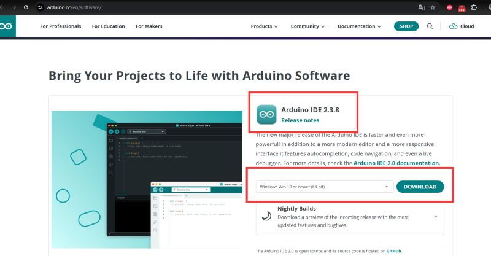

Double click the installation file and follow the instructions to install it.

2. **Add Board Support:** In Boards Manager, add the Arduino ESP32 Boards package to support the Nano ESP32 or In Additional Boards Manager URLs, add (if not present):

```
https://espressif.github.io/arduino-esp32/package_esp32_index.json
```

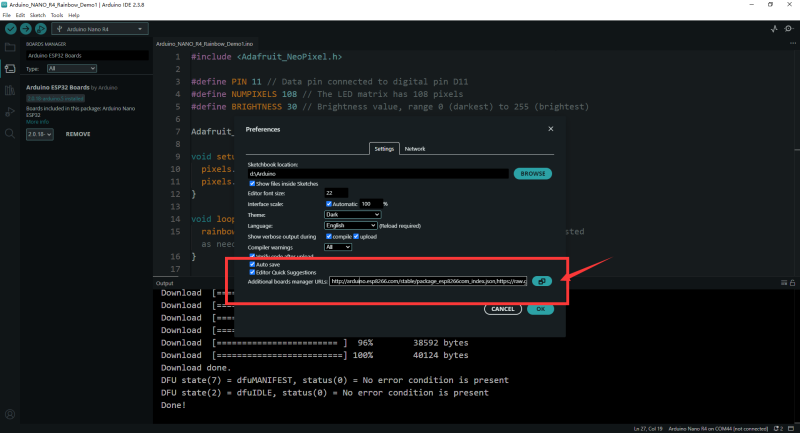

Open Tools → Board → Boards Manager, search for "Arduino ESP32 Boards" (by Arduino) or "ESP32 by Espressif Systems", and install the latest version.

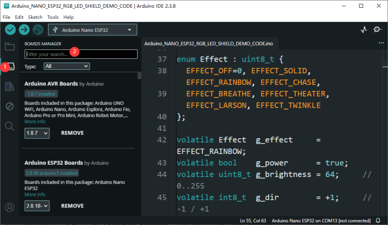


#### Select the Correct Board & Port

- **Board:** Arduino Nano ESP32
- **Port:** Select the COM port that appears when you plug in the USB-C cable.
- **Upload Speed:** 921600 (default).

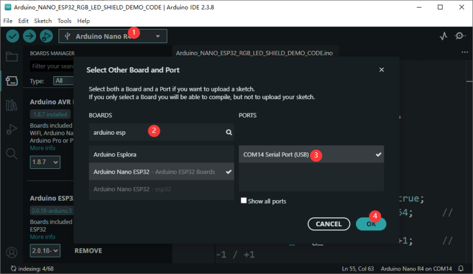

#### Download and Configure the Sketch

**4.0** Download Demo code Sketch from: [https://github.com/geeekpi/RGB-LED-Matrix-Shield-for-Arduino-NANO-R4-ESP32](https://github.com/geeekpi/RGB-LED-Matrix-Shield-for-Arduino-NANO-R4-ESP32)

Open the provided firmware sketch. You must edit the following three sections before uploading:

**4.1 WiFi Credentials:**

```cpp
static const char* ssid     = "YOUR_SSID_HERE";      // <-- Change this
static const char* password = "YOUR_PASSWORD_HERE";    // <-- Change this
```

Note: The ESP32 will operate in Station (STA) mode. Ensure your 2.4 GHz network uses WPA2 or WPA3. The serial monitor will display connection progress and the assigned IP address.

**4.2 Verify Libraries**

This firmware uses only the ESP32 Arduino Core built-in libraries:

- **<WiFi.h\>** : Library version: WiFi==2.0.0
- **<WebServer.h\>** : WiFiWebServer==1.10.1
- **<esp32-hal-rmt.h\>** : ESP32==2.0.0

No third-party ZIP libraries (e.g., Adafruit NeoPixel or FastLED) are required because the code drives the WS2812 protocol directly via the ESP32 RMT peripheral.

**4.3 Compile & Upload**

- Click the Verify (checkmark) button to ensure the code compiles without errors.
- Click Upload and wait for the "Done uploading" message.
- Open Tools → Serial Monitor (115200 baud).
- Press the RST button on the Nano ESP32 once if you do not see output.

**4.4 Obtain the Device IP**

In the Serial Monitor, look for the following lines:

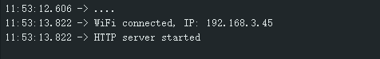

Record this IP address—you will need it to access the control panel.

**4.5 Access the Web Control Panel**

On any device connected to the same WiFi network, open a modern web browser.

**NOTE：Important Network Requirements for Web-Based Control**

**Please note that the Arduino NANO ESP32 only supports 2.4 GHz Wi-Fi networks. It cannot connect to 5GHz networks or dual-band networks broadcasting exclusively on 5GHz.**

**If you intend to debug or control the LED lighting effects via a web interface, your computer, smartphone, or tablet must be connected to the same local area network (LAN) as the Arduino NANO ESP32.**

This means:

- Both your client device and the NANO ESP32 must be on the same 2.4 GHz Wi-Fi network.
- They must reside within the same subnet (e.g., 192.168.1.x) so that the web browser can reach the IP address assigned to the board.
- The NANO ESP32 cannot be accessed over the Internet or from a different network (such as a mobile data connection or a guest network) unless additional port forwarding or a remote relay server is configured separately.
- Before uploading your sketch, ensure your router has a dedicated 2.4 GHz SSID available, or verify that your dual-band router is set to allow 2.4 GHz connections. Failure to do so will prevent the board from joining the network and make the web-based lighting controller unreachable.

If the device has been connected to 2.4GHz network, you can access it via browser from your computer or mobile phone's browser.

Navigate to:
```
http://192.168.x.xxx
```

The embedded NanoESP32 RGB LED Control interface will load instantly. It requires no internet access and works on desktop, tablet, or mobile browsers.

## Using the Web Interface

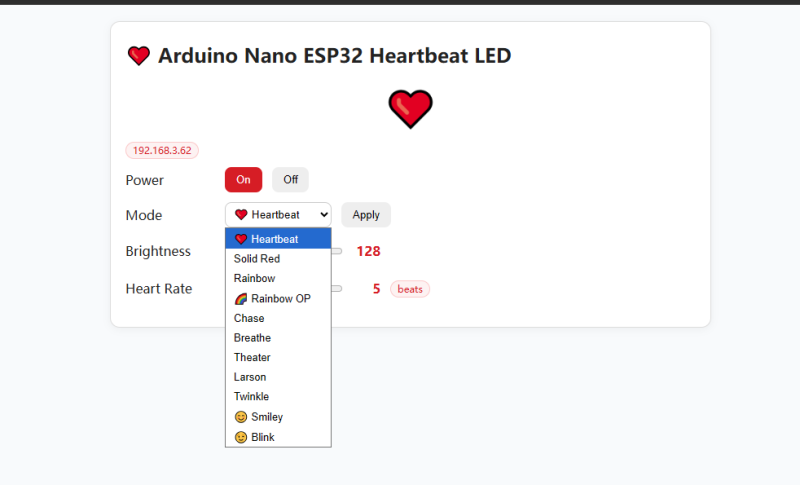

The onboard UI provides real-time control over:

| Control | Function |
| --- | --- |
| Power (On/Off) | Instantly blanks or restores the LED matrix. |
| Mode | Choose from Heartbeat, Solid Red, Rainbow, Rainbow OP, Chase, Breathe, Theater, Larson, Twinkle, Smiley, Blink. |
| Brightness | 0–255 global dimming applied before RMT output. |
| Heart Rate (speed) | 1–10 multiplier affecting animation step rates. |

All UI actions call the REST API asynchronously; the ESP32 responds immediately and updates the LED frame on the next update_effect() cycle.

## Developer Appendix

### REST API Reference (for Developers Only)

**NOTE:**
The REST API reference sections in the demo code of this project are intended solely for developer debugging purposes. We do not provide any technical support for these sections. Your understanding is appreciated.

You can also control the device programmatically via HTTP GET:

| Endpoint | Example | Description |
| --- | --- | --- |
| `/api/state` | `/api/state` | Returns JSON with power, effect, brightness, speed, IP, and LED count. |
| `/api/power?on=1` | `/api/power?on=1` | Turn matrix on (`on=1`) or off (`on=0`). |
| `/api/brightness?v=128` | `/api/brightness?v=128` | Set global brightness (`0–255`). |
| `/api/speed?v=5` | `/api/speed?v=5` | Set animation speed (`1–10`). |
| `/api/effect?name=heartbeat` | `/api/effect?name=rainbow` | Switch effect. Valid names: `solid`, `rainbow`, `rainbow_op`, `chase`, `breathe`, `theater`, `larson`, `twinkle`, `heartbeat`, `smiley`, `smiley_blink`. |

#### `/api/state` Response Format

```json
{
  "power": true,
  "effect": "heartbeat",
  "brightness": 128,
  "speed": 5,
  "num_leds": 104,
  "ip": "192.168.x.xxx"
}
```

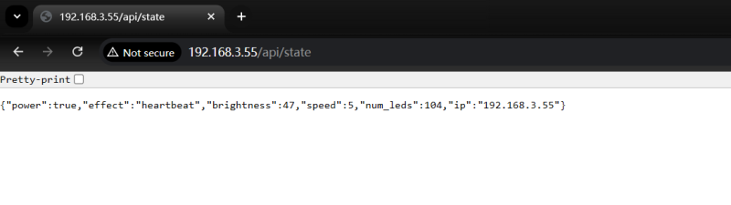

#### Supported Effect Names

| Name | Description |
| --- | --- |
| `solid` | Solid red color across all LEDs. |
| `rainbow` | Rainbow spectrum animation flowing across all LEDs. |
| `rainbow_op` | Rainbow background with hollow "OP" letters displayed on the matrix. Letters are rendered in rainbow stroke with black interior, and the hue continuously shifts. |
| `chase` | Single white LED chasing across the matrix. |
| `breathe` | Red breathing/pulsing effect with sine wave modulation. |
| `theater` | Theater chase effect with orange LEDs. |
| `larson` | Larson scanner (Cylon/KITT) effect with red trail decay. |
| `twinkle` | Random white twinkling LEDs with fade decay. |
| `heartbeat` | Red heart shape with realistic "lub-dub" double-peak heartbeat pulse animation. |
| `smiley` | Static yellow smiley face with red eyes. |
| `smiley_blink` | Yellow smiley face with blinking red eyes animation (eyes close to yellow every ~7% of cycle). |

#### Example Usage with curl

```bash
# Turn on the matrix
curl "http://192.168.x.xxx/api/power?on=1"

# Set effect to heartbeat (default)
curl "http://192.168.x.xxx/api/effect?name=heartbeat"

# Set effect to rainbow
curl "http://192.168.x.xxx/api/effect?name=rainbow"

# Set effect to rainbow OP letters
curl "http://192.168.x.xxx/api/effect?name=rainbow_op"

# Set effect to smiley
curl "http://192.168.x.xxx/api/effect?name=smiley"

# Set brightness to 50 (low)
curl "http://192.168.x.xxx/api/brightness?v=50"

# Set speed to 8 (fast)
curl "http://192.168.x.xxx/api/speed?v=8"

# Turn off the matrix
curl "http://192.168.x.xxx/api/power?on=0"
```

#### Important Notes

- The Arduino Nano ESP32 only supports **2.4 GHz Wi-Fi networks**. It cannot connect to 5 GHz networks.
- Your client device (computer, smartphone, or tablet) must be connected to the **same local network** as the Arduino Nano ESP32 to access the REST API.
- All API endpoints respond with `application/json` content type.
- Brightness value range: `0–255` (0 = off, 255 = maximum brightness).
- Speed value range: `1–10` (1 = slowest, 10 = fastest).
- The default effect on boot is **Heartbeat** (`heartbeat`).
- The default brightness on boot is **128**.
- The default speed on boot is **5**.
- There is **no `off` effect** in this version. To turn off all LEDs, use `/api/power?on=0` instead.

## For Arduino NANO R4

* Please refer to: [RGB LED Matrix Nano R4 Kit](https://docs.52pi.com/md/kz-0087/RGBLED-matrix-kit/#description)

## Purchase Link

* Please visit: [52pi Official](https://52pi.com)
* E-mail: sales@52pi.com


