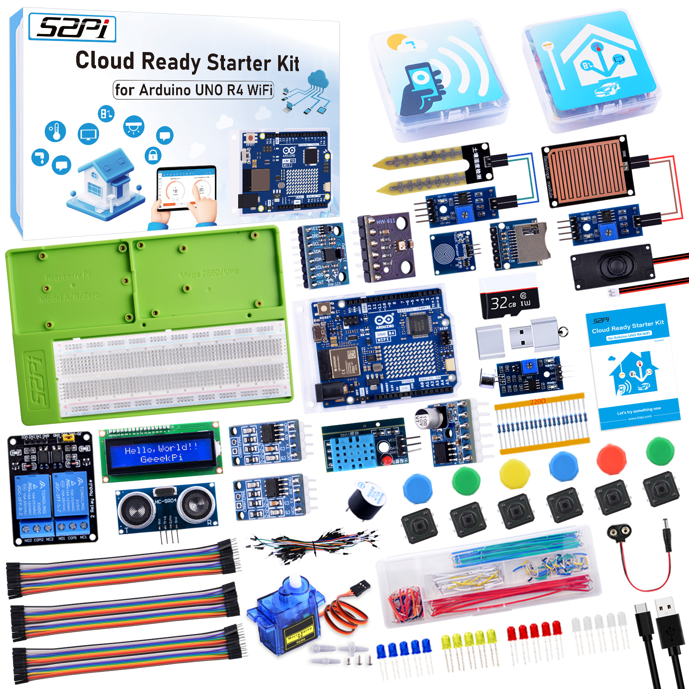
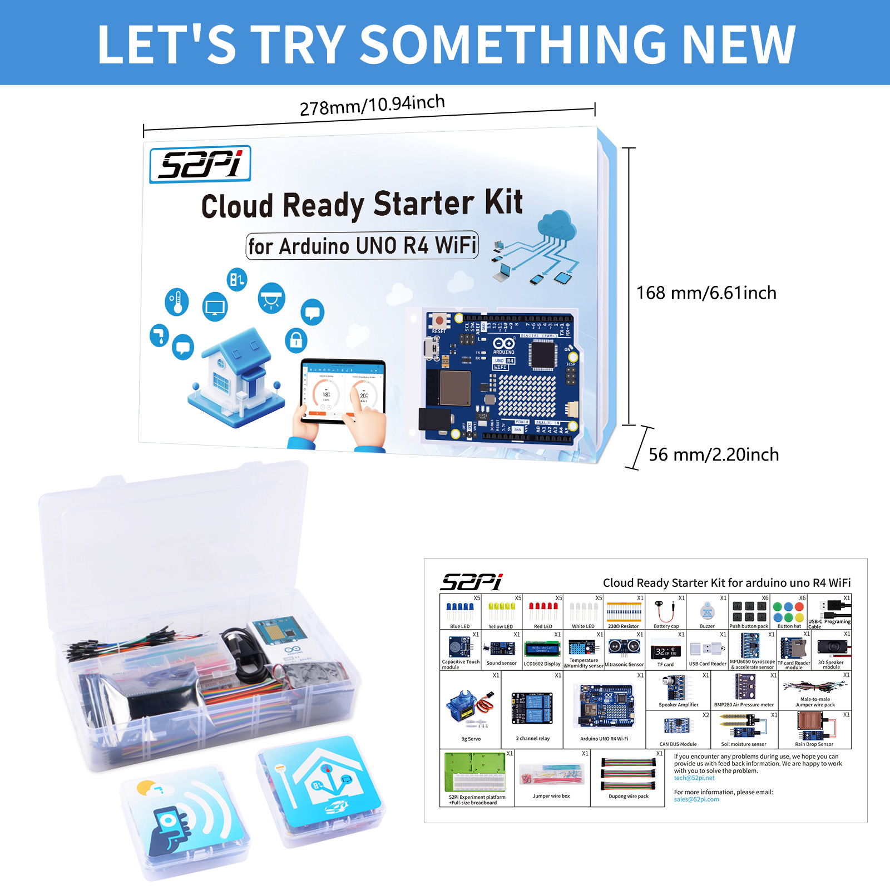
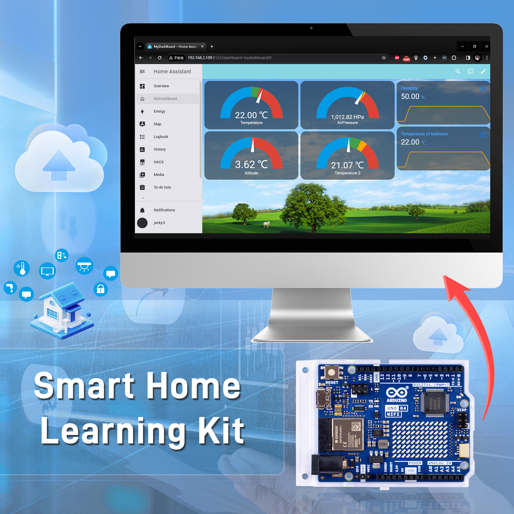
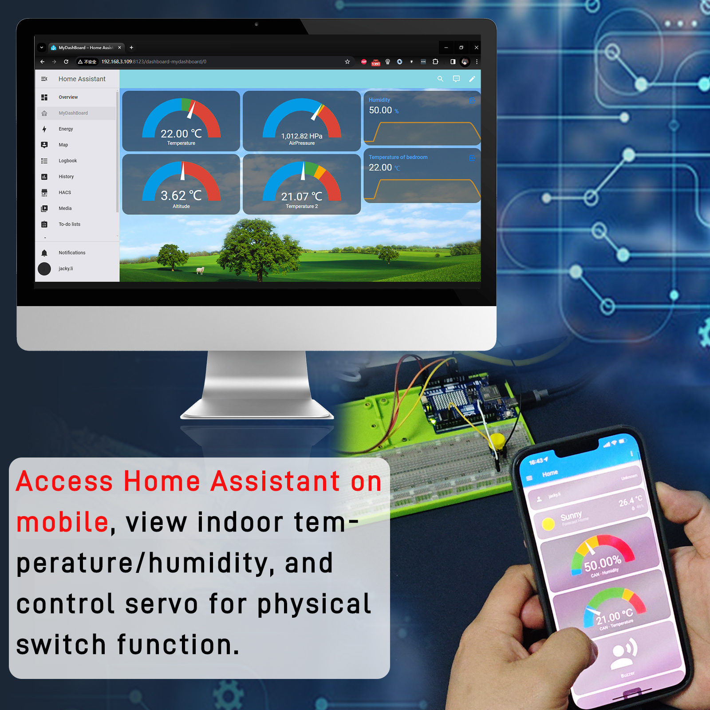
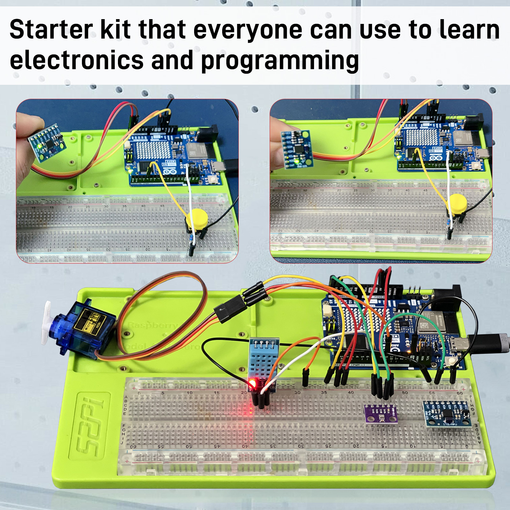
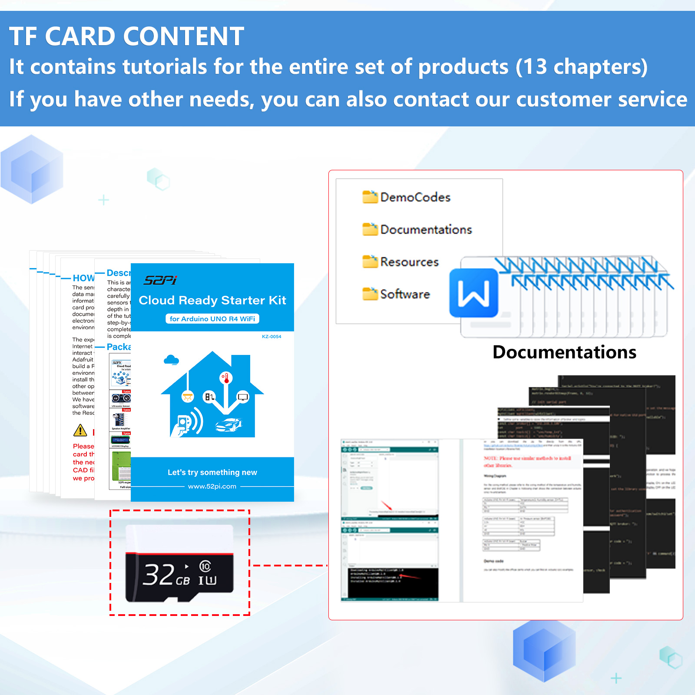
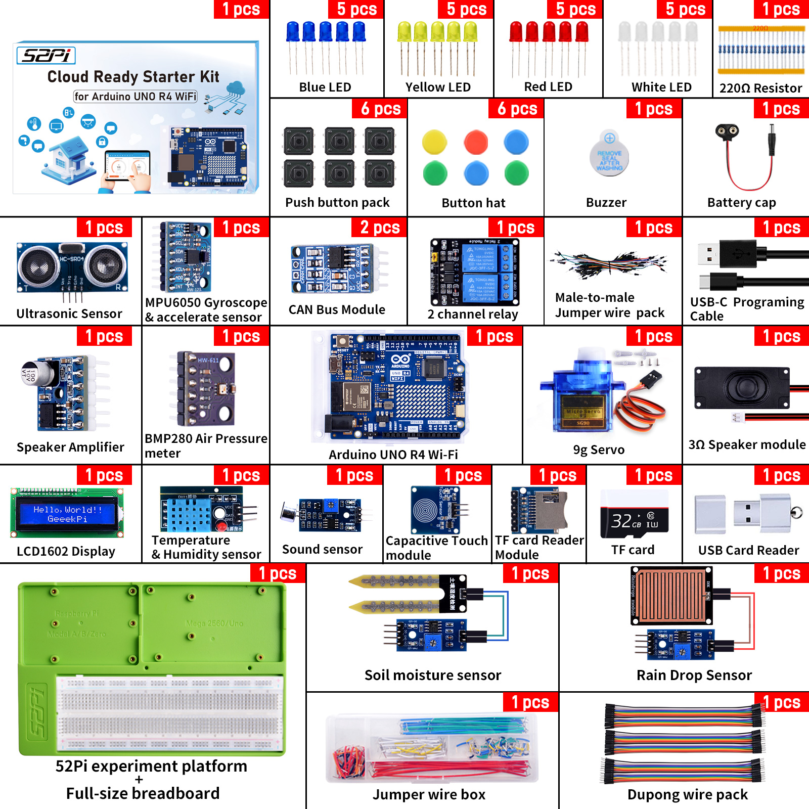

# Cloud Ready Starter Kit for Arduino UNO R4 WiFi

## Product Details

* Product SKU: KZ-0054 
* Product Name: Cloud Ready Starter Kit for Arduino UNO R4 WiFi

## Descriptions

This is an Arduino UNO R4 Wi-Fi kit. Based on the characteristics of the UNO R4 Wi-Fi board, we carefully selected a variety of sensors and used these sensors to gradually lead you to learn and explore in depth in the form of projects. Throughout the writing of the tutorial, we also followed the principle of step-by-step and tried our best to guide everyone to complete the project step by step. After each project is completed, you will encounter higher challenges.

## Features

- **Arduino UNO R4 Wi-Fi Board:** The kit includes an Arduino UNO R4 board with built-in Wi-Fi capabilities, allowing for wireless communication and connectivity.
- **Variety of Sensors:** The kit includes a diverse range of sensors such as temperature sensors, humidity sensors, motion sensors, light sensors, and more. These sensors enable users to collect data from the environment and interact with the physical world.
- **Step-by-step Tutorials:** The kit comes with comprehensive tutorials that guide users through various projects, starting from basic concepts and gradually increasing in complexity. Each project is accompanied by clear instructions and explanations to help users understand the principles behind the experiments.
- **IoT Integration:** The kit emphasizes IoT integration, allowing users to connect their projects to the internet and leverage cloud services. This enables functionalities such as remote monitoring, data logging, real-time control, and more.
- **Progressive Learning:** The tutorials follow a step-by-step approach, allowing users to build upon their knowledge and skills as they progress through the projects. Each project introduces new concepts and challenges, encouraging continuous learning and exploration.
- **Integration with Arduino IDE:** The kit seamlessly integrates with the Arduino Integrated Development Environment (IDE), providing a familiar platform for writing, compiling, and uploading code to the Arduino board.
- **Opportunity for Creativity:** While the tutorials provide a structured learning path, users are encouraged to experiment and customize their projects. This fosters creativity and innovation as users explore different applications and functionalities of the Arduino board and sensors.
- **Community Support:** Arduino has a large and active community of users and developers who share projects, ideas, and troubleshooting tips. Users of the kit can leverage this community for additional support and inspiration.

## Gallery

- Product outlook

  

- Smart home IoT projects

  

- Home Assistant integration

  

- Sensor data transmission

  

- Home Assistant mobile app

  

- Comprehensive package

  

## Tips for You

- **Build a Circuit:** When utilizing the Arduino Uno R4 Wi-Fi kit to build circuits, it's essential to be mindful of the potential instability that can arise from prolonged use of DuPont wires. In the event of device recognition issues, consider replacing the DuPont wires before attempting the task again. Additionally, meticulously inspect the circuit to prevent instances of short-circuiting or incorrect pin connections.

- **Use TF Card:** Before formatting the TF card, please ensure the proper preservation of data stored within it. As part of facilitating user convenience with this kit, we provide corresponding data manuals, documentation, and programming software. Directly formatting the TF card may result in data loss, so proceed with caution.

- **52Pi Platform:** The experiment tray provided in our kit offers excellent stability for securing your Arduino UNO R4 Wi-Fi board and breadboard, serving as a reliable platform for your experiments. We highly recommend using screws to firmly fasten the devices to the board during experimentation.

## Package Includes

* Please check your kit according to the following figure:

## Documentations Download

- Download from GitHub: [https://github.com/geeekpi/Arduino_uno_r4_wifi_kit](https://github.com/geeekpi/Arduino_uno_r4_wifi_kit)

- TF card Contents Download: [https://down.52pi.com](https://down.52pi.com)

## Referrence Video:

* 52Pi MakerEducation Channel:

* SriTu Hobby Channel:

* Education is Life (joed goh) Channel:

* Roberto Jorge Tech Channel:

## Keywords

- Arduino Uno R4 Wi-Fi Kit, Cloud Ready Starter Kit for Arduino UNO R4 WiFi

