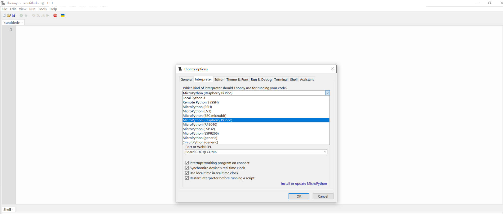
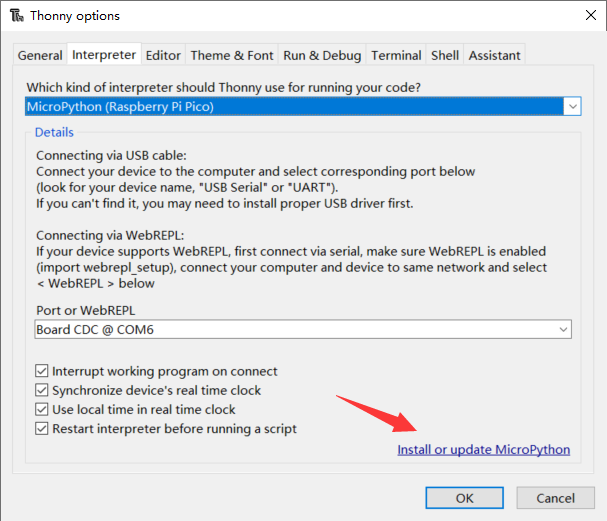
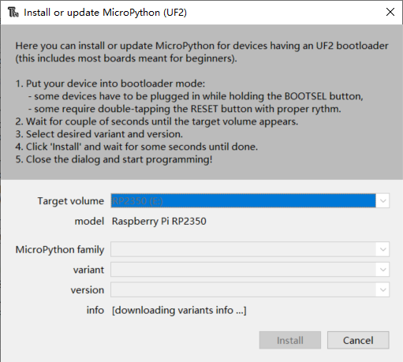
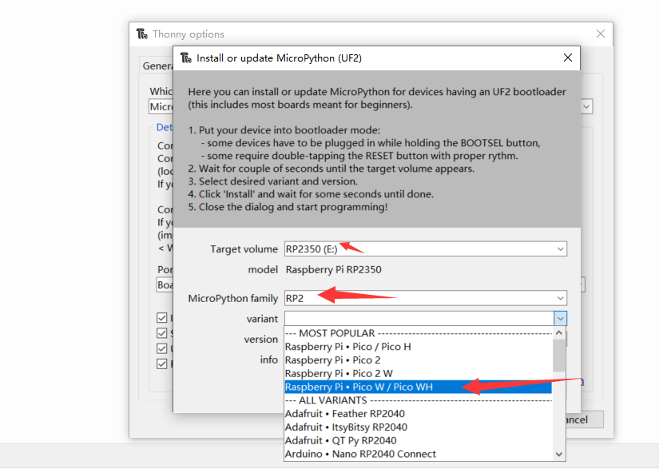
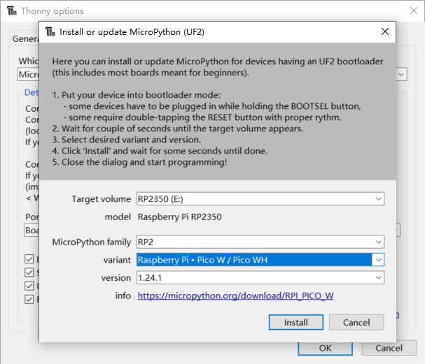
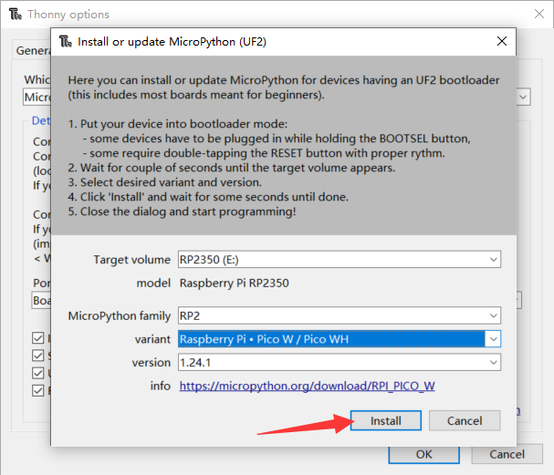

## Raspberry Pi Pico 2 WH Starter Kit Introduction

* **Product Name:** Raspberry Pi Pico 2 WH Starter Kit 
* **Product SKU:** KZ-0083

Welcome to the Raspberry Pi Pico 2 WH Starter Kit! This comprehensive kit is designed for beginners and enthusiasts who are eager to dive into the world of microcontroller programming and electronics. 
Whether you're a student, hobbyist, or educator, this kit provides everything you need to start experimenting with the Raspberry Pi Pico 2 WH.

### Kit Contents

| Item | Description | Quantity |
|:----:|:-----------:|:--------:|
| Raspberry Pi Pico 2 WH | A WiFi-enabled microcontroller board with headers soldered on | 1 |
| LED Indicator | Red, white, blue, and yellow LEDs (5 each) | 20 |
| 220ohm Resistor | Red, white, blue, and yellow resistors (5 each) | 20 |
| Push button | Tactile buttons with caps | 5 |
| Buzzer | Audible alert component | 2 |
| Long Breadboard | 800-hole breadboard for prototyping | 1 |
| Servo | Standard servo motor for mechanical control | 1 |
| MicroUSB Programming Cable | Cable for programming and power supply | 1 |
| Dupont Jump Wire (Male-to-Female) | For connecting components to the breadboard | 40 |
| Dupont Jump Wire (Male-to-Male) | For connecting components to the breadboard | 40 |
| Resistor Color Code Chart | Reference chart for resistor values | 1 |
| Plastic Box | Storage box for organizing components | 1 |
| Instruction Manual | Comprehensive guide to get you started | 1 |

---

### Features

- **Raspberry Pi Pico 2 WH**: This board is equipped with WiFi capabilities and comes with headers soldered on, making it ready for immediate use.
- **Diverse Components**: The kit includes a wide range of sensors and components, allowing you to experiment with various projects, from simple LED control to more complex sensor-based applications.
- **Prototyping Breadboard**: The included 800-hole breadboard provides ample space for building and testing your circuits without the need for soldering.
- **User-Friendly Documentation**: The instruction manual offers step-by-step guidance to help you get started with your first projects and understand the basics of microcontroller programming.

### Getting Started

To start using your Raspberry Pi Pico 2 WH Starter Kit, follow these steps:

1. **Unpack the Kit**: Carefully unpack all the components and ensure everything is present.
2. **Read the Manual**: Go through the instruction manual to familiarize yourself with the components and basic concepts.
3. **Set Up Your Environment**: Connect the Raspberry Pi Pico 2 WH to your computer using the MicroUSB cable and set up the necessary software for programming.
4. **Start with Basic Projects**: Begin with simple projects like blinking an LED or reading sensor data to get comfortable with the hardware and programming environment.
5. **Explore and Experiment**: Once you're comfortable, start exploring more complex projects and combining different components to create your own unique applications.


### Raspberry Pi Pico 2 WH Experiment Guide

This guide provides a series of experiments using the Raspberry Pi Pico 2 WH and various sensors included in the starter kit. 
Each experiment includes a practical application scenario, an explanation of the working principle, circuit wiring instructions, and a MicroPython demo code with detailed explanations.

---

## Basic Steps
* [Install Programming IDE][1]
* [Step 1: Download and Install Thonny IDE][2]
* [Step 2: Download the Latest MicroPython Firmware][3]
* [Step 3: Put Your Pico 2 WH into Bootloader Mode][4]
* [Step 4: Flash the MicroPython Firmware][5]
* [Step 6: Testing Your Setup][6]

## Basic Demo Projects 
* [Project 1 Blinking LED](./project1.md)
* [Project 2 Buttons](./project2.md)
* [Project 3 Music Box](./project3.md)
* [Project 4 Potentiometer](./project4.md)
* [Project 5 Fun with Servo and Friends](./project5.md)
* [Project 6 Stepper Motor](./project6.md)
* [Project 7 Network](./project7.md)
* [Project 8 LCD1602 Display Module](./project8.md)
* [Project 9 Comprehensive Experiment with Network Operation ](./project9.md)

[1]: https://docs.52pi.com/md/kz-0083/getting-start/#install-programming-ide
[2]: https://docs.52pi.com/md/kz-0083/getting-start/#step-1-download-and-install-thonny-ide
[3]: https://docs.52pi.com/md/kz-0083/getting-start/#step-1-download-and-install-thonny-ide
[4]: https://docs.52pi.com/md/kz-0083/getting-start/#step-1-download-and-install-thonny-ide
[5]: https://docs.52pi.com/md/kz-0083/getting-start/#step-1-download-and-install-thonny-ide
[6]: https://docs.52pi.com/md/kz-0083/getting-start/#step-1-download-and-install-thonny-ide

### Install Programming IDE 

How to Install Thonny IDE and Flash MicroPython on Raspberry Pi Pico 2 WH?

This guide will walk you through the process of installing Thonny IDE on your computer and flashing MicroPython onto your Raspberry Pi Pico 2 WH. 
By the end of this guide, you'll be ready to start programming your Pico 2 WH using MicroPython.

---

#### Prerequisites

- A Raspberry Pi Pico 2 WH board.
- A Micro USB cable (for flashing and programming).
- A computer with internet access (Windows, macOS, or Linux).

---

### Step 1: Download and Install Thonny IDE

Thonny is a beginner-friendly IDE (Integrated Development Environment) that supports MicroPython and is compatible with the Raspberry Pi Pico 2 WH.

#### For Windows:
1. Go to the [Thonny IDE download page](https://thonny.org/).
2. Download the latest Windows installer.
3. Run the installer and follow the on-screen instructions to complete the installation.

#### For macOS:
1. Go to the [Thonny IDE download page](https://thonny.org/).
2. Download the macOS version.
3. Open the downloaded `.pkg` file and follow the on-screen instructions to install Thonny.

#### For Linux:
1. Open your terminal.
2. Install Thonny using your distribution's package manager. For example:
   - On Ubuntu/Debian: `sudo apt install thonny`
   - On Fedora: `sudo dnf install thonny`

---

### Step 2: Download the Latest MicroPython Firmware

MicroPython needs to be flashed onto your Pico 2 WH before you can start programming it.

1. Go to the [MicroPython download page for Raspberry Pi Pico](https://micropython.org/download/rp2-pico/).
2. Download the latest UF2 file (e.g., `rp2-pico-20240224-v1.20.0.uf2`).

---

### Step 3: Put Your Pico 2 WH into Bootloader Mode

To flash the MicroPython firmware, you need to put your Pico 2 WH into bootloader mode.

1. Connect your Pico 2 WH to your computer using the Micro USB cable.
2. Press and hold the **BOOTSEL** button on the Pico 2 WH.
3. While holding the button, power the board by connecting it to your computer.
4. Release the **BOOTSEL** button once the board is powered.

Your Pico 2 WH should now appear as a USB drive (e.g., `RPI-RP2`).

---

### Step 4: Flash the MicroPython Firmware

1. Open the USB drive that appeared on your computer (e.g., `RPI-RP2`).
2. Drag and drop the downloaded UF2 file (`rp2-pico-20240224-v1.20.0.uf2`) onto the USB drive.
3. The firmware flashing process will start automatically. You will see a new file named `INFO_UF2.TXT` appear on the drive once flashing is complete.

---

### Step 5: Configure Thonny IDE to Work with Pico 2 WH

1. Open Thonny IDE on your computer.
2. Go to **Run** > **Select Interpreter**.
3. In the **MicroPython (Raspberry Pi Pico)** section, select your Pico 2 WH from the list of connected devices.
4. Click **OK** to confirm.



> NOTE: you can also install or update MicroPython firmware by clicking this:


* wait for a while: 



* Select target volume, Micropython family and variant according to your Pico
type. for example, if your pico is pico W, select `Raspberry Pi * Pico W/Pico WH` as following figure:


* In this kit, the mainboard is Pico 2W, so just select `Raspberry Pi * Pico 2 W`. 
and then click `install`. 





---

### Step 6: Testing Your Setup

To ensure everything is working correctly, let's run a simple test program.

1. In Thonny IDE, open a new script window.
2. Enter the following code:

   ```python
   from machine import Pin
   import time

   led = Pin(25, Pin.OUT)  # Use the onboard LED on GPIO 25
   while True:
       led.value(1)  # Turn on the LED
       time.sleep(1)  # Wait for 1 second
       led.value(0)  # Turn off the LED
       time.sleep(1)  # Wait for 1 second
   ```

3. Click the **Run** button (green triangle) to execute the script.
4. The onboard LED on your Pico 2 WH should start blinking.

---

## Troubleshooting Tips

- **Firmware Not Showing Up**: Ensure you are in bootloader mode and that the USB drive appears on your computer.
- **Thonny Not Detecting Pico 2 WH**: Restart Thonny IDE after flashing the firmware.
- **Code Not Running**: Double-check your code for typos and ensure the correct GPIO pins are used.

You have now successfully installed Thonny IDE, flashed MicroPython onto your Raspberry Pi Pico 2 WH, and run a simple test program. You are ready to start exploring more advanced projects and experimenting with MicroPython on your Pico 2 WH!
Happy coding!

## Raspberry Pi official Documentations:

* [Raspberry Pi Pico 2 series product brief](https://datasheets.raspberrypi.com/pico/pico-2-product-brief.pdf)

* [Raspberry Pi Pico 2 MicroPython SDK](https://datasheets.raspberrypi.com/pico/raspberry-pi-pico-python-sdk.pdf)

* [Getting started with Raspberry Pi Pico-Series](https://datasheets.raspberrypi.com/pico/getting-started-with-pico.pdf)

* [Raspberry Pi Pico-Series C/C++ SDK](https://datasheets.raspberrypi.com/pico/raspberry-pi-pico-c-sdk.pdf)

* [Raspberry Pi Pico/Pico-2-Fritzing-20240708](https://datasheets.raspberrypi.com/pico/Pico-2-Fritzing-20240708.fzpz)

* [Raspberry Pi Pico 2 W Datasheet](https://datasheets.raspberrypi.com/picow/pico-2-w-datasheet.pdf)

* [Raspberry Pi Pico 2 W Pinout](https://datasheets.raspberrypi.com/picow/pico-2-w-datasheet.pdf)

* [Raspberry Pi Pico 2 W Schematic](https://datasheets.raspberrypi.com/picow/pico-2-w-schematic.pdf)

* [RP2350 datasheet](https://datasheets.raspberrypi.com/rp2350/rp2350-datasheet.pdf)

* [Hardware design with rp2350](https://datasheets.raspberrypi.com/rp2350/hardware-design-with-rp2350.pdf)

* [More datasheet](https://datasheets.raspberrypi.com/)

