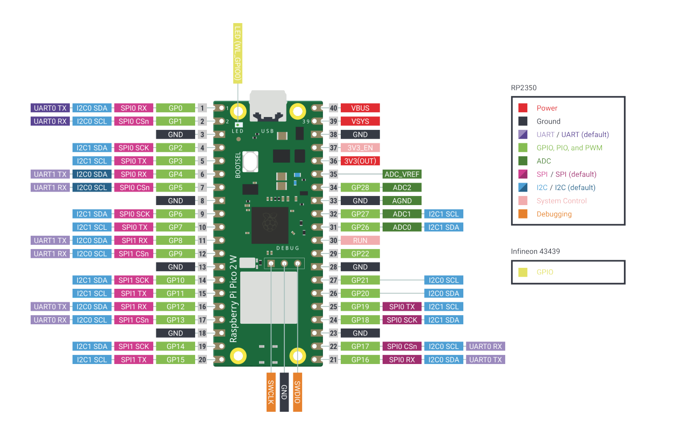
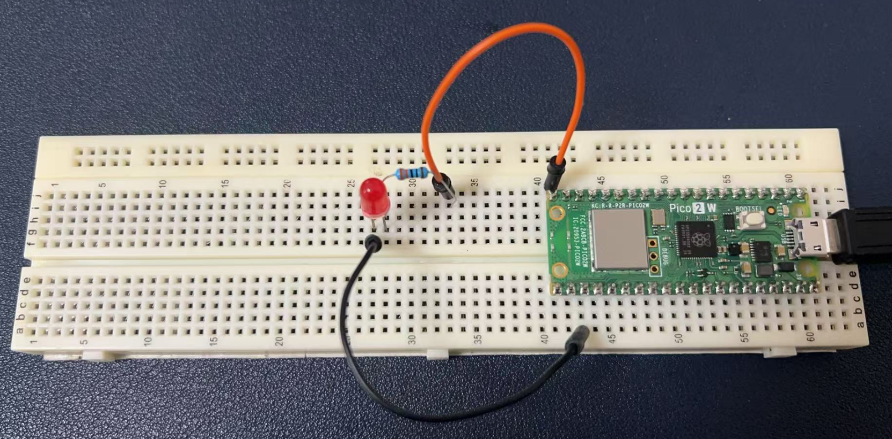
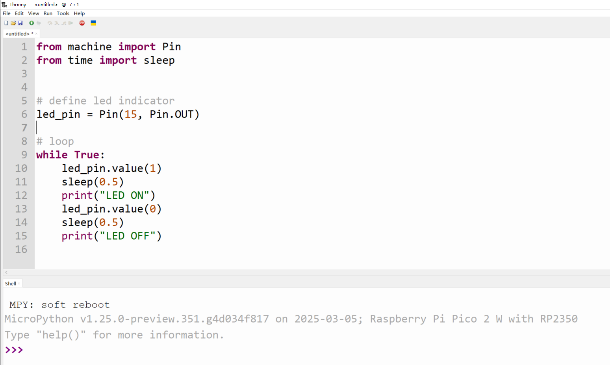
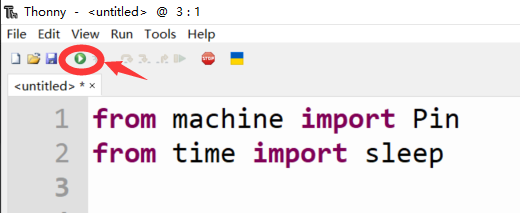
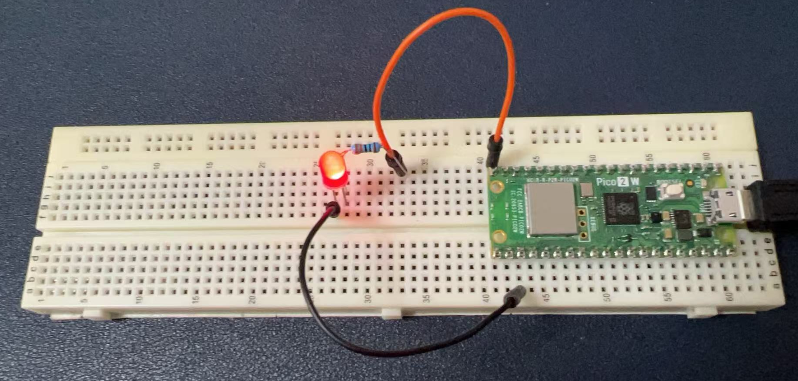
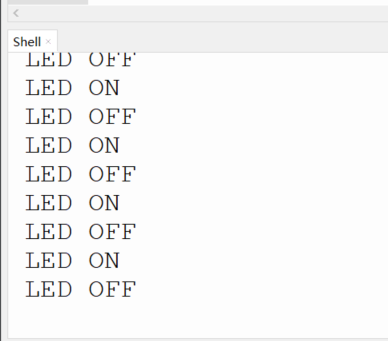

# Project 1: Blinking LED

First and foremost, let's introduce the LED lights. LED, which stands for Light Emitting Diode, is a fundamental component in electronics. By controlling LED lights, you can learn several valuable skills and concepts:

1. **Basic Electronics**: Understanding how diodes work, current flow, and the role of semiconductors in controlling electrical current.
2. **Circuit Building**: Learning how to construct simple circuits that include LEDs, resistors, and power sources.
3. **Component Identification**: Recognizing different types of LEDs and their characteristics, such as color, brightness, and size.
4. **Wiring Techniques**: Mastering the art of soldering and connecting components securely and efficiently.
5. **Voltage and Current**: Exploring the relationship between voltage, current, and resistance, which is fundamental to all electronic circuits.
6. **PWM (Pulse Width Modulation)**: Discovering how to control the brightness of LEDs using PWM, a technique that is widely used in various applications.
7. **Logic Gates and Control**: Introducing the concept of logic gates and how they can be used to control LED lights in more complex circuits.
8. **Troubleshooting**: Developing the ability to identify and fix common issues in electronic circuits, which is a critical skill for any electronics enthusiast.
9. **Creative Expression**: Using LEDs in projects to create visual effects, such as blinking patterns, fading, or color mixing.
10. **Energy Efficiency**: Appreciating the benefits of LEDs over traditional lighting, such as their lower power consumption and longer lifespan.

By starting with LED lights, you're beginning at the foundation of electronic projects. As you progress, these basic skills will build upon each other, enabling you to tackle more complex challenges and create innovative solutions.

---

## OK, let’s build our first diagram and start coding.

### Raspberry Pi Pico 2W Pinout



### Hardware Requirements
- 1 x Breadboard
- 1 x Raspberry Pi Pico 2 W board
- 1 x LED indicator (red/green/blue color as you like)
- 1 x 220ohm Resistor
- 2 x Male-to-male jumper wire
- 1 x MicroUSB programming cable

### Wiring Diagram

| LED Indicator | Raspberry Pi Pico 2W |
|---------------|----------------------|
| Short Leg (negative) | GND Pin |
| Long Leg (Positive) connect to 220ohm Resistor one leg | GP15 connect to other leg of resistor |



---

## Open Thonny IDE and input the following demo code:

```python
from machine import Pin
from time import sleep

# Define LED indicator
led_pin = Pin(15, Pin.OUT)

# Loop
while True:
    led_pin.value(1)
    sleep(0.5)
    print("LED ON") 
    led_pin.value(0)
    sleep(0.5)
    print("LED OFF")
```



Click the play icon on the menu. Do you see the LED is blinking?






The shell will display the status of the LED indicator like this:




### Code Explanations

* Here's what the code does:

It imports the Pin class from the machine module, which provides an interface to control the microcontroller's GPIO (General Purpose Input/Output) pins. It also imports the sleep function from the time module, which is used to pause the execution of the program for a specified amount of time.
It defines an LED indicator by creating a Pin object called led_pin. 

The pin number used is 15, and it is configured as an output pin (Pin.OUT), meaning it will be used to control the flow of electricity to an external device (in this case, an LED).
The code enters an infinite loop (while True:), which will continue to execute until the program is manually stopped or the device is reset.

Inside the loop, it sets the value of led_pin to 1 (which is typically HIGH or 3.3V on most microcontrollers), turning the LED on.
It then calls sleep(0.5), which pauses the program for 0.5 seconds, allowing the LED to remain on for that duration.

After the sleep, it prints "LED ON" to the console to indicate that the LED is currently on.

Next, it sets the value of led_pin to 0 (which is typically LOW or 0V), turning the LED off.

It calls sleep(0.5) again to pause for another 0.5 seconds, allowing the LED to remain off for that duration.

After the sleep, it prints "LED OFF" to the console to indicate that the LED is currently off.

The loop then repeats, causing the LED to blink on and off with a 0.5-second interval between changes.

### The machine Library in MicroPython
The machine library in MicroPython provides a way to access and control the hardware peripherals of the microcontroller. It includes modules for controlling GPIO pins, PWM (Pulse Width Modulation), ADC (Analog to Digital Conversion), UART (Universal Asynchronous Receiver-Transmitter), I2C (Inter-Integrated Circuit), SPI (Serial Peripheral Interface), and more.
The purpose of the machine library is to provide a Python interface to these hardware features, allowing developers to write Python code that interacts directly with the microcontroller's hardware. This makes it easier to develop embedded applications and control hardware devices without needing to write low-level code in languages like C or assembly.
In the context of this code, the machine library is used to control a GPIO pin, which is connected to an LED. By using the Pin class, the code can easily set the pin's mode (input or output) and its value (high or low), which in turn controls the state of the LED.
