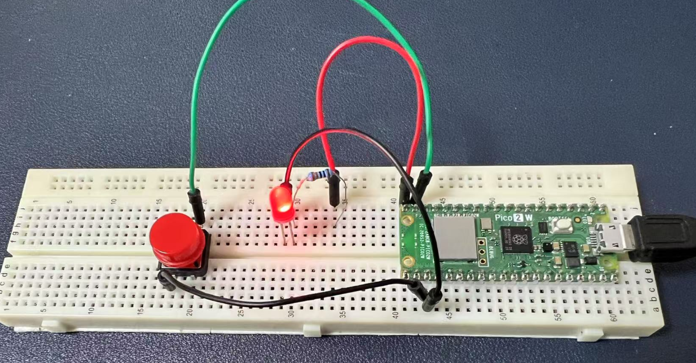

# Project 2 Buttons  

Button-Controlled LED Modes with Raspberry Pi Pico 2W

Here's an interesting experiment using the Raspberry Pi Pico 2W, a button, and an LED. The goal is to control different LED flashing modes using a button. Users can switch between three modes: Constant On, Blinking, and Fading.

## Objectives

- Use a button to switch between different LED flashing modes.
- The LED will have three modes:
  - Mode 1: Constant On
  - Mode 2: Blinking (Fast On/Off)
  - Mode 3: Fading (Gradually Brightening and Dimming)
- Each button press will switch to the next mode.

## Hardware Requirements

- 1 x Raspberry Pi Pico 2W
- 1 x button with button cap
- 1 x LED indicator
- 1 x 220 ohm Resistor
- 1 x Jumper wires
- 1 x Breadboard
- 1 x MicroUSB programming cable

## Wiring Diagram

### LED:
- Connect the LED's positive (anode) pin to a GPIO pin on the Pico (e.g., GPIO 15).
- Connect the LED's negative (cathode) pin to GND.

### Button:
- Connect one end of the button to a GPIO pin (e.g., GPIO 14).
- Connect the other end of the button to GND.



以下是Markdown格式的代码和代码说明部分：

---

## Demo Code

```python
# Import necessary modules
import machine
import utime

# Initialize the LED and button
led_pin = machine.Pin(15, machine.Pin.OUT)  # LED connected to GPIO 15
button_pin = machine.Pin(14, machine.Pin.IN, machine.Pin.PULL_UP)  # Button connected to GPIO 14, with internal pull-up resistor

# Define three modes for the LED
def mode_constant():
    print("Mode 1: LED Constant On")
    led_pin.value(1)  # Turn the LED on constantly
    utime.sleep(0.1)  # Brief delay to avoid overloading the CPU

def mode_blink():
    print("Mode 2: LED Blinking")
    led_pin.toggle()  # Toggle the LED state (on/off)
    utime.sleep(0.5)  # Blink interval

def mode_fade():
    print("Mode 3: LED Fading")
    pwm = machine.PWM(led_pin)  # Use PWM to control LED brightness
    pwm.freq(1000)  # Set PWM frequency
    for duty in range(0, 65535, 1000):  # Brighten from dim to bright
        pwm.duty_u16(duty)
        utime.sleep(0.01)
    for duty in range(65535, 0, -1000):  # Dim from bright to dim
        pwm.duty_u16(duty)
        utime.sleep(0.01)
    pwm.deinit()  # Stop PWM
    utime.sleep(0.1)
    led_pin.value(0)  # Ensure LED is off after PWM

# Main program
current_mode = 0  # Current mode
modes = [mode_constant, mode_blink, mode_fade]  # List of modes
last_button_state = button_pin.value()  # Previous button state

print("Press the button to switch LED modes!")
print(last_button_state)
while True:
    button_state = button_pin.value()  # Get the current button state
    print(button_state)
    if button_state == 0 and last_button_state == 1:  # Detect button press (high to low)
        current_mode = (current_mode + 1) % len(modes)  # Switch to the next mode
        utime.sleep(0.2)  # Debounce delay
        print(f"Switched to Mode {current_mode + 1}")
    last_button_state = button_state  # Update button state

    # Call the function for the current mode
    modes[current_mode]()
```

---

## Code Explanations

### Hardware Initialization
- The LED and button are initialized using `machine.Pin`.
- The button is connected to GPIO 14 with an internal pull-up resistor, making it high by default.

### LED Modes
- **`mode_constant`**: The LED stays on constantly.
- **`mode_blink`**: The LED blinks rapidly.
- **`mode_fade`**: The LED fades in and out using PWM to adjust brightness.

### Button Detection and Mode Switching
- The button state is checked using `button_pin.value()`.
- When a button press is detected (high to low), the mode switches to the next one in the list.
- A delay (`utime.sleep(0.2)`) is used to debounce the button.

### Main Loop
- The loop continuously checks the button state and calls the function corresponding to the current mode.

### Experiment Outcome
- **Mode 1**: The LED stays on constantly.
- **Mode 2**: The LED blinks at a rate of about twice per second.
- **Mode 3**: The LED gradually brightens and dims in a loop.
- Each button press switches to the next mode, cycling back to the first mode after the last one.

---
