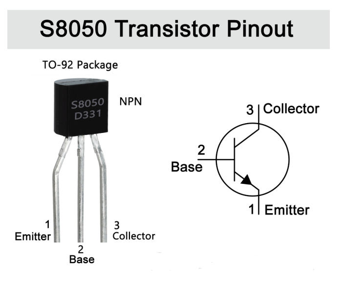
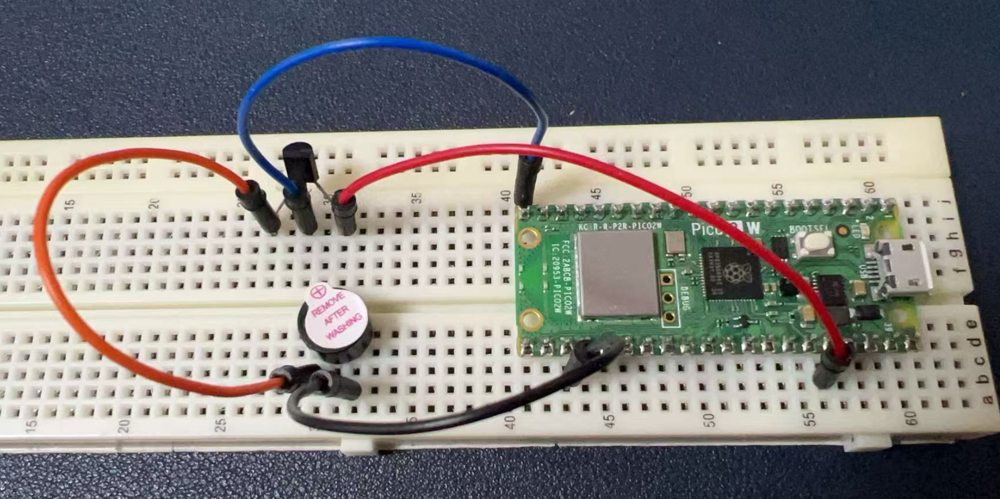

# Project 3 Music Box

## Buzzer Introduction
A buzzer is an electronic device that emits sound when an electrical signal is applied to it. It can be used in various projects to create audible alerts, play melodies, or provide user feedback. There are two types of buzzers: active and passive. An active buzzer has an internal oscillator and requires a DC voltage to operate, while a passive buzzer requires an external signal to produce sound.

## Hardware Requirements
- 1 x Raspberry Pi Pico 2W board  
- 1 x Buzzer  
- 1 x S8050 Transistor  
- 4 x Male-to-male jumper wire  
- 1 x MicroUSB programming cable  

## Pinout of S8050 Transistor



## Wiring Diagram  
To connect a buzzer to a Raspberry Pi Pico 2W, you would typically connect the positive lead of the buzzer to a GPIO pin on the Pico that supports PWM (Pulse Width Modulation), and the negative lead to a ground pin. 

- Connect the base of the transistor (S8050 NPN) to GPIO pin 15 (GP15) on the Raspberry Pi Pico 2W.  
- Connect the emitter of the transistor to the Positive pin (Long leg) on the Buzzer.  
- Connect the collector of the transistor to the 3.3V pin on the Pico.  
- Connect the negative pin of the Buzzer to Ground Pin on the Pico.


---

## Demo Code

```python
import machine
import utime

# Define the GPIO pin connected to the buzzer
buzzer_pin = machine.Pin(15, machine.Pin.OUT)

# Create a PWM object to control the buzzer
buzzer = machine.PWM(buzzer_pin)

# Define note frequencies
NOTE_C4 = 262
NOTE_D4 = 294
NOTE_E4 = 330
NOTE_F4 = 349
NOTE_G4 = 392
NOTE_A4 = 440
NOTE_B4 = 494
NOTE_C5 = 523
NOTE_CS4 = 277
NOTE_DS4 = 311
NOTE_GS4 = 415
NOTE_AS4 = 466
NOTE_B3 = int(494 * (2 / 3))

# Define the melody
melody = [
    NOTE_C4, NOTE_G4, NOTE_E4,
    NOTE_A4, NOTE_B4, NOTE_AS4, NOTE_A4,
    NOTE_G4, NOTE_E4, NOTE_G4, NOTE_AS4, NOTE_F4, NOTE_G4, NOTE_E4,
    NOTE_C4, NOTE_D4, NOTE_B3
]

melody += melody  # Duplicate the melody to make it longer

# Define note durations (in milliseconds)
note_durations = [250] * len(melody)

# Initialize PWM
buzzer = machine.PWM(machine.Pin(15))

# Function to play a tone
def play_tone(frequency, duration):
    buzzer.freq(frequency)  # Set PWM frequency
    buzzer.duty_u16(32768)  # Set duty cycle (50%)
    utime.sleep_ms(duration)  # Play the tone for the specified duration
    buzzer.duty_u16(0)  # Stop the tone
    utime.sleep_ms(50)  # Pause between notes

# Main loop
try:
    while True:
        for i in range(len(melody)):
            play_tone(melody[i], note_durations[i])
except KeyboardInterrupt:
    # Turn off the PWM and clean up if interrupted
    buzzer.deinit()
```

---

## Code Explanations

### Module Import
- **`machine`**: Used to control hardware components, such as GPIO pins and PWM.
- **`utime`**: Used for time-related operations, such as delays.

### Buzzer Initialization
- Define GPIO pin 15 as connected to the buzzer and set it to output mode.
- Create a PWM object `buzzer` to control the buzzer's frequency and duty cycle.

### Note Frequencies
- A series of note frequencies are defined, corresponding to different musical notes (e.g., C4, D4).
- These frequencies are based on standard musical note frequencies.

### Melody Definition
- The `melody` list contains a sequence of note frequencies representing the melody to be played.
- By using `melody += melody`, the melody is duplicated to make it longer when played in a loop.

### Note Durations
- The `note_durations` list specifies the duration of each note in milliseconds.
- By default, all notes have a duration of 250ms.

### Play Function
- The `play_tone` function plays a tone with a specified frequency and duration.
- It controls the buzzer by setting the PWM frequency and duty cycle.
- A 50ms pause is added between notes to prevent overlap.

### Main Loop
- The `while True` loop continuously plays the melody.
- It iterates through the `melody` list and calls the `play_tone` function for each note.
- If the program is manually interrupted (e.g., by pressing Ctrl+C), the `KeyboardInterrupt` exception is caught, and the PWM is deactivated to clean up resources.

---

## Summary
This code is a simple music-playing program that uses a buzzer and PWM technology to play a melody. It defines note frequencies, a melody, and note durations to achieve musical playback functionality.
