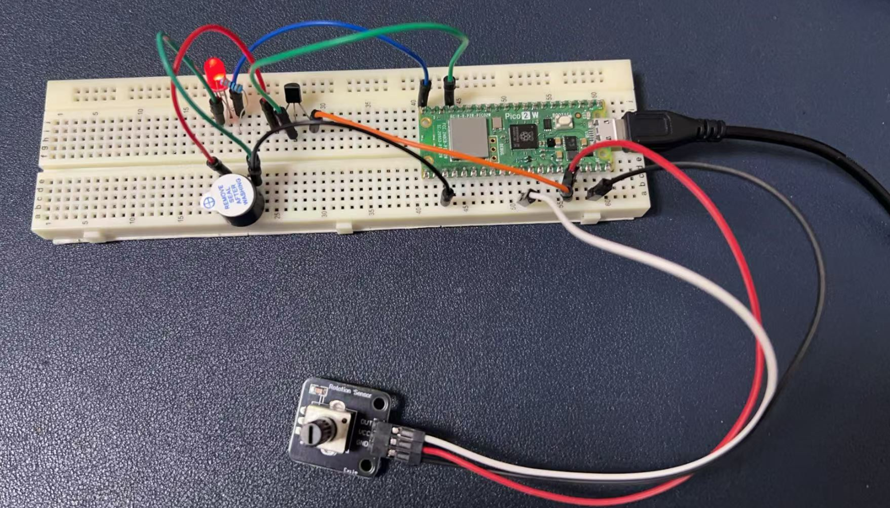
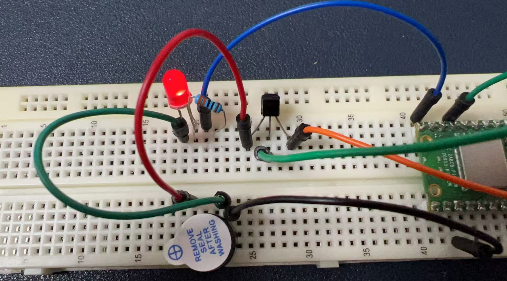
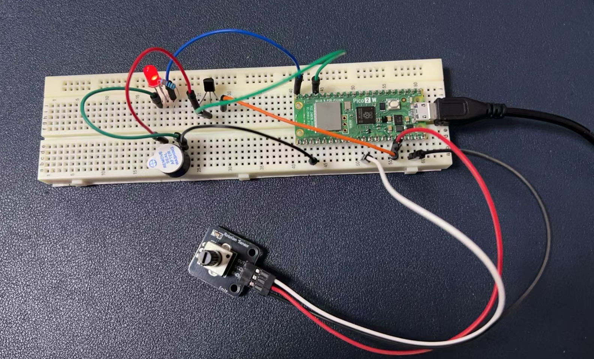

# Project 4: Potentiometer

Let’s build a DJ Box by using those components.

## Potentiometer Introduction

A potentiometer is a type of variable resistor, which means it can change its resistance value in a controlled manner. It is a three-terminal device commonly used to adjust electrical signals or control the flow of current in a circuit.

### Basic Structure and Function

1. **Three Terminals:**
   - **Two Fixed Terminals:** These are connected to the power supply (e.g., VCC and GND).
   - **One Wiper Terminal:** This is the middle terminal, which provides the variable output voltage.
2. **Mechanism:**
   - The potentiometer consists of a resistive element (usually a strip of carbon or a coil of wire) and a wiper that slides along this element.
   - By rotating the knob or adjusting the slider, the position of the wiper changes, altering the resistance between the wiper and the fixed terminals.

### How It Works

- When the wiper is at one end, the resistance between the wiper and that end is zero, and the resistance to the other end is maximum.
- As the wiper moves towards the other end, the resistance to the first end increases, while the resistance to the second end decreases.
- This change in resistance allows the potentiometer to vary the voltage at the wiper terminal relative to the fixed terminals.

### Applications

1. **Volume Control:**
   - In audio equipment, potentiometers are used to adjust the volume by changing the resistance in the audio signal path.
2. **Brightness Control:**
   - In lighting systems, they can control the brightness of LEDs or other lights by adjusting the current flow.
3. **Tuning Circuits:**
   - In radio or other electronic devices, potentiometers are used to tune frequencies by adjusting the resistance in the circuit.
4. **Sensor Applications:**
   - Potentiometers can act as position sensors in mechanical systems, where the position of a slider or knob is converted into an electrical signal.

### Types of Potentiometers

1. **Rotary Potentiometers:**
   - These have a rotating knob and are the most common type. They are used in applications where a circular motion is suitable (e.g., volume controls).
2. **Linear Potentiometers:**
   - These have a sliding mechanism and are used in applications where linear motion is required (e.g., faders on mixing consoles).
3. **Digital Potentiometers:**
   - These are electronically controlled and can change resistance through digital signals. They are often used in microcontroller-based projects for precise control.

### Example in Electronics Projects

In the context of the Raspberry Pi Pico project mentioned earlier, a potentiometer is used to provide an analog voltage signal to the Pico's ADC (Analog-to-Digital Converter) input. By rotating the knob, the user can change the voltage at the wiper terminal, which is then read by the Pico and used to control the brightness of an LED or the pitch of a buzzer.

## Cool Project: Controlling an LED and Buzzer with a Potentiometer and an S8050 Transistor

This code demonstrates how to control the brightness of an LED and the pitch of a buzzer using a potentiometer on a Raspberry Pi Pico 2W. The implementation involves using the potentiometer to adjust the PWM (Pulse Width Modulation) signal for the LED and to select different musical notes for the buzzer. Additionally, an S8050 transistor is used to amplify the current for the LED, ensuring it can operate at higher brightness levels.

### Hardware Requirements

- 1 x Raspberry Pi Pico 2W board
- 1 x Buzzer
- 1 x LED indicator
- 1 x 220-ohm Resistor
- 1 x S8050 Transistor
- 1 x Potentiometer
- 9 x Male-to-male jumper wire
- 1 x MicroUSB programming cable

### Wiring Diagram

1. **Potentiometer:**
   - The middle pin of the potentiometer is connected to GPIO 26 (ADC pin) on the Pico (Pico 2W for short).
   - The other two pins are connected to 3.3V and GND, respectively.
2. **Buzzer with S8050 Transistor:**
   - The positive of the Buzzer is connected to the Emitter pin of the S8050 transistor.
   - The collector Pin of the S8050 transistor is connected to 3.3V on Pico 2W.
   - The base Pin of the S8050 transistor is connected to GPIO 13 (GP13).
   - A 220Ω resistor is placed in series with the LED to limit the current through the LED.
3. **LED:**
   - The positive of the LED (Long leg) is connected to GPIO 14 (PWM pin) on the Pico through a 220-ohm resistor.
   - The negative of the LED (Short leg) is connected to GND.

Please see the following figure:





## Demo Code

```python
from machine import ADC, PWM, Pin
import utime

# Initialize the potentiometer (connected to GPIO 26)
potentiometer = ADC(26)

# Initialize the LED (connected to GPIO 15)
led_pwm = PWM(Pin(15))

# Set PWM frequency to 1000 Hz
led_pwm.freq(1000)  

# Initialize the buzzer (connected to GPIO 13)
buzzer_pwm = PWM(Pin(13))

# Define musical note frequencies 
notes = {
    "C4": 262,
    "D4": 294,
    "E4": 330,
    "F4": 349,
    "G4": 392,
    "A4": 440,
    "B4": 494,
    "C5": 523
}

while True:
    # Read the potentiometer value (range 0-65535)
    pot_value = potentiometer.read_u16()

    # Control the LED brightness
    # Use the potentiometer value to directly control LED brightness
    led_pwm.duty_u16(pot_value) 

    # Map the potentiometer value to a musical note
    # Map the range 0-65535 to 0-7 (corresponding to the notes)
    note_index = int(pot_value / (65536 / len(notes)))
    note = list(notes.keys())[note_index]

    # Set the buzzer frequency 
    buzzer_pwm.freq(notes[note])  # Set the buzzer frequency 
    buzzer_pwm.duty_u16(32768)    # Set the buzzer duty cycle to 50%
    utime.sleep(0.15)             # Sustain for 0.15 seconds
    buzzer_pwm.duty_u16(0)        # Stop the buzzer sound

    utime.sleep(0.1)  # Short delay
```

---

## Code Explanations

- **ADC Initialization**: The potentiometer is connected to GPIO 26, which is configured as an ADC (Analog-to-Digital Converter) input. This allows the Pico to read the analog voltage from the potentiometer and convert it into a digital value.
- **PWM Initialization**: The LED is connected to GPIO 15, and the buzzer is connected to GPIO 13. Both pins are configured for PWM output. The LED PWM frequency is set to 1000 Hz, which is a suitable frequency for controlling LED brightness without visible flickering.
- **Note Frequencies**: A dictionary `notes` is defined to store the frequencies of different musical notes. These frequencies will be used to control the pitch of the buzzer.
- **Reading the Potentiometer**: The `potentiometer.read_u16()` function reads the analog value from the potentiometer, which ranges from 0 to 65535.
- **LED Brightness Control**: The `led_pwm.duty_u16(pot_value)` function sets the PWM duty cycle for the LED. The duty cycle directly corresponds to the brightness of the LED. A higher value results in a brighter LED.
- **Mapping to Musical Notes**: The potentiometer value is mapped to a musical note index. The range 0-65535 is divided into segments corresponding to the number of notes defined in the `notes` dictionary. The selected note is then used to set the frequency of the buzzer.
- **Buzzer Control**: The `buzzer_pwm.freq(notes[note])` function sets the frequency of the buzzer to the selected note. The buzzer is activated for 0.15 seconds (`utime.sleep(0.15)`) and then turned off (`buzzer_pwm.duty_u16(0)`).

---

## Role of the S8050 Transistor

The S8050 transistor is used to amplify the current for the LED. The GPIO pin (GPIO 15) provides a control signal to the base of the transistor, which allows a larger current to flow from the collector to the emitter. This configuration ensures that the LED can achieve higher brightness levels than would be possible with direct GPIO control alone.

---

## Conclusion

This code and circuit setup provide a simple yet effective way to control an LED's brightness and a buzzer's pitch using a potentiometer. The use of an S8050 transistor ensures that the LED can operate at higher brightness levels, while the PWM control allows precise adjustment of both the LED and the buzzer. This project is a great introduction to analog input, PWM control, and basic transistor amplification.

