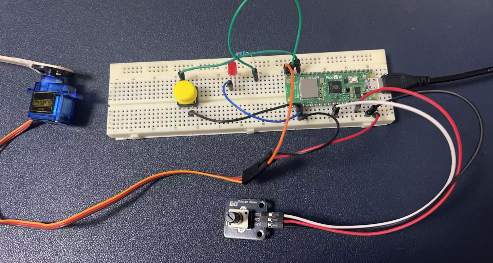
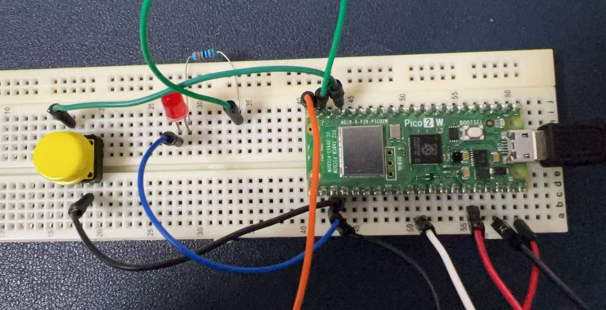
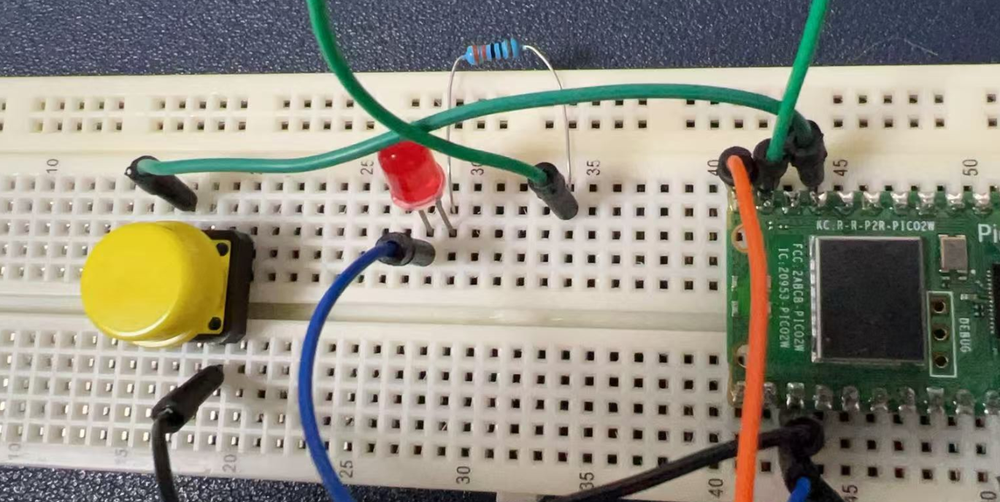

# Project 5: Fun with Servo and Friends

## Servo Introduction

A servo motor is a powerful little component that can rotate to specific angles. It's like a tiny robot arm that can point in different directions based on what you tell it. Servos are perfect for making things move in a controlled way, and they're super easy to use with a microcontroller like the Pico 2W.

---

## Hardware Requirements

To bring this project to life, you'll need the following components:

- 1 x Raspberry Pi Pico 2W - The brain of our project.
- 1 x Servo Motor - The star of the show.
- 1 x LED - For some flashy fun.
- 1 x Button - To give you control.
- 1 x Potentiometer - To adjust things on the fly.
- 1 x Resistor (220Ω) - To protect the LED.
- 6 x Jumper Wires - To connect everything.
- 1 x Breadboard - To keep everything organized.

---

## Wiring Diagram

Let's connect everything up:



### Servo Motor:

- Connect the red wire to the 5V pin on the Pico 2W.
- Connect the black wire to a GND pin.
- Connect the yellow (signal) wire to GPIO pin 15 on the Pico 2W.

### LED:

- Connect the longer leg (anode) to GPIO pin 14.
- Connect the shorter leg (cathode) to a 220Ω resistor.
- Connect the other end of the resistor to GND.

### Button:

- Connect one leg to GPIO pin 13.
- Connect the other leg to GND.

### Potentiometer:

- Connect the middle pin to GPIO pin 26 (analog input).
- Connect the left pin to 3.3V.
- Connect the right pin to GND.




---

## Demo Code

Here's a fun piece of code to make everything work together:

```python
import machine
import utime

# Initialize the servo
servo = machine.PWM(machine.Pin(15))
servo.freq(50)  # Set PWM frequency to 50Hz

# Initialize the LED
led = machine.Pin(14, machine.Pin.OUT)

# Initialize the button
button = machine.Pin(13, machine.Pin.IN, machine.Pin.PULL_UP)

# Initialize the potentiometer
pot = machine.ADC(machine.Pin(26))

while True:
    # Read the potentiometer value
    pot_value = pot.read_u16()
    angle = int(pot_value / 65535 * 180)  # Convert to angle (0-180 degrees)
    
    # Set the servo position
    duty_cycle = int(angle / 180 * 1000000 + 500000)  # Convert angle to duty cycle
    servo.duty_ns(duty_cycle)
    
    # Check if the button is pressed
    if button.value() == 0:  # Button is pressed (active low)
        led.value(1)  # Turn on the LED
    else:
        led.value(0)  # Turn off the LED
    
    utime.sleep(0.1)
```

---

## Code Explanations

1. **Servo Control:**
   - We use the `machine.PWM` class to control the servo. The `freq(50)` sets the PWM frequency to 50Hz, which is standard for servos.
   - The angle is converted to a duty cycle using the formula: `duty_cycle = angle / 180 * 1000000 + 500000`. This maps the angle to the correct PWM signal.

2. **LED Control:**
   - The LED is turned on or off based on the button press. When the button is pressed (`button.value() == 0`), the LED lights up.

3. **Potentiometer Input:**
   - The potentiometer value is read using the `ADC` class. The value is scaled to an angle between 0 and 180 degrees, which controls the servo position.

---

## Conclusion

This project combines movement, interaction, and visual feedback to create a fun and engaging experience. Enjoy experimenting with different angles and seeing how the servo responds!

---

