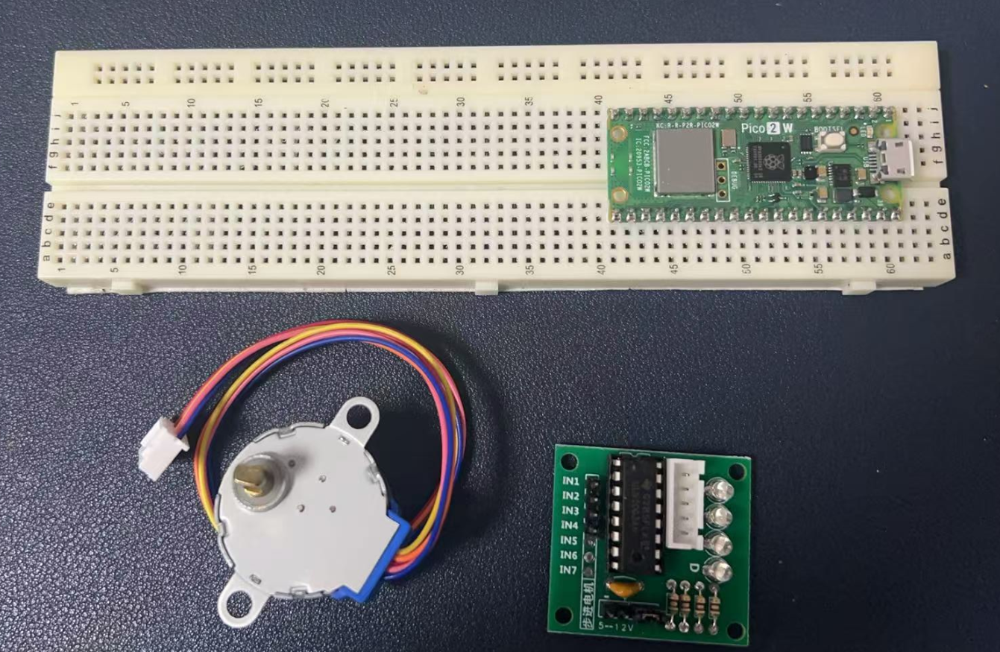
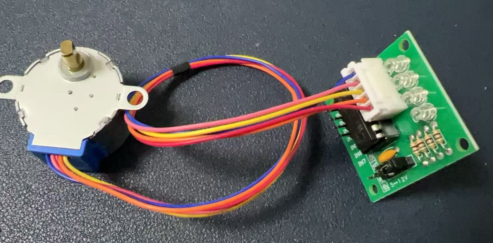
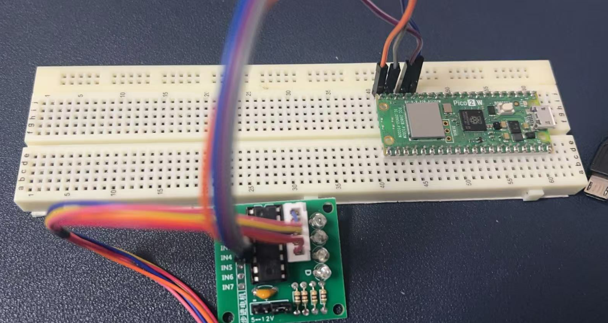
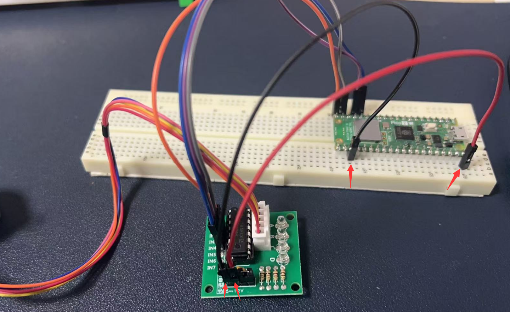
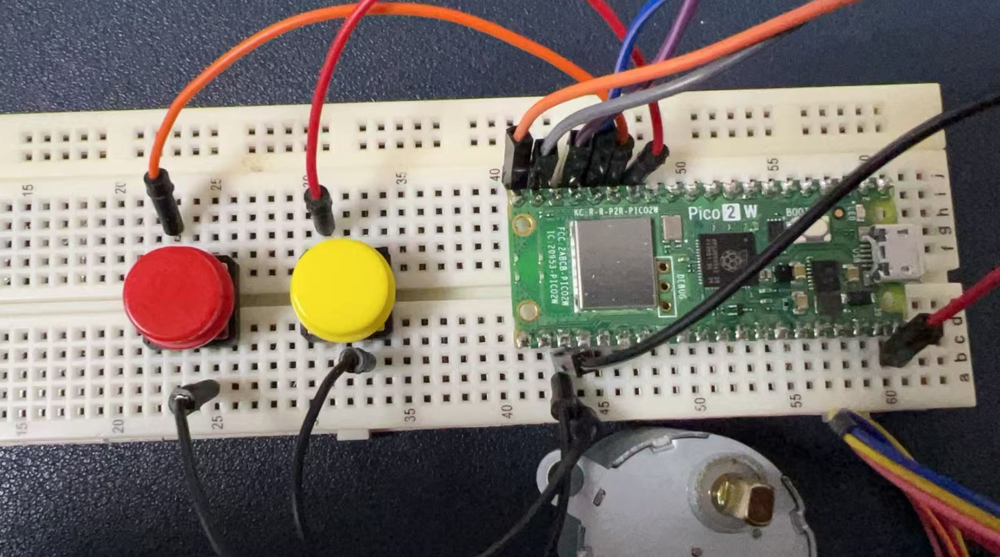
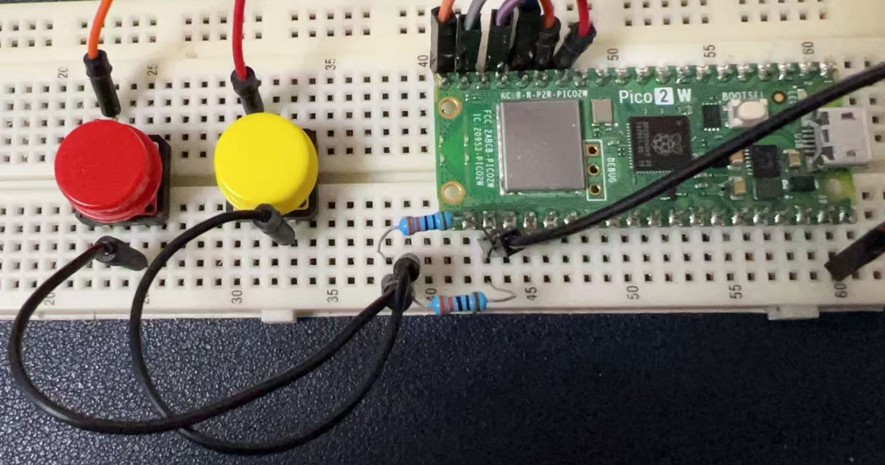

# Project 6: Stepper Motor

## Stepper Motor Introduction
A stepper motor is an electrical motor that converts electrical pulses into discrete angular movements. It is widely used in various applications such as 3D printers, Medical Devices, CNC Machines, Robotics, etc., due to its precise control over position, speed, and accuracy.



## Hardware Requirements
- 1 x Stepper Motor (28BYJ-48)
- 1 x ULN2003 Driver Board
- 1 x Raspberry Pi Pico 2 W
- 2 x Push Buttons
- 2 x 220-Ohm Resistor (for button pull-down)
- 1 x Breadboard
- 6 x Jumper Wires
- 1 x MicroUSB Programming Cable

## Wiring Diagram

### Stepper Motor to ULN2003 Driver
- Stepper Motor Pin 1 to ULN2003 Pin 1
- Stepper Motor Pin 2 to ULN2003 Pin 2
- Stepper Motor Pin 3 to ULN2003 Pin 3
- Stepper Motor Pin 4 to ULN2003 Pin 4  
  *Just connect the white cable to the socket on the driver board.*



### ULN2003 Driver to Development Board
- ULN2003 IN1 to GPIO Pin (e.g., Pin 15)
- ULN2003 IN2 to GPIO Pin (e.g., Pin 14)
- ULN2003 IN3 to GPIO Pin (e.g., Pin 13)
- ULN2003 IN4 to GPIO Pin (e.g., Pin 12)
- ULN2003 GND to GND
- ULN2003 VCC to 5V




### Buttons to Development Board
- One Button:
  - One terminal to GPIO Pin (e.g., Pin 10)
  - Another terminal to GND via 220-ohm resistor
- Another Button:
  - One terminal to GPIO Pin (e.g., Pin 11)
  - Another terminal to GND via 220-ohm resistor



*Adding resistors to buttons.*



## Demo Code

```python
from machine import Pin
import time

# Define stepper motor pins
in1 = Pin(15, Pin.OUT)
in2 = Pin(14, Pin.OUT)
in3 = Pin(13, Pin.OUT)
in4 = Pin(12, Pin.OUT)

# Define button pins
button1 = Pin(10, Pin.IN, Pin.PULL_UP)
button2 = Pin(11, Pin.IN, Pin.PULL_UP)

# Define stepper motor sequence (full-step mode)
sequence = [
    (1, 0, 0, 0),
    (0, 1, 0, 0),
    (0, 0, 1, 0),
    (0, 0, 0, 1)
]

def step_motor(step_count, direction):
    for _ in range(step_count):
        for step in sequence[::direction]:
            in1.value(step[0])
            in2.value(step[1])
            in3.value(step[2])
            in4.value(step[3])
            time.sleep(0.005)  # Add delay to reduce speed

# Main loop
while True:
    if button1.value() == 1:
        print("Button 1 pressed: Motor rotating clockwise")
        step_motor(200, 1)  # Increase step count
        time.sleep(0.1)
    elif button2.value() == 1:
        print("Button 2 pressed: Motor rotating counter-clockwise")
        step_motor(200, -1)  # Increase step count
        time.sleep(0.1)
    else:
        print("No button pressed: Motor stopped")
        in1.value(0)
        in2.value(0)
        in3.value(0)
        in4.value(0)
        time.sleep(0.5)  # Extend the interval when stopped to reduce resource usage
```

## Code Explanations
1. **Define stepper motor pins**: This comment indicates that the following lines of code are setting up the GPIO pins connected to the stepper motor.
2. **Define button pins**: This comment indicates that the following lines are setting up the GPIO pins connected to the buttons.
3. **Define stepper motor sequence (full-step mode)**: This comment explains that the `sequence` list defines the pattern of signals sent to the motor coils for full-step operation.
4. **Add delay to reduce speed**: This comment explains that the `time.sleep(0.005)` line introduces a delay to control the speed of the motor.
5. **Increase step count**: This comment indicates that the `step_motor(200, ...)` function call increases the number of steps the motor will take.
6. **Extend the interval when stopped to reduce resource usage**: This comment explains that the `time.sleep(0.5)` line introduces a longer delay when the motor is stopped to reduce unnecessary resource consumption.

